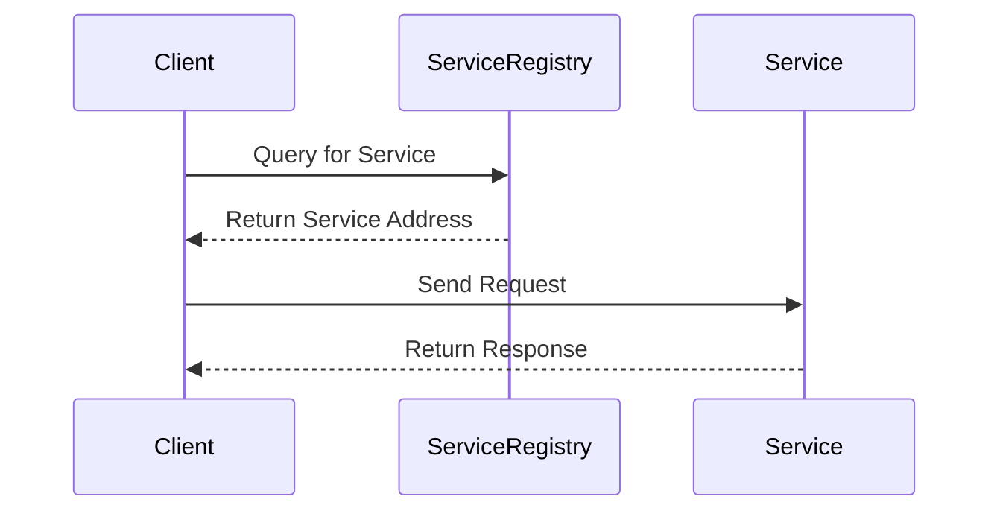

## 15.3 Service Discovery and Registry

In the realm of microservices architecture, **Service Discovery and Registry** play a pivotal role in ensuring seamless communication between distributed services. As we delve into this topic, we'll explore the concepts of dynamic discovery, the role of service registries, and how to implement these patterns effectively in PHP.

### Dynamic Discovery

Dynamic discovery is the process that allows services to find each other at runtime. In a microservices architecture, services are often distributed across multiple servers or containers, and their instances can change dynamically due to scaling, failures, or updates. Dynamic discovery ensures that services can locate each other without hardcoding addresses, thus enhancing flexibility and resilience.

#### Key Concepts

- **Service Registration:** When a service starts, it registers itself with a central registry. This registration includes metadata such as the service's name, address, port, and any other relevant information.
- **Service Lookup:** Clients query the registry to find the address of a service they need to communicate with. This lookup can be done using various strategies, such as round-robin or least connections.
- **Health Checks:** Registries often perform health checks to ensure that registered services are available and functioning correctly. If a service fails a health check, it can be removed from the registry.

### Service Registries

Service registries are the backbone of service discovery. They maintain a directory of available services and their instances, allowing clients to discover and connect to them dynamically. Two popular service registries are **Consul** and **Etcd**.

#### Consul

[Consul](https://www.consul.io/) is a widely used service discovery and configuration tool. It provides a distributed, highly available service mesh that includes service discovery, health checking, and key-value storage.

- **Features:**
  - **Service Discovery:** Consul allows services to register themselves and discover other services.
  - **Health Checking:** It provides health checks to ensure that services are available and functioning.
  - **Key-Value Store:** Consul includes a key-value store for configuration management.
  - **Multi-Datacenter Support:** It supports multi-datacenter configurations, making it suitable for global deployments.

#### Etcd

[Etcd](https://etcd.io/) is a distributed key-value store that is often used for service discovery and configuration management. It is known for its simplicity and reliability.

- **Features:**
  - **Consistency:** Etcd provides strong consistency guarantees, making it reliable for storing critical data.
  - **Watch Mechanism:** It allows clients to watch for changes in the registry, enabling dynamic updates.
  - **Simple API:** Etcd offers a simple HTTP/JSON API for easy integration.

### Implementation

Implementing service discovery and registry in PHP involves several steps. Let's explore how to set up a basic service discovery mechanism using Consul.

#### Setting Up Consul

1. **Install Consul:** Begin by installing Consul on your server. You can download it from the [Consul website](https://www.consul.io/downloads).

2. **Start Consul Agent:** Run the Consul agent in development mode for testing purposes.

   ```bash
   consul agent -dev
   ```

3. **Register a Service:** Create a JSON configuration file to register your service with Consul.

   ```json
   {
     "service": {
       "name": "my-php-service",
       "tags": ["php"],
       "port": 8080,
       "check": {
         "http": "http://localhost:8080/health",
         "interval": "10s"
       }
     }
   }
   ```

4. **Register the Service:** Use the Consul HTTP API to register the service.

   ```bash
   curl --request PUT --data @service.json http://localhost:8500/v1/agent/service/register
   ```

5. **Query the Service:** Use the Consul HTTP API to discover services.

   ```bash
   curl http://localhost:8500/v1/catalog/service/my-php-service
   ```

#### PHP Client for Consul

To interact with Consul from PHP, you can use a library like `php-consul-api`. Here's an example of how to use it:

```php
<?php

require 'vendor/autoload.php';

use SensioLabs\Consul\ServiceFactory;

$serviceFactory = new ServiceFactory();
$agent = $serviceFactory->get('agent');

// Register a service
$agent->registerService([
    'Name' => 'my-php-service',
    'ID' => 'my-php-service-1',
    'Tags' => ['php'],
    'Address' => 'localhost',
    'Port' => 8080,
    'Check' => [
        'HTTP' => 'http://localhost:8080/health',
        'Interval' => '10s'
    ]
]);

// Discover services
$catalog = $serviceFactory->get('catalog');
$services = $catalog->service('my-php-service')->json();

foreach ($services as $service) {
    echo "Service ID: " . $service['ServiceID'] . "\n";
    echo "Service Address: " . $service['ServiceAddress'] . "\n";
    echo "Service Port: " . $service['ServicePort'] . "\n";
}
```

### Design Considerations

When implementing service discovery and registry, consider the following:

- **Scalability:** Ensure that your registry can handle the load of registering and querying services, especially in large-scale deployments.
- **Fault Tolerance:** Implement mechanisms to handle failures in the registry or network.
- **Security:** Secure communication between services and the registry using TLS and authentication.

### PHP Unique Features

PHP's simplicity and flexibility make it well-suited for implementing service discovery. With libraries like `php-consul-api`, you can easily integrate service discovery into your PHP applications.

### Differences and Similarities

Service discovery is often confused with load balancing. While both involve distributing requests, service discovery focuses on locating services, whereas load balancing distributes requests among service instances.

### Visualizing Service Discovery

Let's visualize the service discovery process using a sequence diagram.



**Diagram Description:** This sequence diagram illustrates the interaction between a client, a service registry, and a service. The client queries the registry to find the service's address and then communicates directly with the service.

### Try It Yourself

Experiment with the provided code examples by:

- Modifying the service registration details, such as changing the port or adding tags.
- Implementing a new service and registering it with Consul.
- Exploring the Consul UI to view registered services and their health status.

### Knowledge Check

- What is the primary purpose of service discovery in microservices architecture?
- How does Consul perform health checks on registered services?
- What are the benefits of using a service registry like Etcd?

### Embrace the Journey

Remember, mastering service discovery and registry is a crucial step in building robust microservices architectures. As you continue to explore these concepts, you'll gain the skills needed to design scalable and resilient systems. Keep experimenting, stay curious, and enjoy the journey!

## Quiz: Service Discovery and Registry



### What is the primary purpose of service discovery in microservices architecture?

- [x] To allow services to find each other at runtime
- [ ] To store configuration data
- [ ] To balance load across servers
- [ ] To manage database connections

> **Explanation:** Service discovery enables services to locate each other dynamically, which is essential in a microservices architecture where services are distributed and can change frequently.

### Which of the following is a feature of Consul?

- [x] Service discovery
- [x] Health checking
- [ ] Load balancing
- [ ] Database management

> **Explanation:** Consul provides service discovery and health checking, but it does not handle load balancing or database management.

### How does Etcd ensure data consistency?

- [x] By providing strong consistency guarantees
- [ ] By using eventual consistency
- [ ] By replicating data across multiple nodes
- [ ] By using a single-node architecture

> **Explanation:** Etcd provides strong consistency guarantees, which ensures that all clients see the same data at the same time.

### What is a common use case for a service registry?

- [x] Storing service metadata
- [ ] Managing user sessions
- [ ] Handling HTTP requests
- [ ] Performing data analytics

> **Explanation:** A service registry stores metadata about services, such as their addresses and health status, which is used for service discovery.

### Which PHP library can be used to interact with Consul?

- [x] php-consul-api
- [ ] php-microservices
- [ ] php-service-discovery
- [ ] php-registry

> **Explanation:** The `php-consul-api` library is commonly used to interact with Consul from PHP applications.

### What is the role of health checks in service discovery?

- [x] To ensure services are available and functioning
- [ ] To balance load across services
- [ ] To store service configuration
- [ ] To manage service dependencies

> **Explanation:** Health checks verify that services are available and functioning correctly, which helps maintain an accurate service registry.

### What is the difference between service discovery and load balancing?

- [x] Service discovery locates services; load balancing distributes requests
- [ ] Service discovery distributes requests; load balancing locates services
- [ ] Both perform the same function
- [ ] Neither is used in microservices

> **Explanation:** Service discovery focuses on locating services, while load balancing distributes requests among service instances.

### What is a benefit of using a service registry like Etcd?

- [x] Strong consistency guarantees
- [ ] Built-in load balancing
- [ ] Automatic scaling
- [ ] Database management

> **Explanation:** Etcd provides strong consistency guarantees, making it reliable for storing critical service metadata.

### Which of the following is a key feature of dynamic discovery?

- [x] Services find each other at runtime
- [ ] Services are hardcoded into clients
- [ ] Services are manually configured
- [ ] Services are only available on a single server

> **Explanation:** Dynamic discovery allows services to find each other at runtime, which is essential for flexibility and resilience in microservices.

### True or False: Service discovery is only necessary in large-scale deployments.

- [ ] True
- [x] False

> **Explanation:** Service discovery is beneficial in any microservices architecture, regardless of scale, as it facilitates dynamic communication between services.


