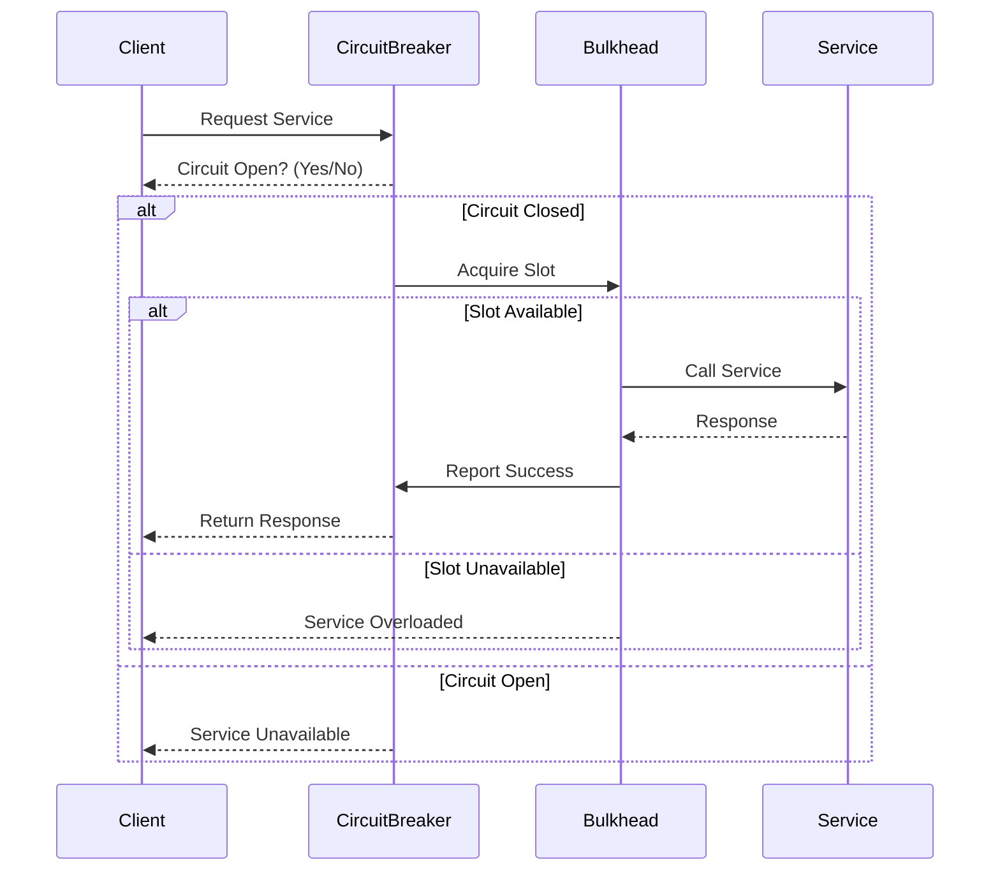

## 15.4 Resilience Patterns in PHP: Circuit Breaker and Bulkhead

In the world of microservices, ensuring the reliability and resilience of your applications is paramount. Resilience patterns such as the Circuit Breaker and Bulkhead are essential tools in a developer's toolkit to prevent cascading failures and isolate faults. In this section, we will delve into these patterns, providing a comprehensive understanding of their implementation and benefits in PHP.

### Circuit Breaker Pattern

#### Intent

The Circuit Breaker pattern is designed to prevent an application from repeatedly trying to execute an operation that is likely to fail. By doing so, it helps to avoid cascading failures and allows the system to recover gracefully.

#### Key Participants

- **Service Consumer**: The component that makes requests to a service.
- **Circuit Breaker**: Monitors the success and failure of requests and determines whether to allow requests to pass through.
- **Service Provider**: The component that provides the service being called.

#### Applicability

Use the Circuit Breaker pattern when:

- You have a service that is prone to failure.
- You want to prevent a failing service from affecting the entire system.
- You need to provide a fallback mechanism when a service is unavailable.

#### Sample Code Snippet

Let's implement a simple Circuit Breaker in PHP using the `php-circuit-breaker` library.

```php
<?php

use CircuitBreaker\CircuitBreaker;
use CircuitBreaker\Storage\MemoryStorage;

// Initialize Circuit Breaker with memory storage
$storage = new MemoryStorage();
$circuitBreaker = new CircuitBreaker('example_service', $storage);

// Function to call the service
function callService($circuitBreaker) {
    if ($circuitBreaker->isAvailable()) {
        try {
            // Simulate service call
            $response = file_get_contents('http://example.com/api');
            $circuitBreaker->reportSuccess();
            return $response;
        } catch (Exception $e) {
            $circuitBreaker->reportFailure();
            return 'Service unavailable, please try again later.';
        }
    } else {
        return 'Service is currently unavailable due to previous failures.';
    }
}

// Call the service
echo callService($circuitBreaker);

?>
```

**Explanation:**

- **Circuit Breaker Initialization**: We initialize the Circuit Breaker with a memory storage to keep track of the service state.
- **Service Call**: We attempt to call the service. If the call is successful, we report success; otherwise, we report failure.
- **Availability Check**: Before making the call, we check if the Circuit Breaker allows the request to proceed.

#### Design Considerations

- **Thresholds**: Define thresholds for failures and timeouts to determine when to open the circuit.
- **Fallback Mechanisms**: Implement fallback mechanisms to handle service unavailability gracefully.
- **Monitoring**: Continuously monitor the state of the Circuit Breaker to adjust thresholds and configurations as needed.

#### PHP Unique Features

PHP's simplicity and flexibility make it easy to implement Circuit Breakers using libraries like `php-circuit-breaker`. Additionally, PHP's exception handling capabilities allow for robust error management within the Circuit Breaker logic.

### Bulkhead Pattern

#### Intent

The Bulkhead pattern is inspired by the compartmentalization of ships, where each compartment is isolated to prevent water from flooding the entire vessel. In software, it involves isolating different components or services to prevent failures from spreading.

#### Key Participants

- **Service Consumer**: The component that makes requests to a service.
- **Bulkhead**: Isolates resources to prevent a failure in one component from affecting others.
- **Service Provider**: The component that provides the service being called.

#### Applicability

Use the Bulkhead pattern when:

- You want to isolate failures to prevent them from affecting the entire system.
- You need to allocate resources efficiently across different services.
- You aim to improve system stability and reliability.

#### Sample Code Snippet

Let's implement a simple Bulkhead pattern in PHP using semaphores to limit concurrent access to a service.

```php
<?php

class Bulkhead {
    private $maxConcurrentRequests;
    private $currentRequests = 0;

    public function __construct($maxConcurrentRequests) {
        $this->maxConcurrentRequests = $maxConcurrentRequests;
    }

    public function acquire() {
        if ($this->currentRequests < $this->maxConcurrentRequests) {
            $this->currentRequests++;
            return true;
        }
        return false;
    }

    public function release() {
        if ($this->currentRequests > 0) {
            $this->currentRequests--;
        }
    }
}

// Initialize Bulkhead with a limit of 5 concurrent requests
$bulkhead = new Bulkhead(5);

// Function to call the service
function callService($bulkhead) {
    if ($bulkhead->acquire()) {
        try {
            // Simulate service call
            $response = file_get_contents('http://example.com/api');
            return $response;
        } catch (Exception $e) {
            return 'Service unavailable, please try again later.';
        } finally {
            $bulkhead->release();
        }
    } else {
        return 'Service is currently overloaded, please try again later.';
    }
}

// Call the service
echo callService($bulkhead);

?>
```

**Explanation:**

- **Bulkhead Initialization**: We initialize the Bulkhead with a limit on the number of concurrent requests.
- **Acquire and Release**: We acquire a slot before making the service call and release it afterward to manage concurrency.
- **Overload Handling**: If the Bulkhead is full, we return a message indicating the service is overloaded.

#### Design Considerations

- **Resource Allocation**: Determine the appropriate number of concurrent requests to allow based on system capacity.
- **Isolation**: Ensure that failures in one component do not affect others by isolating resources.
- **Monitoring**: Continuously monitor resource usage to adjust Bulkhead configurations as needed.

#### PHP Unique Features

PHP's built-in support for semaphores and process control allows for efficient implementation of the Bulkhead pattern. This enables developers to manage concurrency and resource allocation effectively.

### Timeouts and Retries

In addition to Circuit Breaker and Bulkhead patterns, implementing timeouts and retries is crucial for building resilient systems.

#### Implementing Timeouts

Timeouts help prevent a service from waiting indefinitely for a response. In PHP, you can set timeouts using stream contexts or cURL options.

```php
<?php

// Using stream context to set a timeout
$options = [
    'http' => [
        'timeout' => 5, // Timeout in seconds
    ],
];
$context = stream_context_create($options);
$response = file_get_contents('http://example.com/api', false, $context);

?>
```

#### Implementing Retries

Retries allow a service to attempt an operation multiple times before failing. Use exponential backoff to avoid overwhelming the service.

```php
<?php

function callServiceWithRetry($url, $maxRetries = 3) {
    $attempts = 0;
    $delay = 1; // Initial delay in seconds

    while ($attempts < $maxRetries) {
        try {
            $response = file_get_contents($url);
            return $response;
        } catch (Exception $e) {
            $attempts++;
            sleep($delay);
            $delay *= 2; // Exponential backoff
        }
    }

    return 'Service unavailable after multiple attempts.';
}

// Call the service with retries
echo callServiceWithRetry('http://example.com/api');

?>
```

### Visualizing Resilience Patterns

To better understand how these patterns work together, let's visualize the interaction between the Circuit Breaker, Bulkhead, and service calls.



**Diagram Explanation:**

- **Client Request**: The client requests a service through the Circuit Breaker.
- **Circuit Check**: The Circuit Breaker checks if the circuit is open or closed.
- **Bulkhead Isolation**: If the circuit is closed, the Bulkhead pattern manages concurrent requests.
- **Service Call**: The service is called if resources are available, and the response is returned to the client.

### Knowledge Check

- **Question**: What is the primary purpose of the Circuit Breaker pattern?
- **Question**: How does the Bulkhead pattern improve system resilience?
- **Question**: Why is it important to implement timeouts and retries in a microservices architecture?

### Embrace the Journey

Remember, implementing resilience patterns is just the beginning of building robust and reliable microservices. As you progress, you'll encounter more complex scenarios that require a combination of patterns and strategies. Keep experimenting, stay curious, and enjoy the journey!

### Quiz: Resilience Patterns (Circuit Breaker, Bulkhead)



### What is the main purpose of the Circuit Breaker pattern?

- [x] To prevent cascading failures by stopping calls to failing services.
- [ ] To isolate components to prevent failures from spreading.
- [ ] To manage concurrent requests to a service.
- [ ] To implement retries and timeouts.

> **Explanation:** The Circuit Breaker pattern is primarily used to prevent cascading failures by stopping calls to services that are likely to fail.

### How does the Bulkhead pattern improve system resilience?

- [x] By isolating components to prevent failures from spreading.
- [ ] By stopping calls to failing services.
- [ ] By implementing retries and timeouts.
- [ ] By managing concurrent requests to a service.

> **Explanation:** The Bulkhead pattern improves system resilience by isolating components, ensuring that failures in one part do not affect others.

### What is a key feature of the Circuit Breaker pattern?

- [x] It monitors the success and failure of requests.
- [ ] It isolates resources to prevent failures from spreading.
- [ ] It manages concurrent requests to a service.
- [ ] It implements retries and timeouts.

> **Explanation:** A key feature of the Circuit Breaker pattern is monitoring the success and failure of requests to determine whether to allow requests to pass through.

### Which PHP feature is useful for implementing the Bulkhead pattern?

- [x] Semaphores
- [ ] Exception handling
- [ ] Stream contexts
- [ ] cURL options

> **Explanation:** PHP's built-in support for semaphores is useful for implementing the Bulkhead pattern to manage concurrency and resource allocation.

### Why are timeouts important in a microservices architecture?

- [x] To prevent a service from waiting indefinitely for a response.
- [ ] To isolate components to prevent failures from spreading.
- [ ] To stop calls to failing services.
- [ ] To manage concurrent requests to a service.

> **Explanation:** Timeouts are important to prevent a service from waiting indefinitely for a response, ensuring that resources are not tied up unnecessarily.

### What is the purpose of retries in a microservices architecture?

- [x] To attempt an operation multiple times before failing.
- [ ] To isolate components to prevent failures from spreading.
- [ ] To stop calls to failing services.
- [ ] To manage concurrent requests to a service.

> **Explanation:** Retries allow a service to attempt an operation multiple times before failing, increasing the chances of success in case of transient failures.

### How does exponential backoff work in retries?

- [x] By increasing the delay between retries exponentially.
- [ ] By decreasing the delay between retries exponentially.
- [ ] By keeping the delay between retries constant.
- [ ] By stopping retries after a fixed number of attempts.

> **Explanation:** Exponential backoff works by increasing the delay between retries exponentially, reducing the load on the service and increasing the chances of success.

### What is a fallback mechanism in the context of the Circuit Breaker pattern?

- [x] A mechanism to handle service unavailability gracefully.
- [ ] A mechanism to isolate components to prevent failures from spreading.
- [ ] A mechanism to manage concurrent requests to a service.
- [ ] A mechanism to implement retries and timeouts.

> **Explanation:** A fallback mechanism is used to handle service unavailability gracefully, providing an alternative response when a service is down.

### Which pattern is inspired by the compartmentalization of ships?

- [x] Bulkhead pattern
- [ ] Circuit Breaker pattern
- [ ] Timeout pattern
- [ ] Retry pattern

> **Explanation:** The Bulkhead pattern is inspired by the compartmentalization of ships, where each compartment is isolated to prevent water from flooding the entire vessel.

### True or False: The Circuit Breaker pattern can be used to manage concurrent requests to a service.

- [ ] True
- [x] False

> **Explanation:** False. The Circuit Breaker pattern is used to prevent cascading failures by stopping calls to failing services, not to manage concurrent requests.



By understanding and implementing these resilience patterns, you can significantly enhance the reliability and stability of your PHP microservices. Keep exploring and applying these concepts to build robust applications that can withstand failures gracefully.
