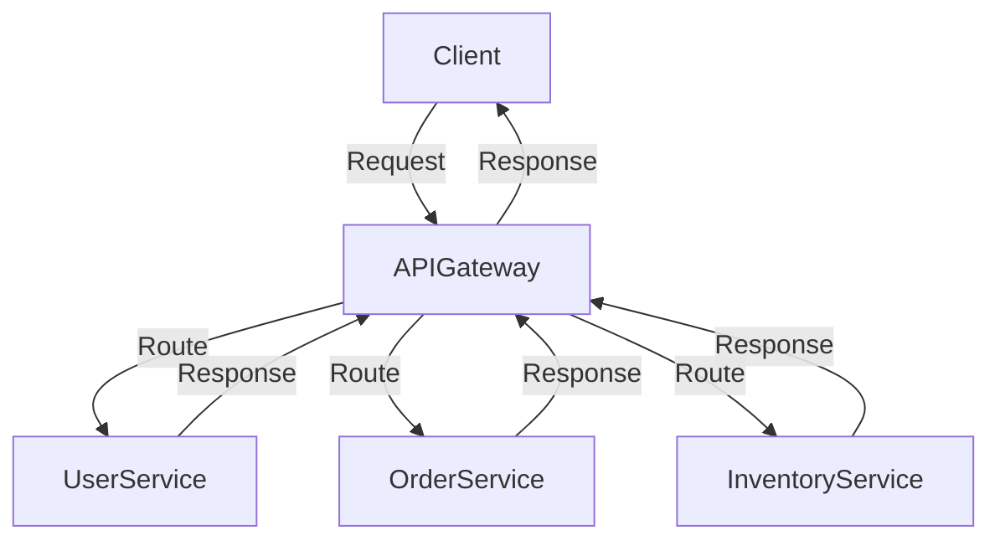

## 15.5 API Gateway Pattern

In the realm of microservices architecture, the API Gateway Pattern plays a pivotal role in managing and orchestrating the interactions between clients and backend services. This pattern serves as a single entry point for client requests, offering a centralized mechanism to route, authenticate, and manage traffic to various microservices. In this section, we will delve into the intricacies of the API Gateway Pattern, its features, tools, and implementation strategies in PHP.

### Role of API Gateway

The API Gateway acts as an intermediary between clients and microservices, providing a unified interface for accessing multiple backend services. Its primary responsibilities include:

- **Single Entry Point for Clients:** The API Gateway consolidates multiple service endpoints into a single, cohesive API, simplifying client interactions and reducing the complexity of managing multiple service URLs.
- **Routing Requests to Appropriate Services:** It intelligently routes incoming requests to the appropriate microservice based on the request path, headers, or other criteria.

### Key Features of API Gateway

An effective API Gateway offers several essential features that enhance the functionality and security of microservices:

- **Authentication and Authorization:** The gateway can enforce security policies, authenticate users, and authorize access to specific services, ensuring that only legitimate requests are processed.
- **Load Balancing:** By distributing incoming requests across multiple instances of a service, the API Gateway helps achieve high availability and scalability.
- **Rate Limiting and Throttling:** It can limit the number of requests a client can make in a given time period, protecting services from being overwhelmed by excessive traffic.
- **Caching:** The gateway can cache responses to reduce the load on backend services and improve response times for frequently accessed resources.
- **Request Transformation:** It can modify incoming requests and outgoing responses, enabling compatibility between clients and services with different data formats or protocols.
- **Monitoring and Logging:** The API Gateway provides insights into traffic patterns, request metrics, and error rates, facilitating performance monitoring and troubleshooting.

### Tools for Implementing API Gateway

Several tools and frameworks are available for implementing an API Gateway in PHP environments. Two popular options are:

- **Kong API Gateway:** Kong is an open-source API Gateway built on Nginx, offering a wide range of plugins for authentication, rate limiting, logging, and more. It is highly extensible and can be integrated with existing PHP applications. [Learn more about Kong](https://konghq.com/).

- **Tyk API Gateway:** Tyk is another open-source API Gateway that provides features such as authentication, rate limiting, and analytics. It supports a variety of deployment options, including cloud, on-premises, and hybrid environments. [Explore Tyk](https://tyk.io/).

### Implementing API Gateway in PHP

To implement an API Gateway in PHP, you can either use a dedicated tool like Kong or Tyk, or build a custom solution using PHP frameworks and libraries. Below, we will explore a basic implementation using PHP.

#### Sample Code Snippet

```php
<?php

class ApiGateway
{
    private $routes = [];

    public function addRoute($path, $serviceUrl)
    {
        $this->routes[$path] = $serviceUrl;
    }

    public function handleRequest($requestPath)
    {
        if (isset($this->routes[$requestPath])) {
            $serviceUrl = $this->routes[$requestPath];
            $response = $this->forwardRequest($serviceUrl);
            return $response;
        } else {
            return $this->notFoundResponse();
        }
    }

    private function forwardRequest($serviceUrl)
    {
        // Forward the request to the appropriate service
        $ch = curl_init($serviceUrl);
        curl_setopt($ch, CURLOPT_RETURNTRANSFER, true);
        $response = curl_exec($ch);
        curl_close($ch);
        return $response;
    }

    private function notFoundResponse()
    {
        return json_encode(['error' => 'Service not found']);
    }
}

// Usage
$gateway = new ApiGateway();
$gateway->addRoute('/user', 'http://user-service/api');
$gateway->addRoute('/order', 'http://order-service/api');

$requestPath = $_SERVER['REQUEST_URI'];
$response = $gateway->handleRequest($requestPath);
echo $response;
```

In this example, we define a simple `ApiGateway` class that maintains a list of routes mapping request paths to service URLs. The `handleRequest` method checks if a route exists for the requested path and forwards the request to the corresponding service using cURL.

#### Design Considerations

When implementing an API Gateway, consider the following:

- **Scalability:** Ensure the gateway can handle high volumes of traffic and scale horizontally as needed.
- **Security:** Implement robust authentication and authorization mechanisms to protect sensitive data and services.
- **Performance:** Optimize request routing and response times to minimize latency.
- **Extensibility:** Design the gateway to be easily extendable with new features or plugins.

### PHP Unique Features

PHP offers several unique features that can be leveraged when building an API Gateway:

- **Built-in Web Server:** PHP's built-in web server can be used for development and testing purposes, simplifying the setup process.
- **Composer:** PHP's package manager, Composer, allows for easy integration of third-party libraries and tools, enhancing the functionality of the API Gateway.
- **PSR Standards:** Adhering to PHP-FIG's PSR standards ensures consistent coding practices and interoperability with other PHP components.

### Differences and Similarities

The API Gateway Pattern is often compared to the **Backend for Frontend (BFF)** pattern. While both patterns provide a single entry point for clients, the BFF pattern is tailored to specific client needs, offering customized APIs for different client types (e.g., mobile, web). In contrast, the API Gateway Pattern provides a unified API for all clients.

### Visualizing the API Gateway Pattern

Below is a diagram illustrating the role of an API Gateway in a microservices architecture:



**Diagram Description:** The diagram shows a client sending a request to the API Gateway, which routes the request to the appropriate microservice (UserService, OrderService, or InventoryService) and returns the response back to the client.

### Try It Yourself

Experiment with the provided code example by adding new routes or modifying the request forwarding logic. Consider implementing additional features such as authentication or rate limiting to enhance the gateway's functionality.

### Knowledge Check

- What are the primary responsibilities of an API Gateway?
- How does the API Gateway Pattern differ from the Backend for Frontend (BFF) pattern?
- What tools can be used to implement an API Gateway in PHP?

### Embrace the Journey

Remember, mastering the API Gateway Pattern is just one step in building robust and scalable microservices applications. Continue exploring other design patterns and best practices to enhance your PHP development skills. Keep experimenting, stay curious, and enjoy the journey!

## Quiz: API Gateway Pattern



### What is the primary role of an API Gateway in microservices architecture?

- [x] To act as a single entry point for client requests
- [ ] To store data for microservices
- [ ] To handle database transactions
- [ ] To replace microservices

> **Explanation:** The API Gateway serves as a single entry point for client requests, routing them to the appropriate microservices.

### Which feature is commonly provided by an API Gateway?

- [x] Authentication and Authorization
- [ ] Database Management
- [ ] File Storage
- [ ] Email Sending

> **Explanation:** An API Gateway often provides authentication and authorization to secure access to microservices.

### Which tool is NOT typically used as an API Gateway?

- [ ] Kong
- [ ] Tyk
- [x] MySQL
- [ ] AWS API Gateway

> **Explanation:** MySQL is a database management system, not an API Gateway tool.

### What is a key difference between the API Gateway Pattern and the Backend for Frontend (BFF) pattern?

- [x] API Gateway provides a unified API for all clients, while BFF offers customized APIs for different clients.
- [ ] API Gateway is used for database management, while BFF is not.
- [ ] BFF is used for routing requests, while API Gateway is not.
- [ ] API Gateway is only used for mobile applications, while BFF is for web applications.

> **Explanation:** The API Gateway provides a unified API for all clients, whereas BFF offers customized APIs tailored to specific client needs.

### Which PHP feature can be leveraged when building an API Gateway?

- [x] Composer
- [ ] MySQL
- [ ] HTML
- [ ] CSS

> **Explanation:** Composer, PHP's package manager, can be used to integrate third-party libraries and tools into an API Gateway.

### What is a common design consideration when implementing an API Gateway?

- [x] Scalability
- [ ] Color Scheme
- [ ] Font Size
- [ ] Text Alignment

> **Explanation:** Scalability is crucial to ensure the API Gateway can handle high volumes of traffic.

### Which of the following is a benefit of using an API Gateway?

- [x] Load Balancing
- [ ] Data Storage
- [ ] Image Processing
- [ ] Video Streaming

> **Explanation:** An API Gateway can perform load balancing to distribute requests across multiple service instances.

### What is a potential pitfall when using an API Gateway?

- [x] Single Point of Failure
- [ ] Increased Data Storage
- [ ] Reduced Security
- [ ] Slower Database Access

> **Explanation:** An API Gateway can become a single point of failure if not properly managed and scaled.

### Which of the following is a feature of Tyk API Gateway?

- [x] Rate Limiting
- [ ] Image Editing
- [ ] Video Encoding
- [ ] Text Formatting

> **Explanation:** Tyk API Gateway provides features like rate limiting to control the flow of requests.

### True or False: An API Gateway can cache responses to improve performance.

- [x] True
- [ ] False

> **Explanation:** An API Gateway can cache responses to reduce the load on backend services and improve response times.


