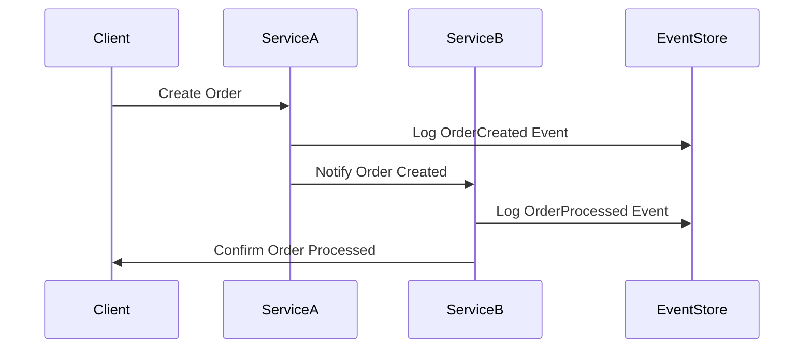

## 15.6 Data Management in Microservices

In the realm of microservices architecture, data management is a critical component that can significantly impact the scalability, reliability, and performance of your applications. This section delves into the intricacies of managing data in a microservices environment, particularly focusing on PHP implementations. We will explore various strategies, challenges, and solutions, including the database per service pattern, maintaining data consistency, managing transactions, and leveraging event-driven architectures.

### Database per Service

The database per service pattern is a fundamental principle in microservices architecture. It dictates that each microservice should have its own database, encapsulating its data storage and ensuring that services are loosely coupled. This approach offers several advantages:

- **Encapsulation and Autonomy:** Each service manages its own data, leading to better encapsulation and autonomy. This independence allows teams to develop, deploy, and scale services independently.
- **Technology Diversity:** Services can choose the most appropriate database technology for their specific needs, whether it's a relational database, NoSQL, or an in-memory data store.
- **Scalability:** Services can be scaled independently, optimizing resource usage and improving performance.

However, this pattern also introduces challenges, particularly in maintaining data consistency and managing transactions across services.

### Challenges in Data Management

#### Maintaining Data Consistency

In a microservices architecture, maintaining data consistency across services is a significant challenge. Unlike monolithic architectures where a single database ensures consistency, microservices require distributed data management. This can lead to issues such as:

- **Eventual Consistency:** Achieving strong consistency is often impractical, so systems must rely on eventual consistency, where updates propagate asynchronously.
- **Data Duplication:** Data may need to be duplicated across services, leading to potential inconsistencies if not managed correctly.

#### Managing Transactions Across Services

Traditional ACID transactions are difficult to implement across distributed systems. Instead, microservices often rely on:

- **Distributed Transactions:** Using protocols like the Two-Phase Commit (2PC), though they can be complex and impact performance.
- **Saga Pattern:** A sequence of local transactions where each step is compensated by another step in case of failure, ensuring eventual consistency.

### Solutions for Effective Data Management

#### Event-Driven Architectures

Event-driven architectures can help manage data consistency and transactions across microservices. By using events to communicate changes, services can react to updates asynchronously, promoting eventual consistency. Key components include:

- **Event Sourcing:** Storing the state of a service as a sequence of events, allowing services to reconstruct the current state by replaying events.
- **CQRS (Command Query Responsibility Segregation):** Separating the read and write operations, allowing for optimized data models and improved performance.

#### Data Replication

Data replication involves copying data across multiple services to ensure availability and consistency. Techniques include:

- **Master-Slave Replication:** One service acts as the master, while others replicate its data.
- **Peer-to-Peer Replication:** Services replicate data among themselves, promoting high availability and fault tolerance.

### Implementing Data Management in PHP

PHP, being a versatile language, offers several tools and libraries to implement effective data management strategies in microservices. Let's explore some practical implementations.

#### Example: Implementing Event Sourcing in PHP

```php
<?php

class EventStore
{
    private $events = [];

    public function addEvent($event)
    {
        $this->events[] = $event;
    }

    public function getEvents()
    {
        return $this->events;
    }
}

class OrderService
{
    private $eventStore;

    public function __construct(EventStore $eventStore)
    {
        $this->eventStore = $eventStore;
    }

    public function createOrder($orderData)
    {
        // Perform order creation logic
        $event = ['type' => 'OrderCreated', 'data' => $orderData];
        $this->eventStore->addEvent($event);
    }

    public function getOrderHistory()
    {
        return $this->eventStore->getEvents();
    }
}

// Usage
$eventStore = new EventStore();
$orderService = new OrderService($eventStore);

$orderService->createOrder(['id' => 1, 'product' => 'Book', 'quantity' => 2]);
$orderHistory = $orderService->getOrderHistory();

print_r($orderHistory);
```

**Explanation:** In this example, we implement a simple event sourcing mechanism using PHP. The `EventStore` class stores events, while the `OrderService` class creates orders and logs events. This setup allows us to track the history of orders through events.

#### Try It Yourself

Experiment with the code by adding more event types, such as `OrderUpdated` or `OrderCancelled`. Observe how the event store maintains a history of all actions performed on orders.

### Visualizing Data Management in Microservices

To better understand the flow of data management in microservices, let's visualize the architecture using a sequence diagram.



**Diagram Description:** This sequence diagram illustrates the interaction between a client, two services, and an event store. The client requests order creation from Service A, which logs the event and notifies Service B. Service B processes the order and logs the event, confirming the process to the client.

### PHP Unique Features for Data Management

PHP offers several unique features that can be leveraged for data management in microservices:

- **PDO (PHP Data Objects):** A database access layer providing a uniform method of access to multiple databases.
- **Guzzle:** A PHP HTTP client that simplifies sending HTTP requests, useful for inter-service communication.
- **Symfony Components:** Reusable PHP libraries that can be integrated into microservices for tasks like routing, dependency injection, and event handling.

### Differences and Similarities with Other Patterns

Data management in microservices can often be confused with other architectural patterns. It's important to distinguish:

- **Monolithic vs. Microservices:** Monolithic architectures use a single database, while microservices advocate for a database per service.
- **SOA (Service-Oriented Architecture):** Similar to microservices but typically involves larger, more complex services.

### Design Considerations

When implementing data management strategies in microservices, consider the following:

- **Data Consistency vs. Availability:** Decide whether to prioritize consistency or availability based on your application's needs.
- **Latency and Performance:** Ensure that data management strategies do not introduce significant latency or degrade performance.
- **Scalability:** Design your architecture to handle increased load and data volume as your application grows.

### Knowledge Check

- How does the database per service pattern promote autonomy in microservices?
- What are the challenges of maintaining data consistency in a microservices architecture?
- How can event-driven architectures help manage transactions across services?

### Embrace the Journey

Remember, mastering data management in microservices is a journey. As you explore these concepts, you'll gain a deeper understanding of how to build scalable, reliable, and efficient applications. Keep experimenting, stay curious, and enjoy the process!

### Quiz: Data Management in Microservices



### What is a key advantage of the database per service pattern in microservices?

- [x] Encapsulation and autonomy of services
- [ ] Centralized data management
- [ ] Simplified transaction management
- [ ] Reduced data duplication

> **Explanation:** The database per service pattern promotes encapsulation and autonomy, allowing each service to manage its own data independently.

### Which of the following is a challenge in maintaining data consistency across microservices?

- [x] Eventual consistency
- [ ] Strong consistency
- [ ] Data centralization
- [ ] Simplified data access

> **Explanation:** Eventual consistency is a challenge because updates propagate asynchronously across distributed systems.

### What is the Saga pattern used for in microservices?

- [x] Managing distributed transactions
- [ ] Centralizing data storage
- [ ] Simplifying service communication
- [ ] Enhancing data security

> **Explanation:** The Saga pattern manages distributed transactions by using a sequence of local transactions with compensating actions.

### How does event-driven architecture help in microservices?

- [x] Promotes eventual consistency
- [ ] Centralizes data management
- [ ] Simplifies database access
- [ ] Reduces service autonomy

> **Explanation:** Event-driven architecture promotes eventual consistency by allowing services to react to updates asynchronously.

### Which PHP feature is useful for inter-service communication in microservices?

- [x] Guzzle
- [ ] PDO
- [ ] Symfony Components
- [ ] Laravel

> **Explanation:** Guzzle is a PHP HTTP client that simplifies sending HTTP requests, making it useful for inter-service communication.

### What is a benefit of using event sourcing in microservices?

- [x] Tracking the history of state changes
- [ ] Simplifying database schema
- [ ] Reducing data duplication
- [ ] Enhancing data security

> **Explanation:** Event sourcing tracks the history of state changes by storing events, allowing services to reconstruct the current state.

### What is a common technique for data replication in microservices?

- [x] Master-Slave Replication
- [ ] Centralized Replication
- [ ] Simplified Replication
- [ ] Data Duplication

> **Explanation:** Master-Slave Replication involves one service acting as the master while others replicate its data.

### What is a challenge of using the Two-Phase Commit protocol in microservices?

- [x] Complexity and performance impact
- [ ] Simplified transaction management
- [ ] Enhanced data security
- [ ] Reduced data duplication

> **Explanation:** The Two-Phase Commit protocol can be complex and impact performance, making it challenging to implement in microservices.

### Which of the following is a PHP library for reusable components in microservices?

- [x] Symfony Components
- [ ] Laravel
- [ ] Guzzle
- [ ] PDO

> **Explanation:** Symfony Components are reusable PHP libraries that can be integrated into microservices for various tasks.

### True or False: In microservices, strong consistency is often prioritized over availability.

- [ ] True
- [x] False

> **Explanation:** In microservices, eventual consistency is often prioritized over strong consistency to ensure availability and scalability.


