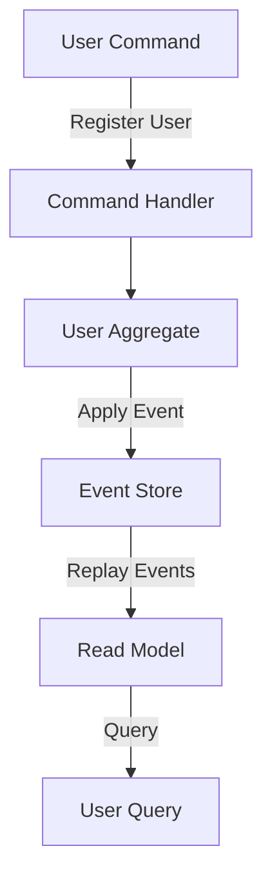

## 15.7 Event Sourcing and CQRS in Microservices

In the realm of microservices architecture, Event Sourcing and Command Query Responsibility Segregation (CQRS) are two powerful patterns that can significantly enhance the scalability and flexibility of your applications. In this section, we'll delve into these concepts, explore their benefits, and demonstrate how to implement them in PHP using libraries like **broadway/broadway**.

### Understanding Event Sourcing

**Event Sourcing** is a pattern where the state of an application is determined by a sequence of events. Instead of storing the current state of an entity, you store a series of events that represent the changes to the state. This approach provides a complete audit trail and allows you to reconstruct the state at any point in time.

#### Key Concepts of Event Sourcing

- **Event Store:** A database that stores all the events. Each event is immutable and represents a single change to the state.
- **Event Stream:** A sequence of events related to a particular entity or aggregate.
- **Event Replay:** The process of replaying events to reconstruct the state of an entity.

#### Benefits of Event Sourcing

- **Auditability:** Every change is recorded as an event, providing a complete history of changes.
- **Flexibility:** You can easily add new features by replaying events to generate new projections.
- **Scalability:** Event sourcing can be scaled horizontally by partitioning event streams.

### Understanding CQRS

**Command Query Responsibility Segregation (CQRS)** is a pattern that separates the read and write operations of a system. In CQRS, the command model (write) and the query model (read) are distinct, allowing for optimized data models for each operation.

#### Key Concepts of CQRS

- **Command Model:** Handles the write operations. It processes commands that change the state of the system.
- **Query Model:** Handles the read operations. It retrieves data without modifying the state.
- **Separation of Concerns:** By separating the read and write models, you can optimize each for its specific purpose.

#### Benefits of CQRS

- **Performance:** Read and write models can be optimized independently, improving performance.
- **Scalability:** You can scale the read and write sides independently.
- **Flexibility:** Different data models can be used for reading and writing, allowing for more complex queries and data structures.

### Implementing Event Sourcing and CQRS in PHP

To implement Event Sourcing and CQRS in PHP, we can use the **broadway/broadway** library, which provides a framework for building applications using these patterns.

#### Setting Up Broadway

First, let's set up a new PHP project and install the Broadway library:

```bash
composer require broadway/broadway
```

#### Creating an Event

In Event Sourcing, events are the core building blocks. Let's create a simple event class:

```php
<?php

namespace MyApp\Events;

use Broadway\Serializer\Serializable;

class UserRegistered implements Serializable
{
    private $userId;
    private $email;

    public function __construct(string $userId, string $email)
    {
        $this->userId = $userId;
        $this->email = $email;
    }

    public function serialize(): array
    {
        return [
            'userId' => $this->userId,
            'email' => $this->email,
        ];
    }

    public static function deserialize(array $data)
    {
        return new self($data['userId'], $data['email']);
    }
}
```

#### Creating an Aggregate

An aggregate is a cluster of domain objects that can be treated as a single unit. Here's an example of a User aggregate:

```php
<?php

namespace MyApp\Aggregates;

use Broadway\EventSourcing\EventSourcedAggregateRoot;
use MyApp\Events\UserRegistered;

class User extends EventSourcedAggregateRoot
{
    private $userId;
    private $email;

    public function getAggregateRootId(): string
    {
        return $this->userId;
    }

    public static function register(string $userId, string $email): self
    {
        $user = new self();
        $user->apply(new UserRegistered($userId, $email));
        return $user;
    }

    protected function applyUserRegistered(UserRegistered $event): void
    {
        $this->userId = $event->userId;
        $this->email = $event->email;
    }
}
```

#### Storing Events

To store events, we need an event store. Broadway provides an interface for this, and you can implement your own or use existing implementations like DBAL or MongoDB.

```php
<?php

use Broadway\EventStore\DBALEventStore;
use Doctrine\DBAL\Connection;

$connection = // Obtain a Doctrine DBAL connection
$eventStore = new DBALEventStore($connection, /* other dependencies */);
```

#### Command Handling

Commands represent actions that change the state of the system. Let's create a command and a command handler:

```php
<?php

namespace MyApp\Commands;

class RegisterUser
{
    public $userId;
    public $email;

    public function __construct(string $userId, string $email)
    {
        $this->userId = $userId;
        $this->email = $email;
    }
}
```

```php
<?php

namespace MyApp\Handlers;

use MyApp\Commands\RegisterUser;
use MyApp\Aggregates\User;
use Broadway\CommandHandling\CommandHandler;

class UserCommandHandler extends CommandHandler
{
    private $repository;

    public function __construct($repository)
    {
        $this->repository = $repository;
    }

    public function handleRegisterUser(RegisterUser $command): void
    {
        $user = User::register($command->userId, $command->email);
        $this->repository->save($user);
    }
}
```

#### Query Handling

For the query side, you can use a separate data store optimized for read operations. This could be a denormalized database or a caching layer.

### Visualizing Event Sourcing and CQRS

To better understand the flow of Event Sourcing and CQRS, let's visualize the architecture using Mermaid.js:



**Diagram Description:** This diagram illustrates the flow of a user registration command through the system. The command is handled by the command handler, which updates the user aggregate. The aggregate applies an event, which is stored in the event store. The event is then replayed to update the read model, which can be queried for user data.

### PHP Unique Features

PHP's dynamic nature and extensive ecosystem make it well-suited for implementing Event Sourcing and CQRS. Libraries like Broadway provide a solid foundation, and PHP's support for various databases and caching solutions allows for flexible implementations.

### Design Considerations

- **Consistency:** Ensure eventual consistency between the command and query models.
- **Complexity:** Be mindful of the added complexity when implementing these patterns.
- **Storage:** Consider the storage implications of maintaining an event store.

### Try It Yourself

Experiment with the provided code examples by modifying the event and command classes to handle different scenarios, such as updating user information or handling user deletion. This hands-on approach will deepen your understanding of Event Sourcing and CQRS.

### Further Reading

For more information on Event Sourcing and CQRS, consider exploring the following resources:

- [Broadway - CQRS and Event Sourcing for PHP](https://github.com/broadway/broadway)
- [Martin Fowler's article on Event Sourcing](https://martinfowler.com/eaaDev/EventSourcing.html)
- [CQRS documentation on Microsoft Docs](https://docs.microsoft.com/en-us/azure/architecture/patterns/cqrs)

### Knowledge Check

- What are the main benefits of using Event Sourcing?
- How does CQRS improve system performance?
- What are the key components of an Event Sourcing system?

### Embrace the Journey

Remember, mastering Event Sourcing and CQRS is a journey. As you experiment and build more complex systems, you'll gain a deeper understanding of these powerful patterns. Keep exploring, stay curious, and enjoy the process!

## Quiz: Event Sourcing and CQRS in Microservices



### What is Event Sourcing?

- [x] A pattern where state changes are stored as a sequence of events.
- [ ] A pattern that separates read and write operations.
- [ ] A pattern for optimizing database queries.
- [ ] A pattern for handling user authentication.

> **Explanation:** Event Sourcing involves storing state changes as a sequence of events, allowing for a complete history of changes.

### What does CQRS stand for?

- [x] Command Query Responsibility Segregation
- [ ] Command Query Resource Segmentation
- [ ] Central Query Resource System
- [ ] Command Queue Resource Segmentation

> **Explanation:** CQRS stands for Command Query Responsibility Segregation, a pattern that separates read and write operations.

### What is a key benefit of Event Sourcing?

- [x] Auditability
- [ ] Increased complexity
- [ ] Reduced storage requirements
- [ ] Simplified codebase

> **Explanation:** Event Sourcing provides auditability by recording every change as an event.

### How does CQRS improve scalability?

- [x] By allowing independent scaling of read and write models.
- [ ] By reducing the number of database queries.
- [ ] By simplifying the codebase.
- [ ] By using a single data model for all operations.

> **Explanation:** CQRS improves scalability by allowing the read and write models to be scaled independently.

### Which library is commonly used for Event Sourcing in PHP?

- [x] broadway/broadway
- [ ] symfony/symfony
- [ ] laravel/laravel
- [ ] zendframework/zendframework

> **Explanation:** The broadway/broadway library is commonly used for implementing Event Sourcing and CQRS in PHP.

### What is an Event Store?

- [x] A database that stores all events.
- [ ] A cache for storing temporary data.
- [ ] A service for handling user authentication.
- [ ] A tool for optimizing database queries.

> **Explanation:** An Event Store is a database that stores all events, providing a complete history of changes.

### What is a Command Model in CQRS?

- [x] A model that handles write operations.
- [ ] A model that handles read operations.
- [ ] A model for optimizing database queries.
- [ ] A model for managing user sessions.

> **Explanation:** In CQRS, the Command Model handles write operations, processing commands that change the state of the system.

### What is a Query Model in CQRS?

- [x] A model that handles read operations.
- [ ] A model that handles write operations.
- [ ] A model for optimizing database queries.
- [ ] A model for managing user sessions.

> **Explanation:** In CQRS, the Query Model handles read operations, retrieving data without modifying the state.

### What is Event Replay?

- [x] The process of replaying events to reconstruct the state of an entity.
- [ ] The process of storing events in a database.
- [ ] The process of optimizing database queries.
- [ ] The process of handling user authentication.

> **Explanation:** Event Replay involves replaying events to reconstruct the state of an entity, allowing for a complete history of changes.

### True or False: Event Sourcing and CQRS can be used together to enhance system scalability and flexibility.

- [x] True
- [ ] False

> **Explanation:** Event Sourcing and CQRS are complementary patterns that can be used together to enhance system scalability and flexibility.


