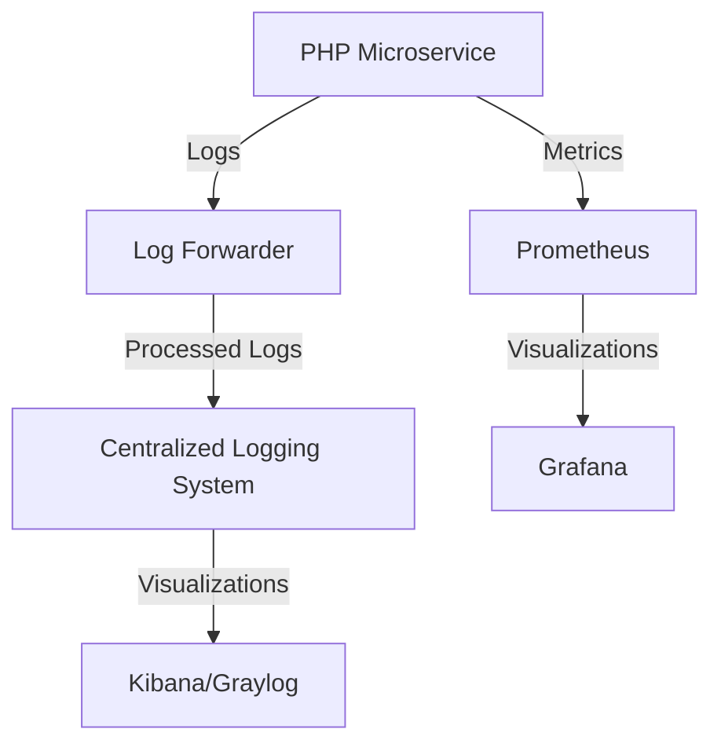

## 15.8 Monitoring and Logging in Microservices

In the dynamic world of microservices, monitoring and logging are crucial components that ensure the health, performance, and reliability of your applications. As PHP developers, understanding how to effectively implement these practices can significantly enhance your ability to maintain robust systems. This section will guide you through the essential concepts, tools, and best practices for monitoring and logging in microservices.

### Understanding Monitoring and Logging

**Monitoring** involves tracking the performance and health of your microservices. It provides insights into system behavior, helping you detect issues before they impact users. **Logging**, on the other hand, records events and errors, offering a detailed view of system operations. Together, they form the backbone of observability in microservices.

#### Key Concepts

- **Centralized Logging**: Aggregating logs from various services into a single location for easier analysis.
- **Metrics**: Quantitative data points that provide insights into system performance (e.g., response times, error rates).
- **Tracing**: Following a request's path through the system to diagnose issues.

### Centralized Logging

Centralized logging is essential in a microservices architecture where services are distributed across multiple servers. By aggregating logs, you can efficiently search, analyze, and visualize data.

#### Benefits of Centralized Logging

- **Simplified Debugging**: Quickly identify and resolve issues by accessing logs from a single interface.
- **Enhanced Security**: Monitor access logs to detect unauthorized activities.
- **Improved Performance Analysis**: Analyze logs to identify performance bottlenecks.

#### Tools for Centralized Logging

Several tools can help you implement centralized logging in your PHP microservices architecture. Let's explore some popular options:

##### ELK Stack (Elasticsearch, Logstash, Kibana)

The ELK Stack is a powerful suite of tools for managing and analyzing logs.

- **Elasticsearch**: A search and analytics engine that stores and indexes log data.
- **Logstash**: A data processing pipeline that ingests, transforms, and sends data to Elasticsearch.
- **Kibana**: A visualization tool that allows you to explore and analyze log data.

**Link:** [ELK Stack](https://www.elastic.co/what-is/elk-stack)

##### Graylog

Graylog is another robust tool for centralized logging, offering features like real-time search, alerting, and dashboards.

**Link:** [Graylog](https://www.graylog.org/)

### Implementing Centralized Logging in PHP

To implement centralized logging in your PHP microservices, follow these steps:

1. **Set Up Log Forwarders**: Use tools like Filebeat or Fluentd to collect logs from your PHP applications and forward them to a centralized logging system.

2. **Configure Log Processing**: Use Logstash or Graylog to process and transform logs. This may involve parsing log formats, filtering unnecessary data, and enriching logs with additional context.

3. **Store and Index Logs**: Send processed logs to Elasticsearch or Graylog for storage and indexing.

4. **Visualize and Analyze Logs**: Use Kibana or Graylog's dashboard features to create visualizations and perform log analysis.

#### Sample PHP Code for Logging

Here's a simple example of logging in a PHP microservice using Monolog, a popular logging library:

```php
<?php

require 'vendor/autoload.php';

use Monolog\Logger;
use Monolog\Handler\StreamHandler;

// Create a logger instance
$log = new Logger('microservice');

// Add a handler
$log->pushHandler(new StreamHandler(__DIR__.'/logs/app.log', Logger::DEBUG));

// Add records to the log
$log->info('This is an informational message');
$log->error('This is an error message');

?>
```

**Try It Yourself**: Modify the log level or message content to see how it affects the log output.

### Monitoring Metrics

Monitoring metrics is crucial for understanding the performance and health of your microservices. Metrics provide real-time insights into system behavior, enabling proactive issue resolution.

#### Key Metrics to Monitor

- **Response Time**: The time taken to process a request.
- **Error Rate**: The percentage of failed requests.
- **Throughput**: The number of requests processed per second.
- **Resource Utilization**: CPU, memory, and disk usage.

#### Tools for Monitoring Metrics

##### Prometheus

Prometheus is an open-source monitoring system that collects metrics from configured targets at given intervals.

- **Data Collection**: Prometheus scrapes metrics from instrumented jobs.
- **Data Storage**: Stores metrics as time-series data.
- **Alerting**: Supports alerting based on defined conditions.

**Link:** [Prometheus](https://prometheus.io/)

##### Grafana

Grafana is a visualization tool that integrates with Prometheus to create interactive dashboards.

- **Custom Dashboards**: Create custom dashboards to visualize metrics.
- **Alerting**: Set up alerts based on metric thresholds.
- **Data Sources**: Supports multiple data sources, including Prometheus.

**Link:** [Grafana](https://grafana.com/)

### Implementing Monitoring in PHP

To implement monitoring in your PHP microservices, follow these steps:

1. **Instrument Your Code**: Use libraries like PromPHP to expose metrics from your PHP applications.

2. **Set Up Prometheus**: Configure Prometheus to scrape metrics from your PHP services.

3. **Create Grafana Dashboards**: Use Grafana to create dashboards that visualize your metrics.

#### Sample PHP Code for Metrics

Here's a simple example of exposing metrics in a PHP microservice using PromPHP:

```php
<?php

require 'vendor/autoload.php';

use Prometheus\CollectorRegistry;
use Prometheus\RenderTextFormat;
use Prometheus\Storage\InMemory;

// Create a registry
$registry = new CollectorRegistry(new InMemory());

// Create a counter
$counter = $registry->getOrRegisterCounter('app', 'requests_total', 'Total number of requests', ['method']);

// Increment the counter
$counter->inc(['GET']);

// Render metrics
$renderer = new RenderTextFormat();
echo $renderer->render($registry->getMetricFamilySamples());

?>
```

**Try It Yourself**: Add more metrics or change the labels to see how it affects the output.

### Visualizing Monitoring and Logging

To better understand the flow of monitoring and logging in microservices, let's visualize the architecture using Mermaid.js:



**Description**: This diagram illustrates the flow of logs and metrics from a PHP microservice to centralized logging and monitoring systems.

### Best Practices for Monitoring and Logging

- **Use Structured Logging**: Format logs in a structured way (e.g., JSON) to facilitate parsing and analysis.
- **Implement Correlation IDs**: Use correlation IDs to trace requests across services.
- **Set Up Alerts**: Configure alerts for critical metrics to enable rapid response to issues.
- **Regularly Review Logs and Metrics**: Periodically review logs and metrics to identify trends and potential issues.

### Conclusion

Monitoring and logging are vital components of a successful microservices architecture. By implementing centralized logging and monitoring metrics, you can gain valuable insights into your system's performance and health. Remember, this is just the beginning. As you progress, you'll build more complex and interactive monitoring solutions. Keep experimenting, stay curious, and enjoy the journey!

## Quiz: Monitoring and Logging in Microservices



### What is the primary purpose of centralized logging in microservices?

- [x] To aggregate logs from various services for easier analysis
- [ ] To store logs locally on each service
- [ ] To delete logs after processing
- [ ] To encrypt logs for security

> **Explanation:** Centralized logging aggregates logs from different services into a single location, making it easier to analyze and troubleshoot issues.

### Which tool is part of the ELK Stack?

- [x] Elasticsearch
- [ ] Prometheus
- [ ] Grafana
- [ ] Graylog

> **Explanation:** Elasticsearch is a core component of the ELK Stack, which also includes Logstash and Kibana.

### What is the role of Prometheus in monitoring?

- [x] Collecting and storing metrics as time-series data
- [ ] Visualizing logs
- [ ] Encrypting data
- [ ] Managing user authentication

> **Explanation:** Prometheus is used for collecting and storing metrics, which are then visualized using tools like Grafana.

### What is a key benefit of using Grafana?

- [x] Creating interactive dashboards for visualizing metrics
- [ ] Encrypting logs
- [ ] Storing metrics
- [ ] Managing microservices

> **Explanation:** Grafana is a visualization tool that allows you to create interactive dashboards for monitoring metrics.

### Which PHP library can be used to expose metrics for Prometheus?

- [x] PromPHP
- [ ] Monolog
- [ ] Graylog
- [ ] Logstash

> **Explanation:** PromPHP is a library used to expose metrics from PHP applications for Prometheus.

### What is a correlation ID used for?

- [x] Tracing requests across services
- [ ] Encrypting logs
- [ ] Storing metrics
- [ ] Visualizing data

> **Explanation:** Correlation IDs are used to trace requests across different services, helping in debugging and analysis.

### Which tool is used for real-time log search and alerting?

- [x] Graylog
- [ ] Prometheus
- [ ] Grafana
- [ ] Elasticsearch

> **Explanation:** Graylog provides real-time log search and alerting capabilities.

### What is the primary function of Logstash in the ELK Stack?

- [x] Processing and transforming log data
- [ ] Storing metrics
- [ ] Visualizing data
- [ ] Managing microservices

> **Explanation:** Logstash processes and transforms log data before sending it to Elasticsearch for storage.

### Which of the following is a metric that should be monitored in microservices?

- [x] Response Time
- [ ] Log Size
- [ ] Encryption Key
- [ ] User Password

> **Explanation:** Response time is a critical metric that provides insights into the performance of microservices.

### True or False: Grafana can only be used with Prometheus.

- [ ] True
- [x] False

> **Explanation:** Grafana supports multiple data sources, including but not limited to Prometheus.


