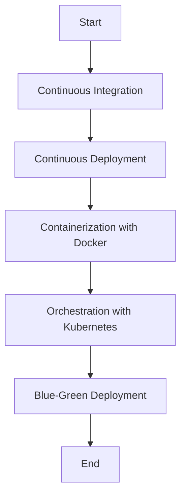

## 15.9 Deployment Strategies for Microservices

Deploying microservices efficiently and reliably is crucial for modern PHP applications. In this section, we will explore various deployment strategies, including Continuous Integration/Continuous Deployment (CI/CD), containerization, orchestration, and blue-green deployments. These strategies help ensure that your microservices are scalable, maintainable, and resilient.

### Continuous Integration/Continuous Deployment (CI/CD)

Continuous Integration (CI) and Continuous Deployment (CD) are practices that automate the process of integrating code changes, testing them, and deploying them to production. This automation reduces manual errors, provides rapid feedback, and ensures that your application is always in a deployable state.

#### Key Concepts of CI/CD

- **Continuous Integration:** Developers frequently integrate code into a shared repository, where automated builds and tests are run. This practice helps identify integration issues early.
- **Continuous Deployment:** Every change that passes all stages of the production pipeline is released to customers. This ensures that the software is always ready for deployment.

#### Implementing CI/CD in PHP

To implement CI/CD for PHP applications, you can use tools like Jenkins, GitLab CI, or GitHub Actions. Here's a basic example using GitHub Actions:

```yaml
name: CI/CD Pipeline

on:
  push:
    branches:
      - main

jobs:
  build:
    runs-on: ubuntu-latest

    steps:
    - name: Checkout code
      uses: actions/checkout@v2

    - name: Set up PHP
      uses: shivammathur/setup-php@v2
      with:
        php-version: '8.0'

    - name: Install dependencies
      run: composer install

    - name: Run tests
      run: vendor/bin/phpunit

    - name: Deploy
      if: success()
      run: ./deploy.sh
```

In this example, the pipeline triggers on every push to the main branch, sets up PHP, installs dependencies, runs tests, and deploys the application if all tests pass.

#### Benefits of CI/CD

- **Faster Time to Market:** Automating the deployment process speeds up the release cycle.
- **Improved Quality:** Automated testing ensures that only code that passes tests is deployed.
- **Reduced Risk:** Frequent deployments in small increments reduce the risk of large-scale failures.

### Containerization

Containerization involves packaging an application and its dependencies into a container, ensuring that it runs consistently across different environments. Docker is the most popular tool for containerization.

#### Why Use Docker for PHP Microservices?

- **Consistency:** Containers ensure that your application behaves the same in development, testing, and production.
- **Isolation:** Each microservice runs in its own container, preventing conflicts between services.
- **Scalability:** Containers can be easily scaled up or down based on demand.

#### Creating a Docker Container for a PHP Application

Here's a simple Dockerfile for a PHP application:

```dockerfile
# Use the official PHP image
FROM php:8.0-apache

# Set the working directory
WORKDIR /var/www/html

# Copy the current directory contents into the container
COPY . .

# Install dependencies
RUN docker-php-ext-install mysqli

# Expose port 80
EXPOSE 80

# Start Apache in the foreground
CMD ["apache2-foreground"]
```

To build and run the container, use the following commands:

```bash
docker build -t my-php-app .
docker run -p 8080:80 my-php-app
```

This Dockerfile sets up a PHP environment with Apache, installs the `mysqli` extension, and copies the application code into the container.

#### Benefits of Containerization

- **Portability:** Containers can run on any system that supports Docker, making it easy to move applications between environments.
- **Resource Efficiency:** Containers share the host OS kernel, making them more lightweight than virtual machines.
- **Rapid Deployment:** Containers can be started and stopped quickly, facilitating rapid deployment and scaling.

### Orchestration with Kubernetes

While Docker provides a way to package and run containers, Kubernetes is a powerful tool for managing containerized applications at scale. It automates deployment, scaling, and management of containerized applications.

#### Key Features of Kubernetes

- **Automated Rollouts and Rollbacks:** Kubernetes can automatically roll out changes to your application or roll back changes if something goes wrong.
- **Service Discovery and Load Balancing:** Kubernetes can expose a container using a DNS name or IP address and load balance traffic across containers.
- **Self-Healing:** Kubernetes restarts containers that fail, replaces containers, and kills containers that don't respond to user-defined health checks.

#### Deploying PHP Microservices with Kubernetes

To deploy a PHP application on Kubernetes, you need to define a deployment and a service. Here's an example:

```yaml
apiVersion: apps/v1
kind: Deployment
metadata:
  name: php-app
spec:
  replicas: 3
  selector:
    matchLabels:
      app: php-app
  template:
    metadata:
      labels:
        app: php-app
    spec:
      containers:
      - name: php-app
        image: my-php-app
        ports:
        - containerPort: 80

---
apiVersion: v1
kind: Service
metadata:
  name: php-app-service
spec:
  type: LoadBalancer
  ports:
  - port: 80
    targetPort: 80
  selector:
    app: php-app
```

This configuration creates a deployment with three replicas of the PHP application and a service that exposes the application to the outside world.

#### Benefits of Using Kubernetes

- **Scalability:** Kubernetes can scale your application up or down based on demand.
- **High Availability:** Kubernetes ensures that your application is always running the desired number of instances.
- **Resource Optimization:** Kubernetes efficiently manages resources, ensuring that applications use only what they need.

### Blue-Green Deployments

Blue-green deployment is a strategy that reduces downtime and risk by running two identical production environments, referred to as "blue" and "green."

#### How Blue-Green Deployment Works

1. **Deploy to Green:** Deploy the new version of your application to the green environment.
2. **Test in Green:** Perform testing in the green environment to ensure everything works as expected.
3. **Switch Traffic:** Once testing is complete, switch the traffic from the blue environment to the green environment.
4. **Rollback if Necessary:** If any issues arise, switch back to the blue environment.

#### Implementing Blue-Green Deployment

Blue-green deployment can be implemented using load balancers or DNS switching. Here's a simple example using Nginx as a load balancer:

```nginx
http {
    upstream blue {
        server blue.example.com;
    }

    upstream green {
        server green.example.com;
    }

    server {
        listen 80;

        location / {
            proxy_pass http://green; # Switch to blue if needed
        }
    }
}
```

In this configuration, traffic is directed to the green environment. To switch to the blue environment, simply change `proxy_pass` to `http://blue`.

#### Benefits of Blue-Green Deployment

- **Zero Downtime:** Traffic can be switched between environments without downtime.
- **Easy Rollback:** If issues occur, you can quickly revert to the previous version.
- **Improved Testing:** The new version can be tested in a production-like environment before going live.

### Visualizing Deployment Strategies

Let's visualize the deployment strategies discussed using a flowchart:



This flowchart illustrates the sequence of deploying microservices, starting from CI/CD, moving through containerization and orchestration, and finally implementing blue-green deployment.

### Try It Yourself

Experiment with the code examples provided by modifying them to suit your needs. For instance, try changing the number of replicas in the Kubernetes deployment or switching the environment in the blue-green deployment example.

### Knowledge Check

- What are the benefits of using CI/CD in microservices deployment?
- How does containerization improve the deployment process?
- What role does Kubernetes play in managing microservices?
- How does blue-green deployment reduce downtime?

### Conclusion

Deploying microservices effectively requires a combination of strategies that automate, scale, and ensure the reliability of your applications. By implementing CI/CD, containerization, orchestration, and blue-green deployments, you can achieve a robust deployment process for your PHP microservices.

## Quiz: Deployment Strategies for Microservices



### What is the primary benefit of Continuous Integration?

- [x] Early detection of integration issues
- [ ] Faster deployment times
- [ ] Reduced server costs
- [ ] Improved user interface

> **Explanation:** Continuous Integration helps in early detection of integration issues by frequently integrating code into a shared repository.

### Which tool is commonly used for containerization?

- [x] Docker
- [ ] Jenkins
- [ ] GitHub Actions
- [ ] Kubernetes

> **Explanation:** Docker is the most popular tool for containerization, allowing applications to run consistently across different environments.

### What is the role of Kubernetes in microservices deployment?

- [x] Automating deployment, scaling, and management of containers
- [ ] Providing a user interface for applications
- [ ] Reducing server costs
- [ ] Enhancing application security

> **Explanation:** Kubernetes automates the deployment, scaling, and management of containerized applications.

### How does blue-green deployment reduce downtime?

- [x] By running two identical production environments and switching traffic between them
- [ ] By using a single environment with frequent updates
- [ ] By reducing the number of servers
- [ ] By automating code integration

> **Explanation:** Blue-green deployment reduces downtime by running two identical environments and switching traffic between them without downtime.

### Which of the following is a benefit of containerization?

- [x] Portability
- [x] Resource efficiency
- [ ] Increased server costs
- [ ] Complex setup

> **Explanation:** Containerization offers portability and resource efficiency, making it easier to move applications between environments and efficiently use resources.

### What is the purpose of a Dockerfile?

- [x] To define the environment and dependencies for a container
- [ ] To manage server configurations
- [ ] To automate code testing
- [ ] To provide a user interface

> **Explanation:** A Dockerfile is used to define the environment and dependencies for a container, ensuring consistency across environments.

### How does CI/CD improve software quality?

- [x] By automating testing and ensuring only passing code is deployed
- [ ] By reducing the number of developers needed
- [x] By providing rapid feedback on code changes
- [ ] By increasing server costs

> **Explanation:** CI/CD improves software quality by automating testing and providing rapid feedback, ensuring that only code that passes tests is deployed.

### What is a key feature of Kubernetes?

- [x] Automated rollouts and rollbacks
- [ ] Providing a graphical user interface
- [ ] Reducing code complexity
- [ ] Enhancing application security

> **Explanation:** Kubernetes offers automated rollouts and rollbacks, ensuring smooth updates and the ability to revert changes if needed.

### Which deployment strategy involves running two identical environments?

- [x] Blue-Green Deployment
- [ ] Continuous Deployment
- [ ] Rolling Deployment
- [ ] Canary Deployment

> **Explanation:** Blue-Green Deployment involves running two identical environments and switching traffic between them to reduce downtime.

### True or False: Kubernetes can only be used with Docker containers.

- [x] True
- [ ] False

> **Explanation:** Kubernetes is designed to work with Docker containers, providing orchestration and management capabilities.



Remember, deploying microservices is an ongoing journey. As you continue to explore and implement these strategies, you'll gain deeper insights and refine your approach. Keep experimenting, stay curious, and enjoy the journey!
