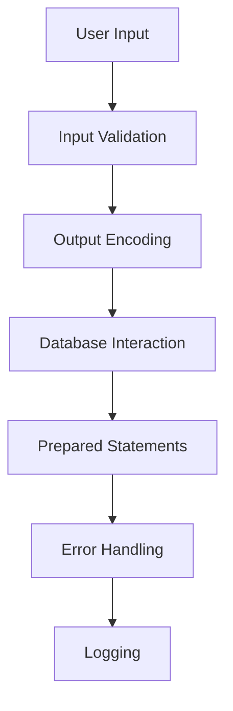

## 16.1 Secure Coding Practices in PHP

In today's digital landscape, security is paramount. As PHP developers, we must ensure that our applications are robust against various threats. This section delves into secure coding practices in PHP, focusing on principles, common vulnerabilities, and best practices to safeguard your applications.

### Principles of Secure Coding

#### Input Validation and Output Encoding

**Input Validation** is the first line of defense against malicious data. Always validate and sanitize user input to ensure it meets the expected format and type. This prevents injection attacks and other malicious exploits.

- **Sanitization**: Remove or escape harmful characters from input data.
- **Validation**: Check if the input data meets specific criteria (e.g., email format, numeric range).

**Output Encoding** is crucial for preventing Cross-Site Scripting (XSS) attacks. Encode data before rendering it in the browser to neutralize any embedded scripts.

```php
// Example of input validation and output encoding
function sanitizeInput($data) {
    return htmlspecialchars(strip_tags(trim($data)));
}

$userInput = "<script>alert('XSS');</script>";
$safeInput = sanitizeInput($userInput);
echo $safeInput; // Outputs: alert('XSS');
```

#### Principle of Least Privilege

The **Principle of Least Privilege** dictates that users and systems should have the minimum level of access necessary to perform their functions. This minimizes the potential damage from accidental or malicious actions.

- **Database Access**: Use accounts with limited permissions for database interactions.
- **File Permissions**: Set restrictive permissions on files and directories.

#### Data Encryption and Hashing

**Encryption** protects sensitive data by converting it into a secure format. Use strong algorithms like AES for encrypting sensitive information.

**Hashing** is used for storing passwords securely. PHP provides the `password_hash()` function, which uses a strong one-way hashing algorithm.

```php
// Example of password hashing
$password = "securePassword123";
$hashedPassword = password_hash($password, PASSWORD_BCRYPT);

if (password_verify($password, $hashedPassword)) {
    echo "Password is valid!";
} else {
    echo "Invalid password.";
}
```

#### Regular Updates and Patching

Keeping PHP and its dependencies up to date is crucial for security. Regular updates patch known vulnerabilities and improve overall security.

- **PHP Version**: Always use the latest stable version of PHP.
- **Libraries and Frameworks**: Regularly update third-party libraries and frameworks.

### Common Security Vulnerabilities

#### SQL Injection

**SQL Injection** occurs when user input is improperly sanitized in SQL queries, allowing attackers to manipulate the database.

- **Prevention**: Use prepared statements with PDO or MySQLi.

```php
// Example of preventing SQL Injection with prepared statements
$dbh = new PDO('mysql:host=localhost;dbname=test', $user, $pass);
$stmt = $dbh->prepare("SELECT * FROM users WHERE username = :username");
$stmt->bindParam(':username', $username);
$stmt->execute();
```

#### Cross-Site Scripting (XSS)

**XSS** allows attackers to inject malicious scripts into web pages viewed by other users.

- **Prevention**: Encode output data and validate input.

#### Cross-Site Request Forgery (CSRF)

**CSRF** forces users to execute unwanted actions on web applications in which they're authenticated.

- **Prevention**: Use anti-CSRF tokens in forms and validate them on the server side.

```php
// Example of CSRF token generation and validation
session_start();
if (empty($_SESSION['csrf_token'])) {
    $_SESSION['csrf_token'] = bin2hex(random_bytes(32));
}

if ($_SERVER['REQUEST_METHOD'] === 'POST') {
    if (!hash_equals($_SESSION['csrf_token'], $_POST['csrf_token'])) {
        die('Invalid CSRF token');
    }
}
```

#### File Inclusion Attacks

**File Inclusion Attacks** occur when an application includes remote or local files that can execute malicious code.

- **Prevention**: Validate file paths and use whitelists for allowed files.

### Best Practices and Guidelines

#### Follow OWASP Guidelines

The **OWASP Top Ten Project** provides a list of the most critical web application security risks. Familiarize yourself with these guidelines to enhance your application's security.

- **Link**: [OWASP Top Ten Project](https://owasp.org/www-project-top-ten/)

#### Use Prepared Statements

Prepared statements prevent SQL injection by separating SQL logic from data. Use PDO or MySQLi for secure database interactions.

#### Error Handling and Logging

Avoid displaying detailed error messages to users, as they can reveal sensitive information. Log errors securely for debugging purposes.

```php
// Example of secure error handling
ini_set('display_errors', 0);
ini_set('log_errors', 1);
ini_set('error_log', '/path/to/error.log');
```

### Visualizing Secure Coding Practices

Below is a diagram illustrating the flow of secure coding practices in PHP, from input validation to error handling.



### Knowledge Check

- **What is the principle of least privilege?**
- **How can you prevent SQL injection attacks?**
- **Why is output encoding important?**

### Try It Yourself

Experiment with the code examples provided. Try modifying the input validation function to handle different types of data, such as email addresses or numeric values. Implement CSRF protection in a simple form submission scenario.

### Embrace the Journey

Remember, secure coding is an ongoing process. As you continue to develop your skills, you'll encounter new challenges and opportunities to enhance your applications' security. Stay curious, keep learning, and embrace the journey of secure PHP development!

## Quiz: Secure Coding Practices in PHP



### What is the primary purpose of input validation?

- [x] To ensure user input meets expected criteria
- [ ] To encode output data
- [ ] To hash passwords
- [ ] To log errors

> **Explanation:** Input validation ensures that user input meets expected criteria, preventing malicious data from entering the system.

### Which PHP function is used for hashing passwords?

- [x] password_hash()
- [ ] md5()
- [ ] sha1()
- [ ] crypt()

> **Explanation:** The `password_hash()` function is used for hashing passwords securely in PHP.

### How can SQL injection be prevented?

- [x] Using prepared statements
- [ ] Displaying error messages
- [ ] Encoding output
- [ ] Using global variables

> **Explanation:** SQL injection can be prevented by using prepared statements, which separate SQL logic from data.

### What is the purpose of output encoding?

- [x] To prevent XSS attacks
- [ ] To validate input
- [ ] To encrypt data
- [ ] To log errors

> **Explanation:** Output encoding prevents XSS attacks by neutralizing any embedded scripts in the data.

### Which of the following is a common security vulnerability?

- [x] SQL Injection
- [x] Cross-Site Scripting (XSS)
- [ ] Secure Hashing
- [ ] Data Encryption

> **Explanation:** SQL Injection and Cross-Site Scripting (XSS) are common security vulnerabilities in web applications.

### What is the principle of least privilege?

- [x] Granting minimal permissions necessary
- [ ] Allowing all users full access
- [ ] Encrypting all data
- [ ] Logging all actions

> **Explanation:** The principle of least privilege involves granting minimal permissions necessary to reduce potential damage.

### How can CSRF attacks be mitigated?

- [x] Using anti-CSRF tokens
- [ ] Displaying error messages
- [ ] Using prepared statements
- [ ] Encoding output

> **Explanation:** CSRF attacks can be mitigated by using anti-CSRF tokens in forms and validating them on the server side.

### What should be done with error messages in production?

- [x] Log them securely
- [ ] Display them to users
- [ ] Ignore them
- [ ] Encrypt them

> **Explanation:** Error messages should be logged securely and not displayed to users in production environments.

### Which of the following is a recommended practice for secure coding?

- [x] Regular updates and patching
- [ ] Using global variables
- [ ] Displaying detailed error messages
- [ ] Allowing file inclusion from any source

> **Explanation:** Regular updates and patching are recommended practices for secure coding to address known vulnerabilities.

### True or False: Output encoding is only necessary for input data.

- [ ] True
- [x] False

> **Explanation:** Output encoding is necessary for any data that is rendered in the browser, not just input data.


