## 16.10 Avoiding Common Vulnerabilities in PHP: OWASP Top 10

In the world of web development, security is paramount. As PHP developers, we must be vigilant in protecting our applications from vulnerabilities that could be exploited by malicious actors. The Open Web Application Security Project (OWASP) provides a well-regarded list of the top 10 security risks that web applications face. Understanding and mitigating these risks is crucial for building secure PHP applications.

### Familiarize with OWASP Top 10 Risks

The OWASP Top 10 is a standard awareness document for developers and web application security. It represents a broad consensus about the most critical security risks to web applications. Let's explore each of these risks and how they apply to PHP development.

#### 1. Injection

Injection flaws, such as SQL, NoSQL, OS, and LDAP injection, occur when untrusted data is sent to an interpreter as part of a command or query. The attacker's hostile data can trick the interpreter into executing unintended commands or accessing data without proper authorization.

**Mitigation Strategies:**
- **Use Prepared Statements:** Always use prepared statements with parameterized queries to prevent SQL injection.
- **Input Validation:** Validate and sanitize all inputs to ensure they conform to expected formats.
- **Output Encoding:** Encode data before rendering it to the user interface to prevent injection attacks.

**Example: SQL Injection Prevention**

```php
<?php
// Using PDO for database interaction
$pdo = new PDO('mysql:host=localhost;dbname=testdb', 'username', 'password');

// Prepared statement with parameterized query
$stmt = $pdo->prepare('SELECT * FROM users WHERE username = :username');
$stmt->execute(['username' => $_GET['username']]);

// Fetching results
$users = $stmt->fetchAll();
?>
```

#### 2. Broken Authentication

Broken authentication vulnerabilities allow attackers to compromise passwords, keys, or session tokens, or to exploit other implementation flaws to assume other users' identities temporarily or permanently.

**Mitigation Strategies:**
- **Implement Multi-Factor Authentication (MFA):** Use MFA to add an extra layer of security.
- **Secure Password Storage:** Use strong hashing algorithms like bcrypt for password storage.
- **Session Management:** Implement secure session management practices, such as regenerating session IDs after login.

**Example: Secure Password Hashing**

```php
<?php
// Hashing a password using bcrypt
$password = 'user_password';
$hashedPassword = password_hash($password, PASSWORD_BCRYPT);

// Verifying a password
if (password_verify($password, $hashedPassword)) {
    echo 'Password is valid!';
} else {
    echo 'Invalid password.';
}
?>
```

#### 3. Sensitive Data Exposure

Sensitive data exposure occurs when applications do not adequately protect sensitive information such as financial data, healthcare data, or personal information.

**Mitigation Strategies:**
- **Encrypt Sensitive Data:** Use strong encryption algorithms to protect sensitive data both at rest and in transit.
- **Use HTTPS:** Ensure all data transmitted over the network is encrypted using HTTPS.
- **Data Minimization:** Only collect and retain data that is necessary for your application.

**Example: Using HTTPS**

Ensure your PHP application is configured to use HTTPS by setting up an SSL certificate on your server. This encrypts data in transit, protecting it from eavesdropping.

#### 4. XML External Entities (XXE)

XXE vulnerabilities occur when XML input containing a reference to an external entity is processed by a weakly configured XML parser.

**Mitigation Strategies:**
- **Disable External Entity Processing:** Configure your XML parser to disable external entity processing.
- **Use JSON:** Consider using JSON instead of XML for data interchange, as it is less prone to XXE attacks.

**Example: Disabling External Entity Processing**

```php
<?php
// Creating a new DOMDocument
$xml = new DOMDocument();
$xml->loadXML($xmlString, LIBXML_NOENT | LIBXML_DTDLOAD);

// Disable external entity loading
libxml_disable_entity_loader(true);
?>
```

#### 5. Broken Access Control

Broken access control vulnerabilities allow unauthorized users to access restricted resources or perform actions beyond their intended permissions.

**Mitigation Strategies:**
- **Implement Role-Based Access Control (RBAC):** Use RBAC to enforce access policies based on user roles.
- **Deny by Default:** Implement a deny-by-default policy, granting access only to authorized users.
- **Regularly Review Access Controls:** Regularly audit and review access controls to ensure they are up-to-date.

**Example: Role-Based Access Control**

```php
<?php
// Example of a simple role-based access control
$userRole = 'editor';

if ($userRole === 'admin') {
    echo 'Access granted to admin resources.';
} else {
    echo 'Access denied.';
}
?>
```

#### 6. Security Misconfiguration

Security misconfiguration is the most common issue in web applications. It occurs when security settings are not defined, implemented, or maintained as required.

**Mitigation Strategies:**
- **Automate Security Configurations:** Use automated tools to configure security settings consistently across environments.
- **Regularly Update Software:** Keep all software, including libraries and frameworks, up-to-date with the latest security patches.
- **Disable Unnecessary Features:** Disable features and services that are not needed to reduce the attack surface.

**Example: Disabling PHP Error Display in Production**

```php
<?php
// Disable error display in production
ini_set('display_errors', 0);
error_reporting(E_ALL);
?>
```

#### 7. Cross-Site Scripting (XSS)

XSS vulnerabilities occur when an application includes untrusted data in a web page without proper validation or escaping, allowing attackers to execute scripts in the victim's browser.

**Mitigation Strategies:**
- **Output Encoding:** Encode all data before rendering it to the user interface.
- **Content Security Policy (CSP):** Implement CSP to restrict the sources from which scripts can be loaded.
- **Input Validation:** Validate and sanitize all inputs to prevent malicious scripts from being executed.

**Example: Output Encoding with htmlspecialchars**

```php
<?php
// Encoding output to prevent XSS
$userInput = '<script>alert("XSS")</script>';
echo htmlspecialchars($userInput, ENT_QUOTES, 'UTF-8');
?>
```

#### 8. Insecure Deserialization

Insecure deserialization vulnerabilities occur when untrusted data is used to abuse the logic of an application, inflict denial of service (DoS) attacks, or execute arbitrary code.

**Mitigation Strategies:**
- **Avoid Deserialization of Untrusted Data:** Do not deserialize data from untrusted sources.
- **Use JSON:** Prefer JSON over serialized PHP objects for data interchange.
- **Implement Integrity Checks:** Use digital signatures to verify the integrity of serialized data.

**Example: Avoiding Untrusted Deserialization**

```php
<?php
// Avoid deserializing untrusted data
$trustedData = 'O:8:"stdClass":1:{s:3:"foo";s:3:"bar";}';
$object = unserialize($trustedData, ['allowed_classes' => false]);
?>
```

#### 9. Using Components with Known Vulnerabilities

Using components with known vulnerabilities can compromise the security of your application. This includes libraries, frameworks, and other software modules.

**Mitigation Strategies:**
- **Regularly Update Dependencies:** Keep all dependencies up-to-date with the latest security patches.
- **Use Dependency Management Tools:** Use tools like Composer to manage and update dependencies.
- **Monitor Vulnerability Databases:** Regularly check vulnerability databases for known issues in your components.

**Example: Using Composer for Dependency Management**

```bash
# Update all dependencies to their latest versions
composer update
```

#### 10. Insufficient Logging and Monitoring

Insufficient logging and monitoring can allow attackers to achieve their goals without being detected. It is crucial to have comprehensive logging and monitoring in place to detect and respond to security incidents.

**Mitigation Strategies:**
- **Implement Comprehensive Logging:** Log all security-relevant events, including authentication attempts and access to sensitive data.
- **Use Centralized Logging Solutions:** Use centralized logging solutions to aggregate and analyze logs.
- **Regularly Review Logs:** Regularly review logs for suspicious activity and respond to incidents promptly.

**Example: Logging with Monolog**

```php
<?php
use Monolog\Logger;
use Monolog\Handler\StreamHandler;

// Create a log channel
$log = new Logger('name');
$log->pushHandler(new StreamHandler('path/to/your.log', Logger::WARNING));

// Add records to the log
$log->warning('Foo');
$log->error('Bar');
?>
```

### Regular Security Audits

Regular security audits are essential to ensure that your PHP application remains secure over time. These audits should include code reviews, security testing, and the use of automated security tools.

- **Perform Code Reviews:** Conduct regular code reviews with a focus on security to identify potential vulnerabilities.
- **Utilize Security Scanners:** Use automated security scanners to identify vulnerabilities in your application.
- **Conduct Penetration Testing:** Perform penetration testing to simulate real-world attacks and identify weaknesses.

### Visualizing OWASP Top 10 Mitigation Strategies

```mermaid
graph TD;
    A[Injection] -->|Prepared Statements| B[Secure Code]
    A -->|Input Validation| B
    A -->|Output Encoding| B
    C[Broken Authentication] -->|MFA| D[Secure Authentication]
    C -->|Password Hashing| D
    C -->|Session Management| D
    E[Sensitive Data Exposure] -->|Encryption| F[Data Protection]
    E -->|HTTPS| F
    E -->|Data Minimization| F
    G[XXE] -->|Disable External Entities| H[Secure XML Processing]
    G -->|Use JSON| H
    I[Broken Access Control] -->|RBAC| J[Access Control]
    I -->|Deny by Default| J
    I -->|Review Access Controls| J
    K[Security Misconfiguration] -->|Automate Configurations| L[Secure Configuration]
    K -->|Update Software| L
    K -->|Disable Unnecessary Features| L
    M[XSS] -->|Output Encoding| N[Secure UI]
    M -->|CSP| N
    M -->|Input Validation| N
    O[Insecure Deserialization] -->|Avoid Untrusted Data| P[Secure Deserialization]
    O -->|Use JSON| P
    O -->|Integrity Checks| P
    Q[Components with Vulnerabilities] -->|Update Dependencies| R[Secure Components]
    Q -->|Use Dependency Management| R
    Q -->|Monitor Vulnerabilities| R
    S[Insufficient Logging] -->|Comprehensive Logging| T[Secure Monitoring]
    S -->|Centralized Logging| T
    S -->|Review Logs| T
```



### References and Links

- **OWASP Top Ten Project:** [OWASP Top Ten Project](https://owasp.org/www-project-top-ten/)
- **PHP Security Best Practices:** [PHP Security Best Practices](https://www.php.net/manual/en/security.php)
- **Monolog Documentation:** [Monolog Documentation](https://seldaek.github.io/monolog/)

### Knowledge Check

- **Question:** What is the primary purpose of using prepared statements in PHP?
- **Exercise:** Implement a secure login system in PHP using the strategies discussed.

### Embrace the Journey

Remember, security is an ongoing process. As you continue to develop PHP applications, keep security at the forefront of your mind. Regularly update your knowledge, stay informed about new vulnerabilities, and apply best practices consistently. Keep experimenting, stay curious, and enjoy the journey of building secure and robust PHP applications!

## Quiz: Avoiding Common Vulnerabilities (OWASP Top 10)



### What is the primary purpose of using prepared statements in PHP?

- [x] To prevent SQL injection attacks
- [ ] To improve database performance
- [ ] To simplify database queries
- [ ] To enable database transactions

> **Explanation:** Prepared statements are used to prevent SQL injection attacks by separating SQL logic from data.

### Which of the following is a recommended practice for secure password storage?

- [x] Use bcrypt for hashing passwords
- [ ] Store passwords in plain text
- [ ] Use MD5 for hashing passwords
- [ ] Use SHA-1 for hashing passwords

> **Explanation:** Bcrypt is a strong hashing algorithm recommended for secure password storage.

### What is the role of HTTPS in web application security?

- [x] Encrypts data in transit
- [ ] Encrypts data at rest
- [ ] Improves server performance
- [ ] Simplifies application deployment

> **Explanation:** HTTPS encrypts data in transit, protecting it from eavesdropping and man-in-the-middle attacks.

### How can you prevent XML External Entity (XXE) attacks in PHP?

- [x] Disable external entity processing in XML parsers
- [ ] Use XML instead of JSON for data interchange
- [ ] Enable external entity processing in XML parsers
- [ ] Use plain text files instead of XML

> **Explanation:** Disabling external entity processing in XML parsers prevents XXE attacks.

### What is a key strategy for preventing cross-site scripting (XSS) attacks?

- [x] Encode output using htmlspecialchars
- [ ] Use plain text for all outputs
- [ ] Disable JavaScript in browsers
- [ ] Use XML for data interchange

> **Explanation:** Encoding output using functions like htmlspecialchars prevents XSS by escaping special characters.

### Which of the following is a benefit of using role-based access control (RBAC)?

- [x] Simplifies access management
- [ ] Increases application complexity
- [ ] Reduces application performance
- [ ] Eliminates the need for authentication

> **Explanation:** RBAC simplifies access management by assigning permissions based on user roles.

### How can you mitigate the risk of using components with known vulnerabilities?

- [x] Regularly update dependencies
- [ ] Use outdated libraries
- [ ] Avoid using third-party libraries
- [ ] Disable security updates

> **Explanation:** Regularly updating dependencies ensures that you have the latest security patches.

### What is the purpose of implementing a Content Security Policy (CSP)?

- [x] Restricts sources from which scripts can be loaded
- [ ] Increases application performance
- [ ] Simplifies application deployment
- [ ] Disables JavaScript in browsers

> **Explanation:** CSP restricts the sources from which scripts can be loaded, helping to prevent XSS attacks.

### Why is it important to conduct regular security audits?

- [x] To identify and fix vulnerabilities
- [ ] To increase application complexity
- [ ] To reduce application performance
- [ ] To eliminate the need for authentication

> **Explanation:** Regular security audits help identify and fix vulnerabilities, ensuring the application remains secure.

### True or False: Using JSON instead of XML can help prevent XXE attacks.

- [x] True
- [ ] False

> **Explanation:** JSON is less prone to XXE attacks compared to XML, making it a safer choice for data interchange.


