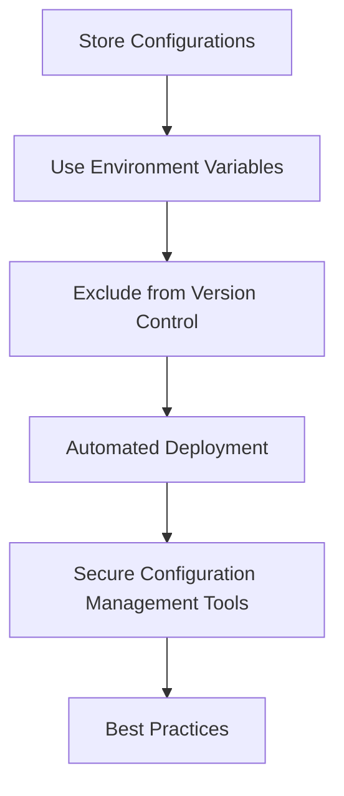

## 16.11 Secure Configuration Management

In the realm of PHP development, secure configuration management is a critical aspect that ensures the safety and integrity of your applications. Mismanagement of configuration files can lead to severe vulnerabilities, exposing sensitive data such as database credentials, API keys, and other confidential information. In this section, we will delve into the best practices for managing configurations securely, leveraging PHP's features, and implementing robust security measures.

### Understanding Configuration Management

Configuration management involves the systematic handling of application settings and parameters to ensure consistency, security, and reliability across different environments. This includes development, testing, staging, and production environments. Proper configuration management helps in maintaining the integrity of your application and prevents unauthorized access to sensitive information.

### Securing Configuration Files

#### Store Sensitive Configurations Outside Web Root

One of the fundamental practices in securing configuration files is to store them outside the web root directory. This prevents direct access to these files via a web browser, reducing the risk of exposure.

```php
// Example of loading configuration from a file outside the web root
$config = parse_ini_file('/path/to/secure/config.ini');
```

#### Use Environment Variables for Credentials

Environment variables offer a secure way to manage sensitive information. By storing credentials in environment variables, you can avoid hardcoding them into your application code.

```php
// Accessing environment variables in PHP
$dbHost = getenv('DB_HOST');
$dbUser = getenv('DB_USER');
$dbPassword = getenv('DB_PASSWORD');
```

**Try It Yourself:** Experiment with setting environment variables in your server configuration and accessing them in your PHP scripts. Modify the values and observe how your application behaves.

### Version Control Considerations

#### Exclude Sensitive Data from Repositories

Sensitive data should never be committed to version control systems. Use `.gitignore` files to exclude configuration files containing sensitive information.

```plaintext
# Example .gitignore entry
config.ini
.env
```

#### Use `.gitignore` to Prevent Committing Secret Files

Ensure that your `.gitignore` file is properly configured to exclude files that contain sensitive data. This prevents accidental exposure of credentials and other confidential information.

### Automated Deployment

#### Use Continuous Integration Pipelines

Automated deployment pipelines can help manage configurations securely by separating configuration data from code. Use tools like Jenkins, GitLab CI/CD, or GitHub Actions to automate the deployment process.

```yaml
# Example GitLab CI/CD configuration
stages:
  - deploy

deploy:
  stage: deploy
  script:
    - echo "Deploying application..."
    - ./deploy.sh
  environment:
    name: production
    url: https://example.com
```

### Secure Configuration Management Tools

Several tools and libraries can assist in managing configurations securely in PHP applications. These tools provide features like encryption, environment-specific configurations, and more.

#### PHP dotenv

PHP dotenv is a popular library for loading environment variables from a `.env` file. It allows you to keep sensitive data out of your codebase.

```php
// Using PHP dotenv to load environment variables
$dotenv = Dotenv\Dotenv::createImmutable(__DIR__);
$dotenv->load();

echo $_ENV['DB_HOST'];
```

#### Ansible and Chef

Tools like Ansible and Chef can automate the configuration management process, ensuring that your application environments are consistent and secure.

### Best Practices for Secure Configuration Management

- **Encrypt Sensitive Data:** Use encryption to protect sensitive data in configuration files.
- **Regularly Review Configurations:** Periodically review your configuration files to ensure they adhere to security best practices.
- **Implement Access Controls:** Restrict access to configuration files to authorized personnel only.
- **Use Configuration Management Systems:** Leverage systems like Puppet or Chef to manage configurations across multiple environments.

### Visualizing Secure Configuration Management

Below is a diagram illustrating the secure configuration management process, from storing configurations to deploying applications.



### Knowledge Check

- **What is the primary purpose of storing configuration files outside the web root?**
- **How can environment variables enhance the security of your PHP application?**
- **Why is it important to exclude sensitive data from version control systems?**

### Embrace the Journey

Remember, secure configuration management is an ongoing process. As you continue to develop and deploy PHP applications, keep refining your strategies and stay informed about the latest security practices. By doing so, you'll ensure that your applications remain robust and secure.

## Quiz: Secure Configuration Management



### What is a key benefit of storing configuration files outside the web root?

- [x] Prevents direct access via a web browser
- [ ] Increases application speed
- [ ] Reduces server load
- [ ] Enhances database performance

> **Explanation:** Storing configuration files outside the web root prevents them from being accessed directly via a web browser, reducing the risk of exposure.

### How do environment variables improve security in PHP applications?

- [x] By keeping sensitive data out of the codebase
- [ ] By increasing application speed
- [ ] By reducing server load
- [ ] By enhancing database performance

> **Explanation:** Environment variables keep sensitive data out of the codebase, reducing the risk of exposure.

### What should be included in a `.gitignore` file?

- [x] Files containing sensitive data
- [ ] All PHP files
- [ ] Images and media files
- [ ] CSS and JavaScript files

> **Explanation:** A `.gitignore` file should include files containing sensitive data to prevent them from being committed to version control.

### What is the role of continuous integration pipelines in secure configuration management?

- [x] Automating deployment processes
- [ ] Increasing application speed
- [ ] Reducing server load
- [ ] Enhancing database performance

> **Explanation:** Continuous integration pipelines automate deployment processes, ensuring configurations are handled securely.

### Which tool is commonly used for loading environment variables in PHP?

- [x] PHP dotenv
- [ ] Composer
- [ ] PHPUnit
- [ ] Laravel

> **Explanation:** PHP dotenv is a popular library for loading environment variables in PHP applications.

### Why is it important to encrypt sensitive data in configuration files?

- [x] To protect it from unauthorized access
- [ ] To increase application speed
- [ ] To reduce server load
- [ ] To enhance database performance

> **Explanation:** Encrypting sensitive data in configuration files protects it from unauthorized access.

### What is a benefit of using configuration management systems like Puppet or Chef?

- [x] Ensures consistency across environments
- [ ] Increases application speed
- [ ] Reduces server load
- [ ] Enhances database performance

> **Explanation:** Configuration management systems like Puppet or Chef ensure consistency across environments, enhancing security.

### What should you regularly do to maintain secure configuration management?

- [x] Review configuration files
- [ ] Increase application speed
- [ ] Reduce server load
- [ ] Enhance database performance

> **Explanation:** Regularly reviewing configuration files ensures they adhere to security best practices.

### What is a key feature of Ansible in configuration management?

- [x] Automates configuration processes
- [ ] Increases application speed
- [ ] Reduces server load
- [ ] Enhances database performance

> **Explanation:** Ansible automates configuration processes, ensuring consistency and security.

### True or False: Sensitive data should be committed to version control systems.

- [ ] True
- [x] False

> **Explanation:** Sensitive data should never be committed to version control systems to prevent exposure.


