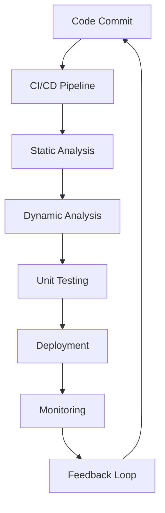

## 16.12 Security Testing and Penetration Testing

In the realm of PHP development, ensuring the security of your applications is paramount. Security testing and penetration testing are critical processes that help identify vulnerabilities and protect your applications from malicious attacks. This section delves into the various types of security testing, the tools available for penetration testing, and how to integrate security into your continuous integration and continuous deployment (CI/CD) pipelines.

### Understanding Security Testing

Security testing is a process designed to uncover vulnerabilities in an application. It ensures that the software is secure and that data is protected from unauthorized access. There are several types of security testing, each serving a unique purpose in the security lifecycle.

#### Security Testing Types

1. **Static Analysis:**
   - **Definition:** Static analysis involves examining the code without executing it. This type of testing is performed early in the development cycle to identify potential vulnerabilities in the source code.
   - **Benefits:** It helps in detecting security flaws such as SQL injection, cross-site scripting (XSS), and buffer overflows before the code is deployed.
   - **Tools:** Tools like PHPStan and SonarQube are commonly used for static analysis in PHP.

2. **Dynamic Analysis:**
   - **Definition:** Dynamic analysis tests the application in a runtime environment. It simulates attacks to identify vulnerabilities that occur during execution.
   - **Benefits:** This type of testing is effective in identifying issues that are not apparent in static analysis, such as runtime errors and security misconfigurations.
   - **Tools:** Tools like OWASP ZAP and Burp Suite are popular for dynamic analysis.

3. **Interactive Application Security Testing (IAST):**
   - **Definition:** IAST combines elements of static and dynamic analysis to provide real-time feedback on security vulnerabilities.
   - **Benefits:** It offers a more comprehensive view of the application's security posture by analyzing code execution paths and data flows.
   - **Tools:** Contrast Security and Veracode are examples of IAST tools.

### Penetration Testing

Penetration testing, or pen testing, is a simulated cyber attack against your application to identify exploitable vulnerabilities. It involves a series of steps to mimic the actions of a potential attacker.

#### Penetration Testing Tools

1. **OWASP ZAP:**
   - **Overview:** OWASP ZAP (Zed Attack Proxy) is an open-source tool used for finding vulnerabilities in web applications.
   - **Features:** It includes automated scanners and a set of tools that allow you to find security vulnerabilities manually.
   - **Usage:** OWASP ZAP can be used to test for issues such as SQL injection, XSS, and broken authentication.

2. **Burp Suite:**
   - **Overview:** Burp Suite is a comprehensive platform for performing security testing of web applications.
   - **Features:** It includes tools for scanning, crawling, and analyzing web applications, as well as a proxy server for intercepting HTTP requests.
   - **Usage:** Burp Suite is widely used for identifying vulnerabilities such as session hijacking, CSRF, and insecure direct object references.

3. **Nmap:**
   - **Overview:** Nmap is a network scanning tool that can be used to discover hosts and services on a computer network.
   - **Features:** It provides information about open ports, running services, and potential vulnerabilities.
   - **Usage:** Nmap is often used in the reconnaissance phase of penetration testing.

4. **Metasploit:**
   - **Overview:** Metasploit is a penetration testing framework that provides information about security vulnerabilities and aids in penetration testing.
   - **Features:** It includes a vast library of exploits and payloads for testing vulnerabilities.
   - **Usage:** Metasploit is used for exploiting known vulnerabilities and testing the effectiveness of security defenses.

### Continuous Security Integration

Integrating security testing into your CI/CD pipelines ensures that security is a continuous process rather than an afterthought. This approach helps in identifying and addressing vulnerabilities early in the development cycle.

#### Steps to Integrate Security into CI/CD

1. **Automate Security Testing:**
   - **Static Analysis:** Integrate static analysis tools into your build process to automatically scan code for vulnerabilities.
   - **Dynamic Analysis:** Use dynamic analysis tools to test applications in staging environments before deployment.

2. **Use Security Plugins:**
   - **Jenkins:** Utilize plugins like OWASP Dependency-Check and SonarQube Scanner to automate security checks in Jenkins pipelines.
   - **GitLab CI/CD:** Implement security scanning features available in GitLab to identify vulnerabilities in code repositories.

3. **Continuous Monitoring:**
   - **Log Analysis:** Continuously monitor logs for suspicious activity and potential security breaches.
   - **Alerting Systems:** Set up alerting systems to notify developers of security issues in real-time.

4. **Regular Security Audits:**
   - **Code Reviews:** Conduct regular code reviews with a focus on security best practices.
   - **Penetration Tests:** Schedule periodic penetration tests to assess the security posture of your applications.

### Code Example: Integrating OWASP ZAP in a CI/CD Pipeline

Let's explore how to integrate OWASP ZAP into a CI/CD pipeline using Jenkins. This example demonstrates how to automate security testing for a PHP application.

```bash
# Jenkinsfile

pipeline {
    agent any

    stages {
        stage('Checkout') {
            steps {
                git 'https://github.com/your-repo/php-app.git'
            }
        }

        stage('Build') {
            steps {
                sh 'composer install'
            }
        }

        stage('Static Analysis') {
            steps {
                sh 'phpstan analyse src --level=max'
            }
        }

        stage('Dynamic Analysis') {
            steps {
                script {
                    def zapHome = tool 'ZAP'
                    sh "${zapHome}/zap.sh -daemon -port 8080 -config api.disablekey=true"
                    sh "curl -X GET http://localhost:8080"
                    sh "${zapHome}/zap-cli quick-scan http://localhost:8080"
                }
            }
        }

        stage('Test') {
            steps {
                sh 'vendor/bin/phpunit'
            }
        }

        stage('Deploy') {
            steps {
                sh 'scp -r * user@server:/var/www/html'
            }
        }
    }
}
```

**Explanation:**
- **Checkout Stage:** Clones the repository containing the PHP application.
- **Build Stage:** Installs dependencies using Composer.
- **Static Analysis Stage:** Runs PHPStan to perform static code analysis.
- **Dynamic Analysis Stage:** Uses OWASP ZAP to perform a quick security scan.
- **Test Stage:** Executes unit tests using PHPUnit.
- **Deploy Stage:** Deploys the application to the server.

### Visualizing Security Testing Workflow

Below is a diagram illustrating the workflow of integrating security testing into a CI/CD pipeline.



**Diagram Explanation:**
- **Code Commit:** Developers commit code changes to the repository.
- **CI/CD Pipeline:** The pipeline is triggered to automate the build and testing process.
- **Static Analysis:** Code is analyzed for vulnerabilities without execution.
- **Dynamic Analysis:** The application is tested in a runtime environment.
- **Unit Testing:** Automated tests are run to ensure functionality.
- **Deployment:** The application is deployed to the production environment.
- **Monitoring:** Continuous monitoring for security threats.
- **Feedback Loop:** Feedback is provided to developers for continuous improvement.

### Knowledge Check

- **Question:** What is the primary difference between static and dynamic analysis?
- **Answer:** Static analysis examines code without execution, while dynamic analysis tests the application during execution.

- **Question:** Name two tools used for penetration testing.
- **Answer:** OWASP ZAP and Burp Suite.

- **Question:** Why is it important to integrate security testing into CI/CD pipelines?
- **Answer:** It ensures vulnerabilities are identified and addressed early in the development cycle.

### Embrace the Journey

Remember, security is an ongoing process. As you continue to develop PHP applications, keep security at the forefront of your development practices. Stay curious, keep learning, and embrace the journey of building secure and robust applications.

## Quiz: Security Testing and Penetration Testing



### What is static analysis in security testing?

- [x] Code review without executing programs
- [ ] Testing applications during execution
- [ ] Simulating cyber attacks
- [ ] Monitoring application logs

> **Explanation:** Static analysis involves examining the code without executing it to identify potential vulnerabilities.

### Which tool is commonly used for dynamic analysis in PHP applications?

- [ ] PHPStan
- [x] OWASP ZAP
- [ ] SonarQube
- [ ] GitLab CI/CD

> **Explanation:** OWASP ZAP is a popular tool for dynamic analysis, testing applications during execution.

### What is the main purpose of penetration testing?

- [ ] To automate unit testing
- [x] To simulate cyber attacks and identify vulnerabilities
- [ ] To deploy applications
- [ ] To monitor application performance

> **Explanation:** Penetration testing simulates cyber attacks to identify exploitable vulnerabilities in applications.

### Which tool is used for network scanning in penetration testing?

- [ ] Burp Suite
- [ ] OWASP ZAP
- [x] Nmap
- [ ] Metasploit

> **Explanation:** Nmap is a network scanning tool used to discover hosts and services on a network.

### What is the benefit of integrating security testing into CI/CD pipelines?

- [x] Early identification and resolution of vulnerabilities
- [ ] Faster deployment of applications
- [ ] Improved application performance
- [x] Continuous monitoring of security threats

> **Explanation:** Integrating security testing into CI/CD pipelines ensures vulnerabilities are identified and addressed early, and allows for continuous monitoring.

### Which stage in a CI/CD pipeline involves running unit tests?

- [ ] Static Analysis
- [ ] Dynamic Analysis
- [x] Test Stage
- [ ] Deployment

> **Explanation:** The Test Stage in a CI/CD pipeline involves running unit tests to ensure application functionality.

### What does OWASP ZAP stand for?

- [x] OWASP Zed Attack Proxy
- [ ] Open Web Application Security Project
- [ ] Online Web Application Security Platform
- [ ] Open Web Application Security Program

> **Explanation:** OWASP ZAP stands for OWASP Zed Attack Proxy, a tool used for finding vulnerabilities in web applications.

### Which of the following is a benefit of static analysis?

- [x] Detecting vulnerabilities before code deployment
- [ ] Identifying runtime errors
- [ ] Simulating cyber attacks
- [ ] Monitoring application logs

> **Explanation:** Static analysis helps in detecting vulnerabilities such as SQL injection and XSS before the code is deployed.

### What is the role of a feedback loop in a CI/CD pipeline?

- [ ] To deploy applications
- [ ] To run unit tests
- [x] To provide feedback to developers for continuous improvement
- [ ] To monitor application performance

> **Explanation:** The feedback loop provides feedback to developers for continuous improvement in the development process.

### True or False: Penetration testing is only necessary for large applications.

- [ ] True
- [x] False

> **Explanation:** Penetration testing is essential for applications of all sizes to ensure security and identify vulnerabilities.


