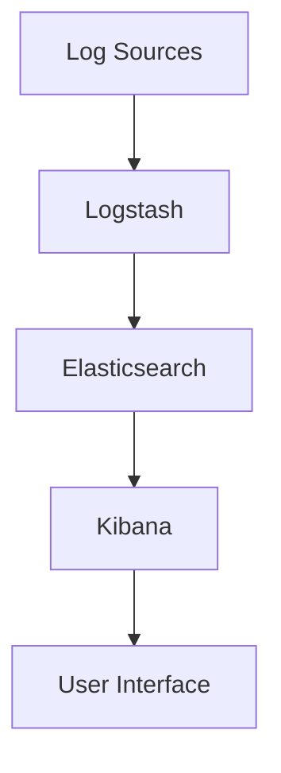
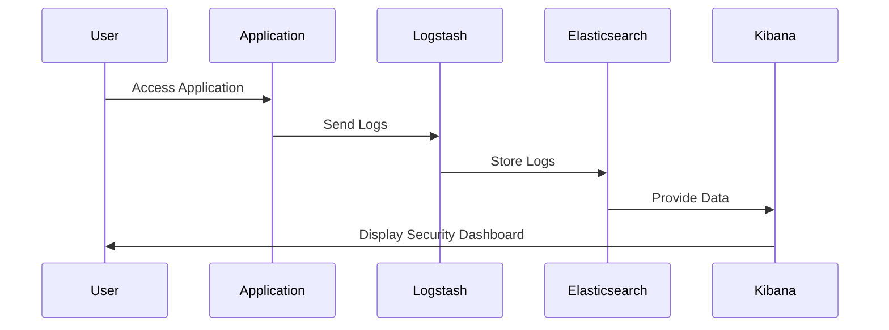

## 16.13 Application Security Monitoring and Auditing

In today's digital landscape, ensuring the security of PHP applications is paramount. Application security monitoring and auditing are critical components of a comprehensive security strategy. They help detect, prevent, and respond to security threats, ensuring the integrity, confidentiality, and availability of your application. In this section, we'll delve into various strategies and tools for effective security monitoring and auditing in PHP applications.

### Monitoring Strategies

#### Real-time Monitoring

Real-time monitoring involves continuously observing your application for security events as they occur. This proactive approach allows you to detect and respond to threats immediately, minimizing potential damage.

- **Implement Intrusion Detection Systems (IDS):** Use tools like Snort or Suricata to monitor network traffic for suspicious activities.
- **Utilize Application Performance Monitoring (APM) Tools:** Tools like New Relic or Datadog can provide insights into application performance and detect anomalies that may indicate security issues.
- **Set Up Alerts and Notifications:** Configure alerts for specific security events, such as failed login attempts or unauthorized access, to ensure timely response.

#### Logging Security Events

Logging is the process of recording events that occur within your application. Proper logging is essential for identifying security incidents and understanding their impact.

- **Log Authentication Attempts:** Record both successful and failed login attempts to detect brute force attacks.
- **Track Access Controls:** Log changes to user permissions and roles to monitor unauthorized access.
- **Capture Error Messages:** Log errors and exceptions to identify potential vulnerabilities.

```php
// Example of logging a failed login attempt
function logFailedLogin($username) {
    $logMessage = sprintf("Failed login attempt for user: %s at %s", $username, date('Y-m-d H:i:s'));
    error_log($logMessage, 3, '/var/log/php_security.log');
}
```

### Audit Trails

Audit trails are chronological records of user activities within an application. They are crucial for forensic analysis and compliance with regulatory requirements.

- **Maintain Detailed Records:** Capture information such as user actions, timestamps, and IP addresses.
- **Ensure Data Integrity:** Use cryptographic techniques to protect audit logs from tampering.
- **Regularly Review Audit Logs:** Conduct periodic reviews to identify suspicious activities and ensure compliance.

```php
// Example of creating an audit trail entry
function createAuditTrail($userId, $action) {
    $auditEntry = [
        'user_id' => $userId,
        'action' => $action,
        'timestamp' => time(),
        'ip_address' => $_SERVER['REMOTE_ADDR']
    ];
    // Save $auditEntry to a secure database or file
}
```

### Security Information and Event Management (SIEM)

SIEM systems provide centralized logging and alerting capabilities, enabling comprehensive security monitoring and analysis.

- **Centralized Logging:** Aggregate logs from various sources, such as web servers, databases, and applications, into a single platform.
- **Real-time Analysis:** Use SIEM tools like Splunk or the ELK Stack to analyze logs in real-time and detect security incidents.
- **Automated Alerts:** Configure automated alerts for specific security events to ensure rapid response.

#### Using the ELK Stack

The ELK Stack (Elasticsearch, Logstash, and Kibana) is a popular open-source solution for centralized logging and monitoring.

- **Elasticsearch:** A search and analytics engine that stores and indexes log data.
- **Logstash:** A data processing pipeline that ingests, transforms, and sends data to Elasticsearch.
- **Kibana:** A visualization tool that allows you to explore and analyze log data.



**Link:** [ELK Stack](https://www.elastic.co/what-is/elk-stack)

### Implementing Security Monitoring in PHP

To effectively implement security monitoring in PHP applications, follow these best practices:

- **Use Secure Coding Practices:** Ensure your code is free from common vulnerabilities such as SQL injection and cross-site scripting (XSS).
- **Regularly Update Dependencies:** Keep your PHP version and third-party libraries up to date to protect against known vulnerabilities.
- **Conduct Security Audits:** Perform regular security audits to identify and remediate vulnerabilities.

### Try It Yourself

Experiment with the following tasks to enhance your understanding of application security monitoring and auditing:

1. **Modify the Logging Code:** Enhance the logging example to include additional information, such as user agent and session ID.
2. **Set Up an ELK Stack:** Install and configure the ELK Stack on a local server to practice centralized logging and analysis.
3. **Create a Custom Alert:** Develop a script that sends an email notification when a specific security event occurs.

### Visualizing Security Monitoring Workflow



### Knowledge Check

- **What is the purpose of real-time monitoring in application security?**
- **How can audit trails assist in forensic analysis?**
- **What are the benefits of using a SIEM system for security monitoring?**

### Summary

In this section, we've explored the importance of application security monitoring and auditing in PHP. By implementing real-time monitoring, logging security events, maintaining audit trails, and utilizing SIEM systems, you can significantly enhance the security posture of your PHP applications. Remember, security is an ongoing process, and staying vigilant is key to protecting your applications from evolving threats.

## Quiz: Application Security Monitoring and Auditing



### What is the primary purpose of real-time monitoring in application security?

- [x] To detect and respond to threats immediately
- [ ] To archive logs for future reference
- [ ] To improve application performance
- [ ] To reduce server load

> **Explanation:** Real-time monitoring allows for immediate detection and response to security threats, minimizing potential damage.

### Which of the following is a key component of an audit trail?

- [x] User actions
- [ ] Application source code
- [ ] Server hardware specifications
- [ ] Network bandwidth

> **Explanation:** Audit trails record user actions, timestamps, and other relevant information for forensic analysis.

### What does SIEM stand for?

- [x] Security Information and Event Management
- [ ] Secure Internet and Email Management
- [ ] System Integration and Event Monitoring
- [ ] Software Installation and Error Management

> **Explanation:** SIEM stands for Security Information and Event Management, which provides centralized logging and alerting capabilities.

### Which tool is part of the ELK Stack?

- [x] Elasticsearch
- [ ] Snort
- [ ] New Relic
- [ ] Datadog

> **Explanation:** Elasticsearch is a component of the ELK Stack, used for storing and indexing log data.

### What is a benefit of using centralized logging?

- [x] Aggregates logs from various sources
- [ ] Reduces application size
- [ ] Increases server response time
- [ ] Eliminates the need for backups

> **Explanation:** Centralized logging aggregates logs from various sources, making it easier to analyze and detect security incidents.

### How can you ensure the integrity of audit logs?

- [x] Use cryptographic techniques
- [ ] Store logs on a public server
- [ ] Delete logs after 30 days
- [ ] Share logs with all users

> **Explanation:** Cryptographic techniques protect audit logs from tampering, ensuring their integrity.

### What is a common use of logging in security monitoring?

- [x] Recording authentication attempts
- [ ] Displaying user profiles
- [ ] Enhancing UI design
- [ ] Compressing data files

> **Explanation:** Logging authentication attempts helps detect unauthorized access and brute force attacks.

### Which of the following is a real-time monitoring tool?

- [x] New Relic
- [ ] GitHub
- [ ] WordPress
- [ ] MySQL

> **Explanation:** New Relic is a real-time monitoring tool that provides insights into application performance and security.

### What is the role of Kibana in the ELK Stack?

- [x] Visualization and analysis of log data
- [ ] Data ingestion and transformation
- [ ] Log storage and indexing
- [ ] Network traffic monitoring

> **Explanation:** Kibana is used for visualizing and analyzing log data within the ELK Stack.

### True or False: Security monitoring is a one-time process.

- [ ] True
- [x] False

> **Explanation:** Security monitoring is an ongoing process that requires continuous vigilance and adaptation to new threats.



Remember, this is just the beginning. As you progress, you'll build more secure and resilient PHP applications. Keep experimenting, stay curious, and enjoy the journey!
