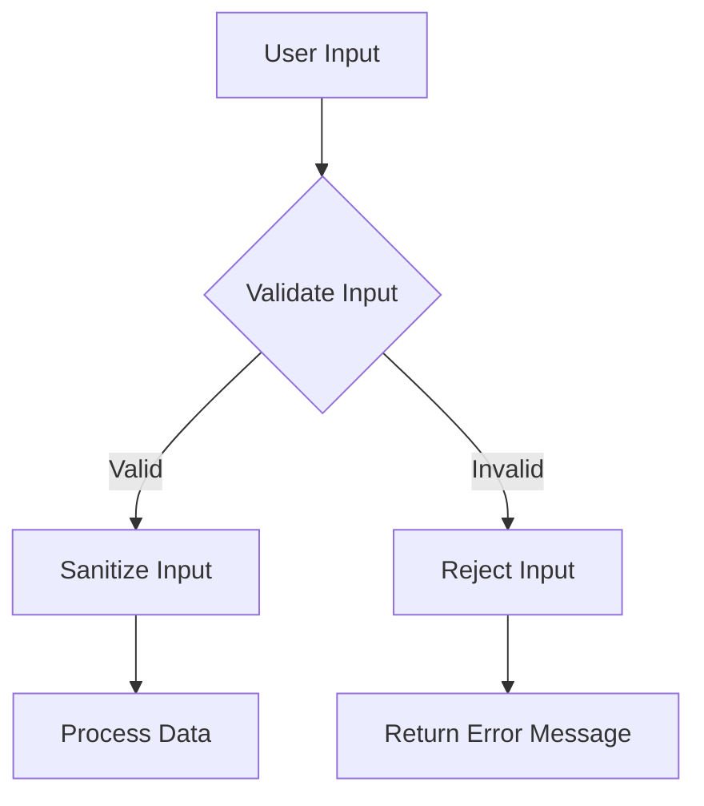

## 16.2 Input Validation and Sanitization

In the realm of web development, ensuring the security and integrity of your application is paramount. One of the foundational practices to achieve this is through input validation and sanitization. This section will delve into the importance of these practices, explore various techniques, and provide practical examples to solidify your understanding.

### Importance of Validating Input

Input validation is a critical security measure that ensures the data entering your application is both expected and safe. By validating input, you can:

- **Prevent Malicious Data:** Protect your application from attacks such as SQL injection, cross-site scripting (XSS), and other forms of data manipulation.
- **Ensure Data Integrity:** Maintain the accuracy and consistency of data within your application.
- **Enhance User Experience:** Provide immediate feedback to users when their input does not meet expected criteria.

### Validation Techniques

Let's explore some common techniques for validating input in PHP.

#### Type Casting and Checking

Type casting and checking are fundamental techniques to ensure that data types match expected values. PHP provides several functions to assist with this:

```php
<?php
// Example of type casting
$input = "123";
$integerValue = (int)$input; // Casts string to integer

// Type checking
if (is_int($integerValue)) {
    echo "The input is a valid integer.";
} else {
    echo "The input is not a valid integer.";
}
?>
```

#### Regular Expressions

Regular expressions (regex) are powerful tools for validating the format of input data, such as emails or phone numbers.

```php
<?php
$email = "user@example.com";
if (preg_match("/^[\w-\.]+@([\w-]+\.)+[\w-]{2,4}$/", $email)) {
    echo "Valid email address.";
} else {
    echo "Invalid email address.";
}
?>
```

#### Built-in Functions

PHP offers built-in functions like `filter_var()` to perform common validations efficiently.

```php
<?php
$email = "user@example.com";
if (filter_var($email, FILTER_VALIDATE_EMAIL)) {
    echo "Valid email address.";
} else {
    echo "Invalid email address.";
}
?>
```

### Sanitization Techniques

Sanitization involves cleaning input data to prevent harmful content from being processed. Here are some essential techniques:

#### Escaping Output

Escaping output is crucial to prevent XSS attacks. Use `htmlspecialchars()` to convert special characters to HTML entities.

```php
<?php
$userInput = "<script>alert('XSS');</script>";
$safeOutput = htmlspecialchars($userInput, ENT_QUOTES, 'UTF-8');
echo $safeOutput; // Outputs: &lt;script&gt;alert(&#039;XSS&#039;);&lt;/script&gt;
?>
```

#### Prepared Statements

Prepared statements are a robust way to handle SQL queries, automatically escaping data to prevent SQL injection.

```php
<?php
$pdo = new PDO('mysql:host=localhost;dbname=test', 'user', 'password');
$stmt = $pdo->prepare("SELECT * FROM users WHERE email = :email");
$stmt->execute(['email' => $email]);
$user = $stmt->fetch();
?>
```

### Libraries and Tools

To further enhance input validation and sanitization, consider using these libraries:

#### Respect\Validation

Respect\Validation is a powerful validation library for PHP, offering a wide range of validation rules.

- **Link:** [Respect\Validation](https://respect-validation.readthedocs.io/en/latest/)

```php
<?php
use Respect\Validation\Validator as v;

$emailValidator = v::email();
if ($emailValidator->validate($email)) {
    echo "Valid email.";
} else {
    echo "Invalid email.";
}
?>
```

#### HTML Purifier

HTML Purifier is a library that filters and cleans HTML content, ensuring it is safe and standards-compliant.

- **Link:** [HTML Purifier](http://htmlpurifier.org/)

```php
<?php
require_once 'HTMLPurifier.auto.php';

$config = HTMLPurifier_Config::createDefault();
$purifier = new HTMLPurifier($config);
$cleanHtml = $purifier->purify($dirtyHtml);
?>
```

### Visualizing Input Validation and Sanitization

To better understand the flow of input validation and sanitization, let's visualize the process using a flowchart.



**Description:** This flowchart illustrates the process of validating and sanitizing user input before processing it. If the input is valid, it is sanitized and processed; if invalid, an error message is returned.

### Try It Yourself

Experiment with the code examples provided. Try modifying the regular expressions to validate different formats, or use `filter_var()` with different filters. Test the HTML Purifier with various HTML inputs to see how it cleans the content.

### Knowledge Check

- Why is input validation important in web applications?
- How can regular expressions be used to validate input formats?
- What is the role of `htmlspecialchars()` in preventing XSS attacks?
- How do prepared statements help prevent SQL injection?

### Embrace the Journey

Remember, input validation and sanitization are just the beginning of securing your PHP applications. As you continue to develop, keep exploring new techniques and tools to enhance your security practices. Stay curious, and enjoy the journey of building robust and secure applications!

### References and Links

- [PHP Manual: Filter Functions](https://www.php.net/manual/en/book.filter.php)
- [OWASP: Input Validation](https://owasp.org/www-community/controls/Input_Validation)
- [Respect\Validation Documentation](https://respect-validation.readthedocs.io/en/latest/)
- [HTML Purifier Documentation](http://htmlpurifier.org/)

## Quiz: Input Validation and Sanitization



### What is the primary purpose of input validation?

- [x] To ensure data integrity and prevent malicious data from affecting application logic.
- [ ] To improve the speed of the application.
- [ ] To enhance the visual appearance of the application.
- [ ] To reduce the size of the database.

> **Explanation:** Input validation ensures that the data entering the application is expected and safe, preventing malicious data from affecting application logic and ensuring data integrity.

### Which PHP function is commonly used for validating email addresses?

- [x] `filter_var()`
- [ ] `htmlspecialchars()`
- [ ] `preg_match()`
- [ ] `str_replace()`

> **Explanation:** `filter_var()` is used with the `FILTER_VALIDATE_EMAIL` filter to validate email addresses in PHP.

### What is the role of `htmlspecialchars()` in PHP?

- [x] To convert special characters to HTML entities, preventing XSS attacks.
- [ ] To validate email addresses.
- [ ] To execute SQL queries.
- [ ] To format dates.

> **Explanation:** `htmlspecialchars()` is used to convert special characters to HTML entities, which helps prevent XSS attacks by escaping potentially harmful input.

### How do prepared statements help in securing SQL queries?

- [x] They automatically handle data escaping, preventing SQL injection.
- [ ] They increase the speed of SQL queries.
- [ ] They format SQL queries for better readability.
- [ ] They store SQL queries in a cache.

> **Explanation:** Prepared statements automatically handle data escaping, which prevents SQL injection by ensuring that user input is treated as data, not executable code.

### Which library is recommended for validating complex input in PHP?

- [x] Respect\Validation
- [ ] HTML Purifier
- [ ] PDO
- [ ] cURL

> **Explanation:** Respect\Validation is a powerful library for validating complex input in PHP, offering a wide range of validation rules.

### What is the purpose of HTML Purifier?

- [x] To filter and clean HTML content, ensuring it is safe and standards-compliant.
- [ ] To validate email addresses.
- [ ] To execute SQL queries.
- [ ] To format dates.

> **Explanation:** HTML Purifier is used to filter and clean HTML content, ensuring it is safe and standards-compliant, which is crucial for preventing XSS attacks.

### Which of the following is a benefit of using regular expressions for input validation?

- [x] They allow for precise validation of input formats.
- [ ] They increase the speed of the application.
- [ ] They reduce the size of the database.
- [ ] They enhance the visual appearance of the application.

> **Explanation:** Regular expressions allow for precise validation of input formats, making them a powerful tool for ensuring data integrity.

### What is a common use case for type casting in PHP?

- [x] To ensure that data types match expected values.
- [ ] To improve the speed of the application.
- [ ] To enhance the visual appearance of the application.
- [ ] To reduce the size of the database.

> **Explanation:** Type casting is used to ensure that data types match expected values, which is a fundamental aspect of input validation.

### Which PHP function can be used to check if a variable is an integer?

- [x] `is_int()`
- [ ] `filter_var()`
- [ ] `htmlspecialchars()`
- [ ] `preg_match()`

> **Explanation:** `is_int()` is used to check if a variable is an integer, which is useful for type checking during input validation.

### True or False: Input validation can completely eliminate all security risks in a PHP application.

- [ ] True
- [x] False

> **Explanation:** While input validation is a critical security measure, it cannot completely eliminate all security risks. It should be used in conjunction with other security practices to ensure comprehensive protection.



---
