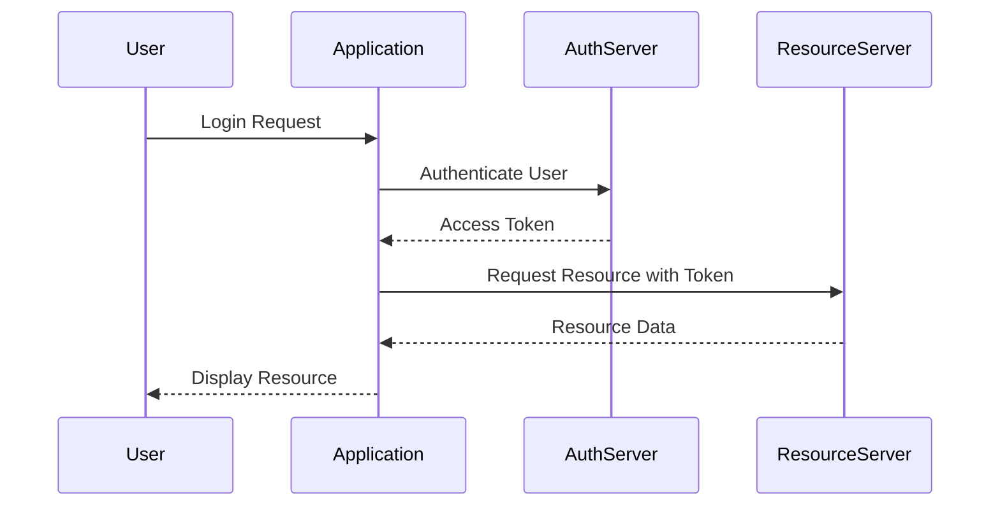

## 16.3 Authentication and Authorization Patterns

In the realm of web development, ensuring that users are who they claim to be and have access only to what they are permitted is crucial. This section delves into the intricacies of authentication and authorization patterns in PHP, providing you with the tools and knowledge to implement secure and efficient systems.

### Understanding Authentication and Authorization

Before diving into patterns, let's clarify the difference between authentication and authorization:

- **Authentication** is the process of verifying the identity of a user. It's akin to checking someone's ID to confirm they are who they say they are.
- **Authorization** determines what an authenticated user is allowed to do. It's like checking if someone has the right ticket to access a particular area.

### Implementing Secure Authentication

#### Password Hashing

One of the foundational aspects of secure authentication is password hashing. PHP provides robust functions for this purpose:

```php
// Hashing a password
$password = 'user_password';
$hashedPassword = password_hash($password, PASSWORD_DEFAULT);

// Verifying a password
if (password_verify($password, $hashedPassword)) {
    echo 'Password is valid!';
} else {
    echo 'Invalid password.';
}
```

- **`password_hash()`**: This function creates a password hash using a strong one-way hashing algorithm. It automatically handles the generation of a salt and the selection of a secure algorithm.
- **`password_verify()`**: This function checks if a given password matches a hash.

#### Multi-Factor Authentication (MFA)

Multi-factor authentication adds an extra layer of security by requiring additional verification methods beyond just a password. Implementing MFA can involve:

- **SMS or Email Verification**: Sending a code to the user's phone or email.
- **Authenticator Apps**: Using apps like Google Authenticator to generate time-based codes.

### Authorization Strategies

#### Role-Based Access Control (RBAC)

RBAC is a widely used authorization strategy where permissions are assigned to roles, and users are assigned to these roles. This simplifies management and enhances security.

```php
class User {
    private $role;

    public function __construct($role) {
        $this->role = $role;
    }

    public function hasPermission($permission) {
        $rolePermissions = [
            'admin' => ['create', 'edit', 'delete'],
            'editor' => ['create', 'edit'],
            'viewer' => ['view']
        ];

        return in_array($permission, $rolePermissions[$this->role]);
    }
}

// Example usage
$user = new User('editor');
if ($user->hasPermission('edit')) {
    echo 'User can edit.';
} else {
    echo 'User cannot edit.';
}
```

#### Access Control Lists (ACLs)

ACLs provide a more granular level of control by specifying permissions for each user or group.

```php
class ACL {
    private $permissions = [];

    public function addPermission($user, $resource, $action) {
        $this->permissions[$user][$resource][] = $action;
    }

    public function isAllowed($user, $resource, $action) {
        return in_array($action, $this->permissions[$user][$resource] ?? []);
    }
}

// Example usage
$acl = new ACL();
$acl->addPermission('user1', 'document', 'read');

if ($acl->isAllowed('user1', 'document', 'read')) {
    echo 'Access granted.';
} else {
    echo 'Access denied.';
}
```

### Security Libraries

#### PHPAuth

PHPAuth is a secure authentication class for PHP websites. It simplifies the implementation of authentication systems.

- **GitHub Repository**: [PHPAuth](https://github.com/PHPAuth/PHPAuth)

#### OAuth2 Server Libraries

OAuth2 is a protocol that allows third-party applications to grant limited access to user accounts. The PHP League's OAuth2 Server is a popular library for implementing OAuth2 in PHP.

- **Documentation**: [The PHP League's OAuth2 Server](https://oauth2.thephpleague.com/)

### Visualizing Authentication and Authorization

To better understand how these concepts work together, let's visualize a typical authentication and authorization flow:



**Description**: This diagram illustrates the flow of a user logging into an application, obtaining an access token from an authentication server, and using that token to access resources from a resource server.

### Try It Yourself

Experiment with the provided code examples by:

- Modifying the roles and permissions in the RBAC example to fit different scenarios.
- Implementing a simple MFA system using email verification.
- Extending the ACL example to include more complex permission checks.

### Knowledge Check

- What is the difference between authentication and authorization?
- How does `password_hash()` enhance security?
- What are the benefits of using RBAC over ACLs?

### Embrace the Journey

Remember, implementing secure authentication and authorization is an ongoing process. Stay updated with the latest security practices and continue to refine your systems. Keep experimenting, stay curious, and enjoy the journey!

## Quiz: Authentication and Authorization Patterns



### What is the primary purpose of authentication?

- [x] To verify the identity of a user
- [ ] To determine what a user is allowed to do
- [ ] To encrypt user data
- [ ] To manage user sessions

> **Explanation:** Authentication is the process of verifying the identity of a user.

### Which PHP function is used to hash passwords securely?

- [x] `password_hash()`
- [ ] `md5()`
- [ ] `sha1()`
- [ ] `crypt()`

> **Explanation:** `password_hash()` is a secure function for hashing passwords in PHP.

### What is the main advantage of using RBAC?

- [x] Simplifies management by assigning permissions to roles
- [ ] Provides more granular control than ACLs
- [ ] Requires less storage space
- [ ] Eliminates the need for user authentication

> **Explanation:** RBAC simplifies management by assigning permissions to roles, which users are then assigned to.

### What does MFA stand for?

- [x] Multi-Factor Authentication
- [ ] Multi-Function Authentication
- [ ] Multi-Form Authentication
- [ ] Multi-Factor Authorization

> **Explanation:** MFA stands for Multi-Factor Authentication, which adds an extra layer of security.

### Which library is recommended for implementing OAuth2 in PHP?

- [x] The PHP League's OAuth2 Server
- [ ] PHPAuth
- [ ] Laravel Passport
- [ ] Symfony Security

> **Explanation:** The PHP League's OAuth2 Server is a popular library for implementing OAuth2 in PHP.

### What does ACL stand for?

- [x] Access Control List
- [ ] Authentication Control List
- [ ] Authorization Control List
- [ ] Access Configuration List

> **Explanation:** ACL stands for Access Control List, which specifies permissions for users or groups.

### Which of the following is a benefit of using `password_verify()`?

- [x] It checks if a given password matches a hash
- [ ] It encrypts passwords
- [ ] It generates a password hash
- [ ] It stores passwords securely

> **Explanation:** `password_verify()` checks if a given password matches a hash.

### What is the role of an access token in OAuth2?

- [x] It grants limited access to user accounts
- [ ] It encrypts user data
- [ ] It verifies user identity
- [ ] It manages user sessions

> **Explanation:** An access token in OAuth2 grants limited access to user accounts.

### True or False: Authorization determines what an authenticated user is allowed to do.

- [x] True
- [ ] False

> **Explanation:** Authorization determines what an authenticated user is allowed to do.

### Which of the following is a common method for implementing MFA?

- [x] SMS or Email Verification
- [ ] Password Hashing
- [ ] Role-Based Access Control
- [ ] Access Control Lists

> **Explanation:** SMS or Email Verification is a common method for implementing MFA.




