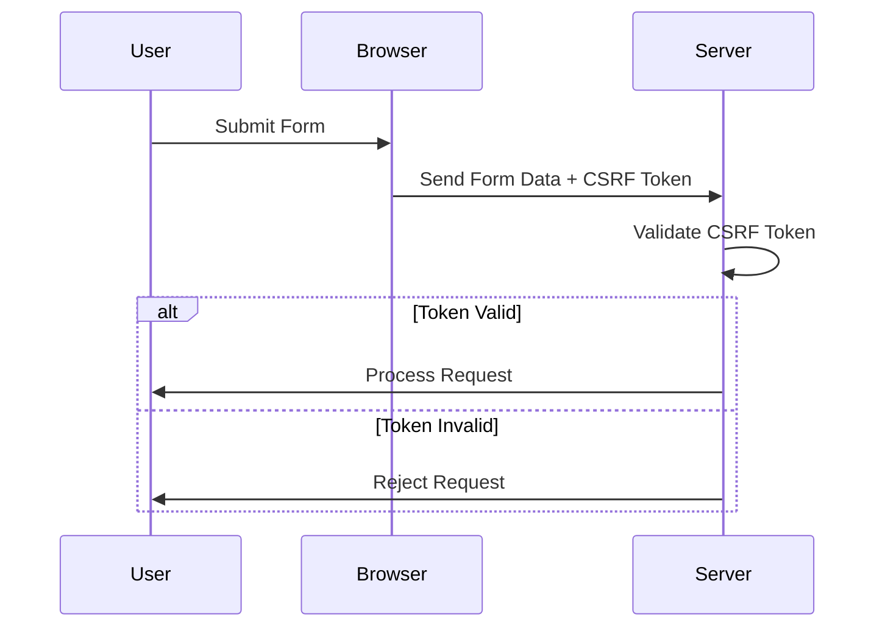
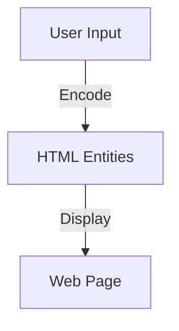

## 16.4 Implementing CSRF and XSS Protection

In the world of web development, ensuring the security of your applications is paramount. Two common vulnerabilities that developers must guard against are Cross-Site Request Forgery (CSRF) and Cross-Site Scripting (XSS). In this section, we will explore techniques to protect PHP applications from these threats, using both built-in PHP features and best practices.

### Understanding CSRF and XSS

Before diving into protection techniques, it's crucial to understand what CSRF and XSS are:

- **CSRF (Cross-Site Request Forgery):** This attack tricks a user into executing unwanted actions on a web application in which they are authenticated. It exploits the trust that a site has in the user's browser.

- **XSS (Cross-Site Scripting):** This vulnerability allows attackers to inject malicious scripts into web pages viewed by other users. It exploits the trust that users have in a website.

### CSRF Protection Techniques

#### CSRF Tokens

One of the most effective ways to prevent CSRF attacks is by using CSRF tokens. These are unique, secret, and unpredictable values that are generated by the server and sent to the client. They must be included in any form submission or state-changing request.

**Implementation Steps:**

1. **Generate a CSRF Token:**

   ```php
   session_start();
   if (empty($_SESSION['csrf_token'])) {
       $_SESSION['csrf_token'] = bin2hex(random_bytes(32));
   }
   ```

   *Explanation:* We start a session and generate a random token if it doesn't already exist. This token is stored in the session.

2. **Include the Token in Forms:**

   ```html
   <form method="post" action="submit.php">
       <input type="hidden" name="csrf_token" value="<?php echo $_SESSION['csrf_token']; ?>">
       <!-- Other form fields -->
       <input type="submit" value="Submit">
   </form>
   ```

   *Explanation:* The token is included as a hidden field in the form.

3. **Validate the Token on Form Submission:**

   ```php
   session_start();
   if ($_SERVER['REQUEST_METHOD'] === 'POST') {
       if (!hash_equals($_SESSION['csrf_token'], $_POST['csrf_token'])) {
           die('CSRF token validation failed');
       }
       // Process form data
   }
   ```

   *Explanation:* Upon form submission, the server checks if the token matches the one stored in the session. If not, the request is rejected.

#### SameSite Cookies

The `SameSite` attribute in cookies can help mitigate CSRF attacks by restricting how cookies are sent with cross-site requests.

**Setting SameSite Cookies:**

```php
setcookie('session', $sessionId, [
    'samesite' => 'Strict',
    'secure' => true,
    'httponly' => true
]);
```

*Explanation:* The `SameSite` attribute can be set to `Strict` or `Lax`, depending on the level of protection needed. `Strict` prevents the cookie from being sent with any cross-site requests, while `Lax` allows it for top-level navigation.

### XSS Protection Techniques

#### Output Encoding

To prevent XSS, always encode user-generated content before displaying it in the browser. This ensures that any potentially malicious scripts are rendered harmless.

**Using PHP's `htmlspecialchars`:**

```php
$userInput = '<script>alert("XSS")</script>';
$safeOutput = htmlspecialchars($userInput, ENT_QUOTES, 'UTF-8');
echo $safeOutput;
```

*Explanation:* The `htmlspecialchars` function converts special characters to HTML entities, preventing the browser from interpreting them as code.

#### Content Security Policy (CSP)

A Content Security Policy (CSP) is a powerful tool that helps prevent XSS by specifying which sources of content are allowed to be loaded on a webpage.

**Example CSP Header:**

```php
header("Content-Security-Policy: default-src 'self'; script-src 'self' https://apis.google.com");
```

*Explanation:* This policy allows scripts to be loaded only from the same origin and from `https://apis.google.com`.

### Framework Features

Many PHP frameworks offer built-in features to help protect against CSRF and XSS.

#### Laravel CSRF Protection

Laravel automatically generates a CSRF token for each active user session. This token is used to verify that the authenticated user is the one actually making the requests.

- **Automatic Token Generation:** Laravel includes a CSRF token in each form generated by the `@csrf` Blade directive.

- **Token Verification:** Laravel automatically verifies the CSRF token on form submissions.

For more information, visit the [Laravel CSRF Protection](https://laravel.com/docs/csrf) documentation.

#### Symfony Security Component

Symfony provides a robust security component that includes tools for authentication and authorization, as well as CSRF protection.

- **CSRF Token Manager:** Symfony's CSRF Token Manager can be used to generate and validate tokens.

- **Twig Integration:** Symfony's Twig templating engine provides functions to include CSRF tokens in forms.

For more details, check out the [Symfony Security Component](https://symfony.com/doc/current/components/security.html) documentation.

### Visualizing CSRF and XSS Protection

To better understand how CSRF and XSS protection mechanisms work, let's visualize the process using Mermaid.js diagrams.

#### CSRF Protection Flow



*Description:* This sequence diagram illustrates the process of submitting a form with a CSRF token and the server's validation of the token.

#### XSS Protection with Output Encoding



*Description:* This flowchart shows how user input is encoded into HTML entities before being displayed on a web page, preventing XSS.

### References and Further Reading

- [OWASP CSRF Prevention Cheat Sheet](https://owasp.org/www-project-cheat-sheets/cheatsheets/Cross-Site_Request_Forgery_Prevention_Cheat_Sheet.html)
- [OWASP XSS Prevention Cheat Sheet](https://owasp.org/www-project-cheat-sheets/cheatsheets/Cross_Site_Scripting_Prevention_Cheat_Sheet.html)
- [MDN Web Docs on Content Security Policy](https://developer.mozilla.org/en-US/docs/Web/HTTP/CSP)

### Knowledge Check

- Explain the difference between CSRF and XSS.
- How do CSRF tokens help prevent CSRF attacks?
- What is the purpose of the `SameSite` attribute in cookies?
- Why is output encoding important for XSS protection?
- How does a Content Security Policy enhance security?

### Embrace the Journey

Remember, implementing security measures like CSRF and XSS protection is just the beginning of building secure web applications. As you continue to develop your skills, you'll encounter more complex security challenges. Stay curious, keep learning, and enjoy the journey of becoming a more proficient and security-conscious developer!

### Quiz: Implementing CSRF and XSS Protection



### What is the primary purpose of a CSRF token?

- [x] To verify that the request is made by the authenticated user
- [ ] To encrypt user data
- [ ] To store user session information
- [ ] To prevent SQL injection

> **Explanation:** CSRF tokens are used to verify that the request is made by the authenticated user, preventing unauthorized actions.

### Which PHP function is commonly used for output encoding to prevent XSS?

- [x] htmlspecialchars
- [ ] htmlentities
- [ ] strip_tags
- [ ] addslashes

> **Explanation:** `htmlspecialchars` is commonly used to convert special characters to HTML entities, preventing XSS.

### What does the `SameSite` attribute in cookies do?

- [x] Restricts how cookies are sent with cross-site requests
- [ ] Encrypts the cookie data
- [ ] Increases the cookie expiration time
- [ ] Stores additional user information

> **Explanation:** The `SameSite` attribute restricts how cookies are sent with cross-site requests, helping to prevent CSRF attacks.

### How does a Content Security Policy (CSP) help prevent XSS?

- [x] By specifying which content sources are allowed
- [ ] By encrypting all web traffic
- [ ] By blocking all external scripts
- [ ] By validating user input

> **Explanation:** A CSP specifies which content sources are allowed, reducing the risk of XSS by blocking unauthorized scripts.

### What is a common feature of PHP frameworks like Laravel for CSRF protection?

- [x] Automatic CSRF token generation and verification
- [ ] Built-in encryption for all data
- [ ] Automatic SQL query optimization
- [ ] Session management

> **Explanation:** PHP frameworks like Laravel automatically generate and verify CSRF tokens for form submissions.

### Which of the following is NOT a method to prevent XSS?

- [ ] Output encoding
- [ ] Content Security Policy
- [x] SQL injection prevention
- [ ] Input validation

> **Explanation:** SQL injection prevention is not directly related to XSS prevention, which focuses on output encoding and CSP.

### What is the role of the `hash_equals` function in CSRF protection?

- [x] To securely compare the CSRF token with the session token
- [ ] To hash user passwords
- [ ] To encrypt form data
- [ ] To generate random tokens

> **Explanation:** `hash_equals` is used to securely compare the CSRF token with the session token, ensuring they match.

### Why is it important to use `secure` and `httponly` flags with cookies?

- [x] To enhance security by restricting cookie access
- [ ] To increase cookie storage capacity
- [ ] To make cookies expire faster
- [ ] To allow cookies to be accessed by JavaScript

> **Explanation:** The `secure` and `httponly` flags enhance security by restricting cookie access to secure channels and preventing JavaScript access.

### What is the main difference between CSRF and XSS?

- [x] CSRF exploits user trust in a website, while XSS exploits website trust in user input
- [ ] CSRF involves SQL injection, while XSS involves script injection
- [ ] CSRF is a server-side attack, while XSS is a client-side attack
- [ ] CSRF targets databases, while XSS targets browsers

> **Explanation:** CSRF exploits user trust in a website, while XSS exploits website trust in user input.

### True or False: A Content Security Policy can completely eliminate the risk of XSS.

- [ ] True
- [x] False

> **Explanation:** While a CSP significantly reduces the risk of XSS, it cannot completely eliminate it, especially if not properly configured.


