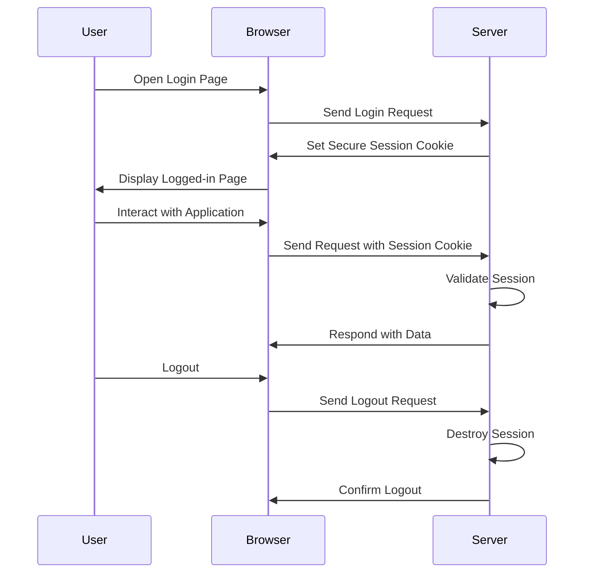

## 16.6 Secure Session Management

In the realm of web development, managing user sessions securely is paramount to safeguarding sensitive information and maintaining user trust. PHP, being a widely used server-side scripting language, offers robust mechanisms for session management. However, to ensure security, developers must adhere to best practices and leverage the right tools and configurations. In this section, we'll delve into secure session management in PHP, exploring best practices, session configuration, and useful libraries and tools.

### Understanding Sessions in PHP

Before diving into secure session management, let's briefly understand what sessions are. Sessions in PHP allow you to store user information across multiple pages. Unlike cookies, session data is stored on the server, making it a more secure option for storing sensitive information.

### Session Handling Best Practices

#### Use Secure, HTTP-Only Cookies for Session IDs

One of the fundamental practices in secure session management is to use secure, HTTP-only cookies for storing session IDs. This prevents session IDs from being accessed through JavaScript, mitigating the risk of cross-site scripting (XSS) attacks.

```php
// Start the session with secure and HTTP-only flags
session_start([
    'cookie_secure' => true, // Ensures the cookie is sent over HTTPS
    'cookie_httponly' => true // Prevents JavaScript access to the session cookie
]);
```

#### Regenerate Session IDs Upon Login

Session fixation attacks occur when an attacker sets a user's session ID to a known value. To prevent this, regenerate session IDs upon user login or privilege escalation.

```php
// Regenerate session ID to prevent fixation
session_regenerate_id(true);
```

#### Implement Session Timeout

Setting a session timeout is crucial to prevent unauthorized access. This involves setting a time limit for how long a session can remain active without user interaction.

```php
// Set session timeout
ini_set('session.gc_maxlifetime', 1800); // 30 minutes
```

#### Validate Session Data

Always validate session data to ensure it hasn't been tampered with. This can be done by storing a hash of the session data and comparing it on each request.

```php
// Example of session data validation
if (isset($_SESSION['user_data'])) {
    $hash = hash('sha256', $_SESSION['user_data']);
    if ($hash !== $_SESSION['data_hash']) {
        // Session data has been tampered with
        session_destroy();
        header("Location: login.php");
        exit();
    }
}
```

### Session Configuration

#### Configure Session Storage Securely

PHP allows you to store session data in various ways, including files, databases, or memory. Choose a storage method that aligns with your security requirements. For example, storing sessions in a database can enhance security by centralizing session management and allowing for better control over session data.

```php
// Example of configuring session storage in a database
ini_set('session.save_handler', 'user');
ini_set('session.save_path', 'tcp://localhost:6379');
```

#### Set Proper Session Timeout Values

Configuring appropriate timeout values for sessions is crucial. This involves setting both the session lifetime and garbage collection settings to ensure sessions are not kept longer than necessary.

```php
// Set session timeout and garbage collection
ini_set('session.gc_maxlifetime', 1440); // 24 minutes
session_set_cookie_params(1440);
```

### Libraries and Tools

#### Symfony Sessions

Symfony provides a robust session management component that offers advanced features such as session storage, flash messages, and session attributes. It is highly configurable and integrates seamlessly with Symfony applications.

- **Link:** [Symfony Session Management](https://symfony.com/doc/current/components/http_foundation/sessions.html)

#### PHP Session Management Libraries

Several libraries can enhance PHP's native session management capabilities. These libraries offer features such as encrypted session storage, session locking, and more.

- **PHP-Session:** A library that provides secure session management with encryption and session locking.
- **SecureSessionHandler:** A library that offers secure session storage with encryption and validation.

### Visualizing Secure Session Management

To better understand secure session management, let's visualize the process using a sequence diagram. This diagram illustrates the flow of a secure session management process, including session creation, validation, and destruction.



### Try It Yourself

To solidify your understanding of secure session management, try implementing the following:

1. **Modify the Session Timeout:** Change the session timeout value and observe how it affects session expiration.
2. **Implement Session Data Validation:** Add a hash validation mechanism to your session data and test it by tampering with the session data.
3. **Use a Database for Session Storage:** Configure your PHP application to store session data in a database and test its functionality.

### Knowledge Check

- What is the purpose of regenerating session IDs upon login?
- How does setting the `cookie_httponly` flag enhance session security?
- Why is it important to configure session storage securely?

### Embrace the Journey

Remember, secure session management is a critical aspect of web development. By following best practices and leveraging the right tools, you can protect your users' data and enhance the security of your applications. Keep experimenting, stay curious, and enjoy the journey!

## Quiz: Secure Session Management



### What is the primary purpose of using secure, HTTP-only cookies for session IDs?

- [x] To prevent session IDs from being accessed through JavaScript
- [ ] To make session IDs accessible to JavaScript
- [ ] To allow session IDs to be sent over HTTP
- [ ] To store session data on the client side

> **Explanation:** Secure, HTTP-only cookies prevent session IDs from being accessed through JavaScript, mitigating XSS attacks.

### Why should session IDs be regenerated upon login?

- [x] To prevent session fixation attacks
- [ ] To increase server load
- [ ] To make sessions last longer
- [ ] To allow multiple users to share the same session

> **Explanation:** Regenerating session IDs upon login prevents session fixation attacks by ensuring a new session ID is used.

### What is the role of session timeout in secure session management?

- [x] To prevent unauthorized access by expiring sessions after a period of inactivity
- [ ] To keep sessions active indefinitely
- [ ] To allow sessions to be shared across users
- [ ] To increase the server's memory usage

> **Explanation:** Session timeout prevents unauthorized access by expiring sessions after a period of inactivity.

### How can session data be validated to ensure it hasn't been tampered with?

- [x] By storing a hash of the session data and comparing it on each request
- [ ] By allowing users to modify session data
- [ ] By storing session data in cookies
- [ ] By disabling session validation

> **Explanation:** Storing a hash of the session data and comparing it on each request ensures data integrity.

### What is the benefit of using a database for session storage?

- [x] Centralized session management and better control over session data
- [ ] Increased complexity in session management
- [ ] Reduced security of session data
- [ ] Slower session retrieval

> **Explanation:** Using a database for session storage centralizes session management and provides better control over session data.

### Which PHP library provides robust session management features?

- [x] Symfony Sessions
- [ ] PHP-Session
- [ ] SecureSessionHandler
- [ ] Laravel Sessions

> **Explanation:** Symfony Sessions provide robust session management features and integrate seamlessly with Symfony applications.

### What is the purpose of setting the `cookie_secure` flag?

- [x] To ensure the cookie is sent over HTTPS
- [ ] To allow the cookie to be sent over HTTP
- [ ] To make the cookie accessible to JavaScript
- [ ] To store session data on the client side

> **Explanation:** The `cookie_secure` flag ensures the cookie is sent over HTTPS, enhancing security.

### How can session storage be configured securely?

- [x] By choosing a storage method that aligns with security requirements
- [ ] By storing sessions in plain text files
- [ ] By allowing users to choose their session storage method
- [ ] By disabling session storage

> **Explanation:** Configuring session storage securely involves choosing a method that aligns with security requirements.

### What is the significance of session garbage collection settings?

- [x] To ensure sessions are not kept longer than necessary
- [ ] To increase server memory usage
- [ ] To allow sessions to be shared across users
- [ ] To disable session expiration

> **Explanation:** Session garbage collection settings ensure sessions are not kept longer than necessary, enhancing security.

### True or False: Secure session management is only necessary for applications handling sensitive data.

- [x] False
- [ ] True

> **Explanation:** Secure session management is necessary for all applications to protect user data and maintain trust.


