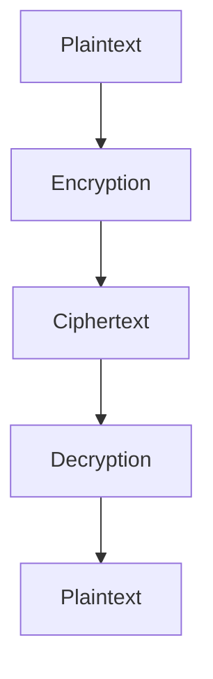

## 16.7 Encryption and Decryption Techniques

In the digital age, securing data is paramount. Encryption and decryption are critical techniques that ensure data confidentiality and integrity. In this section, we will delve into encryption and decryption techniques in PHP, focusing on the OpenSSL extension and other libraries. We'll explore key management, best practices, and provide practical code examples to enhance your PHP applications' security.

### Understanding Encryption and Decryption

**Encryption** is the process of converting plaintext into ciphertext, making it unreadable to unauthorized users. **Decryption** is the reverse process, converting ciphertext back to plaintext. These processes rely on cryptographic keys, which must be managed securely.

#### Key Concepts

- **Symmetric Encryption**: Uses the same key for encryption and decryption. It's fast and suitable for large data volumes.
- **Asymmetric Encryption**: Uses a pair of keys (public and private). It's more secure but slower, often used for key exchange.
- **Hashing**: Converts data into a fixed-size string of characters, which is irreversible. Used for data integrity checks.

### Using PHP's OpenSSL Extension

PHP's OpenSSL extension provides a robust set of functions for encryption and decryption. It supports both symmetric and asymmetric encryption, making it versatile for various security needs.

#### Encrypting and Decrypting Data

The `openssl_encrypt()` and `openssl_decrypt()` functions are central to using OpenSSL in PHP.

```php
<?php
// Define the data to encrypt
$data = "Sensitive information";

// Define a secret key
$key = "secretkey123456";

// Define an initialization vector (IV)
$iv = openssl_random_pseudo_bytes(openssl_cipher_iv_length('aes-256-cbc'));

// Encrypt the data
$encryptedData = openssl_encrypt($data, 'aes-256-cbc', $key, 0, $iv);

// Decrypt the data
$decryptedData = openssl_decrypt($encryptedData, 'aes-256-cbc', $key, 0, $iv);

echo "Encrypted: $encryptedData\n";
echo "Decrypted: $decryptedData\n";
?>
```

**Key Points:**

- **Cipher Method**: `aes-256-cbc` is a popular choice for its balance of security and performance.
- **Initialization Vector (IV)**: Ensures that the same plaintext encrypts to different ciphertexts, enhancing security.
- **Key Length**: Must match the cipher method requirements.

### Key Management

Proper key management is crucial for maintaining encryption security. Here are some best practices:

- **Environment Variables**: Store keys in environment variables to keep them out of source code.
- **Secure Storage Solutions**: Use services like AWS Secrets Manager or HashiCorp Vault for managing keys.
- **Regular Rotation**: Change keys periodically to minimize risk exposure.

### Encryption Libraries

While OpenSSL is powerful, other libraries can simplify encryption tasks. One such library is **Defuse PHP Encryption**.

#### Defuse PHP Encryption

Defuse PHP Encryption is a user-friendly library designed to make encryption secure and straightforward.

**Installation:**

```bash
composer require defuse/php-encryption
```

**Usage Example:**

```php
<?php
require 'vendor/autoload.php';

use Defuse\Crypto\Crypto;
use Defuse\Crypto\Key;

// Generate a new random key
$key = Key::createNewRandomKey();

// Encrypt the data
$encrypted = Crypto::encrypt("Sensitive information", $key);

// Decrypt the data
$decrypted = Crypto::decrypt($encrypted, $key);

echo "Encrypted: $encrypted\n";
echo "Decrypted: $decrypted\n";
?>
```

**Advantages:**

- **Simplicity**: Easy to use with minimal configuration.
- **Security**: Designed with security best practices in mind.

### Best Practices for Encryption and Decryption

1. **Use Strong Algorithms**: Always opt for well-established algorithms like AES.
2. **Secure Key Management**: Never hard-code keys in your application.
3. **Encrypt Sensitive Data**: Encrypt data at rest and in transit.
4. **Regularly Update Libraries**: Keep encryption libraries up to date to mitigate vulnerabilities.
5. **Test Encryption Implementations**: Regularly test your encryption and decryption processes to ensure they work as expected.

### Visualizing Encryption and Decryption

To better understand the encryption and decryption process, let's visualize it using a flowchart.



**Diagram Explanation:**

- **Plaintext**: The original data.
- **Encryption**: The process of converting plaintext to ciphertext.
- **Ciphertext**: The encrypted data.
- **Decryption**: The process of converting ciphertext back to plaintext.

### Try It Yourself

Experiment with the code examples provided. Try changing the cipher method, key, or data to see how it affects the output. This hands-on approach will deepen your understanding of encryption and decryption in PHP.

### Further Reading

- [PHP OpenSSL Documentation](https://www.php.net/manual/en/book.openssl.php)
- [Defuse PHP Encryption GitHub](https://github.com/defuse/php-encryption)
- [OWASP Cryptographic Storage Cheat Sheet](https://cheatsheetseries.owasp.org/cheatsheets/Cryptographic_Storage_Cheat_Sheet.html)

### Knowledge Check

- What is the difference between symmetric and asymmetric encryption?
- Why is key management important in encryption?
- How does an initialization vector (IV) enhance encryption security?

### Embrace the Journey

Remember, mastering encryption and decryption is a journey. As you progress, you'll build more secure and robust PHP applications. Keep experimenting, stay curious, and enjoy the journey!

## Quiz: Encryption and Decryption Techniques



### What is the primary purpose of encryption?

- [x] To convert plaintext into ciphertext
- [ ] To convert ciphertext into plaintext
- [ ] To hash data
- [ ] To compress data

> **Explanation:** Encryption is used to convert plaintext into ciphertext to protect data from unauthorized access.

### Which PHP function is used to encrypt data using OpenSSL?

- [x] openssl_encrypt()
- [ ] openssl_decrypt()
- [ ] hash()
- [ ] password_hash()

> **Explanation:** The `openssl_encrypt()` function is used to encrypt data using OpenSSL in PHP.

### What is the role of an initialization vector (IV) in encryption?

- [x] It ensures that the same plaintext encrypts to different ciphertexts
- [ ] It acts as a key for encryption
- [ ] It compresses the data
- [ ] It hashes the data

> **Explanation:** An initialization vector (IV) ensures that the same plaintext encrypts to different ciphertexts, enhancing security.

### Which library is known for simplifying encryption tasks in PHP?

- [x] Defuse PHP Encryption
- [ ] Laravel
- [ ] Symfony
- [ ] PHPUnit

> **Explanation:** Defuse PHP Encryption is a library designed to simplify encryption tasks in PHP.

### What is a best practice for managing encryption keys?

- [x] Store keys in environment variables
- [ ] Hard-code keys in the source code
- [ ] Use keys from online sources
- [ ] Share keys with all team members

> **Explanation:** Storing keys in environment variables is a best practice for managing encryption keys securely.

### What is symmetric encryption?

- [x] Uses the same key for encryption and decryption
- [ ] Uses different keys for encryption and decryption
- [ ] Converts data into a fixed-size string
- [ ] Compresses data

> **Explanation:** Symmetric encryption uses the same key for both encryption and decryption.

### Which of the following is a strong encryption algorithm?

- [x] AES
- [ ] MD5
- [ ] SHA-1
- [ ] Base64

> **Explanation:** AES is a strong encryption algorithm widely used for secure data encryption.

### What should you regularly do to encryption libraries?

- [x] Update them to mitigate vulnerabilities
- [ ] Delete them after use
- [ ] Share them with others
- [ ] Ignore them

> **Explanation:** Regularly updating encryption libraries helps mitigate vulnerabilities and maintain security.

### What is the purpose of hashing?

- [x] To convert data into a fixed-size string
- [ ] To encrypt data
- [ ] To decrypt data
- [ ] To compress data

> **Explanation:** Hashing converts data into a fixed-size string, often used for data integrity checks.

### True or False: Asymmetric encryption is faster than symmetric encryption.

- [ ] True
- [x] False

> **Explanation:** Asymmetric encryption is generally slower than symmetric encryption due to its complexity.


