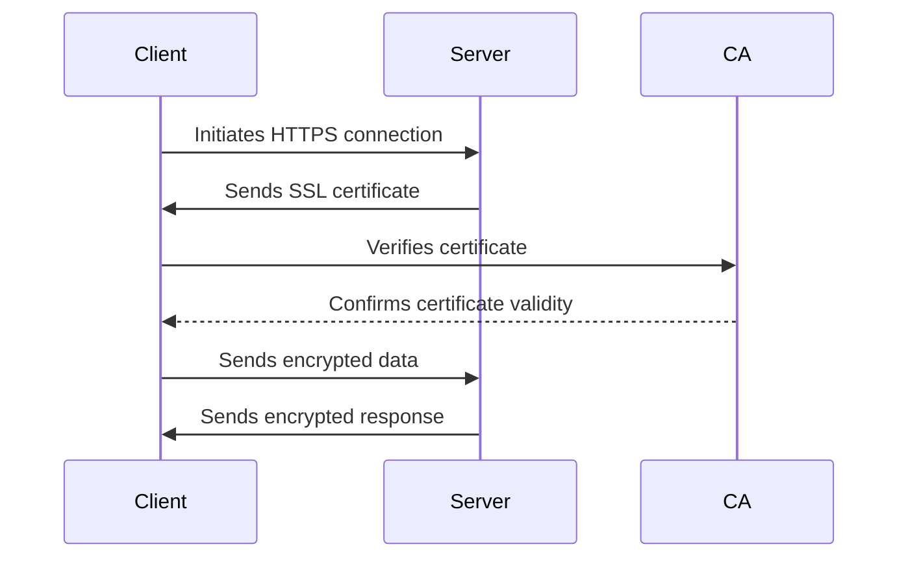

## 16.8 Using HTTPS and SSL/TLS

In today's digital landscape, securing web applications is paramount. One of the foundational elements of web security is the use of HTTPS and SSL/TLS protocols. In this section, we will explore the importance of HTTPS, the process of implementing SSL/TLS, and how to secure your PHP applications effectively.

### Importance of HTTPS

HTTPS (Hypertext Transfer Protocol Secure) is an extension of HTTP and is used to secure data transmitted over the internet. It is crucial for several reasons:

- **Data Encryption:** HTTPS encrypts data in transit between the client and server, ensuring that sensitive information such as passwords, credit card numbers, and personal data are not exposed to eavesdroppers.
- **Data Integrity:** It prevents data from being altered or corrupted during transmission, ensuring that the data received by the client is exactly what the server sent.
- **Authentication:** HTTPS verifies the identity of the website, protecting users from man-in-the-middle attacks and ensuring they are communicating with the intended server.
- **Trust and SEO Benefits:** Browsers display a padlock icon for HTTPS sites, increasing user trust. Additionally, search engines like Google give preference to HTTPS sites in search rankings.

### Implementing SSL/TLS

SSL (Secure Sockets Layer) and TLS (Transport Layer Security) are cryptographic protocols that provide secure communication over a network. TLS is the successor to SSL and is more secure. Implementing SSL/TLS involves several steps:

#### Obtaining SSL Certificates

To enable HTTPS, you need an SSL certificate issued by a trusted Certificate Authority (CA). Here’s how you can obtain one:

1. **Choose a Certificate Authority (CA):** Select a reputable CA such as DigiCert, Comodo, or GlobalSign. Alternatively, you can use free CAs like Let's Encrypt.
2. **Generate a Certificate Signing Request (CSR):** This is a block of encoded text that you send to the CA to apply for an SSL certificate. It contains your public key and information about your organization.
3. **Submit the CSR to the CA:** The CA will verify your information and issue an SSL certificate.
4. **Install the SSL Certificate:** Once issued, you need to install the certificate on your web server.

#### Configuring Web Servers

After obtaining an SSL certificate, configure your web server to use HTTPS. Here’s how you can do it for Apache and Nginx:

##### Apache Configuration

1. **Enable SSL Module:**
   ```bash
   sudo a2enmod ssl
   ```

2. **Edit the SSL Configuration File:**
   Open the SSL configuration file, typically located at `/etc/apache2/sites-available/default-ssl.conf`.

3. **Configure SSL Certificate Paths:**
   ```apache
   <VirtualHost *:443>
       ServerName yourdomain.com
       DocumentRoot /var/www/html

       SSLEngine on
       SSLCertificateFile /etc/ssl/certs/yourdomain.com.crt
       SSLCertificateKeyFile /etc/ssl/private/yourdomain.com.key
       SSLCertificateChainFile /etc/ssl/certs/chain.pem
   </VirtualHost>
   ```

4. **Restart Apache:**
   ```bash
   sudo systemctl restart apache2
   ```

##### Nginx Configuration

1. **Edit the Nginx Configuration File:**
   Open your server block configuration file, typically located at `/etc/nginx/sites-available/default`.

2. **Configure SSL Certificate Paths:**
   ```nginx
   server {
       listen 443 ssl;
       server_name yourdomain.com;

       ssl_certificate /etc/ssl/certs/yourdomain.com.crt;
       ssl_certificate_key /etc/ssl/private/yourdomain.com.key;
       ssl_trusted_certificate /etc/ssl/certs/chain.pem;

       location / {
           root /var/www/html;
           index index.php index.html index.htm;
       }
   }
   ```

3. **Test and Restart Nginx:**
   ```bash
   sudo nginx -t
   sudo systemctl restart nginx
   ```

### Free Certificates with Let's Encrypt

Let's Encrypt is a free, automated, and open Certificate Authority that provides SSL/TLS certificates. It simplifies the process of obtaining and renewing certificates. Here’s how you can use Let's Encrypt:

1. **Install Certbot:** Certbot is a tool that automates the process of obtaining and renewing Let's Encrypt certificates.
   ```bash
   sudo apt-get install certbot python3-certbot-apache
   ```

2. **Obtain a Certificate:**
   ```bash
   sudo certbot --apache -d yourdomain.com
   ```

3. **Automatic Renewal:**
   Certbot automatically renews certificates before they expire. You can manually test the renewal process with:
   ```bash
   sudo certbot renew --dry-run
   ```

For more information, visit [Let's Encrypt](https://letsencrypt.org/).

### Code Example: Secure PHP Connection

To ensure your PHP application communicates securely with external services, use HTTPS URLs in your API requests. Here’s a simple example using `cURL`:

```php
<?php
// Initialize cURL session
$ch = curl_init();

// Set the URL to fetch
curl_setopt($ch, CURLOPT_URL, "https://api.example.com/data");

// Set options to return the transfer as a string
curl_setopt($ch, CURLOPT_RETURNTRANSFER, true);

// Execute the session and store the result
$response = curl_exec($ch);

// Check for errors
if (curl_errno($ch)) {
    echo 'cURL error: ' . curl_error($ch);
} else {
    echo 'Response: ' . $response;
}

// Close the cURL session
curl_close($ch);
?>
```

### Visualizing HTTPS and SSL/TLS

To better understand how HTTPS and SSL/TLS work, let's visualize the process using a sequence diagram:



### Knowledge Check

- **Why is HTTPS important for web applications?**
- **What are the steps to obtain an SSL certificate?**
- **How do you configure Apache and Nginx for HTTPS?**
- **What is Let's Encrypt, and how does it simplify SSL/TLS implementation?**

### Try It Yourself

Experiment with the code example by modifying the URL to a different HTTPS endpoint. Observe how the response changes based on the endpoint's configuration.

### Embrace the Journey

Securing your PHP applications with HTTPS and SSL/TLS is a crucial step in protecting user data and building trust. Remember, this is just the beginning. As you progress, you'll explore more advanced security measures. Keep experimenting, stay curious, and enjoy the journey!

### References and Links

- [Let's Encrypt](https://letsencrypt.org/)
- [Mozilla SSL Configuration Generator](https://ssl-config.mozilla.org/)
- [OpenSSL Documentation](https://www.openssl.org/docs/)

## Quiz: Using HTTPS and SSL/TLS



### What is the primary purpose of HTTPS?

- [x] Encrypts data in transit
- [ ] Increases website speed
- [ ] Reduces server load
- [ ] Improves website design

> **Explanation:** HTTPS encrypts data in transit between the client and server, ensuring secure communication.

### Which protocol is the successor to SSL?

- [ ] HTTP
- [x] TLS
- [ ] FTP
- [ ] SMTP

> **Explanation:** TLS (Transport Layer Security) is the successor to SSL (Secure Sockets Layer).

### What is a Certificate Authority (CA)?

- [x] An entity that issues digital certificates
- [ ] A server that hosts websites
- [ ] A protocol for data transmission
- [ ] A type of encryption algorithm

> **Explanation:** A Certificate Authority (CA) is an entity that issues digital certificates to verify the identity of websites.

### How can you obtain a free SSL certificate?

- [ ] Purchase from a hosting provider
- [x] Use Let's Encrypt
- [ ] Create it manually
- [ ] Use a self-signed certificate

> **Explanation:** Let's Encrypt provides free SSL/TLS certificates.

### What tool automates the process of obtaining Let's Encrypt certificates?

- [ ] OpenSSL
- [x] Certbot
- [ ] Apache
- [ ] Nginx

> **Explanation:** Certbot is a tool that automates the process of obtaining and renewing Let's Encrypt certificates.

### Which command is used to test Nginx configuration?

- [ ] sudo nginx-restart
- [ ] sudo nginx-reload
- [x] sudo nginx -t
- [ ] sudo nginx-check

> **Explanation:** The command `sudo nginx -t` is used to test Nginx configuration for syntax errors.

### What does the padlock icon in a browser indicate?

- [x] The website is using HTTPS
- [ ] The website is fast
- [ ] The website is popular
- [ ] The website is under maintenance

> **Explanation:** The padlock icon indicates that the website is using HTTPS, ensuring secure communication.

### What is the role of a CSR in obtaining an SSL certificate?

- [x] It is a request for a digital certificate
- [ ] It is a type of encryption
- [ ] It is a server configuration file
- [ ] It is a browser setting

> **Explanation:** A Certificate Signing Request (CSR) is a request sent to a CA to apply for an SSL certificate.

### True or False: SSL and TLS are the same.

- [ ] True
- [x] False

> **Explanation:** SSL and TLS are not the same; TLS is the more secure successor to SSL.

### What is the benefit of using HTTPS for SEO?

- [x] Search engines prefer HTTPS sites
- [ ] It reduces website load time
- [ ] It increases ad revenue
- [ ] It improves website aesthetics

> **Explanation:** Search engines like Google give preference to HTTPS sites in search rankings.


