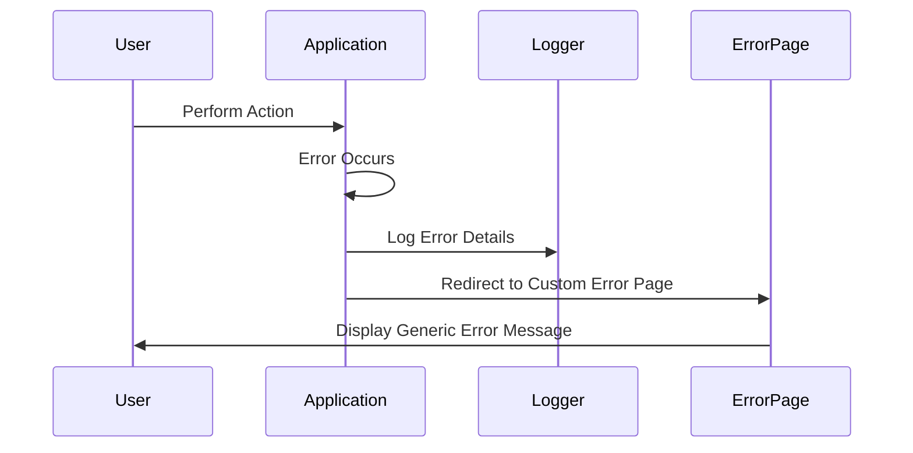

## 16.9 Error Handling and Exception Security

In the realm of PHP development, error handling and exception security are critical components that ensure the robustness and security of applications. Proper error handling not only aids in debugging but also prevents sensitive information from being exposed to potential attackers. In this section, we will explore secure error handling practices, logging strategies, and exception handling techniques in PHP.

### Secure Error Handling

Secure error handling is essential to prevent attackers from gaining insights into the inner workings of your application. Here are some best practices to follow:

#### Do Not Expose Sensitive Information

When an error occurs, it's crucial to ensure that sensitive information, such as database credentials or file paths, is not exposed to the user. Instead, provide generic error messages that do not reveal the underlying system details.

```php
<?php
// Example of a secure error message
try {
    // Code that may throw an exception
} catch (Exception $e) {
    // Log the detailed error message
    error_log($e->getMessage());
    
    // Display a generic error message to the user
    echo "An unexpected error occurred. Please try again later.";
}
?>
```

#### Customize Error Pages

Custom error pages can enhance user experience while keeping attackers at bay. Design error pages that are user-friendly but do not divulge technical details.

```php
<?php
// Custom error handler function
function customErrorHandler($errno, $errstr, $errfile, $errline) {
    // Log the error details
    error_log("Error [$errno]: $errstr in $errfile on line $errline");
    
    // Redirect to a custom error page
    header("Location: /error.php");
    exit();
}

// Set the custom error handler
set_error_handler("customErrorHandler");
?>
```

### Logging Errors Securely

Logging is a vital part of error handling, providing insights into application issues. However, logs must be managed securely to prevent unauthorized access.

#### Log Detailed Errors to Files

Store detailed error logs in files that are not accessible from the web. This ensures that sensitive information is not exposed to users.

```php
<?php
// Log error details to a file
function logErrorToFile($message) {
    $logFile = '/var/log/php_errors.log';
    file_put_contents($logFile, $message, FILE_APPEND);
}

// Example usage
logErrorToFile("Error: Database connection failed.");
?>
```

#### Protect Log Files with Proper Permissions

Ensure that log files have the correct permissions to prevent unauthorized access. Only the necessary users should have read/write access to these files.

```bash
# Set file permissions for the log file
chmod 640 /var/log/php_errors.log
chown www-data:www-data /var/log/php_errors.log
```

### Exception Handling Best Practices

Exception handling is a powerful mechanism in PHP that allows developers to manage errors gracefully. Here are some best practices for handling exceptions:

#### Catch and Handle Exceptions Appropriately

Use try-catch blocks to catch exceptions and handle them appropriately. This prevents the application from crashing and allows for graceful error recovery.

```php
<?php
try {
    // Code that may throw an exception
    $result = divide(10, 0);
} catch (DivisionByZeroError $e) {
    // Handle division by zero error
    echo "Cannot divide by zero.";
} catch (Exception $e) {
    // Handle other exceptions
    echo "An error occurred: " . $e->getMessage();
}
?>
```

#### Use Custom Exception Classes

Creating custom exception classes can help in categorizing and handling different types of exceptions more effectively.

```php
<?php
// Define a custom exception class
class DatabaseException extends Exception {}

// Example usage
try {
    // Code that may throw a DatabaseException
    throw new DatabaseException("Database connection failed.");
} catch (DatabaseException $e) {
    // Handle database-specific exceptions
    echo "Database error: " . $e->getMessage();
}
?>
```

### Visualizing Error Handling Flow

To better understand the flow of error handling in PHP, let's visualize it using a sequence diagram.



### References and Links

- [PHP Error Handling](https://www.php.net/manual/en/book.errorfunc.php) - PHP Manual
- [OWASP Secure Coding Practices](https://owasp.org/www-project-secure-coding-practices-quick-reference-guide/) - OWASP

### Knowledge Check

- What is the importance of not exposing sensitive information in error messages?
- How can you customize error pages to be user-friendly yet secure?
- Why is it important to log errors securely, and how can you protect log files?
- What are the benefits of using custom exception classes in PHP?

### Embrace the Journey

Remember, mastering error handling and exception security is a continuous journey. As you progress, you'll build more secure and robust PHP applications. Keep experimenting, stay curious, and enjoy the journey!

## Quiz: Error Handling and Exception Security



### What is a key reason to avoid exposing sensitive information in error messages?

- [x] To prevent attackers from gaining insights into the system
- [ ] To make debugging easier for developers
- [ ] To improve application performance
- [ ] To comply with coding standards

> **Explanation:** Exposing sensitive information in error messages can provide attackers with valuable insights into the system, potentially leading to security vulnerabilities.

### How can you ensure that error logs are not accessible from the web?

- [x] Store logs in files outside the web root directory
- [ ] Use a database to store logs
- [ ] Display logs on a custom error page
- [ ] Send logs via email to the administrator

> **Explanation:** Storing logs in files outside the web root directory ensures that they are not directly accessible from the web, enhancing security.

### What is the purpose of using custom exception classes in PHP?

- [x] To categorize and handle different types of exceptions effectively
- [ ] To improve application performance
- [ ] To simplify error messages
- [ ] To comply with PSR standards

> **Explanation:** Custom exception classes allow developers to categorize and handle different types of exceptions more effectively, improving error management.

### Which PHP function can be used to set a custom error handler?

- [x] set_error_handler()
- [ ] error_reporting()
- [ ] trigger_error()
- [ ] restore_error_handler()

> **Explanation:** The `set_error_handler()` function is used to set a custom error handler in PHP, allowing developers to define how errors should be handled.

### What is a best practice for handling exceptions in PHP?

- [x] Use try-catch blocks to manage exceptions
- [ ] Ignore exceptions to avoid application crashes
- [ ] Log exceptions to the console
- [ ] Display exception details to the user

> **Explanation:** Using try-catch blocks to manage exceptions is a best practice in PHP, allowing developers to handle errors gracefully and prevent application crashes.

### How can you protect log files from unauthorized access?

- [x] Set proper file permissions and ownership
- [ ] Encrypt log files
- [ ] Store logs in a public directory
- [ ] Use a cloud-based logging service

> **Explanation:** Setting proper file permissions and ownership ensures that only authorized users can access log files, enhancing security.

### What should you include in a custom error page?

- [x] A generic error message
- [ ] Detailed error information
- [ ] Debugging tools
- [ ] System configuration details

> **Explanation:** A custom error page should include a generic error message to inform the user of an issue without exposing sensitive information.

### Why is it important to log errors securely?

- [x] To prevent unauthorized access to sensitive information
- [ ] To improve application performance
- [ ] To comply with coding standards
- [ ] To simplify debugging

> **Explanation:** Logging errors securely prevents unauthorized access to sensitive information, protecting the application from potential security breaches.

### What is the role of the `error_log()` function in PHP?

- [x] To log error messages to a specified destination
- [ ] To display error messages to the user
- [ ] To set the error reporting level
- [ ] To trigger a user-level error

> **Explanation:** The `error_log()` function is used to log error messages to a specified destination, such as a file or a logging service.

### True or False: It is safe to display detailed error messages to users in a production environment.

- [ ] True
- [x] False

> **Explanation:** Displaying detailed error messages to users in a production environment is not safe, as it can expose sensitive information and aid attackers.


