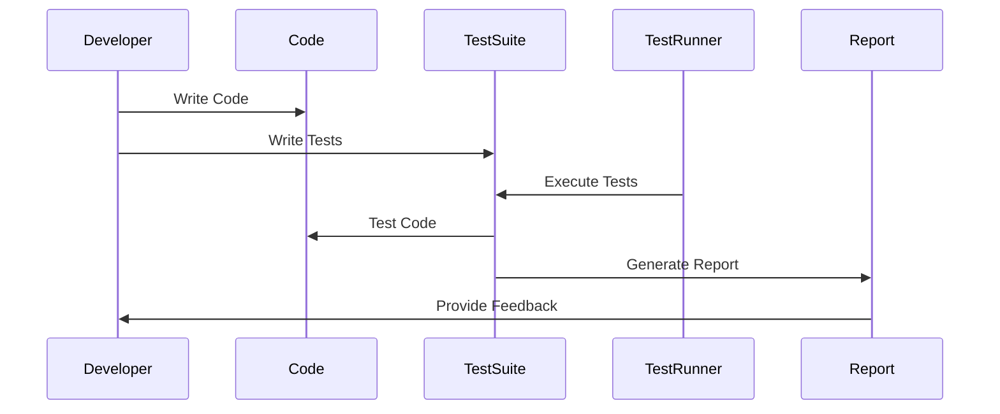

## 17.1 Introduction to Testing in PHP

In the world of software development, testing is a crucial step that ensures the reliability and quality of code. As PHP developers, understanding and implementing testing strategies is essential for building robust applications that stand the test of time. In this section, we will delve into the importance of testing, explore various types of tests, and introduce popular testing frameworks that can be leveraged in PHP development.

### Importance of Testing

Testing is not just a phase in the development lifecycle; it is an ongoing process that accompanies every stage of software creation. Here are some key reasons why testing is indispensable:

- **Ensures Code Reliability and Quality:** Testing helps identify bugs and issues early in the development process, ensuring that the code behaves as expected. This leads to higher quality software that is reliable and performs well under various conditions.

- **Facilitates Refactoring and Maintenance:** With a comprehensive suite of tests, developers can confidently refactor code and make changes, knowing that any regressions will be caught by the tests. This makes maintaining and evolving the codebase much easier.

- **Improves Code Design:** Writing tests often leads to better code design. It encourages developers to write modular, decoupled code that is easier to test and maintain.

- **Boosts Developer Confidence:** Knowing that there are tests in place to catch errors gives developers the confidence to make changes and add new features without fear of breaking existing functionality.

### Types of Tests

Testing can be categorized into several types, each serving a specific purpose in the development process. Let's explore the most common types of tests used in PHP development:

- **Unit Tests:** These tests focus on individual units of code, such as functions or methods, in isolation. Unit tests are fast and help ensure that each part of the code behaves as expected.

- **Integration Tests:** These tests verify the interaction between different units or components of the application. Integration tests ensure that the components work together correctly.

- **Functional Tests:** These tests evaluate the application from the user's perspective, ensuring that the software functions as intended. Functional tests often involve testing user interfaces and workflows.

- **Acceptance Tests:** These tests validate that the application meets the business requirements and specifications. Acceptance tests are often written in collaboration with stakeholders to ensure that the software delivers the expected value.

### Testing Frameworks

To effectively implement testing in PHP, developers can leverage various testing frameworks that provide the necessary tools and structure. Here are some of the most popular testing frameworks in the PHP ecosystem:

#### PHPUnit

PHPUnit is the industry-standard testing framework for PHP. It is widely used for unit testing and provides a comprehensive set of features for writing and running tests.

- **Installation:** PHPUnit can be installed via Composer, the dependency manager for PHP. Simply add it to your `composer.json` file or run the following command:

  ```bash
  composer require --dev phpunit/phpunit
  ```

- **Basic Usage:** Here's a simple example of a PHPUnit test case:

  ```php
  <?php

  use PHPUnit\Framework\TestCase;

  class CalculatorTest extends TestCase
  {
      public function testAddition()
      {
          $calculator = new Calculator();
          $result = $calculator->add(2, 3);
          $this->assertEquals(5, $result);
      }
  }
  ```

  In this example, we define a test case for a `Calculator` class and verify that the `add` method returns the correct result.

- **Link:** [PHPUnit](https://phpunit.de/)

#### Behat

Behat is a behavior-driven development (BDD) framework for PHP. It allows developers to write human-readable specifications that describe the behavior of the application.

- **Installation:** Behat can be installed via Composer. Add it to your `composer.json` file or run the following command:

  ```bash
  composer require --dev behat/behat
  ```

- **Basic Usage:** Behat uses Gherkin syntax to define scenarios. Here's an example:

  ```gherkin
  Feature: Calculator
    In order to avoid silly mistakes
    As a math idiot
    I want to be told the sum of two numbers

    Scenario: Add two numbers
      Given I have entered 2 into the calculator
      And I have entered 3 into the calculator
      When I press add
      Then the result should be 5 on the screen
  ```

  This scenario describes a feature of a calculator application, specifying the expected behavior in plain language.

- **Link:** [Behat](https://behat.org/)

#### Codeception

Codeception is an all-in-one testing framework that supports unit, functional, and acceptance testing. It provides a unified API for writing tests and integrates with various testing tools.

- **Installation:** Codeception can be installed via Composer. Add it to your `composer.json` file or run the following command:

  ```bash
  composer require --dev codeception/codeception
  ```

- **Basic Usage:** Codeception tests are organized into suites. Here's an example of a functional test:

  ```php
  <?php

  class CalculatorCest
  {
      public function tryToTest(\FunctionalTester $I)
      {
          $I->amOnPage('/calculator');
          $I->fillField('number1', '2');
          $I->fillField('number2', '3');
          $I->click('Add');
          $I->see('5', '#result');
      }
  }
  ```

  This test simulates a user interacting with a calculator web page and verifies the result.

- **Link:** [Codeception](https://codeception.com/)

### Visualizing the Testing Process

To better understand the testing process, let's visualize the flow of testing in a PHP application using a sequence diagram.



In this diagram, the developer writes code and corresponding tests. The test runner executes the tests, which interact with the code. The results are compiled into a report, providing feedback to the developer.

### Try It Yourself

To get hands-on experience with testing in PHP, try modifying the code examples provided above. For instance, you can:

- Add more test cases to the `CalculatorTest` class to cover additional operations like subtraction, multiplication, and division.
- Create a new feature in Behat for a different application scenario and write corresponding step definitions.
- Experiment with Codeception by writing a new functional test for a web application you are working on.

### Knowledge Check

- What are the benefits of writing tests for your PHP applications?
- How do unit tests differ from integration tests?
- What is the role of a testing framework in PHP development?
- How can behavior-driven development (BDD) improve collaboration between developers and stakeholders?

### Embrace the Journey

Remember, testing is a journey, not a destination. As you continue to develop your PHP applications, embrace the practice of writing tests. It will not only improve the quality of your code but also enhance your skills as a developer. Keep experimenting, stay curious, and enjoy the journey!

## Quiz: Introduction to Testing in PHP



### What is the primary purpose of testing in PHP development?

- [x] To ensure code reliability and quality
- [ ] To increase the complexity of the code
- [ ] To reduce the number of developers needed
- [ ] To make the code run faster

> **Explanation:** The primary purpose of testing is to ensure the reliability and quality of the code by identifying and fixing bugs early in the development process.

### Which type of test focuses on individual units of code?

- [x] Unit tests
- [ ] Integration tests
- [ ] Functional tests
- [ ] Acceptance tests

> **Explanation:** Unit tests focus on testing individual units of code, such as functions or methods, in isolation.

### What is PHPUnit primarily used for?

- [x] Unit testing
- [ ] Integration testing
- [ ] Functional testing
- [ ] Acceptance testing

> **Explanation:** PHPUnit is primarily used for unit testing in PHP applications.

### Which testing framework uses Gherkin syntax for defining scenarios?

- [x] Behat
- [ ] PHPUnit
- [ ] Codeception
- [ ] Selenium

> **Explanation:** Behat uses Gherkin syntax to define scenarios for behavior-driven development (BDD).

### What is the role of a test runner in the testing process?

- [x] To execute tests and provide feedback
- [ ] To write code for the application
- [ ] To deploy the application to production
- [ ] To manage the project's dependencies

> **Explanation:** The test runner executes the tests and provides feedback to the developer, indicating whether the tests passed or failed.

### Which type of test evaluates the application from the user's perspective?

- [x] Functional tests
- [ ] Unit tests
- [ ] Integration tests
- [ ] Load tests

> **Explanation:** Functional tests evaluate the application from the user's perspective, ensuring that the software functions as intended.

### What is the benefit of using a testing framework like Codeception?

- [x] It supports multiple types of testing
- [ ] It reduces the need for writing tests
- [ ] It automatically fixes bugs in the code
- [ ] It replaces the need for a development team

> **Explanation:** Codeception is an all-in-one testing framework that supports unit, functional, and acceptance testing, providing a unified API for writing tests.

### How does behavior-driven development (BDD) improve collaboration?

- [x] By using human-readable specifications
- [ ] By reducing the number of tests needed
- [ ] By automating the entire development process
- [ ] By eliminating the need for stakeholder involvement

> **Explanation:** BDD improves collaboration by using human-readable specifications that describe the behavior of the application, making it easier for stakeholders to understand and contribute.

### What is the main advantage of writing tests before refactoring code?

- [x] It ensures that changes do not introduce regressions
- [ ] It makes the code run faster
- [ ] It eliminates the need for documentation
- [ ] It reduces the complexity of the code

> **Explanation:** Writing tests before refactoring ensures that any changes made do not introduce regressions, as the tests will catch any errors.

### True or False: Testing is only necessary during the initial development phase.

- [ ] True
- [x] False

> **Explanation:** Testing is an ongoing process that accompanies every stage of software development, not just the initial development phase.


