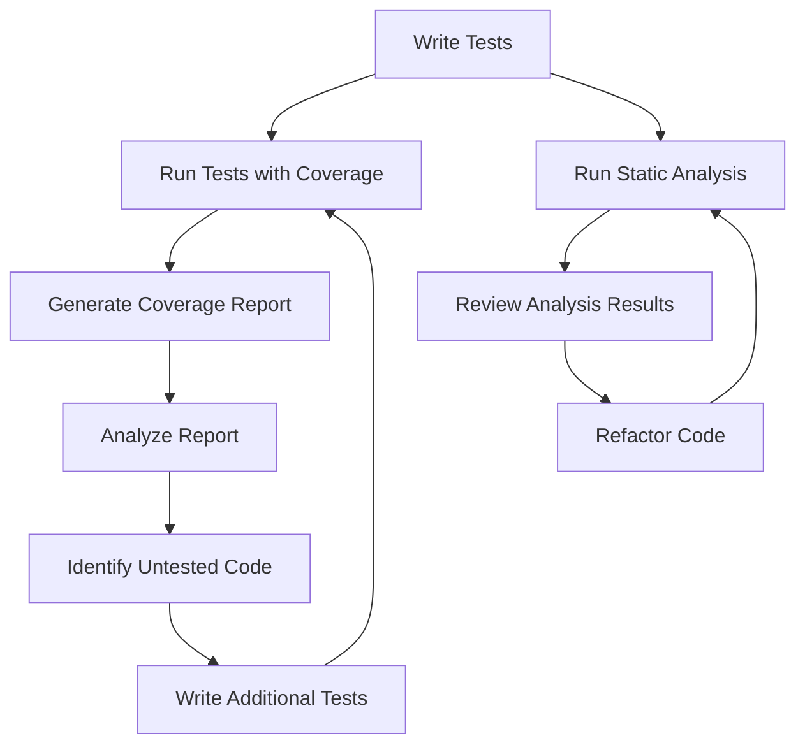

## 17.10 Code Coverage and Static Analysis

In the realm of PHP development, ensuring that your code is both robust and maintainable is paramount. Two critical components in achieving this are **code coverage** and **static analysis**. These tools and techniques help developers identify potential issues early, enforce coding standards, and ultimately deliver high-quality software.

### Understanding Code Coverage

**Code coverage** is a metric used to measure the amount of code executed during automated tests. It provides insights into which parts of your codebase are being tested and which are not, helping you identify untested paths and improve your test suite.

#### Types of Code Coverage

1. **Line Coverage:** Measures the percentage of lines executed.
2. **Function Coverage:** Determines which functions have been called.
3. **Branch Coverage:** Evaluates whether each branch of control structures (like `if` statements) has been executed.
4. **Path Coverage:** Considers all possible paths through the code.

### Generating Code Coverage Reports

To generate code coverage reports in PHP, we commonly use **PHPUnit** in conjunction with extensions like **Xdebug** or **pcov**.

#### Setting Up PHPUnit with Xdebug

1. **Install Xdebug:** Ensure Xdebug is installed and configured in your `php.ini` file.
2. **Configure PHPUnit:** Add the following configuration to your `phpunit.xml`:

   ```xml
   <phpunit>
       <coverage processUncoveredFiles="true">
           <report>
               <clover outputFile="build/logs/clover.xml"/>
               <html outputDirectory="build/coverage"/>
           </report>
       </coverage>
   </phpunit>
   ```

3. **Run Tests with Coverage:** Execute your tests with coverage enabled:

   ```bash
   phpunit --coverage-html build/coverage
   ```

#### Using pcov for Code Coverage

**pcov** is an alternative to Xdebug, optimized for code coverage. It is lightweight and faster, making it suitable for CI environments.

1. **Install pcov:** Use PECL to install pcov:

   ```bash
   pecl install pcov
   ```

2. **Enable pcov:** Add the following to your `php.ini`:

   ```ini
   extension=pcov.so
   pcov.enabled=1
   ```

3. **Run PHPUnit with pcov:** Ensure pcov is enabled when running PHPUnit:

   ```bash
   phpunit --coverage-html build/coverage
   ```

### Interpreting Code Coverage Reports

Once you have generated a code coverage report, you can analyze it to identify areas of your code that lack test coverage. Focus on increasing coverage for critical parts of your application, such as business logic and complex algorithms.

### Static Analysis in PHP

**Static analysis** involves examining your code without executing it to find potential errors, enforce coding standards, and ensure code quality. It helps catch issues early in the development process, reducing the likelihood of bugs in production.

#### Popular Static Analysis Tools

1. **PHPStan:** A powerful static analysis tool that helps you find bugs in your code without running it. It focuses on type safety and can be integrated into your CI/CD pipeline.

   - **Installation:**

     ```bash
     composer require --dev phpstan/phpstan
     ```

   - **Configuration:**

     Create a `phpstan.neon` file to configure PHPStan:

     ```yaml
     parameters:
         level: max
         paths:
             - src
             - tests
     ```

   - **Running PHPStan:**

     ```bash
     vendor/bin/phpstan analyse
     ```

   - **Link:** [PHPStan](https://phpstan.org/)

2. **Psalm:** Another static analysis tool that focuses on finding errors and improving code quality. It offers features like type inference and can be customized to suit your project's needs.

   - **Installation:**

     ```bash
     composer require --dev vimeo/psalm
     ```

   - **Configuration:**

     Initialize Psalm with:

     ```bash
     vendor/bin/psalm --init
     ```

   - **Running Psalm:**

     ```bash
     vendor/bin/psalm
     ```

   - **Link:** [Psalm](https://psalm.dev/)

### Benefits of Code Coverage and Static Analysis

- **Early Detection of Issues:** Identify potential bugs and vulnerabilities before they reach production.
- **Enforcement of Coding Standards:** Ensure consistency and maintainability across your codebase.
- **Improved Code Quality:** Enhance the reliability and robustness of your software.
- **Increased Confidence:** Gain assurance that your code behaves as expected.

### Visualizing Code Coverage and Static Analysis

To better understand the flow of code coverage and static analysis, let's visualize the process using a flowchart.



**Description:** This flowchart illustrates the iterative process of writing tests, running them with coverage, analyzing the results, and using static analysis to improve code quality.

### Try It Yourself

Experiment with the code examples and tools discussed in this section. Try modifying the PHPUnit configuration to include different types of coverage reports, or explore the various levels of analysis offered by PHPStan and Psalm. By doing so, you'll gain a deeper understanding of how these tools can enhance your PHP development workflow.

### Knowledge Check

- What is the primary purpose of code coverage?
- How does static analysis differ from code coverage?
- What are the benefits of using tools like PHPStan and Psalm?

### Summary

Incorporating code coverage and static analysis into your PHP development process is essential for maintaining high-quality code. These tools help you identify potential issues early, enforce coding standards, and ensure your software is robust and reliable. By leveraging PHPUnit, Xdebug, pcov, PHPStan, and Psalm, you can significantly enhance your testing strategy and deliver better software.

## Quiz: Code Coverage and Static Analysis



### What is the primary purpose of code coverage?

- [x] To measure the amount of code executed during tests
- [ ] To find syntax errors in code
- [ ] To optimize code performance
- [ ] To generate documentation

> **Explanation:** Code coverage measures the amount of code executed during tests, helping identify untested parts of the codebase.

### Which tool is used for static analysis in PHP?

- [x] PHPStan
- [ ] PHPUnit
- [ ] Xdebug
- [ ] Composer

> **Explanation:** PHPStan is a static analysis tool used to find errors in PHP code without executing it.

### What does branch coverage measure?

- [x] Whether each branch of control structures has been executed
- [ ] The percentage of lines executed
- [ ] The number of functions called
- [ ] The total number of tests run

> **Explanation:** Branch coverage evaluates whether each branch of control structures, like `if` statements, has been executed.

### How can you enable code coverage in PHPUnit?

- [x] By configuring the `phpunit.xml` file and using Xdebug or pcov
- [ ] By installing Composer
- [ ] By writing more tests
- [ ] By using a different IDE

> **Explanation:** Code coverage in PHPUnit is enabled by configuring the `phpunit.xml` file and using extensions like Xdebug or pcov.

### What is a benefit of static analysis?

- [x] Early detection of potential issues
- [ ] Faster code execution
- [ ] Reduced memory usage
- [ ] Increased code complexity

> **Explanation:** Static analysis helps in the early detection of potential issues, improving code quality and maintainability.

### Which of the following is a type of code coverage?

- [x] Line Coverage
- [ ] Syntax Coverage
- [ ] Memory Coverage
- [ ] Execution Coverage

> **Explanation:** Line coverage measures the percentage of lines executed during tests.

### What is the role of Xdebug in code coverage?

- [x] It helps generate code coverage reports
- [ ] It optimizes code performance
- [ ] It provides syntax highlighting
- [ ] It manages dependencies

> **Explanation:** Xdebug is used to generate code coverage reports by tracking which parts of the code are executed during tests.

### What is the main focus of PHPStan?

- [x] Type safety and finding bugs without running code
- [ ] Code formatting
- [ ] Dependency management
- [ ] Performance optimization

> **Explanation:** PHPStan focuses on type safety and finding bugs in PHP code without executing it.

### What is the purpose of a `phpstan.neon` file?

- [x] To configure PHPStan settings
- [ ] To manage Composer dependencies
- [ ] To define PHPUnit test cases
- [ ] To set PHP version compatibility

> **Explanation:** The `phpstan.neon` file is used to configure PHPStan settings, such as analysis level and paths.

### True or False: Static analysis can enforce coding standards.

- [x] True
- [ ] False

> **Explanation:** Static analysis tools can enforce coding standards, ensuring consistency and maintainability across the codebase.



Remember, this is just the beginning. As you progress, you'll build more complex and interactive applications. Keep experimenting, stay curious, and enjoy the journey!
