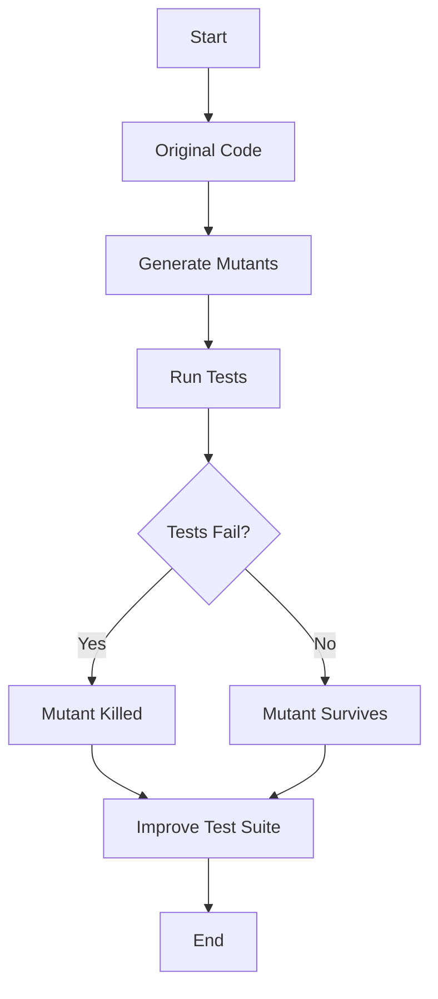

## 17.11 Mutation Testing with Infection

In the realm of software development, ensuring the robustness and reliability of your code is paramount. While traditional testing methods like unit testing are essential, they often fall short in assessing the quality of the tests themselves. This is where mutation testing comes into play. In this section, we will delve into the concept of mutation testing, focusing on the Infection framework for PHP, and explore how it can significantly enhance your testing strategy.

### Understanding Mutation Testing

**Mutation Testing Concept:**

Mutation testing is a technique used to evaluate the quality of your test suite by introducing small changes, or "mutations," to your code. The primary goal is to determine whether your existing tests can detect these changes. If a test fails after a mutation is introduced, it indicates that the test is effective in catching potential bugs. Conversely, if the test passes, it suggests that the test may not be robust enough.

#### Key Concepts:

- **Mutants:** These are the modified versions of your code created by introducing small changes. Each mutant represents a potential fault in the code.
- **Mutation Operators:** These are the rules or patterns used to create mutants. Common mutation operators include changing arithmetic operators, negating conditions, and altering logical connectors.
- **Surviving Mutants:** Mutants that do not cause any test to fail are considered "surviving." They indicate areas where the test suite may be lacking.
- **Killed Mutants:** Mutants that cause tests to fail are "killed," demonstrating that the tests are effective in detecting changes.

### Why Use Mutation Testing?

Mutation testing provides several benefits that make it a valuable addition to your testing arsenal:

- **Assess Test Quality:** It helps identify weaknesses in your test suite by highlighting tests that fail to detect code changes.
- **Improve Test Coverage:** By revealing untested paths in your code, mutation testing encourages the development of more comprehensive tests.
- **Enhance Code Reliability:** Ensuring that your tests can catch potential bugs leads to more reliable and maintainable code.

### Introducing Infection: PHP Mutation Testing Framework

**Using Infection:**

Infection is a powerful mutation testing framework specifically designed for PHP. It automates the process of introducing mutations and running tests, providing detailed reports on the effectiveness of your test suite.

- **Link:** [Infection - PHP Mutation Testing Framework](https://infection.github.io/)

#### Key Features of Infection:

- **Automated Mutation Generation:** Infection automatically generates mutants using a variety of mutation operators.
- **Integration with PHPUnit:** It seamlessly integrates with PHPUnit, making it easy to incorporate into existing testing workflows.
- **Detailed Reports:** Infection provides comprehensive reports that highlight surviving and killed mutants, offering insights into test effectiveness.
- **Configurable:** The framework allows customization of mutation operators and test execution parameters to suit your project's needs.

### Setting Up Infection

To get started with Infection, follow these steps:

1. **Install Infection:**

   Infection can be installed via Composer. Run the following command in your project's root directory:

   ```bash
   composer require --dev infection/infection
   ```

2. **Configure Infection:**

   After installation, you need to configure Infection by creating an `infection.json.dist` file in your project's root directory. This file allows you to specify various settings, such as the directories to scan for code and tests, and the mutation operators to use.

   ```json
   {
       "source": {
           "directories": ["src"]
       },
       "mutators": {
           "@default": true
       },
       "timeout": 10
   }
   ```

3. **Run Infection:**

   Once configured, you can run Infection using the following command:

   ```bash
   ./vendor/bin/infection
   ```

   Infection will generate mutants and execute your test suite, providing a report on the results.

### Analyzing Infection Reports

Infection generates detailed reports that help you understand the effectiveness of your test suite. The report includes:

- **Mutation Score Indicator (MSI):** This metric indicates the percentage of mutants killed by your tests. A higher MSI suggests a more effective test suite.
- **Surviving Mutants:** A list of mutants that were not detected by your tests, indicating potential areas for improvement.
- **Killed Mutants:** A list of mutants that were successfully detected by your tests.

### Code Example: Mutation Testing with Infection

Let's walk through a simple example to illustrate how Infection works in practice.

**Sample Code:**

Consider the following PHP class that performs basic arithmetic operations:

```php
<?php

class Calculator
{
    public function add($a, $b)
    {
        return $a + $b;
    }

    public function subtract($a, $b)
    {
        return $a - $b;
    }
}
```

**Unit Test:**

Here's a PHPUnit test for the `Calculator` class:

```php
<?php

use PHPUnit\Framework\TestCase;

class CalculatorTest extends TestCase
{
    public function testAdd()
    {
        $calculator = new Calculator();
        $this->assertEquals(5, $calculator->add(2, 3));
    }

    public function testSubtract()
    {
        $calculator = new Calculator();
        $this->assertEquals(1, $calculator->subtract(3, 2));
    }
}
```

**Running Infection:**

After setting up Infection, run it to generate mutants and execute the tests. Infection will introduce mutations, such as changing the addition operator to subtraction, and check if the tests fail.

**Analyzing Results:**

If the `testAdd` method fails when the addition operator is mutated, it indicates that the test is effective. If it passes, you may need to enhance the test to cover more scenarios.

### Visualizing Mutation Testing Process

To better understand the mutation testing process, let's visualize it using a flowchart.



**Description:** This flowchart illustrates the mutation testing process, starting from the original code, generating mutants, running tests, and analyzing whether mutants are killed or survive.

### Best Practices for Mutation Testing

To maximize the benefits of mutation testing, consider the following best practices:

- **Focus on Critical Code:** Prioritize mutation testing for critical parts of your codebase where reliability is paramount.
- **Iterative Improvement:** Use mutation testing iteratively to continuously improve your test suite over time.
- **Balance Coverage and Performance:** While high mutation coverage is desirable, be mindful of the performance impact on large codebases.

### Try It Yourself

To deepen your understanding of mutation testing with Infection, try modifying the `Calculator` class and its tests. Experiment with different mutation operators and observe how they affect the test results. Consider adding new methods to the class and writing corresponding tests to see how Infection handles them.

### References and Further Reading

- [Infection - PHP Mutation Testing Framework](https://infection.github.io/)
- [PHPUnit Documentation](https://phpunit.de/documentation.html)
- [Mutation Testing: Concepts and Techniques](https://en.wikipedia.org/wiki/Mutation_testing)

### Knowledge Check

Before we conclude, let's reinforce what we've learned with a few questions:

1. What is the primary goal of mutation testing?
2. How does Infection help in mutation testing for PHP?
3. What are surviving mutants, and what do they indicate?
4. How can you improve your test suite based on mutation testing results?

### Embrace the Journey

Remember, mutation testing is a powerful tool to enhance the quality of your test suite and, ultimately, your code. As you continue to explore and experiment with Infection, you'll gain deeper insights into your code's reliability. Keep pushing the boundaries of your testing strategy, stay curious, and enjoy the journey of continuous improvement!

## Quiz: Mutation Testing with Infection



### What is the primary goal of mutation testing?

- [x] To assess the quality of the test suite by introducing code changes
- [ ] To improve code performance
- [ ] To refactor code for better readability
- [ ] To increase code coverage

> **Explanation:** Mutation testing aims to evaluate the effectiveness of the test suite by introducing small changes to the code and checking if the tests can detect them.

### What does a surviving mutant indicate?

- [ ] The test suite is effective
- [x] The test suite may be lacking
- [ ] The code is bug-free
- [ ] The code is optimized

> **Explanation:** A surviving mutant indicates that the test suite failed to detect the introduced change, suggesting potential weaknesses in the tests.

### Which framework is used for mutation testing in PHP?

- [ ] PHPUnit
- [ ] Behat
- [x] Infection
- [ ] Codeception

> **Explanation:** Infection is a mutation testing framework specifically designed for PHP.

### What is the Mutation Score Indicator (MSI)?

- [x] A metric indicating the percentage of mutants killed by tests
- [ ] A measure of code performance
- [ ] A tool for code refactoring
- [ ] A PHP extension

> **Explanation:** The Mutation Score Indicator (MSI) measures the effectiveness of the test suite by indicating the percentage of mutants killed.

### How can you improve your test suite based on mutation testing results?

- [x] By enhancing tests to cover more scenarios
- [ ] By reducing the number of tests
- [ ] By ignoring surviving mutants
- [ ] By focusing only on killed mutants

> **Explanation:** Improving the test suite involves enhancing tests to cover more scenarios and detect surviving mutants.

### What is a mutant in mutation testing?

- [x] A modified version of the code with small changes
- [ ] A bug in the code
- [ ] A new feature in the code
- [ ] A deprecated function

> **Explanation:** A mutant is a version of the code that has been altered by introducing small changes to test the effectiveness of the test suite.

### What is the purpose of mutation operators?

- [x] To create mutants by introducing changes to the code
- [ ] To optimize code performance
- [ ] To refactor code for readability
- [ ] To increase code coverage

> **Explanation:** Mutation operators are used to create mutants by introducing specific changes to the code, such as altering operators or conditions.

### What does a high Mutation Score Indicator (MSI) suggest?

- [x] The test suite is effective
- [ ] The code is bug-free
- [ ] The code is poorly written
- [ ] The test suite is lacking

> **Explanation:** A high MSI suggests that the test suite is effective in detecting changes introduced by mutants.

### How does Infection integrate with PHPUnit?

- [x] It runs PHPUnit tests on generated mutants
- [ ] It replaces PHPUnit as a testing framework
- [ ] It optimizes PHPUnit test execution
- [ ] It provides a GUI for PHPUnit

> **Explanation:** Infection integrates with PHPUnit by running tests on generated mutants to assess their effectiveness.

### True or False: Mutation testing can help identify untested paths in the code.

- [x] True
- [ ] False

> **Explanation:** Mutation testing can reveal untested paths in the code by highlighting surviving mutants, encouraging the development of more comprehensive tests.


