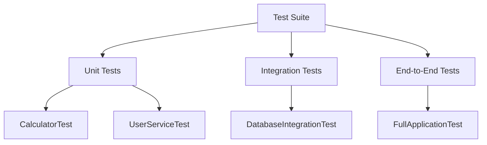

## 17.12 Automated Testing Best Practices

Automated testing is a cornerstone of modern software development, ensuring that code is reliable, maintainable, and scalable. In PHP, automated testing can be particularly powerful when combined with design patterns, allowing developers to create robust applications with confidence. This section will guide you through best practices for automated testing in PHP, focusing on maintainability, reliability, speed, and effective test case organization.

### Introduction to Automated Testing

Automated testing involves using software tools to execute tests on your codebase automatically. This process helps identify bugs, verify functionality, and ensure that new changes do not break existing features. Automated tests can range from unit tests, which test individual components, to integration tests, which verify the interaction between different parts of the application.

### Maintainability in Automated Testing

Maintainability is crucial for automated tests, as they need to be updated alongside the codebase. Here are some best practices to ensure your tests remain maintainable:

- **Write Clean, Readable Test Code:** Just like production code, test code should be clean and easy to read. Use descriptive variable names, consistent formatting, and comments where necessary to explain complex logic.

- **Use Test Frameworks:** Leverage PHP testing frameworks like PHPUnit to structure your tests. These frameworks provide a standardized way to write and execute tests, making them easier to maintain.

- **Refactor Tests Regularly:** As your application evolves, your tests should too. Regularly refactor your tests to remove duplication, improve readability, and ensure they accurately reflect the current state of the application.

- **Keep Tests DRY (Don't Repeat Yourself):** Avoid duplicating test logic by using helper methods or classes to encapsulate common functionality. This makes it easier to update tests when changes occur.

### Reliability in Automated Testing

Reliable tests consistently produce the same results, regardless of the environment or execution order. To achieve reliability, consider the following:

- **Avoid Flaky Tests:** Flaky tests are those that sometimes pass and sometimes fail without any changes to the code. They can be caused by dependencies on external systems, timing issues, or shared state. Isolate tests from external dependencies by using mocks or stubs.

- **Ensure Consistent Outcomes:** Tests should not depend on the order in which they are run. Use setup and teardown methods to ensure each test starts with a clean state.

- **Mock External Dependencies:** Use mocking frameworks like Mockery to simulate external dependencies. This ensures that tests are not affected by changes in external systems or network conditions.

### Speed in Automated Testing

Fast tests encourage developers to run them frequently, providing quick feedback on code changes. Here are some tips to keep your tests speedy:

- **Run Tests in Parallel:** Use tools that support parallel test execution to reduce overall test runtime. PHPUnit, for example, can be configured to run tests concurrently.

- **Optimize Test Data:** Use minimal and efficient test data to reduce setup time. Avoid loading large datasets unless necessary for the test.

- **Focus on Unit Tests:** Unit tests are typically faster than integration or end-to-end tests. Aim to cover as much functionality as possible with unit tests, and reserve slower tests for critical integration points.

### Test Cases Organization

Organizing test cases effectively helps maintain a clear and logical test suite. Consider the following practices:

- **Group Related Tests:** Organize tests into suites or categories based on functionality or components. This makes it easier to run specific groups of tests and identify areas of concern.

- **Use Meaningful Test Names:** Test names should clearly describe what the test is verifying. This makes it easier to understand test failures and maintain the test suite.

- **Follow a Consistent Structure:** Use a consistent structure for your test files and directories. This helps developers quickly locate and understand tests.

### Code Examples

Let's explore some code examples to illustrate these best practices.

#### Example 1: Writing a Maintainable Unit Test

```php
<?php

use PHPUnit\Framework\TestCase;

class CalculatorTest extends TestCase
{
    protected $calculator;

    protected function setUp(): void
    {
        $this->calculator = new Calculator();
    }

    public function testAddition()
    {
        $result = $this->calculator->add(2, 3);
        $this->assertEquals(5, $result, "Addition should return the sum of two numbers.");
    }

    public function testSubtraction()
    {
        $result = $this->calculator->subtract(5, 3);
        $this->assertEquals(2, $result, "Subtraction should return the difference of two numbers.");
    }
}
```

**Explanation:** In this example, we use PHPUnit to create a test case for a `Calculator` class. The `setUp` method initializes the calculator object, ensuring each test starts with a clean state. The test methods use descriptive names and assertions to verify the calculator's functionality.

#### Example 2: Mocking External Dependencies

```php
<?php

use PHPUnit\Framework\TestCase;
use Mockery as m;

class UserServiceTest extends TestCase
{
    public function tearDown(): void
    {
        m::close();
    }

    public function testGetUserReturnsUserData()
    {
        $userRepository = m::mock('UserRepository');
        $userRepository->shouldReceive('find')
            ->once()
            ->with(1)
            ->andReturn(['id' => 1, 'name' => 'John Doe']);

        $userService = new UserService($userRepository);
        $user = $userService->getUser(1);

        $this->assertEquals(['id' => 1, 'name' => 'John Doe'], $user);
    }
}
```

**Explanation:** This example demonstrates how to use Mockery to mock a `UserRepository` dependency. By mocking the repository, we isolate the `UserService` test from the database, ensuring consistent test outcomes.

### Visualizing Test Organization

To better understand how to organize your test cases, let's visualize a typical test suite structure using a Mermaid.js diagram.



**Description:** This diagram illustrates a test suite organized into unit, integration, and end-to-end tests. Each category contains specific test cases, such as `CalculatorTest` and `UserServiceTest` for unit tests.

### References and Links

For further reading on automated testing in PHP, consider the following resources:

- [PHPUnit Documentation](https://phpunit.de/documentation.html)
- [Mockery Documentation](http://docs.mockery.io/en/latest/)
- [PHP Testing Best Practices](https://phptherightway.com/#testing)

### Knowledge Check

To reinforce your understanding of automated testing best practices, consider the following questions:

1. What are some key characteristics of maintainable test code?
2. How can you ensure your tests are reliable and produce consistent outcomes?
3. Why is it important to keep tests fast, and how can you achieve this?
4. How should you organize your test cases for clarity and efficiency?

### Embrace the Journey

Remember, mastering automated testing is a journey. As you continue to develop your skills, you'll find new ways to improve your test suite and ensure your PHP applications are robust and reliable. Keep experimenting, stay curious, and enjoy the process!

## Quiz: Automated Testing Best Practices



### What is a key characteristic of maintainable test code?

- [x] Clean and readable
- [ ] Complex and comprehensive
- [ ] Short and concise
- [ ] Long and detailed

> **Explanation:** Maintainable test code should be clean and readable, making it easy to understand and update.

### How can you avoid flaky tests?

- [x] Isolate tests from external dependencies
- [ ] Run tests in a specific order
- [ ] Use large datasets
- [ ] Avoid using mocks

> **Explanation:** Flaky tests can be avoided by isolating tests from external dependencies, ensuring consistent outcomes.

### What is the benefit of running tests in parallel?

- [x] Reduces overall test runtime
- [ ] Increases test complexity
- [ ] Ensures tests run in order
- [ ] Decreases test reliability

> **Explanation:** Running tests in parallel reduces overall test runtime, providing faster feedback.

### Why should you use meaningful test names?

- [x] To clearly describe what the test is verifying
- [ ] To make the test suite look professional
- [ ] To confuse other developers
- [ ] To make tests harder to find

> **Explanation:** Meaningful test names clearly describe what the test is verifying, aiding in understanding and maintenance.

### What is the purpose of using a setup method in tests?

- [x] To ensure each test starts with a clean state
- [ ] To speed up test execution
- [x] To initialize shared resources
- [ ] To make tests more complex

> **Explanation:** A setup method ensures each test starts with a clean state and can initialize shared resources.

### How can you optimize test data for speed?

- [x] Use minimal and efficient test data
- [ ] Use large datasets
- [ ] Avoid using test data
- [ ] Use random data

> **Explanation:** Using minimal and efficient test data reduces setup time and keeps tests fast.

### What is the role of a mocking framework?

- [x] To simulate external dependencies
- [ ] To increase test complexity
- [x] To ensure tests run in order
- [ ] To avoid using real data

> **Explanation:** A mocking framework simulates external dependencies, ensuring tests are isolated and reliable.

### How should you organize your test cases?

- [x] Group related tests logically
- [ ] Randomly distribute tests
- [ ] Alphabetically order tests
- [ ] By test execution time

> **Explanation:** Organizing test cases by grouping related tests logically helps maintain a clear and efficient test suite.

### What is the advantage of using a consistent structure for test files?

- [x] Helps developers quickly locate and understand tests
- [ ] Makes tests harder to find
- [ ] Increases test complexity
- [ ] Decreases test reliability

> **Explanation:** A consistent structure for test files helps developers quickly locate and understand tests, improving maintainability.

### True or False: Unit tests are typically slower than integration tests.

- [ ] True
- [x] False

> **Explanation:** Unit tests are typically faster than integration tests, as they focus on individual components without external dependencies.


