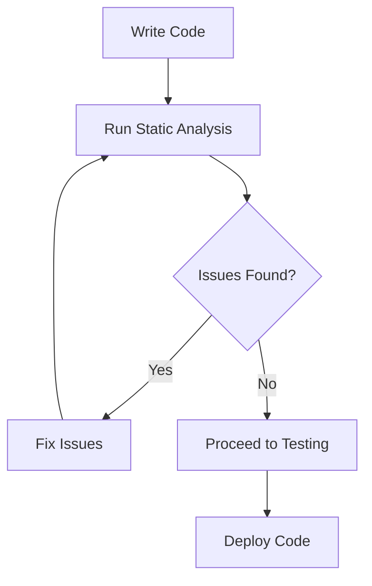

## 17.13 Using Code Quality Tools (PHPStan, Psalm)

In the world of PHP development, maintaining high code quality is crucial for building robust, maintainable, and error-free applications. Static analysis tools like PHPStan and Psalm have become indispensable in achieving this goal. These tools help developers identify potential issues in their code without executing it, thus saving time and reducing the risk of bugs in production.

### Static Analysis Benefits

Static analysis tools offer several advantages:

- **Early Bug Detection**: Identify potential issues before they manifest as runtime errors.
- **Improved Code Quality**: Enforce coding standards and best practices.
- **Enhanced Maintainability**: Simplify code reviews by automatically catching common mistakes.
- **Increased Developer Productivity**: Reduce the time spent on debugging and testing.

### PHPStan Features

PHPStan is a popular static analysis tool for PHP that focuses on finding bugs in your code. It offers a level-based analysis system, allowing you to progressively improve your codebase.

#### Key Features of PHPStan

- **Level-Based Analysis**: PHPStan uses a level system (0-8) to gradually increase the strictness of analysis. Start at a lower level and work your way up as your code improves.
- **Type Safety**: Enforces type safety by checking for type-related errors.
- **Custom Rules**: Extend PHPStan with custom rules to enforce project-specific standards.
- **IDE Integration**: Integrates with popular IDEs for real-time feedback.

#### Installing PHPStan

To get started with PHPStan, you need to install it via Composer:

```bash
composer require --dev phpstan/phpstan
```

#### Configuring PHPStan

Create a `phpstan.neon` configuration file to customize PHPStan's behavior:

```yaml
parameters:
    level: 5
    paths:
        - src
    autoload_files:
        - %rootDir%/../../vendor/autoload.php
```

#### Running PHPStan

Run PHPStan from the command line to analyze your code:

```bash
vendor/bin/phpstan analyse
```

### Psalm Features

Psalm is another powerful static analysis tool for PHP, known for its advanced type inference capabilities and comprehensive static analysis.

#### Key Features of Psalm

- **Type Inference**: Automatically infers types, reducing the need for explicit type annotations.
- **Advanced Static Analysis**: Detects a wide range of issues, including unused code and potential security vulnerabilities.
- **Plugin System**: Extend Psalm's functionality with plugins.
- **Integration with CI/CD**: Easily integrate Psalm into your CI/CD pipelines.

#### Installing Psalm

Install Psalm using Composer:

```bash
composer require --dev vimeo/psalm
```

#### Configuring Psalm

Create a `psalm.xml` configuration file to define your project's analysis settings:

```xml
<?xml version="1.0"?>
<psalm>
    <projectFiles>
        <directory name="src" />
    </projectFiles>
    <issueHandlers>
        <MissingReturnType errorLevel="info" />
    </issueHandlers>
</psalm>
```

#### Running Psalm

Execute Psalm to analyze your codebase:

```bash
vendor/bin/psalm
```

### Integration with CI

Integrating PHPStan and Psalm into your Continuous Integration (CI) pipelines ensures that code quality checks are automated and enforced consistently across your team.

#### Setting Up CI Integration

1. **Choose a CI Service**: Select a CI service like GitHub Actions, GitLab CI, or Travis CI.
2. **Configure CI Pipeline**: Add steps to your CI configuration to run PHPStan and Psalm.
3. **Fail on Errors**: Configure the pipeline to fail if either tool detects issues.

#### Example: GitHub Actions

Here's an example of a GitHub Actions workflow that runs PHPStan and Psalm:

```yaml
name: CI

on: [push, pull_request]

jobs:
  static-analysis:
    runs-on: ubuntu-latest
    steps:
      - uses: actions/checkout@v2
      - name: Set up PHP
        uses: shivammathur/setup-php@v2
        with:
          php-version: '8.0'
      - name: Install dependencies
        run: composer install
      - name: Run PHPStan
        run: vendor/bin/phpstan analyse
      - name: Run Psalm
        run: vendor/bin/psalm
```

### Code Examples

Let's explore some code examples to see how PHPStan and Psalm can help improve code quality.

#### Example 1: Detecting Type Errors

Consider the following PHP code:

```php
function add(int $a, int $b): int {
    return $a + $b;
}

echo add(5, '10'); // This will cause a type error
```

Running PHPStan or Psalm on this code will flag the type mismatch, helping you catch the error before runtime.

#### Example 2: Identifying Unused Code

Static analysis tools can also identify unused code, which can clutter your codebase and lead to maintenance challenges.

```php
function unusedFunction() {
    return "This function is never called";
}
```

Both PHPStan and Psalm will alert you to the presence of unused functions, encouraging you to clean up your code.

### Visualizing Static Analysis Workflow

To better understand how static analysis tools fit into the development workflow, let's visualize the process using a flowchart.



**Description**: This flowchart illustrates the integration of static analysis tools into the development workflow. After writing code, developers run static analysis to identify issues. If issues are found, they are fixed, and the analysis is rerun. Once the code passes static analysis, it proceeds to testing and deployment.

### Knowledge Check

- **Question**: What is the primary benefit of using static analysis tools like PHPStan and Psalm?
  - **Answer**: They help identify potential issues in code without executing it.

- **Question**: How does PHPStan's level-based analysis system work?
  - **Answer**: It allows developers to gradually increase the strictness of analysis as their code improves.

- **Question**: What is a key feature of Psalm that distinguishes it from PHPStan?
  - **Answer**: Psalm's advanced type inference capabilities.

### Try It Yourself

To deepen your understanding, try modifying the code examples provided and observe how PHPStan and Psalm respond to different changes. For instance, introduce a type error or add an unused function and see how the tools flag these issues.

### References and Links

- [PHPStan Documentation](https://phpstan.org/)
- [Psalm Documentation](https://psalm.dev/)
- [GitHub Actions](https://github.com/features/actions)

### Embrace the Journey

Remember, mastering static analysis tools is a journey. As you integrate PHPStan and Psalm into your workflow, you'll find that your code quality improves, and your development process becomes more efficient. Keep experimenting, stay curious, and enjoy the journey!

## Quiz: Using Code Quality Tools (PHPStan, Psalm)



### What is the primary benefit of using static analysis tools like PHPStan and Psalm?

- [x] They help identify potential issues in code without executing it.
- [ ] They improve runtime performance.
- [ ] They automatically fix code errors.
- [ ] They replace the need for unit tests.

> **Explanation:** Static analysis tools analyze code for potential issues without executing it, allowing developers to catch errors early in the development process.

### How does PHPStan's level-based analysis system work?

- [x] It allows developers to gradually increase the strictness of analysis as their code improves.
- [ ] It automatically fixes code errors at higher levels.
- [ ] It decreases the strictness of analysis over time.
- [ ] It only works with PHP 8 and above.

> **Explanation:** PHPStan's level-based system lets developers start with less strict analysis and gradually increase it, improving code quality over time.

### What is a key feature of Psalm that distinguishes it from PHPStan?

- [x] Advanced type inference capabilities.
- [ ] Level-based analysis.
- [ ] Integration with all IDEs.
- [ ] Automatic code formatting.

> **Explanation:** Psalm's advanced type inference allows it to deduce types without explicit annotations, setting it apart from PHPStan.

### Which of the following is NOT a benefit of static analysis?

- [ ] Early bug detection.
- [ ] Improved code quality.
- [x] Increased runtime performance.
- [ ] Enhanced maintainability.

> **Explanation:** Static analysis focuses on code quality and bug detection, not runtime performance.

### What command is used to run PHPStan analysis?

- [x] `vendor/bin/phpstan analyse`
- [ ] `phpstan run`
- [ ] `composer phpstan`
- [ ] `phpstan check`

> **Explanation:** The correct command to run PHPStan analysis is `vendor/bin/phpstan analyse`.

### What file is typically used to configure Psalm?

- [x] `psalm.xml`
- [ ] `phpstan.neon`
- [ ] `composer.json`
- [ ] `psalm.config`

> **Explanation:** Psalm configurations are typically stored in a `psalm.xml` file.

### How can static analysis tools be integrated into CI pipelines?

- [x] By adding steps to run the tools in the CI configuration.
- [ ] By replacing unit tests with static analysis.
- [ ] By using them only in local development.
- [ ] By running them after deployment.

> **Explanation:** Static analysis tools can be integrated into CI pipelines by adding steps to run them as part of the CI process.

### What is the purpose of the `phpstan.neon` file?

- [x] To configure PHPStan's analysis settings.
- [ ] To configure Psalm's analysis settings.
- [ ] To store Composer dependencies.
- [ ] To define PHP version compatibility.

> **Explanation:** The `phpstan.neon` file is used to configure PHPStan's analysis settings.

### True or False: Static analysis tools can automatically fix all code issues.

- [ ] True
- [x] False

> **Explanation:** Static analysis tools identify issues but do not automatically fix them; developers must address the issues manually.

### Which tool is known for its plugin system to extend functionality?

- [ ] PHPStan
- [x] Psalm
- [ ] Both
- [ ] Neither

> **Explanation:** Psalm is known for its plugin system, allowing developers to extend its functionality.



By integrating PHPStan and Psalm into your development workflow, you can significantly enhance the quality and maintainability of your PHP code. These tools provide valuable insights and help enforce coding standards, making them essential for any modern PHP project. Keep exploring and refining your skills with these powerful static analysis tools!
