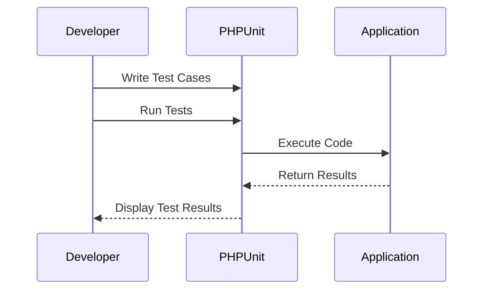

## 17.2 Unit Testing with PHPUnit

Unit testing is a fundamental practice in software development that ensures individual components of your application work as intended. In PHP, PHPUnit is the go-to framework for unit testing, providing a robust set of tools for testing your code effectively. In this section, we will delve into setting up PHPUnit, writing unit tests, organizing test suites, and adhering to best practices to ensure your PHP applications are reliable and maintainable.

### Setting Up PHPUnit

Before you can start writing tests, you need to set up PHPUnit in your PHP project. The most common way to install PHPUnit is via Composer, the dependency manager for PHP.

#### Install via Composer

To install PHPUnit, you first need to have Composer installed on your system. Once Composer is ready, you can add PHPUnit to your project by running the following command in your terminal:

```bash
composer require --dev phpunit/phpunit
```

This command installs PHPUnit as a development dependency, ensuring it is only used during development and testing phases.

#### Configure `phpunit.xml` for Project Settings

After installing PHPUnit, you should configure it to suit your project's needs. This is done by creating a `phpunit.xml` file in the root of your project. This file allows you to define settings such as the test directory, bootstrap files, and environment variables.

Here is an example of a basic `phpunit.xml` configuration:

```xml
<?xml version="1.0" encoding="UTF-8"?>
<phpunit bootstrap="vendor/autoload.php" colors="true">
    <testsuites>
        <testsuite name="Application Test Suite">
            <directory>./tests</directory>
        </testsuite>
    </testsuites>
    <php>
        <ini name="error_reporting" value="-1"/>
        <ini name="display_errors" value="1"/>
    </php>
</phpunit>
```

- **Bootstrap**: This attribute specifies the file to be included before running tests. Typically, this is the Composer autoload file.
- **Colors**: Enabling colors makes the output more readable.
- **Testsuites**: This section defines the test suites and their respective directories.

### Writing Unit Tests

Writing unit tests involves creating test classes and methods that verify the behavior of your code. PHPUnit provides a rich set of assertion methods to facilitate this process.

#### Creating Test Classes Extending `PHPUnit\Framework\TestCase`

To write a unit test, create a new class that extends `PHPUnit\Framework\TestCase`. Each method in this class represents a test case.

Here's a simple example:

```php
<?php

use PHPUnit\Framework\TestCase;

class CalculatorTest extends TestCase
{
    public function testAddition()
    {
        $calculator = new Calculator();
        $result = $calculator->add(2, 3);
        $this->assertEquals(5, $result);
    }
}
```

- **Test Method**: Each test method should start with the word `test` and should be public.
- **Assertions**: Use assertions to check if the expected outcome matches the actual result.

#### Using Assertion Methods

PHPUnit provides a variety of assertion methods to validate different conditions. Here are some commonly used assertions:

- **`assertEquals($expected, $actual)`**: Checks if two values are equal.
- **`assertTrue($condition)`**: Verifies that a condition is true.
- **`assertFalse($condition)`**: Verifies that a condition is false.
- **`assertNull($variable)`**: Checks if a variable is null.
- **`assertInstanceOf($expected, $actual)`**: Confirms that an object is an instance of a specific class.

### Test Suites

Organizing tests into suites allows you to run specific groups of tests together. This is particularly useful for large projects with many tests.

#### Grouping Tests for Organized Execution

In your `phpunit.xml` file, you can define multiple test suites, each containing different test cases. This allows you to run specific tests based on your needs.

Example configuration for multiple test suites:

```xml
<testsuites>
    <testsuite name="Unit Tests">
        <directory>./tests/Unit</directory>
    </testsuite>
    <testsuite name="Integration Tests">
        <directory>./tests/Integration</directory>
    </testsuite>
</testsuites>
```

You can run a specific test suite using the following command:

```bash
vendor/bin/phpunit --testsuite "Unit Tests"
```

### Best Practices

Adhering to best practices in unit testing ensures that your tests are effective and maintainable.

#### Write Tests for Individual Units of Code

Focus on testing small, isolated units of code. This makes it easier to identify the source of a problem when a test fails.

#### Test Edge Cases and Expected Failures

Ensure your tests cover edge cases and potential failure scenarios. This helps in identifying bugs that might not be apparent in normal conditions.

#### Keep Tests Independent

Tests should not depend on each other. Each test should set up its own environment and clean up after itself.

#### Use Descriptive Test Names

Name your test methods descriptively to indicate what they are testing. This makes it easier to understand the purpose of a test at a glance.

### Code Examples

Let's explore a more comprehensive example to solidify our understanding of unit testing with PHPUnit.

```php
<?php

use PHPUnit\Framework\TestCase;

class StringUtilsTest extends TestCase
{
    public function testCanConvertStringToUpperCase()
    {
        $stringUtils = new StringUtils();
        $result = $stringUtils->toUpperCase('hello');
        $this->assertEquals('HELLO', $result);
    }

    public function testCanReverseString()
    {
        $stringUtils = new StringUtils();
        $result = $stringUtils->reverse('world');
        $this->assertEquals('dlrow', $result);
    }

    public function testEmptyStringReturnsEmpty()
    {
        $stringUtils = new StringUtils();
        $result = $stringUtils->reverse('');
        $this->assertEquals('', $result);
    }
}
```

In this example, we have a `StringUtilsTest` class that tests the functionality of a hypothetical `StringUtils` class. Each test method checks a specific behavior of the `StringUtils` class.

### Try It Yourself

To deepen your understanding, try modifying the code examples above. For instance, add a new method to the `StringUtils` class and write corresponding tests. Experiment with different assertion methods to see how they work.

### Visualizing the Testing Process

To better understand the flow of unit testing with PHPUnit, let's visualize the process using a sequence diagram.



This diagram illustrates the interaction between the developer, PHPUnit, and the application during the testing process.

### References and Links

For further reading and resources on PHPUnit and unit testing in PHP, consider the following links:

- [PHPUnit Documentation](https://phpunit.de/documentation.html)
- [Composer Documentation](https://getcomposer.org/doc/)
- [PHP Manual](https://www.php.net/manual/en/)

### Knowledge Check

To reinforce your understanding, consider the following questions:

1. What is the purpose of the `phpunit.xml` file?
2. How do you install PHPUnit using Composer?
3. What is the significance of assertion methods in PHPUnit?
4. Why is it important to write independent tests?
5. How can you organize tests into suites?

### Embrace the Journey

Remember, mastering unit testing with PHPUnit is a journey. As you continue to write and refine tests, you'll gain deeper insights into your code and improve its quality. Keep experimenting, stay curious, and enjoy the process!

## Quiz: Unit Testing with PHPUnit



### What is the primary purpose of unit testing?

- [x] To verify that individual components of code work as intended
- [ ] To test the entire application as a whole
- [ ] To ensure the application is visually appealing
- [ ] To optimize the performance of the application

> **Explanation:** Unit testing focuses on testing individual components or units of code to ensure they function correctly.

### How do you install PHPUnit in a PHP project?

- [x] Using Composer with the command `composer require --dev phpunit/phpunit`
- [ ] By downloading it from the PHPUnit website
- [ ] By including it in the PHP configuration file
- [ ] By using the PHP built-in server

> **Explanation:** PHPUnit is typically installed via Composer as a development dependency using the specified command.

### What is the role of the `phpunit.xml` file?

- [x] To configure PHPUnit settings for the project
- [ ] To store test results
- [ ] To define the database schema
- [ ] To manage application routes

> **Explanation:** The `phpunit.xml` file is used to configure PHPUnit settings, such as test directories and environment variables.

### Which of the following is a common assertion method in PHPUnit?

- [x] `assertEquals()`
- [ ] `assertMatch()`
- [ ] `assertSimilar()`
- [ ] `assertSame()`

> **Explanation:** `assertEquals()` is a commonly used assertion method in PHPUnit to check if two values are equal.

### Why should tests be independent of each other?

- [x] To ensure that the outcome of one test does not affect another
- [ ] To reduce the number of tests needed
- [ ] To make tests run faster
- [ ] To simplify the test setup process

> **Explanation:** Independent tests ensure that the outcome of one test does not affect another, leading to more reliable results.

### What is a test suite in PHPUnit?

- [x] A collection of tests grouped together for organized execution
- [ ] A single test case
- [ ] A tool for debugging code
- [ ] A method for optimizing performance

> **Explanation:** A test suite is a collection of tests grouped together to be executed as a unit.

### How can you run a specific test suite using PHPUnit?

- [x] By using the command `vendor/bin/phpunit --testsuite "Suite Name"`
- [ ] By specifying the suite in the `phpunit.xml` file
- [ ] By using the PHP built-in server
- [ ] By running each test individually

> **Explanation:** You can run a specific test suite using the specified command, which targets the suite by name.

### What is the benefit of using descriptive test names?

- [x] They make it easier to understand the purpose of a test
- [ ] They reduce the number of tests needed
- [ ] They improve test performance
- [ ] They simplify the test setup process

> **Explanation:** Descriptive test names make it easier to understand the purpose of a test at a glance.

### What should you focus on when writing unit tests?

- [x] Testing small, isolated units of code
- [ ] Testing the entire application
- [ ] Testing only the user interface
- [ ] Testing only the database interactions

> **Explanation:** Unit tests should focus on testing small, isolated units of code to ensure they function correctly.

### True or False: PHPUnit can only be used for unit testing.

- [ ] True
- [x] False

> **Explanation:** While PHPUnit is primarily used for unit testing, it can also be used for integration and functional testing.


