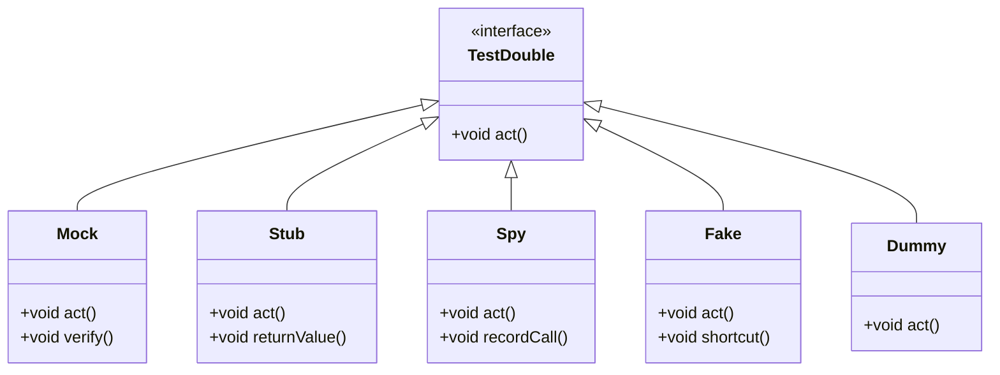

## 17.3 Mocking and Test Doubles

In the realm of software testing, particularly in PHP, the concepts of mocking and test doubles play a crucial role in ensuring that our code is reliable, maintainable, and robust. This section will delve into the intricacies of mocking, explore various types of test doubles, demonstrate how to use PHPUnit for creating mock objects, and emphasize the importance of isolation in tests.

### Concept of Mocking

Mocking is a technique used in unit testing to simulate the behavior of real objects. It allows developers to test a unit of code in isolation by replacing its dependencies with mock objects that mimic the behavior of the real ones. This is particularly useful when the real objects are complex, slow, or have side effects that are undesirable during testing.

#### Why Mocking?

- **Isolation**: By mocking dependencies, we can focus on testing the unit of code without interference from external factors.
- **Speed**: Mock objects are typically faster than real objects, especially if the real objects involve network calls or database access.
- **Control**: Mocks allow us to simulate different scenarios, including edge cases and error conditions, which might be difficult to reproduce with real objects.
- **Independence**: Tests can be run independently of the environment, making them more reliable and easier to automate.

### Types of Test Doubles

Test doubles are objects that stand in for real objects in a test. They come in various forms, each serving a specific purpose:

1. **Mocks**: These are objects pre-programmed with expectations, which form a specification of the calls they are expected to receive. Mocks are used to verify that the interactions with the object are as expected.

2. **Stubs**: These provide canned answers to calls made during the test, usually not responding to anything outside what's programmed in for the test. Stubs are used to simulate the behavior of real objects.

3. **Spies**: These are similar to mocks but are used to record information about how they were called, such as the number of times a method was invoked.

4. **Fakes**: These are objects with working implementations, but usually take some shortcut which makes them not suitable for production (e.g., an in-memory database).

5. **Dummies**: These are objects that are passed around but never actually used. They are usually just used to fill parameter lists.

### Using PHPUnit Mock Objects

PHPUnit is a popular testing framework in PHP that provides robust support for creating mock objects. Let's explore how to create and use mock objects with PHPUnit.

#### Creating Mocks with `createMock()`

The `createMock()` method is the simplest way to create a mock object in PHPUnit. It creates a mock object for a specified class or interface.

```php
use PHPUnit\Framework\TestCase;

class UserServiceTest extends TestCase
{
    public function testUserCreation()
    {
        // Create a mock for the UserRepository class
        $userRepositoryMock = $this->createMock(UserRepository::class);

        // Configure the mock to return a specific value when the find method is called
        $userRepositoryMock->method('find')
                           ->willReturn(new User('John Doe'));

        // Inject the mock into the UserService
        $userService = new UserService($userRepositoryMock);

        // Assert that the user creation process works as expected
        $this->assertEquals('John Doe', $userService->createUser()->getName());
    }
}
```

In this example, we create a mock for the `UserRepository` class and configure it to return a specific `User` object when the `find` method is called. This allows us to test the `UserService` class in isolation.

#### Creating Mocks with `getMockBuilder()`

For more complex mocking scenarios, you can use the `getMockBuilder()` method. This provides more control over the mock object, allowing you to set expectations, configure methods, and more.

```php
use PHPUnit\Framework\TestCase;

class OrderServiceTest extends TestCase
{
    public function testOrderProcessing()
    {
        // Create a mock for the PaymentGateway class
        $paymentGatewayMock = $this->getMockBuilder(PaymentGateway::class)
                                   ->setMethods(['charge'])
                                   ->getMock();

        // Set up the expectation for the charge method
        $paymentGatewayMock->expects($this->once())
                           ->method('charge')
                           ->with($this->equalTo(100))
                           ->willReturn(true);

        // Inject the mock into the OrderService
        $orderService = new OrderService($paymentGatewayMock);

        // Assert that the order processing works as expected
        $this->assertTrue($orderService->processOrder(100));
    }
}
```

Here, we use `getMockBuilder()` to create a mock for the `PaymentGateway` class and set an expectation that the `charge` method will be called once with a specific argument.

### Isolation in Tests

Isolation is a fundamental principle in unit testing. By isolating the unit under test from its dependencies, we can ensure that our tests are reliable and focused solely on the behavior of the unit.

#### Mocking External Dependencies

Mocking is a powerful tool for achieving isolation in tests. By replacing external dependencies with mock objects, we can:

- **Eliminate Side Effects**: Avoid unintended consequences that might arise from interacting with real dependencies.
- **Simulate Edge Cases**: Easily create scenarios that might be difficult to reproduce with real dependencies.
- **Improve Test Speed**: Reduce the time it takes to run tests by avoiding slow operations, such as network calls or database queries.

### Visualizing Mocking and Test Doubles

To better understand the relationship between the different types of test doubles and their roles in testing, let's visualize them using a class diagram.



This diagram illustrates the hierarchy of test doubles, with each type implementing the `TestDouble` interface and providing specific functionality for testing.

### Try It Yourself

To deepen your understanding of mocking and test doubles, try modifying the code examples provided:

- **Experiment with Different Return Values**: Change the return values of the mock methods to see how it affects the test outcomes.
- **Add More Expectations**: Use `expects()` to set additional expectations on the mock objects and observe how they influence the tests.
- **Create Your Own Test Doubles**: Implement custom test doubles for a class in your project and use them in your tests.

### References and Links

- [PHPUnit Documentation](https://phpunit.de/documentation.html)
- [Martin Fowler's Article on Mocks Aren't Stubs](https://martinfowler.com/articles/mocksArentStubs.html)
- [Test Double Patterns](https://xunitpatterns.com/Test%20Double.html)

### Knowledge Check

- **What is the primary purpose of mocking in unit tests?**
- **List the different types of test doubles and their uses.**
- **How does PHPUnit's `createMock()` method differ from `getMockBuilder()`?**
- **Why is isolation important in unit testing?**

### Embrace the Journey

Remember, mastering mocking and test doubles is a journey. As you continue to explore and experiment, you'll gain a deeper understanding of how to write effective and reliable tests. Keep pushing your boundaries, stay curious, and enjoy the process of becoming a more proficient PHP developer!

## Quiz: Mocking and Test Doubles



### What is the primary purpose of mocking in unit tests?

- [x] To simulate the behavior of real objects
- [ ] To replace the entire application logic
- [ ] To increase the complexity of tests
- [ ] To eliminate the need for testing

> **Explanation:** Mocking is used to simulate the behavior of real objects, allowing for isolated and controlled testing of units.

### Which of the following is NOT a type of test double?

- [ ] Mock
- [ ] Stub
- [ ] Spy
- [x] Real Object

> **Explanation:** Real objects are not test doubles; they are the actual objects used in production.

### How does a stub differ from a mock?

- [x] A stub provides predefined responses, while a mock is used to verify interactions
- [ ] A stub is used to verify interactions, while a mock provides predefined responses
- [ ] A stub is a type of spy, while a mock is a type of dummy
- [ ] There is no difference between a stub and a mock

> **Explanation:** Stubs provide predefined responses, whereas mocks are used to verify that certain interactions occur.

### What method in PHPUnit is used to create a simple mock object?

- [x] createMock()
- [ ] getMockBuilder()
- [ ] mockObject()
- [ ] buildMock()

> **Explanation:** The `createMock()` method is used in PHPUnit to create a simple mock object.

### Why is isolation important in unit testing?

- [x] To ensure tests focus solely on the unit under test
- [ ] To make tests more dependent on external factors
- [ ] To increase the complexity of the test environment
- [ ] To eliminate the need for assertions

> **Explanation:** Isolation ensures that tests focus solely on the unit under test, making them more reliable and easier to maintain.

### What is the role of a spy in testing?

- [x] To record information about how it was called
- [ ] To provide predefined responses
- [ ] To simulate complex behavior
- [ ] To replace the entire application logic

> **Explanation:** A spy records information about how it was called, such as the number of times a method was invoked.

### Which PHPUnit method provides more control over mock objects?

- [x] getMockBuilder()
- [ ] createMock()
- [ ] mockObject()
- [ ] buildMock()

> **Explanation:** The `getMockBuilder()` method provides more control over mock objects, allowing for more complex configurations.

### What is a fake in the context of test doubles?

- [x] An object with a working implementation but not suitable for production
- [ ] An object that records method calls
- [ ] An object that provides predefined responses
- [ ] An object that is never used in the test

> **Explanation:** A fake is an object with a working implementation but takes shortcuts that make it unsuitable for production.

### What is the main advantage of using mocks in tests?

- [x] They allow for verification of interactions with dependencies
- [ ] They eliminate the need for assertions
- [ ] They increase the complexity of tests
- [ ] They replace the entire application logic

> **Explanation:** Mocks allow for verification of interactions with dependencies, ensuring that the unit under test behaves as expected.

### True or False: Mocks and stubs serve the same purpose in testing.

- [ ] True
- [x] False

> **Explanation:** Mocks and stubs serve different purposes; mocks are used for verifying interactions, while stubs provide predefined responses.




