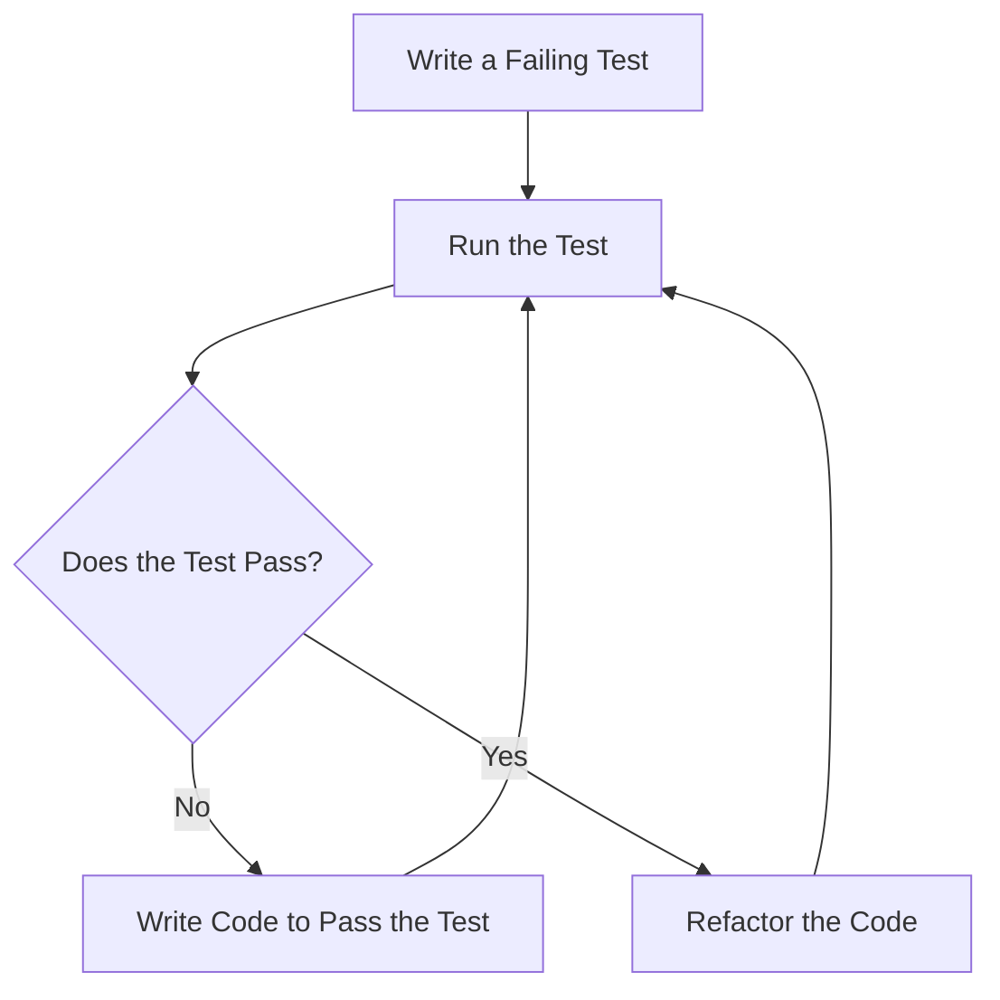

## 17.4 Test-Driven Development (TDD)

Test-Driven Development (TDD) is a software development process that emphasizes writing tests before writing the actual code. This approach not only ensures that the code meets its requirements but also guides the design of the software. In this section, we will delve into the TDD cycle, its benefits, and how to implement TDD effectively in PHP.

### Understanding the TDD Cycle

The TDD cycle is a repetitive process that consists of three main steps: Red, Green, and Refactor. Let's explore each step in detail:

#### Red: Write a Failing Test

The first step in TDD is to write a test that defines a function or improvement of a function, which will initially fail. This step is crucial because it sets the expectations for the code's behavior. By writing the test first, you clarify what the code should do before you start implementing it.

```php
<?php

use PHPUnit\Framework\TestCase;

class CalculatorTest extends TestCase
{
    public function testAddition()
    {
        $calculator = new Calculator();
        $result = $calculator->add(2, 3);
        $this->assertEquals(5, $result);
    }
}
```

In this example, we are writing a test for a simple addition function. The test will fail initially because the `add` method does not exist yet.

#### Green: Write Code to Pass the Test

Once you have a failing test, the next step is to write the minimum amount of code necessary to make the test pass. This step focuses on getting the test to pass as quickly as possible, without worrying about the quality or efficiency of the code.

```php
<?php

class Calculator
{
    public function add($a, $b)
    {
        return $a + $b;
    }
}
```

Here, we implement the `add` method to return the sum of two numbers, which should make the test pass.

#### Refactor: Improve the Code

With the test passing, you can now refactor the code to improve its structure and readability without changing its behavior. The tests act as a safety net, ensuring that the refactoring does not introduce any new bugs.

```php
<?php

class Calculator
{
    public function add(int $a, int $b): int
    {
        return $a + $b;
    }
}
```

In this refactoring step, we added type declarations to the method parameters and return type, enhancing the code's robustness and clarity.

### Benefits of TDD

Implementing TDD in your PHP projects offers several advantages:

- **Guides Design Decisions:** By writing tests first, you are forced to think about the design and interface of your code before implementation. This often leads to cleaner, more modular code.
- **Ensures Thorough Test Coverage:** TDD ensures that every piece of functionality is covered by tests, reducing the likelihood of bugs and regressions.
- **Facilitates Refactoring:** With a comprehensive suite of tests, you can refactor code with confidence, knowing that any changes that break functionality will be caught by the tests.
- **Improves Code Quality:** TDD encourages writing smaller, more focused functions and classes, leading to higher-quality code.
- **Enhances Collaboration:** Tests serve as documentation for the code, making it easier for team members to understand and work with the codebase.

### Implementing TDD in PHP

To effectively implement TDD in PHP, follow these guidelines:

#### Start with Writing Tests Before Implementation

Begin by writing a test for the smallest piece of functionality you want to implement. This test should clearly define the expected behavior of the code.

#### Focus on Small, Incremental Steps

TDD encourages taking small, incremental steps. Write a test, implement the code to pass the test, and then refactor. This approach helps maintain focus and reduces the complexity of the development process.

#### Use a Testing Framework

PHPUnit is the most popular testing framework for PHP and provides a robust set of tools for writing and running tests. Familiarize yourself with PHPUnit's features to make the most of TDD.

#### Maintain a Fast Feedback Loop

Ensure that your tests run quickly to maintain a fast feedback loop. This allows you to identify and fix issues promptly, keeping the development process efficient.

#### Embrace Continuous Integration

Integrate your tests into a continuous integration (CI) pipeline to automatically run tests whenever code is pushed to the repository. This ensures that the codebase remains stable and that new changes do not introduce regressions.

### Code Examples and Exercises

Let's explore some more examples and exercises to solidify your understanding of TDD in PHP.

#### Example: Implementing a Simple Calculator

We'll extend our calculator example to include subtraction, multiplication, and division.

```php
<?php

use PHPUnit\Framework\TestCase;

class CalculatorTest extends TestCase
{
    public function testAddition()
    {
        $calculator = new Calculator();
        $result = $calculator->add(2, 3);
        $this->assertEquals(5, $result);
    }

    public function testSubtraction()
    {
        $calculator = new Calculator();
        $result = $calculator->subtract(5, 3);
        $this->assertEquals(2, $result);
    }

    public function testMultiplication()
    {
        $calculator = new Calculator();
        $result = $calculator->multiply(2, 3);
        $this->assertEquals(6, $result);
    }

    public function testDivision()
    {
        $calculator = new Calculator();
        $result = $calculator->divide(6, 3);
        $this->assertEquals(2, $result);
    }
}
```

```php
<?php

class Calculator
{
    public function add(int $a, int $b): int
    {
        return $a + $b;
    }

    public function subtract(int $a, int $b): int
    {
        return $a - $b;
    }

    public function multiply(int $a, int $b): int
    {
        return $a * $b;
    }

    public function divide(int $a, int $b): int
    {
        if ($b === 0) {
            throw new InvalidArgumentException('Division by zero');
        }
        return $a / $b;
    }
}
```

#### Exercise: Extend the Calculator

Try adding more functionality to the calculator, such as exponentiation or square root. Write tests for these new features before implementing them.

### Visualizing the TDD Process

To better understand the TDD process, let's visualize it using a flowchart.



**Figure 1:** The TDD Cycle

This flowchart illustrates the iterative nature of TDD, where each cycle begins with writing a failing test, followed by writing code to pass the test, and finally refactoring the code.

### References and Further Reading

- [PHPUnit Documentation](https://phpunit.de/documentation.html)
- [Test-Driven Development by Example by Kent Beck](https://www.amazon.com/Test-Driven-Development-Kent-Beck/dp/0321146530)
- [Martin Fowler's Refactoring](https://martinfowler.com/books/refactoring.html)

### Knowledge Check

- What are the three main steps in the TDD cycle?
- How does TDD guide design decisions?
- Why is it important to write tests before implementation?
- What role does refactoring play in TDD?
- How can TDD improve collaboration among team members?

### Embrace the Journey

Remember, TDD is a journey, not a destination. As you practice TDD, you'll become more adept at writing clean, testable code. Keep experimenting, stay curious, and enjoy the process of continuous improvement.

## Quiz: Test-Driven Development (TDD)



### What is the first step in the TDD cycle?

- [x] Write a failing test
- [ ] Write code to pass the test
- [ ] Refactor the code
- [ ] Run the test

> **Explanation:** The first step in TDD is to write a failing test that defines the expected behavior of the code.

### What is the primary goal of the "Green" phase in TDD?

- [ ] Refactor the code
- [x] Write code to pass the test
- [ ] Write a failing test
- [ ] Document the code

> **Explanation:** The "Green" phase focuses on writing the minimum code necessary to pass the test.

### How does TDD help in refactoring code?

- [x] Provides a safety net of tests
- [ ] Eliminates the need for tests
- [ ] Increases code complexity
- [ ] Reduces test coverage

> **Explanation:** TDD provides a suite of tests that ensure refactoring does not introduce new bugs.

### What is a key benefit of writing tests before implementation?

- [x] Guides design decisions
- [ ] Increases development time
- [ ] Reduces code readability
- [ ] Eliminates the need for refactoring

> **Explanation:** Writing tests first helps clarify the design and expected behavior of the code.

### Which PHP testing framework is commonly used for TDD?

- [x] PHPUnit
- [ ] Jasmine
- [ ] Mocha
- [ ] Jest

> **Explanation:** PHPUnit is the most popular testing framework for PHP and is widely used for TDD.

### What does the "Refactor" phase in TDD involve?

- [x] Improving code structure
- [ ] Writing a failing test
- [ ] Writing code to pass the test
- [ ] Ignoring test failures

> **Explanation:** The "Refactor" phase involves improving the code's structure and readability without changing its behavior.

### How does TDD enhance collaboration among team members?

- [x] Provides clear documentation through tests
- [ ] Increases code complexity
- [ ] Reduces test coverage
- [ ] Eliminates the need for communication

> **Explanation:** Tests serve as documentation, making it easier for team members to understand and work with the codebase.

### What is the role of continuous integration in TDD?

- [x] Automatically runs tests on code changes
- [ ] Eliminates the need for tests
- [ ] Increases development time
- [ ] Reduces code readability

> **Explanation:** Continuous integration ensures that tests are automatically run whenever code is pushed, maintaining code stability.

### True or False: TDD eliminates the need for manual testing.

- [ ] True
- [x] False

> **Explanation:** While TDD provides automated tests, manual testing is still necessary for exploratory testing and user experience validation.

### What is a common challenge when adopting TDD?

- [x] Initial learning curve
- [ ] Reduced code quality
- [ ] Increased bug frequency
- [ ] Elimination of tests

> **Explanation:** The initial learning curve can be challenging, but the benefits of TDD outweigh the initial effort.


