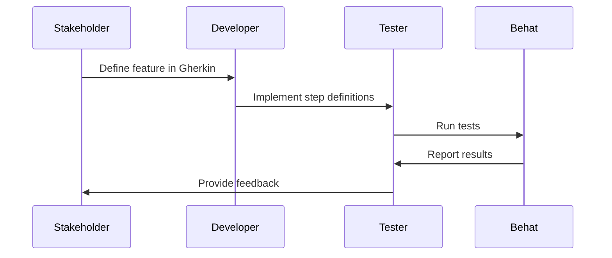

## 17.5 Behavior-Driven Development (BDD) with Behat

Behavior-Driven Development (BDD) is a software development approach that emphasizes collaboration between developers, QA, and non-technical or business participants in a software project. It encourages teams to use conversation and concrete examples to formalize a shared understanding of how the application should behave. Behat is a popular BDD framework for PHP that allows you to write tests in a natural language style using Gherkin syntax. This section will guide you through the concepts of BDD, how to use Behat, and how to integrate it into your PHP projects.

### BDD Concepts

#### Understanding BDD

Behavior-Driven Development focuses on the behavior of an application from the user's perspective. It is an extension of Test-Driven Development (TDD) that encourages collaboration across roles to build a shared understanding of the requirements. BDD uses examples to illustrate how the application should behave in different scenarios, which are then used to guide development.

**Key Principles of BDD:**

- **Collaboration:** Involves stakeholders, developers, and testers in the process.
- **Communication:** Uses a common language to describe application behavior.
- **Specification by Example:** Defines requirements through concrete examples.
- **Test Automation:** Automates these examples to ensure the application behaves as expected.

#### The Role of Gherkin Syntax

Gherkin is a domain-specific language for writing BDD test cases. It allows you to describe application behavior in a human-readable format. Gherkin syntax is structured around features, scenarios, and steps, making it easy for non-technical stakeholders to understand.

**Basic Structure of Gherkin:**

- **Feature:** Describes a specific functionality of the application.
- **Scenario:** Represents a particular use case or example.
- **Given, When, Then:** Defines the context, action, and expected outcome.

### Using Behat

Behat is a PHP framework for BDD that uses Gherkin syntax to describe application behavior. It allows you to write human-readable feature descriptions and define steps in PHP to implement test logic.

#### Installing Behat

To start using Behat, you need to install it via Composer. Run the following command in your project directory:

```bash
composer require --dev behat/behat
```

#### Writing Features in Gherkin

Create a new directory named `features` in your project root. Inside this directory, create a file with the `.feature` extension. Here's an example of a simple feature file:

```gherkin
Feature: User login
  In order to access my account
  As a registered user
  I want to log in to the application

  Scenario: Successful login
    Given I am on the login page
    When I fill in "username" with "user@example.com"
    And I fill in "password" with "securepassword"
    And I press "Log in"
    Then I should see "Welcome, user!"
```

#### Defining Steps in PHP

Behat uses step definitions to map Gherkin steps to PHP code. Create a new directory named `features/bootstrap` and inside it, create a file named `FeatureContext.php`. This file will contain your step definitions.

```php
<?php

use Behat\Behat\Context\Context;
use Behat\Behat\Tester\Exception\PendingException;

class FeatureContext implements Context
{
    /**
     * @Given I am on the login page
     */
    public function iAmOnTheLoginPage()
    {
        // Implement logic to navigate to the login page
    }

    /**
     * @When I fill in :field with :value
     */
    public function iFillInWith($field, $value)
    {
        // Implement logic to fill in the form field
    }

    /**
     * @When I press :button
     */
    public function iPress($button)
    {
        // Implement logic to press the button
    }

    /**
     * @Then I should see :text
     */
    public function iShouldSee($text)
    {
        // Implement logic to verify the text is visible
    }
}
```

#### Running Behat Tests

To run your Behat tests, execute the following command in your terminal:

```bash
vendor/bin/behat
```

Behat will parse the feature files, execute the corresponding PHP code, and report the results.

### Collaborative Development

BDD encourages collaboration between developers, testers, and business stakeholders. By involving all parties in the process, BDD helps ensure that everyone has a shared understanding of the application requirements.

#### Involving Stakeholders

In BDD, stakeholders are involved in defining application behavior. This collaboration helps ensure that the software meets the business needs and reduces the likelihood of misunderstandings.

**Benefits of Stakeholder Involvement:**

- **Improved Communication:** Stakeholders can express requirements in their own language.
- **Shared Understanding:** Everyone has a clear understanding of what needs to be built.
- **Early Feedback:** Stakeholders can provide feedback early in the development process.

### Example Features

BDD scenarios describe user interactions with the application. These scenarios are written in Gherkin syntax and serve as both documentation and automated tests.

#### Writing Effective Scenarios

When writing scenarios, focus on the user's perspective and the desired behavior of the application. Use clear and concise language to describe the steps.

**Example Scenario:**

```gherkin
Scenario: User registration
  Given I am on the registration page
  When I fill in "email" with "newuser@example.com"
  And I fill in "password" with "newpassword"
  And I press "Register"
  Then I should see "Registration successful"
```

### Try It Yourself

Experiment with Behat by modifying the provided examples. Try adding new scenarios or changing the existing ones to see how Behat handles different cases.

**Suggestions for Experimentation:**

- Add a scenario for unsuccessful login attempts.
- Modify the step definitions to include additional logic.
- Create a new feature file for a different part of the application.

### Visualizing BDD Workflow

To better understand the BDD workflow, let's visualize the process using a sequence diagram.



**Diagram Description:** This sequence diagram illustrates the BDD workflow, showing the interactions between stakeholders, developers, testers, and Behat.

### References and Links

- [Behat Documentation](http://behat.org/en/latest/)
- [Gherkin Syntax Reference](https://cucumber.io/docs/gherkin/reference/)
- [PHPUnit and Behat Integration](https://phpunit.de/)
- [Collaborative Development with BDD](https://dannorth.net/introducing-bdd/)

### Knowledge Check

To reinforce your understanding of BDD with Behat, consider the following questions:

- What is the primary focus of BDD?
- How does Gherkin syntax facilitate communication between stakeholders?
- What are the benefits of involving stakeholders in the BDD process?

### Embrace the Journey

Remember, BDD is not just about writing tests; it's about fostering collaboration and communication across your team. As you continue to explore BDD with Behat, keep experimenting, stay curious, and enjoy the journey!

## Quiz: Behavior-Driven Development (BDD) with Behat



### What is the primary focus of Behavior-Driven Development (BDD)?

- [x] The behavior of an application from the user's perspective.
- [ ] The internal architecture of the application.
- [ ] The performance optimization of the application.
- [ ] The security aspects of the application.

> **Explanation:** BDD focuses on the behavior of an application from the user's perspective, ensuring that the software meets user needs.

### Which language is used to write BDD test cases in Behat?

- [x] Gherkin
- [ ] PHP
- [ ] JavaScript
- [ ] HTML

> **Explanation:** Gherkin is the language used to write BDD test cases in Behat, allowing for human-readable feature descriptions.

### What is the purpose of step definitions in Behat?

- [x] To map Gherkin steps to PHP code.
- [ ] To define the application's architecture.
- [ ] To optimize the application's performance.
- [ ] To secure the application from vulnerabilities.

> **Explanation:** Step definitions in Behat map Gherkin steps to PHP code, implementing the test logic.

### How can stakeholders benefit from BDD?

- [x] Improved communication and shared understanding.
- [ ] Increased application performance.
- [ ] Enhanced security measures.
- [ ] Reduced development costs.

> **Explanation:** BDD improves communication and shared understanding among stakeholders, developers, and testers.

### What command is used to run Behat tests?

- [x] vendor/bin/behat
- [ ] phpunit
- [ ] composer install
- [ ] php artisan test

> **Explanation:** The command `vendor/bin/behat` is used to run Behat tests in a PHP project.

### What is the role of Gherkin's "Given" keyword?

- [x] To define the initial context or state.
- [ ] To specify the expected outcome.
- [ ] To describe the action taken.
- [ ] To outline the test environment.

> **Explanation:** The "Given" keyword in Gherkin is used to define the initial context or state before an action is taken.

### What is a key benefit of using Behat for BDD?

- [x] It allows for human-readable tests that stakeholders can understand.
- [ ] It automatically optimizes application performance.
- [ ] It provides built-in security features.
- [ ] It reduces the need for manual testing.

> **Explanation:** Behat allows for human-readable tests that stakeholders can understand, facilitating collaboration.

### What is the structure of a Gherkin scenario?

- [x] Given, When, Then
- [ ] Start, Process, End
- [ ] Initialize, Execute, Verify
- [ ] Begin, Action, Result

> **Explanation:** A Gherkin scenario is structured with "Given, When, Then" to define context, action, and expected outcome.

### What is the main advantage of using BDD over traditional testing methods?

- [x] It fosters collaboration and communication across roles.
- [ ] It requires less time to implement.
- [ ] It is more cost-effective.
- [ ] It guarantees bug-free software.

> **Explanation:** BDD fosters collaboration and communication across roles, ensuring a shared understanding of requirements.

### True or False: Behat can only be used for testing web applications.

- [ ] True
- [x] False

> **Explanation:** False. Behat can be used for testing various types of applications, not just web applications.




