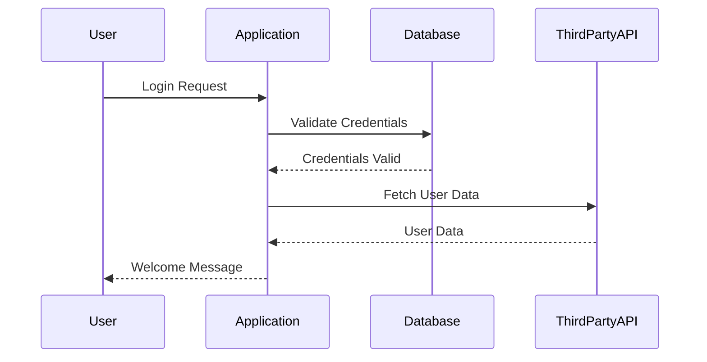

## 17.6 Acceptance and Integration Testing

In the realm of software development, ensuring that your application functions as intended is paramount. Acceptance and integration testing are two critical components of the testing process that help achieve this goal. In this section, we will delve into these testing methodologies, explore their significance, and demonstrate how to implement them effectively in PHP.

### Understanding Acceptance Testing

**Acceptance Testing** is a type of testing that validates whether a software application meets the business requirements and is ready for delivery. It is often the final phase of testing before the software is released to production. Acceptance testing can be performed in two main forms: User Acceptance Testing (UAT) and Business Acceptance Testing (BAT).

- **User Acceptance Testing (UAT):** Conducted by end-users to ensure the software meets their needs and expectations.
- **Business Acceptance Testing (BAT):** Conducted by business stakeholders to ensure the software aligns with business goals and requirements.

#### Key Objectives of Acceptance Testing

1. **Validation of Requirements:** Ensure that all business requirements are met.
2. **User Satisfaction:** Confirm that the software is user-friendly and meets user expectations.
3. **Functionality Verification:** Verify that all functionalities work as intended in a real-world scenario.
4. **Risk Mitigation:** Identify any potential issues before the software goes live.

### Integration Testing Explained

**Integration Testing** focuses on testing the interactions between different components or services within an application. The goal is to ensure that integrated units work together as expected. This type of testing is crucial in identifying issues that may arise when individual components are combined.

#### Types of Integration Testing

1. **Big Bang Integration Testing:** All components are integrated simultaneously, and the entire system is tested as a whole.
2. **Incremental Integration Testing:** Components are integrated and tested one by one. This can be further divided into:
   - **Top-Down Integration Testing:** Testing starts from the top-level modules and progresses downwards.
   - **Bottom-Up Integration Testing:** Testing begins with the lower-level modules and moves upwards.
3. **Sandwich Integration Testing:** A combination of top-down and bottom-up approaches.

### Tools for Acceptance and Integration Testing in PHP

When it comes to PHP, several tools can facilitate acceptance and integration testing. One of the most popular tools is **Codeception**.

#### Codeception

**Codeception** is a versatile testing framework for PHP that supports acceptance, functional, and unit testing. It provides a unified interface for writing tests and simulating user actions.

- **Website:** [Codeception](https://codeception.com/)
- **Features:**
  - Supports multiple testing types (acceptance, functional, unit).
  - Allows for testing of web applications, APIs, and more.
  - Provides a simple syntax for writing tests.
  - Integrates with popular PHP frameworks like Laravel, Symfony, and Yii.

#### Setting Up Codeception

To get started with Codeception, follow these steps:

1. **Install Codeception via Composer:**

   ```bash
   composer require codeception/codeception --dev
   ```

2. **Initialize Codeception in Your Project:**

   ```bash
   vendor/bin/codecept bootstrap
   ```

3. **Generate a Test Suite:**

   ```bash
   vendor/bin/codecept generate:suite acceptance
   ```

4. **Create a Test Case:**

   ```bash
   vendor/bin/codecept generate:test acceptance LoginTest
   ```

#### Writing Acceptance Tests with Codeception

Let's write a simple acceptance test to verify the login functionality of a web application.

```php
<?php

class LoginTestCest
{
    public function _before(AcceptanceTester $I)
    {
        // This method runs before each test
    }

    public function tryToTest(AcceptanceTester $I)
    {
        $I->amOnPage('/login');
        $I->fillField('username', 'testuser');
        $I->fillField('password', 'password123');
        $I->click('Login');
        $I->see('Welcome, testuser');
    }
}
```

- **Explanation:**
  - **`amOnPage('/login')`:** Navigate to the login page.
  - **`fillField('username', 'testuser')`:** Enter the username.
  - **`fillField('password', 'password123')`:** Enter the password.
  - **`click('Login')`:** Click the login button.
  - **`see('Welcome, testuser')`:** Verify that the welcome message is displayed.

### Executing Integration Tests

Integration tests can be executed using Codeception or other PHP testing frameworks like PHPUnit. The focus is on testing the interactions between components.

#### Example: Testing API Integration

Consider a scenario where you need to test the integration between a PHP application and a third-party API.

```php
<?php

use PHPUnit\Framework\TestCase;

class ApiIntegrationTest extends TestCase
{
    public function testApiResponse()
    {
        $response = file_get_contents('https://api.example.com/data');
        $data = json_decode($response, true);

        $this->assertArrayHasKey('id', $data);
        $this->assertArrayHasKey('name', $data);
        $this->assertEquals('Example Name', $data['name']);
    }
}
```

- **Explanation:**
  - **`file_get_contents('https://api.example.com/data')`:** Fetch data from the API.
  - **`json_decode($response, true)`:** Decode the JSON response.
  - **`assertArrayHasKey('id', $data)`:** Check if the 'id' key exists in the response.
  - **`assertEquals('Example Name', $data['name'])`:** Verify the 'name' value.

### Best Practices for Acceptance and Integration Testing

1. **Define Clear Test Cases:** Ensure that test cases are well-defined and cover all possible scenarios.
2. **Automate Tests:** Automate acceptance and integration tests to save time and reduce human error.
3. **Use Mock Services:** For integration testing, use mock services to simulate third-party APIs and services.
4. **Maintain Test Data:** Ensure that test data is consistent and can be easily reset between test runs.
5. **Continuous Integration:** Integrate testing into your CI/CD pipeline to catch issues early.

### Visualizing the Testing Process

To better understand the flow of acceptance and integration testing, let's visualize the process using a sequence diagram.



- **Description:** This diagram illustrates the sequence of interactions during a login process, highlighting the integration between the application, database, and third-party API.

### Try It Yourself

Experiment with the provided code examples by modifying them to suit your application's needs. For instance, try changing the login credentials or testing different API endpoints. This hands-on approach will deepen your understanding of acceptance and integration testing in PHP.

### Knowledge Check

- **What is the primary goal of acceptance testing?**
- **How does integration testing differ from unit testing?**
- **What are some common tools used for acceptance and integration testing in PHP?**

### Embrace the Journey

Remember, mastering acceptance and integration testing is a journey. As you continue to explore these testing methodologies, you'll gain valuable insights into ensuring software quality and reliability. Keep experimenting, stay curious, and enjoy the process!

## Quiz: Acceptance and Integration Testing



### What is the primary purpose of acceptance testing?

- [x] To validate that the application meets business requirements.
- [ ] To test individual components in isolation.
- [ ] To check for code syntax errors.
- [ ] To optimize application performance.

> **Explanation:** Acceptance testing ensures that the application meets the business requirements and is ready for delivery.

### Which tool is commonly used for acceptance and integration testing in PHP?

- [x] Codeception
- [ ] Selenium
- [ ] JUnit
- [ ] Mocha

> **Explanation:** Codeception is a popular PHP testing framework that supports acceptance, functional, and unit testing.

### What is the difference between user acceptance testing and business acceptance testing?

- [x] UAT is conducted by end-users, while BAT is conducted by business stakeholders.
- [ ] UAT focuses on technical aspects, while BAT focuses on user experience.
- [ ] UAT is automated, while BAT is manual.
- [ ] UAT is for developers, while BAT is for testers.

> **Explanation:** User Acceptance Testing (UAT) is conducted by end-users, whereas Business Acceptance Testing (BAT) is conducted by business stakeholders.

### What is the main focus of integration testing?

- [x] Testing interactions between different components or services.
- [ ] Testing the user interface.
- [ ] Testing database performance.
- [ ] Testing code syntax.

> **Explanation:** Integration testing focuses on testing the interactions between different components or services within an application.

### Which of the following is a type of integration testing?

- [x] Big Bang Integration Testing
- [ ] Unit Testing
- [ ] Load Testing
- [ ] Regression Testing

> **Explanation:** Big Bang Integration Testing is a type of integration testing where all components are integrated simultaneously and tested as a whole.

### What is a key benefit of automating acceptance tests?

- [x] Reducing human error and saving time.
- [ ] Increasing code complexity.
- [ ] Enhancing manual testing efforts.
- [ ] Improving user interface design.

> **Explanation:** Automating acceptance tests reduces human error and saves time by executing tests consistently and efficiently.

### How can mock services be used in integration testing?

- [x] To simulate third-party APIs and services.
- [ ] To test user interface elements.
- [ ] To enhance database performance.
- [ ] To optimize application speed.

> **Explanation:** Mock services are used in integration testing to simulate third-party APIs and services, allowing for controlled testing environments.

### What is the role of continuous integration in testing?

- [x] To catch issues early by integrating testing into the CI/CD pipeline.
- [ ] To replace manual testing entirely.
- [ ] To focus solely on performance optimization.
- [ ] To eliminate the need for unit tests.

> **Explanation:** Continuous integration involves integrating testing into the CI/CD pipeline to catch issues early in the development process.

### What is the purpose of maintaining consistent test data?

- [x] To ensure reliable and repeatable test results.
- [ ] To increase test complexity.
- [ ] To enhance user interface design.
- [ ] To optimize application performance.

> **Explanation:** Maintaining consistent test data ensures reliable and repeatable test results, which is crucial for accurate testing.

### True or False: Acceptance testing is typically the final phase of testing before software release.

- [x] True
- [ ] False

> **Explanation:** Acceptance testing is often the final phase of testing before the software is released to production, ensuring it meets business requirements.


