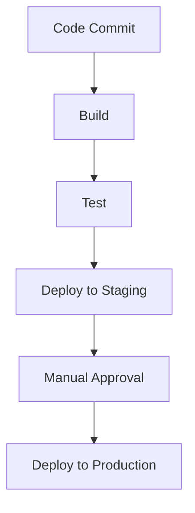

## 17.7 Continuous Integration and Continuous Deployment (CI/CD)

In the realm of modern software development, Continuous Integration (CI) and Continuous Deployment (CD) have become indispensable practices. They ensure that code changes are automatically tested and deployed, leading to faster and more reliable software delivery. In this section, we will delve into the concepts of CI/CD, explore popular tools, and demonstrate how to implement these practices in PHP development.

### Understanding CI/CD Concepts

**Continuous Integration (CI)** is a development practice where developers integrate code into a shared repository frequently, ideally several times a day. Each integration is verified by an automated build and automated tests to detect integration errors as quickly as possible.

**Continuous Deployment (CD)** extends CI by automatically deploying code changes to a production environment after passing the automated tests. This practice ensures that software can be released to users at any time, reducing the time to market and improving the feedback loop.

#### Key Benefits of CI/CD

- **Faster Time to Market:** Automating the integration and deployment processes reduces the time required to release new features and fixes.
- **Improved Code Quality:** Automated testing ensures that code changes meet quality standards before being deployed.
- **Reduced Risk:** Frequent deployments with smaller changes reduce the risk of introducing bugs into production.
- **Enhanced Collaboration:** CI/CD fosters a culture of collaboration among developers, testers, and operations teams.

### CI/CD Tools for PHP Development

There are several tools available to implement CI/CD pipelines in PHP projects. Let's explore some of the most popular ones:

#### Jenkins

[Jenkins](https://www.jenkins.io/) is an open-source automation server that enables developers to build, test, and deploy their software. It is highly customizable and supports a wide range of plugins to extend its functionality.

- **Installation and Setup:** Jenkins can be installed on various platforms, including Windows, macOS, and Linux. Once installed, you can configure Jenkins to monitor your version control system for changes and trigger builds automatically.
- **Pipeline as Code:** Jenkins supports defining build pipelines as code using the Jenkinsfile, which allows you to version control your CI/CD pipeline.
- **Integration with PHP Tools:** Jenkins can integrate with PHP tools like PHPUnit for testing, PHP_CodeSniffer for code style checks, and PHPStan for static analysis.

#### GitLab CI/CD

[GitLab CI/CD](https://docs.gitlab.com/ee/ci/) is a built-in feature of GitLab that provides a robust platform for automating the software development lifecycle.

- **Integrated with GitLab:** GitLab CI/CD is tightly integrated with GitLab repositories, making it easy to set up and manage pipelines directly from the GitLab interface.
- **YAML Configuration:** Pipelines are defined using a `.gitlab-ci.yml` file, which specifies the stages, jobs, and scripts to be executed.
- **Docker Support:** GitLab CI/CD supports running jobs in Docker containers, providing a consistent and isolated environment for builds.

#### GitHub Actions

[GitHub Actions](https://github.com/features/actions) is a CI/CD platform that allows you to automate workflows directly from your GitHub repository.

- **Workflow Automation:** GitHub Actions uses YAML files to define workflows that can be triggered by events such as pushes, pull requests, and more.
- **Marketplace for Actions:** GitHub provides a marketplace where you can find pre-built actions to integrate with various tools and services.
- **Integration with PHP Tools:** You can use GitHub Actions to run PHP tests, perform static analysis, and deploy applications.

### Implementing CI/CD in PHP Projects

Let's walk through the process of setting up a CI/CD pipeline for a PHP project using GitHub Actions as an example.

#### Step 1: Create a GitHub Repository

First, create a new repository on GitHub for your PHP project. If you already have a repository, you can skip this step.

#### Step 2: Define a Workflow

Create a new directory named `.github/workflows` in your project root. Inside this directory, create a YAML file (e.g., `ci.yml`) to define your CI/CD workflow.

```yaml
name: PHP CI/CD

on:
  push:
    branches:
      - main
  pull_request:
    branches:
      - main

jobs:
  build:
    runs-on: ubuntu-latest

    steps:
    - name: Checkout code
      uses: actions/checkout@v2

    - name: Set up PHP
      uses: shivammathur/setup-php@v2
      with:
        php-version: '8.0'

    - name: Install dependencies
      run: composer install

    - name: Run tests
      run: vendor/bin/phpunit
```

#### Step 3: Configure the Workflow

- **Trigger Events:** The workflow is triggered on pushes and pull requests to the `main` branch.
- **Job Definition:** The `build` job runs on the latest Ubuntu environment.
- **Steps:**
  - **Checkout Code:** Uses the `actions/checkout` action to clone the repository.
  - **Set Up PHP:** Uses the `shivammathur/setup-php` action to install PHP 8.0.
  - **Install Dependencies:** Runs `composer install` to install project dependencies.
  - **Run Tests:** Executes PHPUnit tests using `vendor/bin/phpunit`.

#### Step 4: Commit and Push Changes

Commit your changes to the repository and push them to GitHub. The workflow will be triggered automatically, and you can view the progress and results in the "Actions" tab of your repository.

### Automated Testing in CI/CD Pipelines

Automated testing is a crucial component of CI/CD pipelines. It ensures that code changes do not introduce new bugs and that the application behaves as expected.

#### Types of Automated Tests

- **Unit Tests:** Test individual components or functions in isolation.
- **Integration Tests:** Test the interaction between different components or systems.
- **End-to-End Tests:** Simulate real user scenarios to test the entire application flow.

#### Tools for Automated Testing in PHP

- **PHPUnit:** A popular testing framework for writing unit and integration tests in PHP.
- **Behat:** A behavior-driven development (BDD) framework for testing PHP applications.
- **Codeception:** A full-stack testing framework that supports unit, functional, and acceptance testing.

### Best Practices for CI/CD in PHP

- **Keep Pipelines Simple:** Start with a simple pipeline and gradually add complexity as needed.
- **Fail Fast:** Configure pipelines to fail quickly if a step fails, allowing developers to address issues promptly.
- **Use Caching:** Cache dependencies and build artifacts to speed up pipeline execution.
- **Monitor Pipeline Performance:** Regularly review pipeline performance and optimize as necessary.
- **Secure Your Pipelines:** Implement security best practices to protect your CI/CD pipelines from unauthorized access.

### Visualizing a CI/CD Pipeline

To better understand the flow of a CI/CD pipeline, let's visualize a typical pipeline using a flowchart.



**Description:** This flowchart represents a CI/CD pipeline where code commits trigger a build, followed by testing. Successful tests lead to deployment in a staging environment, with manual approval required before deploying to production.

### Try It Yourself

Experiment with the provided GitHub Actions workflow by modifying the PHP version or adding additional steps, such as static analysis with PHPStan or code style checks with PHP_CodeSniffer. Observe how these changes affect the pipeline execution.

### Further Reading

- [Jenkins CI Documentation](https://www.jenkins.io/doc/)
- [GitLab CI/CD Documentation](https://docs.gitlab.com/ee/ci/)
- [GitHub Actions Documentation](https://docs.github.com/en/actions)

### Knowledge Check

- What are the key benefits of implementing CI/CD in PHP projects?
- How does GitHub Actions differ from Jenkins and GitLab CI/CD?
- Why is automated testing important in CI/CD pipelines?

### Embrace the Journey

Remember, implementing CI/CD is a journey that requires continuous improvement and adaptation. As you gain experience, you'll discover new ways to optimize your pipelines and enhance your development workflow. Keep experimenting, stay curious, and enjoy the journey!

## Quiz: Continuous Integration and Continuous Deployment (CI/CD)



### What is the primary goal of Continuous Integration (CI)?

- [x] To integrate code changes frequently and detect errors quickly
- [ ] To deploy code changes to production automatically
- [ ] To manage version control systems
- [ ] To monitor application performance

> **Explanation:** Continuous Integration aims to integrate code changes frequently and detect errors quickly through automated builds and tests.

### Which tool is not typically used for CI/CD in PHP projects?

- [ ] Jenkins
- [ ] GitLab CI/CD
- [ ] GitHub Actions
- [x] Microsoft Word

> **Explanation:** Microsoft Word is not a CI/CD tool; it is a word processing application.

### What file format is used to define GitHub Actions workflows?

- [ ] XML
- [ ] JSON
- [x] YAML
- [ ] INI

> **Explanation:** GitHub Actions workflows are defined using YAML files.

### What is the purpose of automated testing in CI/CD pipelines?

- [x] To ensure code changes do not introduce new bugs
- [ ] To manually verify code quality
- [ ] To deploy code changes to production
- [ ] To manage version control systems

> **Explanation:** Automated testing ensures that code changes do not introduce new bugs and that the application behaves as expected.

### Which PHP testing framework is commonly used for unit testing?

- [x] PHPUnit
- [ ] Behat
- [ ] Codeception
- [ ] Laravel

> **Explanation:** PHPUnit is a popular testing framework for writing unit tests in PHP.

### What is a common practice to speed up CI/CD pipelines?

- [x] Use caching for dependencies and build artifacts
- [ ] Run all tests manually
- [ ] Avoid using version control
- [ ] Deploy directly to production without testing

> **Explanation:** Caching dependencies and build artifacts can significantly speed up CI/CD pipelines.

### What is the role of manual approval in a CI/CD pipeline?

- [x] To ensure human oversight before deploying to production
- [ ] To automate the deployment process
- [ ] To run automated tests
- [ ] To manage version control

> **Explanation:** Manual approval ensures human oversight before deploying to production, adding an extra layer of verification.

### Which CI/CD tool is integrated with GitLab repositories?

- [ ] Jenkins
- [x] GitLab CI/CD
- [ ] GitHub Actions
- [ ] Travis CI

> **Explanation:** GitLab CI/CD is integrated with GitLab repositories, providing a seamless CI/CD experience.

### What is the benefit of using Docker in CI/CD pipelines?

- [x] Provides a consistent and isolated environment for builds
- [ ] Increases manual testing efforts
- [ ] Reduces the need for version control
- [ ] Automatically writes code

> **Explanation:** Docker provides a consistent and isolated environment for builds, ensuring that the application behaves the same way in different environments.

### True or False: Continuous Deployment (CD) always requires manual approval before deploying to production.

- [ ] True
- [x] False

> **Explanation:** Continuous Deployment automates the deployment process and does not always require manual approval, although it can be configured to include it.


