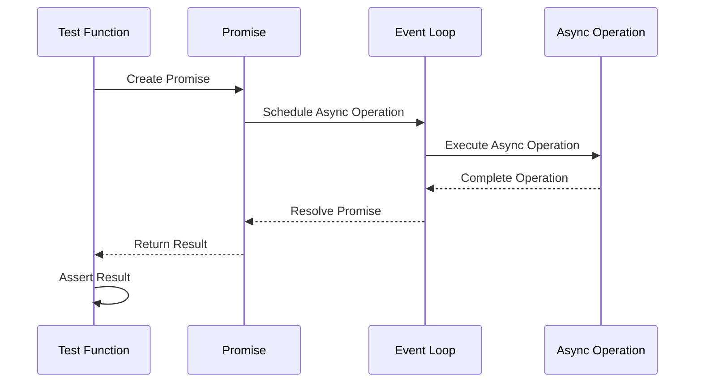

## 17.8 Testing Asynchronous Code

Asynchronous programming is a powerful paradigm that allows PHP developers to write non-blocking code, improving the efficiency and responsiveness of applications. However, testing asynchronous code presents unique challenges due to its non-deterministic nature. In this section, we will explore the intricacies of testing asynchronous code in PHP, focusing on the challenges, approaches, and tools available to ensure robust and reliable applications.

### Challenges of Testing Asynchronous Code

Testing asynchronous code can be daunting due to the following challenges:

- **Non-Deterministic Outcomes:** Asynchronous operations may complete in an unpredictable order, making it difficult to assert expected outcomes.
- **Timing Issues:** Tests may pass or fail depending on the timing of asynchronous events, leading to flaky tests.
- **Complex Control Flow:** Asynchronous code often involves callbacks, promises, or event loops, complicating the control flow and making it harder to test.

### Approaches to Testing Asynchronous Code

To effectively test asynchronous code, developers can employ several strategies:

#### 1. Using Promises and Callbacks in Tests

Promises and callbacks are fundamental to asynchronous programming in PHP. They can be leveraged in tests to handle asynchronous operations gracefully.

```php
<?php

use React\Promise\Promise;

function asyncOperation(): Promise
{
    return new Promise(function ($resolve, $reject) {
        // Simulate an asynchronous operation
        sleep(1);
        $resolve('Operation completed');
    });
}

// Test function
function testAsyncOperation()
{
    asyncOperation()->then(function ($result) {
        assert($result === 'Operation completed');
        echo "Test passed!\n";
    });
}

testAsyncOperation();
```

In this example, we use a promise to simulate an asynchronous operation. The test asserts the result once the promise is resolved.

#### 2. Employing Event Loops or Test Doubles

Event loops, such as those provided by ReactPHP, can be used to manage asynchronous operations in tests. Test doubles (mocks, stubs, or spies) can simulate asynchronous behavior, allowing for more controlled testing environments.

```php
<?php

use React\EventLoop\Factory;
use React\Promise\Deferred;

function asyncOperationWithLoop($loop): Deferred
{
    $deferred = new Deferred();

    $loop->addTimer(1, function () use ($deferred) {
        $deferred->resolve('Operation completed');
    });

    return $deferred;
}

// Test function
function testAsyncOperationWithLoop()
{
    $loop = Factory::create();
    $deferred = asyncOperationWithLoop($loop);

    $deferred->promise()->then(function ($result) {
        assert($result === 'Operation completed');
        echo "Test passed with event loop!\n";
    });

    $loop->run();
}

testAsyncOperationWithLoop();
```

Here, we use ReactPHP's event loop to schedule an asynchronous operation, demonstrating how to test such operations using an event-driven approach.

### ReactPHP Testing

ReactPHP is a popular library for building event-driven applications in PHP. Testing ReactPHP applications involves specific techniques to handle its asynchronous nature.

#### Techniques for Testing Event-Driven Applications

1. **Using ReactPHP's Test Utilities:** ReactPHP provides utilities to facilitate testing, such as `LoopInterface` for controlling the event loop during tests.

2. **Mocking Timers and Streams:** Mocking timers and streams can help simulate asynchronous events and control their execution order.

3. **Testing with Promises:** Promises are central to ReactPHP's asynchronous model. Testing involves asserting promise resolutions and rejections.

#### Example: Testing a ReactPHP Application

```php
<?php

use React\EventLoop\Factory;
use React\Promise\Deferred;
use React\Stream\ReadableResourceStream;

function fetchDataFromStream($loop): Deferred
{
    $deferred = new Deferred();
    $stream = new ReadableResourceStream(fopen('data.txt', 'r'), $loop);

    $stream->on('data', function ($chunk) use ($deferred) {
        $deferred->resolve($chunk);
    });

    return $deferred;
}

// Test function
function testFetchDataFromStream()
{
    $loop = Factory::create();
    $deferred = fetchDataFromStream($loop);

    $deferred->promise()->then(function ($data) {
        assert(!empty($data));
        echo "Data fetched successfully!\n";
    });

    $loop->run();
}

testFetchDataFromStream();
```

In this example, we test a function that reads data from a stream using ReactPHP. The test asserts that data is successfully fetched.

### Visualizing Asynchronous Testing

To better understand the flow of asynchronous testing, let's visualize the process using a sequence diagram.



This diagram illustrates the sequence of events when testing an asynchronous operation using promises and an event loop.

### References and Links

For further reading on testing asynchronous code in PHP, consider the following resources:

- [ReactPHP Documentation](https://reactphp.org/)
- [PHPUnit Documentation](https://phpunit.de/)
- [Testing ReactPHP Applications](https://reactphp.org/testing/)

### Knowledge Check

- What are the main challenges of testing asynchronous code?
- How can promises be used in testing asynchronous operations?
- What role do event loops play in testing asynchronous code?
- How does ReactPHP facilitate testing of event-driven applications?

### Embrace the Journey

Testing asynchronous code can be complex, but with the right tools and techniques, it becomes manageable. Remember, this is just the beginning. As you progress, you'll build more robust and reliable applications. Keep experimenting, stay curious, and enjoy the journey!

## Quiz: Testing Asynchronous Code



### What is a common challenge when testing asynchronous code?

- [x] Non-deterministic outcomes
- [ ] Deterministic outcomes
- [ ] Synchronous execution
- [ ] Lack of callbacks

> **Explanation:** Asynchronous code can lead to non-deterministic outcomes due to the unpredictable order of execution.

### Which PHP library is commonly used for event-driven programming?

- [x] ReactPHP
- [ ] Laravel
- [ ] Symfony
- [ ] CodeIgniter

> **Explanation:** ReactPHP is a popular library for building event-driven applications in PHP.

### What is a promise in asynchronous programming?

- [x] An object representing a future result
- [ ] A synchronous function call
- [ ] A type of callback
- [ ] A PHP extension

> **Explanation:** A promise is an object that represents a future result of an asynchronous operation.

### How can event loops assist in testing asynchronous code?

- [x] By managing the execution of asynchronous operations
- [ ] By blocking synchronous code
- [ ] By eliminating the need for promises
- [ ] By simplifying synchronous code

> **Explanation:** Event loops manage the execution of asynchronous operations, making it easier to test them.

### What is a test double?

- [x] A mock or stub used in testing
- [ ] A real object used in production
- [ ] A type of promise
- [ ] A PHP function

> **Explanation:** A test double is a mock or stub used to simulate real objects in testing.

### Which ReactPHP component is used to control the event loop?

- [x] LoopInterface
- [ ] PromiseInterface
- [ ] StreamInterface
- [ ] TimerInterface

> **Explanation:** LoopInterface is used to control the event loop in ReactPHP.

### What is the purpose of mocking timers in tests?

- [x] To simulate asynchronous events
- [ ] To execute synchronous code
- [ ] To eliminate the need for promises
- [ ] To simplify synchronous code

> **Explanation:** Mocking timers helps simulate asynchronous events and control their execution order.

### How can promises be tested in PHP?

- [x] By asserting promise resolutions and rejections
- [ ] By executing synchronous code
- [ ] By eliminating callbacks
- [ ] By using only synchronous functions

> **Explanation:** Promises can be tested by asserting their resolutions and rejections.

### What is the role of a deferred object in ReactPHP?

- [x] To create and manage promises
- [ ] To execute synchronous code
- [ ] To eliminate the need for event loops
- [ ] To simplify synchronous code

> **Explanation:** A deferred object is used to create and manage promises in ReactPHP.

### True or False: Asynchronous code always executes in a predictable order.

- [ ] True
- [x] False

> **Explanation:** Asynchronous code does not always execute in a predictable order due to its non-deterministic nature.


