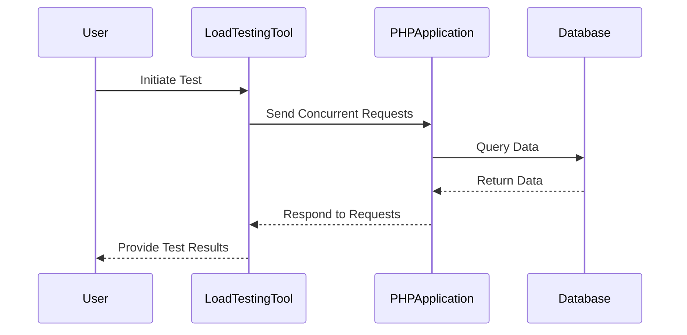

## 17.9 Performance and Load Testing

Performance and load testing are critical components of the software development lifecycle, especially for PHP applications that often serve as the backbone of web services. These testing methodologies help ensure that applications can handle expected and unexpected loads while maintaining performance standards. In this section, we will delve into the purpose, tools, metrics, and analysis techniques for performance and load testing in PHP applications.

### Purpose of Performance and Load Testing

The primary goal of performance and load testing is to evaluate how a PHP application behaves under various conditions. This involves:

- **Assessing Response Time:** Determine how quickly the application responds to user requests.
- **Measuring Throughput:** Evaluate the number of requests the application can handle within a given time frame.
- **Testing Concurrency Levels:** Understand how the application performs when multiple users access it simultaneously.
- **Identifying Bottlenecks:** Pinpoint areas that degrade performance and require optimization.
- **Ensuring Scalability:** Verify that the application can scale to accommodate increased loads without performance degradation.

By conducting these tests, developers can ensure that their PHP applications provide a smooth and responsive user experience, even under heavy load conditions.

### Tools for Performance and Load Testing

Several tools are available to facilitate performance and load testing in PHP applications. Here, we will focus on two popular tools: Apache JMeter and Siege.

#### Apache JMeter

[Apache JMeter](https://jmeter.apache.org/) is a powerful open-source tool designed for load testing and measuring performance. It is widely used due to its flexibility and ability to simulate a variety of scenarios.

- **Features:**
  - Supports multiple protocols, including HTTP, HTTPS, FTP, and more.
  - Provides a graphical interface for test plan creation.
  - Allows for distributed testing across multiple machines.
  - Offers extensive reporting and visualization capabilities.

- **Installation:**
  To install JMeter, download the latest version from the [official website](https://jmeter.apache.org/download_jmeter.cgi) and extract it to your desired location. Ensure that Java is installed on your system, as JMeter requires it to run.

- **Creating a Test Plan:**
  A test plan in JMeter consists of a series of steps that define the testing scenario. Here is a basic example:

  ```xml
  <TestPlan>
    <ThreadGroup>
      <num_threads>10</num_threads>
      <ramp_time>5</ramp_time>
      <loop_count>100</loop_count>
      <HTTPSamplerProxy>
        <domain>example.com</domain>
        <port>80</port>
        <path>/</path>
        <method>GET</method>
      </HTTPSamplerProxy>
    </ThreadGroup>
  </TestPlan>
  ```

  - **Thread Group:** Defines the number of users (threads), ramp-up time, and loop count.
  - **HTTP Sampler:** Specifies the request details, such as domain, port, path, and method.

- **Running the Test:**
  Execute the test plan using the JMeter GUI or command line. Analyze the results to identify performance issues.

#### Siege

Siege is a command-line HTTP load testing tool that is simple yet effective for testing web applications.

- **Features:**
  - Simulates multiple users accessing a web application.
  - Provides metrics such as response time, transaction rate, and concurrency.
  - Supports basic authentication and cookies.

- **Installation:**
  Install Siege using your package manager. For example, on Ubuntu, use:

  ```bash
  sudo apt-get install siege
  ```

- **Running a Test:**
  Use the following command to run a basic load test:

  ```bash
  siege -c 10 -r 100 http://example.com
  ```

  - **-c:** Number of concurrent users.
  - **-r:** Number of repetitions.

- **Analyzing Results:**
  Siege provides a summary of the test, including metrics like response time and transaction rate.

### Key Metrics in Performance and Load Testing

Understanding the key metrics is essential for analyzing the results of performance and load tests. Here are some critical metrics to consider:

- **Response Time:** The time taken for the application to respond to a request. Lower response times indicate better performance.
- **Throughput:** The number of requests processed by the application per second. Higher throughput suggests better handling of concurrent requests.
- **Error Rate:** The percentage of failed requests. A high error rate indicates potential issues with the application.
- **Concurrency:** The number of simultaneous users accessing the application. Testing different concurrency levels helps assess scalability.
- **Latency:** The delay between the request initiation and the first byte received. Lower latency is desirable for a responsive application.

### Analyzing Results and Identifying Bottlenecks

Once the tests are complete, analyzing the results is crucial to identify performance bottlenecks and scalability issues. Here are some steps to guide the analysis:

1. **Review Metrics:** Examine response times, throughput, and error rates to identify any anomalies or areas of concern.
2. **Identify Bottlenecks:** Look for patterns indicating bottlenecks, such as increased response times under higher loads.
3. **Analyze Logs:** Review server and application logs for errors or warnings that may indicate underlying issues.
4. **Profile Code:** Use profiling tools to identify inefficient code paths or resource-intensive operations.
5. **Optimize Resources:** Consider optimizing server resources, such as CPU, memory, and network bandwidth, to improve performance.

### Code Example: Simulating Load with PHP

Let's create a simple PHP script to simulate load on a server. This script will send multiple concurrent requests to a specified URL.

```php
<?php

function loadTest($url, $concurrentUsers, $requestsPerUser) {
    $multiHandle = curl_multi_init();
    $handles = [];

    for ($i = 0; $i < $concurrentUsers; $i++) {
        for ($j = 0; $j < $requestsPerUser; $j++) {
            $handle = curl_init($url);
            curl_setopt($handle, CURLOPT_RETURNTRANSFER, true);
            curl_multi_add_handle($multiHandle, $handle);
            $handles[] = $handle;
        }
    }

    do {
        $status = curl_multi_exec($multiHandle, $active);
        if ($active) {
            curl_multi_select($multiHandle);
        }
    } while ($active && $status == CURLM_OK);

    foreach ($handles as $handle) {
        $response = curl_multi_getcontent($handle);
        curl_multi_remove_handle($multiHandle, $handle);
        curl_close($handle);
    }

    curl_multi_close($multiHandle);
}

$url = "http://example.com";
$concurrentUsers = 10;
$requestsPerUser = 100;

loadTest($url, $concurrentUsers, $requestsPerUser);
```

- **Explanation:**
  - The script uses `curl_multi_init` to handle multiple concurrent requests.
  - It loops through the number of concurrent users and requests per user, initializing a cURL handle for each request.
  - The `curl_multi_exec` function executes the requests, and the responses are collected and processed.

### Try It Yourself

Experiment with the PHP load testing script by modifying the number of concurrent users and requests per user. Observe how these changes affect the server's response time and throughput.

### Visualizing Performance Testing Workflow

To better understand the workflow of performance testing, let's visualize the process using a Mermaid.js sequence diagram.



- **Description:** This diagram illustrates the interaction between the user, load testing tool, PHP application, and database during a performance test.

### References and Further Reading

For more information on performance and load testing, consider the following resources:

- [Apache JMeter Documentation](https://jmeter.apache.org/usermanual/index.html)
- [Siege User Guide](https://www.joedog.org/siege-manual/)
- [PHP Performance Testing](https://www.php.net/manual/en/book.xhprof.php)

### Knowledge Check

- What are the key metrics to consider in performance testing?
- How can you identify bottlenecks in a PHP application?
- What tools can be used for load testing PHP applications?

### Embrace the Journey

Remember, performance and load testing are ongoing processes. As your PHP application evolves, continue to test and optimize its performance. Stay curious, experiment with different tools and techniques, and enjoy the journey of creating high-performing applications!

## Quiz: Performance and Load Testing



### What is the primary goal of performance and load testing?

- [x] Evaluate how an application behaves under various conditions
- [ ] Determine the application's security vulnerabilities
- [ ] Test the application's user interface
- [ ] Assess the application's code quality

> **Explanation:** The primary goal of performance and load testing is to evaluate how an application behaves under various conditions, such as different loads and user interactions.

### Which tool is commonly used for load testing PHP applications?

- [x] Apache JMeter
- [ ] PHPUnit
- [ ] Behat
- [ ] Xdebug

> **Explanation:** Apache JMeter is a popular tool used for load testing PHP applications due to its flexibility and extensive features.

### What does the response time metric indicate in performance testing?

- [x] The time taken for the application to respond to a request
- [ ] The number of requests processed per second
- [ ] The percentage of failed requests
- [ ] The number of simultaneous users

> **Explanation:** Response time indicates the time taken for the application to respond to a request, which is crucial for assessing performance.

### What is the purpose of using a tool like Siege?

- [x] To simulate multiple users accessing a web application
- [ ] To debug PHP code
- [ ] To manage database transactions
- [ ] To create user interfaces

> **Explanation:** Siege is used to simulate multiple users accessing a web application, helping to test its performance under load.

### Which metric helps assess the scalability of an application?

- [x] Concurrency
- [ ] Error rate
- [ ] Latency
- [ ] Code coverage

> **Explanation:** Concurrency helps assess the scalability of an application by determining how it performs with multiple simultaneous users.

### What does a high error rate indicate in performance testing?

- [x] Potential issues with the application
- [ ] Efficient resource usage
- [ ] High throughput
- [ ] Low response time

> **Explanation:** A high error rate indicates potential issues with the application, such as failed requests or errors under load.

### How can you optimize server resources to improve performance?

- [x] By optimizing CPU, memory, and network bandwidth
- [ ] By increasing the number of database queries
- [ ] By reducing the number of users
- [ ] By disabling caching

> **Explanation:** Optimizing server resources, such as CPU, memory, and network bandwidth, can improve application performance.

### What is the function of `curl_multi_exec` in the PHP load testing script?

- [x] To execute multiple concurrent requests
- [ ] To initialize a cURL handle
- [ ] To close a cURL handle
- [ ] To select a cURL handle

> **Explanation:** `curl_multi_exec` is used to execute multiple concurrent requests in the PHP load testing script.

### What does the throughput metric measure?

- [x] The number of requests processed per second
- [ ] The time taken for the application to respond to a request
- [ ] The percentage of failed requests
- [ ] The number of simultaneous users

> **Explanation:** Throughput measures the number of requests processed by the application per second, indicating its capacity to handle load.

### True or False: Performance testing is a one-time process.

- [ ] True
- [x] False

> **Explanation:** Performance testing is an ongoing process that should be conducted regularly as the application evolves and changes.




