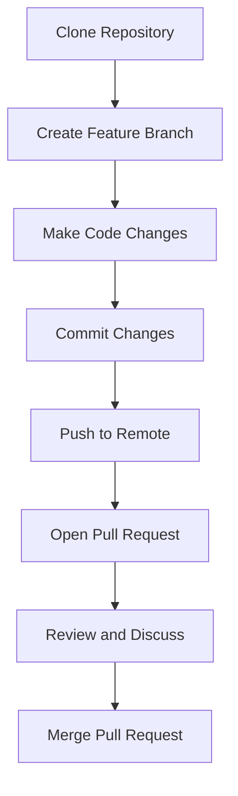

## 18.10 Code Reviews and Collaboration

In the world of software development, especially in PHP, code reviews and collaboration are pivotal to producing high-quality, maintainable, and efficient code. This section delves into the best practices, tools, and techniques that foster effective collaboration and code reviews within development teams.

### Code Review Practices

Code reviews are an integral part of the software development lifecycle. They serve as a quality assurance measure, ensuring that code adheres to the project's standards and is free from defects. Let's explore the key practices that make code reviews effective.

#### Peer Reviews

Peer reviews involve team members examining each other's code. This practice not only helps catch bugs early but also facilitates knowledge sharing among team members. Here are some tips for conducting successful peer reviews:

- **Set Clear Objectives:** Define what you aim to achieve with the review, such as improving code quality, ensuring adherence to coding standards, or learning new techniques.
- **Focus on Code, Not the Coder:** Keep feedback objective and constructive. The goal is to improve the code, not criticize the developer.
- **Use Checklists:** Develop a checklist of common issues to look for, such as code readability, adherence to coding standards, and potential performance bottlenecks.
- **Limit Review Size:** Smaller code changes are easier to review and less likely to introduce errors. Aim for reviews that can be completed in under an hour.

#### Code Review Tools

Utilizing tools can streamline the code review process. Here are some popular tools that integrate well with PHP development:

- **GitHub Pull Requests:** GitHub provides a robust platform for code reviews through pull requests. Developers can comment on specific lines of code, suggest changes, and approve or request changes.
- **GitLab Merge Requests:** Similar to GitHub, GitLab offers merge requests that facilitate code discussions and reviews.
- **Bitbucket:** Offers pull requests with inline comments, task lists, and approvals, making it a solid choice for teams using Atlassian tools.

### Version Control Systems

Version control systems (VCS) are essential for collaboration in software development. They allow multiple developers to work on the same codebase simultaneously without conflicts. Git is the most widely used VCS in the PHP community.

#### Using Git for Collaboration

Git is a distributed version control system that tracks changes in source code. Here are some best practices for using Git in collaborative environments:

- **Branching Strategy:** Adopt a branching strategy like Git Flow or GitHub Flow to manage feature development, bug fixes, and releases.
- **Commit Messages:** Write clear and descriptive commit messages. A good commit message explains the "what" and "why" of a change.
- **Pull Requests:** Use pull requests to propose changes, discuss them with team members, and merge them into the main codebase.
- **Conflict Resolution:** Learn how to resolve merge conflicts effectively. This often involves understanding the changes made by others and deciding how to integrate them with your own.

#### Platforms for Collaboration

Platforms like GitHub, GitLab, and Bitbucket provide additional features that enhance collaboration:

- **Issue Tracking:** Track bugs and feature requests directly within the platform.
- **Code Discussions:** Use comments and discussions to communicate with team members about specific code changes.
- **Project Management:** Integrate project management tools to keep track of tasks, milestones, and deadlines.

### Continuous Integration Tools

Continuous Integration (CI) is a practice where developers frequently integrate code into a shared repository. Each integration is verified by an automated build and tests, allowing teams to detect problems early.

#### Benefits of Continuous Integration

- **Automated Testing:** CI tools run automated tests on every code change, ensuring that new code does not break existing functionality.
- **Consistent Builds:** CI ensures that the codebase is always in a deployable state, reducing integration problems.
- **Faster Feedback:** Developers receive immediate feedback on their changes, allowing them to address issues quickly.

#### Popular CI Tools

- **Jenkins:** An open-source automation server that supports building, deploying, and automating any project.
- **Travis CI:** A hosted CI service that integrates with GitHub, providing a simple way to test and deploy code.
- **GitLab CI/CD:** Built into GitLab, it offers a comprehensive CI/CD solution with pipelines, environments, and monitoring.

### Team Communication

Effective communication is the backbone of successful collaboration. Establishing clear communication channels and coding standards can significantly enhance team productivity.

#### Establishing Coding Standards

Coding standards ensure consistency across the codebase, making it easier for developers to read and understand each other's code. Here are some tips for establishing coding standards:

- **Adopt a Style Guide:** Use a style guide like PSR-12 for PHP to ensure consistent formatting and naming conventions.
- **Automate Code Formatting:** Use tools like PHP-CS-Fixer or PHP_CodeSniffer to automatically format code according to the style guide.
- **Regularly Review Standards:** As the project evolves, review and update coding standards to reflect new practices and technologies.

#### Regular Design Discussions

Regular discussions about design decisions can prevent misunderstandings and ensure that everyone is on the same page. Consider the following practices:

- **Design Meetings:** Hold regular meetings to discuss architectural decisions, design patterns, and technical challenges.
- **Documentation:** Document design decisions and rationale to provide context for future developers.
- **Feedback Loops:** Encourage feedback from all team members, fostering a culture of continuous improvement.

### Code Example: Implementing a Pull Request Workflow

Let's look at a simple example of how a pull request workflow might look in a PHP project using GitHub.

```php
<?php
// Step 1: Clone the repository
// git clone https://github.com/yourusername/yourproject.git

// Step 2: Create a new branch for your feature
// git checkout -b feature/new-feature

// Step 3: Make changes to the code
function greet($name) {
    return "Hello, " . $name . "!";
}

// Step 4: Commit your changes
// git add .
// git commit -m "Add greet function"

// Step 5: Push your branch to GitHub
// git push origin feature/new-feature

// Step 6: Open a pull request on GitHub
// Navigate to your repository on GitHub and click "Compare & pull request"

// Step 7: Review and discuss the pull request
// Team members can comment on the pull request, suggest changes, and approve it

// Step 8: Merge the pull request
// Once approved, click "Merge pull request" to integrate the changes into the main branch
?>
```

### Visualizing the Pull Request Workflow



This diagram illustrates the typical flow of a pull request workflow, from cloning the repository to merging the pull request.

### Try It Yourself

Experiment with the pull request workflow by creating a simple PHP project on GitHub. Try adding a new feature, opening a pull request, and collaborating with a friend or colleague to review and merge the changes.

### Knowledge Check

- What are the benefits of conducting peer reviews?
- How does continuous integration improve code quality?
- Why is it important to establish coding standards?

### Embrace the Journey

Remember, effective collaboration and code reviews are not just about finding bugs. They are about learning from each other, sharing knowledge, and building a better product together. Keep experimenting, stay curious, and enjoy the journey!

## Quiz: Code Reviews and Collaboration



### What is the primary goal of code reviews?

- [x] To improve code quality and catch bugs early
- [ ] To criticize the developer's work
- [ ] To delay the development process
- [ ] To replace automated testing

> **Explanation:** The primary goal of code reviews is to improve code quality and catch bugs early, not to criticize developers or delay the process.

### Which tool is commonly used for version control in PHP projects?

- [x] Git
- [ ] SVN
- [ ] Mercurial
- [ ] CVS

> **Explanation:** Git is the most commonly used version control system in PHP projects, providing distributed version control and collaboration features.

### What is a benefit of using continuous integration?

- [x] Automated testing of code changes
- [ ] Manual code reviews
- [ ] Delayed feedback on code changes
- [ ] Increased code complexity

> **Explanation:** Continuous integration provides automated testing of code changes, ensuring that new code does not break existing functionality.

### What is a pull request?

- [x] A request to merge code changes into the main branch
- [ ] A request to delete a branch
- [ ] A request to create a new repository
- [ ] A request to clone a repository

> **Explanation:** A pull request is a request to merge code changes into the main branch, allowing for review and discussion before integration.

### Which of the following is a popular CI tool?

- [x] Jenkins
- [ ] GitHub
- [ ] Bitbucket
- [ ] PHPStorm

> **Explanation:** Jenkins is a popular CI tool used for building, deploying, and automating projects.

### What is the purpose of a branching strategy?

- [x] To manage feature development, bug fixes, and releases
- [ ] To increase the number of branches
- [ ] To reduce code quality
- [ ] To eliminate code reviews

> **Explanation:** A branching strategy helps manage feature development, bug fixes, and releases, ensuring a structured workflow.

### Why is it important to write clear commit messages?

- [x] To explain the "what" and "why" of a change
- [ ] To increase the size of the repository
- [ ] To confuse other developers
- [ ] To avoid using version control

> **Explanation:** Clear commit messages explain the "what" and "why" of a change, making it easier for others to understand the history of the project.

### What is the role of coding standards in a project?

- [x] To ensure consistency across the codebase
- [ ] To increase code complexity
- [ ] To reduce collaboration
- [ ] To eliminate the need for code reviews

> **Explanation:** Coding standards ensure consistency across the codebase, making it easier for developers to read and understand each other's code.

### How can design discussions benefit a development team?

- [x] By preventing misunderstandings and aligning team members
- [ ] By increasing the number of bugs
- [ ] By delaying project timelines
- [ ] By reducing code quality

> **Explanation:** Design discussions prevent misunderstandings and ensure that all team members are aligned on architectural decisions.

### True or False: Code reviews are only about finding bugs.

- [ ] True
- [x] False

> **Explanation:** Code reviews are not only about finding bugs; they also involve learning from each other, sharing knowledge, and improving the overall quality of the code.


