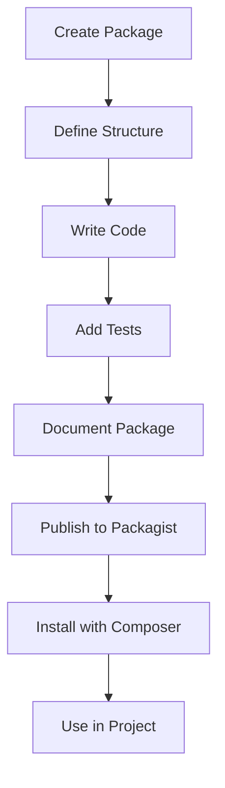

## 18.11 Building and Using PHP Packages

In the world of PHP development, building and using packages is a fundamental skill that can significantly enhance your productivity and code quality. Packages allow you to encapsulate functionality, promote code reuse, and share your work with the community. In this section, we will explore the intricacies of building and using PHP packages, focusing on package structure, autoloading, quality assurance, and dependency management.

### Understanding PHP Packages

Before diving into the technical aspects, let's clarify what a PHP package is. A PHP package is a collection of PHP files and resources that provide specific functionality. Packages are typically distributed via Composer, the de facto dependency manager for PHP, which allows developers to easily include and manage packages in their projects.

### Package Structure

A well-structured package is crucial for maintainability and ease of use. Let's break down the essential components of a PHP package:

#### 1. Follow PSR-4 for Autoloading

The PSR-4 standard defines a specification for autoloading classes from file paths. Following PSR-4 ensures that your package is compatible with Composer's autoloader and other PSR-4 compliant systems.

**Example Directory Structure:**

```
my-package/
├── src/
│   └── MyPackage/
│       └── ExampleClass.php
├── tests/
│   └── ExampleClassTest.php
├── composer.json
└── README.md
```

**Example `composer.json`:**

```json
{
    "name": "vendor/my-package",
    "description": "A sample PHP package",
    "autoload": {
        "psr-4": {
            "MyPackage\\": "src/"
        }
    },
    "require": {}
}
```

#### 2. Include Necessary Files and Resources

Ensure that your package includes all necessary files and resources, such as configuration files, assets, and documentation. A `README.md` file is essential for providing an overview of the package and usage instructions.

### Autoloading

Autoloading is a mechanism that automatically loads PHP classes when they are needed, without requiring manual `include` or `require` statements. Composer provides a powerful autoloader that supports PSR-4, making it easy to manage class loading in your package.

#### Leveraging Composer's Autoloader

To use Composer's autoloader, you need to define an autoload section in your `composer.json` file. This section specifies the autoloading strategy and the namespace-to-directory mapping.

**Example Autoload Configuration:**

```json
"autoload": {
    "psr-4": {
        "MyPackage\\": "src/"
    }
}
```

After defining the autoload configuration, run `composer dump-autoload` to generate the autoload files. This command creates an `autoload.php` file in the `vendor` directory, which you can include in your project to enable autoloading.

**Usage in a Project:**

```php
require 'vendor/autoload.php';

use MyPackage\ExampleClass;

$example = new ExampleClass();
$example->doSomething();
```

### Quality Assurance

Quality assurance is a critical aspect of package development. It ensures that your package is reliable, maintainable, and easy to use. Let's explore some key practices for quality assurance:

#### 1. Include Tests

Testing is essential for verifying the functionality of your package. Include unit tests and integration tests to cover different aspects of your package's functionality. Use PHPUnit, a popular testing framework for PHP, to write and run tests.

**Example Test Case:**

```php
use PHPUnit\Framework\TestCase;
use MyPackage\ExampleClass;

class ExampleClassTest extends TestCase
{
    public function testDoSomething()
    {
        $example = new ExampleClass();
        $this->assertTrue($example->doSomething());
    }
}
```

#### 2. Provide Documentation

Comprehensive documentation is vital for helping users understand how to use your package. Include a `README.md` file with installation instructions, usage examples, and API documentation. Consider using tools like PHPDocumentor to generate API documentation from your code comments.

#### 3. Include Examples

Provide example scripts or projects that demonstrate how to use your package. Examples help users quickly understand the package's capabilities and how to integrate it into their projects.

### Dependency Management

Managing dependencies is a crucial part of package development. Composer simplifies dependency management by allowing you to declare dependencies in your `composer.json` file.

#### Declare Dependencies Properly

Specify your package's dependencies in the `require` section of `composer.json`. Use semantic versioning to define version constraints, ensuring compatibility with other packages.

**Example Dependency Declaration:**

```json
"require": {
    "php": "^7.4 || ^8.0",
    "some/package": "^1.0"
}
```

#### Use Composer for Dependency Management

Composer handles the installation and management of dependencies, ensuring that the correct versions are used. Run `composer install` to install the dependencies specified in `composer.json`.

### Publishing Your Package

Once your package is ready, you can publish it to Packagist, the default package repository for Composer. Publishing your package makes it available to the PHP community, allowing others to benefit from your work.

#### Steps to Publish a Package:

1. **Create a Git Repository:** Host your package on a platform like GitHub or GitLab.
2. **Tag a Release:** Use Git tags to mark a release version.
3. **Submit to Packagist:** Create an account on Packagist and submit your package by providing the repository URL.

### Using PHP Packages

In addition to building packages, it's essential to know how to use them effectively in your projects. Composer makes it easy to include and manage packages.

#### Installing Packages with Composer

To install a package, use the `composer require` command followed by the package name. Composer will download the package and its dependencies, updating the `composer.json` and `composer.lock` files.

**Example Installation Command:**

```bash
composer require vendor/package-name
```

#### Managing Package Versions

Composer allows you to specify version constraints for packages, ensuring compatibility and stability. Use semantic versioning to define constraints in `composer.json`.

**Example Version Constraints:**

```json
"require": {
    "vendor/package-name": "^1.0"
}
```

#### Updating Packages

To update packages to their latest versions, use the `composer update` command. This command updates the `composer.lock` file and installs the latest compatible versions of the packages.

### Visualizing Package Structure and Workflow

To better understand the package structure and workflow, let's visualize the process using a Mermaid.js diagram.



**Diagram Description:** This flowchart illustrates the process of building and using a PHP package, from creating the package to using it in a project.

### Try It Yourself

Now that we've covered the essentials, it's time to try building your own PHP package. Start by creating a simple package that provides a utility function or class. Follow the steps outlined in this guide, and experiment with different features and configurations.

### Knowledge Check

To reinforce your understanding, let's pose a few questions:

- What is the purpose of the `composer.json` file in a PHP package?
- How does Composer's autoloader work with PSR-4?
- Why is it important to include tests and documentation in your package?

### Summary

In this section, we've explored the process of building and using PHP packages. We've covered package structure, autoloading, quality assurance, and dependency management. By following these best practices, you can create robust, reusable packages that enhance your PHP development projects.

### Embrace the Journey

Remember, building and using PHP packages is an ongoing journey. As you gain experience, you'll discover new techniques and best practices. Stay curious, keep experimenting, and enjoy the process of creating and sharing your work with the PHP community.

## Quiz: Building and Using PHP Packages



### What is the primary purpose of a PHP package?

- [x] To encapsulate functionality and promote code reuse
- [ ] To replace the need for a database
- [ ] To serve as a standalone application
- [ ] To provide a user interface

> **Explanation:** A PHP package encapsulates functionality, promoting code reuse and sharing within the community.

### Which standard should you follow for autoloading in PHP packages?

- [x] PSR-4
- [ ] PSR-1
- [ ] PSR-2
- [ ] PSR-3

> **Explanation:** PSR-4 is the standard for autoloading classes from file paths in PHP packages.

### What tool is commonly used for testing PHP packages?

- [x] PHPUnit
- [ ] Jasmine
- [ ] Mocha
- [ ] Jest

> **Explanation:** PHPUnit is a popular testing framework for PHP, used to write and run tests for packages.

### What command is used to install a package with Composer?

- [x] composer require
- [ ] composer install
- [ ] composer update
- [ ] composer remove

> **Explanation:** The `composer require` command is used to install a package and its dependencies.

### What is the role of the `composer.json` file?

- [x] To declare package dependencies and autoloading configuration
- [ ] To store database credentials
- [ ] To define user interface components
- [ ] To manage server configurations

> **Explanation:** The `composer.json` file declares package dependencies and autoloading configuration.

### How can you publish a PHP package to the community?

- [x] By submitting it to Packagist
- [ ] By uploading it to a personal server
- [ ] By sharing it on social media
- [ ] By emailing it to developers

> **Explanation:** Packagist is the default package repository for Composer, where PHP packages are published.

### What is the benefit of including tests in your package?

- [x] To verify functionality and ensure reliability
- [ ] To increase package size
- [ ] To make the package more complex
- [ ] To reduce development time

> **Explanation:** Including tests helps verify functionality and ensure the reliability of the package.

### What does the `composer update` command do?

- [x] Updates packages to their latest compatible versions
- [ ] Installs a new package
- [ ] Removes a package
- [ ] Downgrades package versions

> **Explanation:** The `composer update` command updates packages to their latest compatible versions.

### Why is documentation important for a PHP package?

- [x] To help users understand how to use the package
- [ ] To increase the package's file size
- [ ] To make the package more complex
- [ ] To reduce the need for testing

> **Explanation:** Documentation helps users understand how to use the package effectively.

### True or False: Composer can manage both package dependencies and autoloading.

- [x] True
- [ ] False

> **Explanation:** Composer manages both package dependencies and autoloading, simplifying PHP development.


