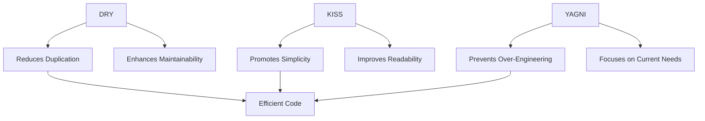

## 18.2 DRY, KISS, and YAGNI Principles

In the realm of software development, especially when working with PHP, adhering to certain principles can significantly enhance the quality, maintainability, and efficiency of your code. Among these principles, DRY (Don't Repeat Yourself), KISS (Keep It Simple, Stupid), and YAGNI (You Aren't Gonna Need It) stand out as fundamental guidelines that every developer should embrace. In this section, we will delve into each of these principles, exploring their significance, application, and impact on PHP development.

### Don't Repeat Yourself (DRY)

The DRY principle is a cornerstone of software development that emphasizes the importance of reducing repetition within code. The idea is simple: every piece of knowledge must have a single, unambiguous, authoritative representation within a system. By adhering to DRY, developers can avoid redundancy, which in turn reduces the risk of errors and simplifies maintenance.

#### Key Concepts of DRY

- **Code Duplication**: Identify and eliminate duplicate code by extracting common logic into reusable functions or classes.
- **Single Source of Truth**: Ensure that any piece of information or logic is defined only once and reused wherever necessary.
- **Modularity**: Encourage the use of modules or components that encapsulate specific functionality, making them easy to reuse and maintain.

#### Implementing DRY in PHP

Let's explore how to implement the DRY principle in PHP with a practical example.

```php
<?php

// Before applying DRY
function calculateRectangleArea($width, $height) {
    return $width * $height;
}

function calculateSquareArea($side) {
    return $side * $side;
}

// After applying DRY
function calculateArea($width, $height = null) {
    if ($height === null) {
        // If height is not provided, assume it's a square
        return $width * $width;
    }
    return $width * $height;
}

// Usage
echo calculateArea(5); // Square area
echo calculateArea(5, 10); // Rectangle area
?>
```

In this example, we initially had two separate functions for calculating the area of a rectangle and a square. By applying the DRY principle, we consolidated the logic into a single function, `calculateArea`, which handles both cases.

#### Benefits of DRY

- **Reduced Code Duplication**: Minimizes the amount of code that needs to be maintained.
- **Easier Maintenance**: Changes need to be made in only one place, reducing the likelihood of introducing bugs.
- **Improved Readability**: Code becomes more organized and easier to understand.

### Keep It Simple, Stupid (KISS)

The KISS principle advocates for simplicity in design and implementation. The idea is to avoid unnecessary complexity and keep code as straightforward as possible. This principle is particularly important in PHP development, where simplicity can lead to more efficient and maintainable code.

#### Key Concepts of KISS

- **Simplicity**: Strive for the simplest solution that works, avoiding over-engineering.
- **Clarity**: Write code that is easy to read and understand, even for someone unfamiliar with the project.
- **Avoiding Over-Optimization**: Focus on solving the problem at hand without adding unnecessary features or complexity.

#### Implementing KISS in PHP

Consider the following example, where we apply the KISS principle to simplify code.

```php
<?php

// Complex and over-engineered solution
function calculateDiscount($price, $discountType) {
    if ($discountType === 'percentage') {
        return $price * 0.9; // 10% discount
    } elseif ($discountType === 'fixed') {
        return $price - 10; // $10 discount
    } else {
        return $price;
    }
}

// Simplified solution using KISS
function applyPercentageDiscount($price, $percentage) {
    return $price * ((100 - $percentage) / 100);
}

// Usage
echo applyPercentageDiscount(100, 10); // 10% discount
?>
```

In the initial code, we had a function that handled multiple discount types, leading to unnecessary complexity. By focusing on a single type of discount and simplifying the logic, we adhere to the KISS principle.

#### Benefits of KISS

- **Easier Debugging**: Simple code is easier to debug and troubleshoot.
- **Faster Development**: Simplicity speeds up the development process.
- **Enhanced Readability**: Code is more accessible to other developers.

### You Aren't Gonna Need It (YAGNI)

The YAGNI principle advises against implementing features or functionality until they are actually needed. This principle helps prevent over-engineering and ensures that development efforts are focused on delivering value.

#### Key Concepts of YAGNI

- **Avoid Premature Optimization**: Do not add features based on assumptions about future needs.
- **Focus on Current Requirements**: Implement only what is necessary to meet the current requirements.
- **Iterative Development**: Embrace an iterative approach, adding features as they become necessary.

#### Implementing YAGNI in PHP

Let's see how the YAGNI principle can be applied in a PHP project.

```php
<?php

// Before applying YAGNI
class User {
    private $name;
    private $email;
    private $address; // Not needed yet

    public function __construct($name, $email) {
        $this->name = $name;
        $this->email = $email;
    }

    // Additional methods for address management
}

// After applying YAGNI
class User {
    private $name;
    private $email;

    public function __construct($name, $email) {
        $this->name = $name;
        $this->email = $email;
    }
}

// Usage
$user = new User('John Doe', 'john@example.com');
?>
```

In this example, we initially included an `address` property in the `User` class, even though it was not needed. By removing it, we adhere to the YAGNI principle, focusing only on the current requirements.

#### Benefits of YAGNI

- **Reduced Complexity**: Avoids unnecessary complexity by focusing on current needs.
- **Efficient Resource Use**: Saves time and resources by not implementing unused features.
- **Adaptability**: Makes it easier to adapt to changing requirements.

### Visualizing DRY, KISS, and YAGNI

To better understand how these principles interact and complement each other, let's visualize their relationship using a diagram.



**Diagram Description**: This diagram illustrates how the DRY, KISS, and YAGNI principles contribute to creating efficient, maintainable, and straightforward code. DRY reduces duplication, KISS promotes simplicity, and YAGNI prevents over-engineering, all leading to efficient code.

### Applying the Principles Together

While each principle has its own focus, they are most effective when applied together. Let's consider a scenario where we combine these principles in a PHP project.

#### Scenario: Building a User Management System

Imagine we are tasked with building a user management system. Here's how we can apply DRY, KISS, and YAGNI:

- **DRY**: Create reusable components for common tasks such as user authentication and validation.
- **KISS**: Keep the user interface and logic simple, avoiding unnecessary complexity in the design.
- **YAGNI**: Implement only the essential features needed for user management, such as registration and login, deferring advanced features like social media integration until they are required.

By applying these principles, we ensure that the system is efficient, maintainable, and adaptable to future changes.

### Knowledge Check

To reinforce your understanding of these principles, consider the following questions:

- How can the DRY principle help reduce bugs in your code?
- Why is it important to keep your code simple according to the KISS principle?
- How does the YAGNI principle prevent wasted development effort?

### Summary

In this section, we've explored the DRY, KISS, and YAGNI principles, understanding their significance in PHP development. By reducing duplication, promoting simplicity, and focusing on current needs, these principles help create efficient, maintainable, and adaptable code. Remember, the journey to mastering these principles is ongoing. Keep experimenting, stay curious, and enjoy the process of refining your PHP development skills.

## Quiz: DRY, KISS, and YAGNI Principles



### What does the DRY principle stand for?

- [x] Don't Repeat Yourself
- [ ] Don't Run Yourself
- [ ] Do Repeat Yourself
- [ ] Don't Reuse Yourself

> **Explanation:** DRY stands for "Don't Repeat Yourself," emphasizing the reduction of code duplication.

### Which principle advises against implementing features until they are necessary?

- [x] YAGNI
- [ ] DRY
- [ ] KISS
- [ ] SOLID

> **Explanation:** YAGNI stands for "You Aren't Gonna Need It," advising against implementing unnecessary features.

### What is the main focus of the KISS principle?

- [x] Simplicity
- [ ] Complexity
- [ ] Duplication
- [ ] Optimization

> **Explanation:** The KISS principle focuses on keeping code simple and straightforward.

### How does the DRY principle enhance maintainability?

- [x] By reducing code duplication
- [ ] By increasing code complexity
- [ ] By adding more features
- [ ] By optimizing performance

> **Explanation:** DRY enhances maintainability by reducing code duplication, making it easier to manage and update.

### What is a benefit of applying the YAGNI principle?

- [x] Reduced complexity
- [ ] Increased complexity
- [ ] More features
- [ ] Faster performance

> **Explanation:** YAGNI reduces complexity by focusing on current needs and avoiding unnecessary features.

### Which principle is associated with the phrase "Keep It Simple, Stupid"?

- [x] KISS
- [ ] DRY
- [ ] YAGNI
- [ ] SOLID

> **Explanation:** KISS stands for "Keep It Simple, Stupid," promoting simplicity in design and implementation.

### How can the KISS principle improve readability?

- [x] By simplifying code
- [ ] By adding more comments
- [ ] By using complex algorithms
- [ ] By increasing code length

> **Explanation:** KISS improves readability by simplifying code, making it easier to understand.

### What is the relationship between DRY and modularity?

- [x] DRY encourages modularity
- [ ] DRY discourages modularity
- [ ] DRY has no relation to modularity
- [ ] DRY complicates modularity

> **Explanation:** DRY encourages modularity by promoting reusable components and reducing duplication.

### How does YAGNI contribute to efficient resource use?

- [x] By avoiding unnecessary features
- [ ] By adding more features
- [ ] By optimizing existing features
- [ ] By increasing code complexity

> **Explanation:** YAGNI contributes to efficient resource use by avoiding the implementation of unnecessary features.

### True or False: The DRY, KISS, and YAGNI principles are only applicable to PHP development.

- [ ] True
- [x] False

> **Explanation:** These principles are applicable to all areas of software development, not just PHP.



Remember, mastering these principles is a continuous journey. As you progress, you'll find that applying DRY, KISS, and YAGNI will lead to more robust and maintainable PHP applications. Keep experimenting, stay curious, and enjoy the journey!
