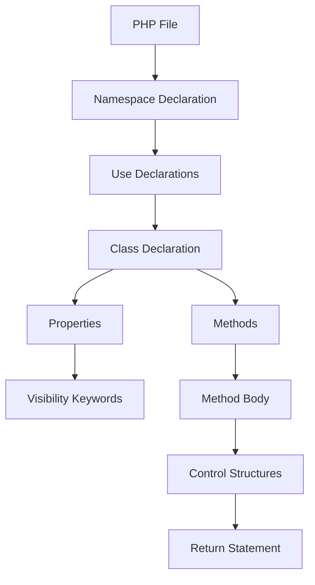

## 18.3 Coding Standards and PSR-12

In the world of PHP development, maintaining a consistent coding style is crucial for collaboration, readability, and maintainability. The PHP community has established a set of standards known as PHP Standard Recommendations (PSRs) to guide developers in writing clean and consistent code. Among these, PSR-12 is a widely adopted coding style guide that builds upon the foundational PSR-1, providing detailed guidelines on code formatting, naming conventions, and more.

### PHP Standard Recommendations (PSRs)

PHP Standard Recommendations, or PSRs, are a series of standards published by the PHP Framework Interoperability Group (PHP-FIG). These standards aim to promote uniformity and interoperability among PHP projects. PSRs cover a wide range of topics, from basic coding standards to complex architectural patterns.

- **PSR-1: Basic Coding Standard**: Establishes basic coding standards such as file formatting, naming conventions, and class declaration.
- **PSR-12: Extended Coding Style Guide**: Extends PSR-1 by providing more detailed guidelines on code formatting, including indentation, line length, and more.

### PSR-12 Coding Style

PSR-12 is an extension of PSR-1 and provides a comprehensive guide for coding style in PHP. It covers various aspects of code formatting and style, ensuring that PHP code is consistent and easy to read.

#### Key Aspects of PSR-12

1. **Indentation and Spacing**: 
   - Use 4 spaces for indentation, not tabs.
   - Ensure consistent spacing around operators and after commas.

2. **Line Length**:
   - Limit lines to 120 characters; however, 80 characters is preferred for better readability.

3. **Naming Conventions**:
   - Use camelCase for method names and variables.
   - Use PascalCase for class names.
   - Constants should be in uppercase with underscores.

4. **Control Structures**:
   - Use one space after control structure keywords (e.g., `if`, `for`, `while`).
   - Opening braces should be on the same line as the control structure.

5. **Namespace and Use Declarations**:
   - Declare namespaces at the top of the file.
   - Group `use` declarations together and sort them alphabetically.

6. **Class and Method Declaration**:
   - Declare one class per file.
   - Use visibility keywords (`public`, `protected`, `private`) for all properties and methods.

7. **Comments and Documentation**:
   - Use PHPDoc for documenting classes, methods, and functions.
   - Ensure comments are clear and concise.

8. **File Structure**:
   - Use UTF-8 without BOM for PHP files.
   - End files with a single newline character.

#### Code Example

Here is a simple example demonstrating PSR-12 coding style:

```php
<?php

namespace App\Service;

use App\Repository\UserRepository;

class UserService
{
    private UserRepository $userRepository;

    public function __construct(UserRepository $userRepository)
    {
        $this->userRepository = $userRepository;
    }

    public function getUserById(int $id): ?User
    {
        return $this->userRepository->find($id);
    }
}
```

### Enforcing Standards

To ensure that your code adheres to PSR-12, you can use tools like **PHP_CodeSniffer**. This tool analyzes your PHP code and detects violations of the defined coding standards.

- **PHP_CodeSniffer**: A popular tool for checking PHP code against a set of coding standards. It can be integrated into your development workflow to automatically check code for compliance.

#### Installing PHP_CodeSniffer

You can install PHP_CodeSniffer globally using Composer:

```bash
composer global require "squizlabs/php_codesniffer=*"
```

#### Running PHP_CodeSniffer

To check your code against PSR-12, run the following command:

```bash
phpcs --standard=PSR12 /path/to/your/code
```

### Visualizing PSR-12 Compliance

To better understand how PSR-12 affects your code structure, consider the following diagram illustrating the flow of a typical PHP file adhering to PSR-12:



**Diagram Description**: This flowchart represents the structure of a PHP file following PSR-12. It starts with the namespace declaration, followed by use declarations, class declaration, properties with visibility keywords, and methods containing control structures and return statements.

### Knowledge Check

To reinforce your understanding of PSR-12, consider the following questions:

- What is the recommended line length in PSR-12?
- How should namespaces be declared in a PHP file?
- What tool can be used to enforce PSR-12 compliance?

### Try It Yourself

Experiment with the code example provided by modifying the class or method names to see how it affects readability and compliance with PSR-12. Try running PHP_CodeSniffer on your modified code to check for any violations.

### References and Links

- [PSR-12: Extended Coding Style Guide](https://www.php-fig.org/psr/psr-12/)
- [PHP_CodeSniffer](https://github.com/squizlabs/PHP_CodeSniffer)

### Embrace the Journey

Remember, adopting coding standards like PSR-12 is a step towards writing cleaner, more maintainable code. As you continue to develop your PHP skills, keep experimenting with different coding styles and tools to find what works best for you and your team. Stay curious, and enjoy the journey of becoming a better PHP developer!

## Quiz: Coding Standards and PSR-12



### What is the primary purpose of PSR-12?

- [x] To provide a comprehensive coding style guide for PHP
- [ ] To define PHP language syntax
- [ ] To replace PSR-1
- [ ] To enforce security standards

> **Explanation:** PSR-12 extends PSR-1 by providing detailed guidelines on coding style, ensuring consistency and readability in PHP code.

### Which tool is commonly used to enforce PSR-12 compliance?

- [x] PHP_CodeSniffer
- [ ] PHPUnit
- [ ] Composer
- [ ] PHPStan

> **Explanation:** PHP_CodeSniffer is a tool that checks PHP code against a set of coding standards, including PSR-12.

### What is the recommended indentation style in PSR-12?

- [x] 4 spaces
- [ ] 2 spaces
- [ ] Tabs
- [ ] 8 spaces

> **Explanation:** PSR-12 recommends using 4 spaces for indentation to ensure consistency across different environments.

### How should class names be formatted according to PSR-12?

- [x] PascalCase
- [ ] camelCase
- [ ] snake_case
- [ ] kebab-case

> **Explanation:** PSR-12 specifies that class names should be in PascalCase for consistency and readability.

### What is the maximum recommended line length in PSR-12?

- [x] 120 characters
- [ ] 80 characters
- [ ] 100 characters
- [ ] 150 characters

> **Explanation:** PSR-12 recommends a maximum line length of 120 characters, with 80 characters being preferred for better readability.

### How should constants be named according to PSR-12?

- [x] Uppercase with underscores
- [ ] camelCase
- [ ] PascalCase
- [ ] lowercase

> **Explanation:** Constants should be named in uppercase with underscores to distinguish them from variables and methods.

### What is the recommended way to declare namespaces in a PHP file?

- [x] At the top of the file
- [ ] At the bottom of the file
- [ ] Inside a class
- [ ] Inside a function

> **Explanation:** PSR-12 specifies that namespaces should be declared at the top of the file to clearly define the scope of the code.

### Which of the following is NOT a focus of PSR-12?

- [x] Security practices
- [ ] Indentation and spacing
- [ ] Naming conventions
- [ ] Line length

> **Explanation:** PSR-12 focuses on coding style and formatting, not security practices.

### What is the purpose of PHPDoc in PSR-12?

- [x] To document classes, methods, and functions
- [ ] To enforce coding standards
- [ ] To define namespaces
- [ ] To manage dependencies

> **Explanation:** PHPDoc is used to document code elements, providing information about their purpose and usage.

### True or False: PSR-12 allows the use of tabs for indentation.

- [ ] True
- [x] False

> **Explanation:** PSR-12 specifies the use of 4 spaces for indentation, not tabs, to ensure consistency across different environments.


