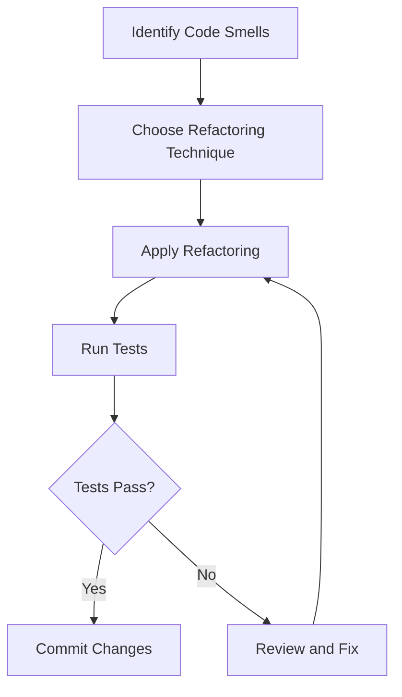

## 18.4 Refactoring Techniques

Refactoring is a critical process in software development that involves restructuring existing code without altering its external behavior. This practice is essential for maintaining code quality, enhancing readability, and ensuring long-term maintainability. In this section, we will delve into various refactoring techniques, best practices, and tools that can aid PHP developers in improving their codebases.

### Understanding Refactoring

Refactoring is the process of improving the internal structure of code while preserving its functionality. It is a disciplined technique for restructuring an existing body of code, altering its internal structure without changing its external behavior. The primary goal of refactoring is to make the code more understandable and easier to modify.

#### Key Concepts

- **Code Smells**: Indicators of potential problems in the code that may require refactoring. Examples include duplicated code, long methods, and large classes.
- **Technical Debt**: The implied cost of additional rework caused by choosing an easy solution now instead of using a better approach that would take longer.
- **Continuous Refactoring**: The practice of refactoring code regularly as part of the development process to prevent the accumulation of technical debt.

### Common Refactoring Techniques

Refactoring techniques are specific methods used to improve the structure of code. Here are some of the most common techniques:

#### 1. Extract Method

Extracting a method involves taking a piece of code and moving it into a new method. This technique is useful for breaking down large methods into smaller, more manageable ones.

```php
class OrderProcessor {
    public function processOrder($order) {
        // Validate order
        if (!$this->validateOrder($order)) {
            throw new Exception("Invalid order");
        }

        // Calculate total
        $total = $this->calculateTotal($order);

        // Process payment
        $this->processPayment($order, $total);
    }

    private function validateOrder($order) {
        // Validation logic
        return true;
    }

    private function calculateTotal($order) {
        // Calculation logic
        return 100;
    }

    private function processPayment($order, $total) {
        // Payment processing logic
    }
}
```

#### 2. Rename Variable

Renaming variables to more descriptive names can significantly enhance code readability and maintainability.

```php
// Before
$fn = "John";
$ln = "Doe";

// After
$firstName = "John";
$lastName = "Doe";
```

#### 3. Move Method

Moving a method involves relocating a method from one class to another where it is more relevant. This helps in organizing code better and adhering to the Single Responsibility Principle.

```php
class Customer {
    private $address;

    public function getAddress() {
        return $this->address;
    }
}

class Order {
    private $customer;

    public function getCustomerAddress() {
        return $this->customer->getAddress();
    }
}
```

#### 4. Replace Temp with Query

This technique involves replacing temporary variables with method calls to improve code clarity and reduce redundancy.

```php
class Product {
    private $price;
    private $taxRate;

    public function getPriceWithTax() {
        return $this->price * (1 + $this->taxRate);
    }
}
```

### Refactoring Tools

Several tools can assist in the refactoring process, providing automated support for common refactoring techniques:

- **PHPStorm**: A popular IDE that offers a wide range of automated refactoring tools, including method extraction, variable renaming, and more.
- **NetBeans**: Another IDE that provides refactoring support for PHP developers.
- **Eclipse PDT**: Offers basic refactoring capabilities for PHP projects.

### Best Practices for Refactoring

Refactoring should be approached with care and discipline. Here are some best practices to follow:

- **Refactor in Small Steps**: Make incremental changes to the codebase to minimize the risk of introducing errors.
- **Ensure Tests Pass**: Always run tests after refactoring to verify that the code's functionality remains intact.
- **Use Version Control**: Keep track of changes using a version control system like Git to easily revert if necessary.
- **Prioritize Code Smells**: Focus on refactoring areas of the code that exhibit code smells or are difficult to understand.

### Visualizing the Refactoring Process

To better understand the refactoring process, let's visualize the steps involved using a flowchart:



**Figure 1**: The Refactoring Process Flowchart

### Try It Yourself

To get hands-on experience with refactoring, try the following exercise:

1. Identify a piece of code in your project that could benefit from refactoring.
2. Choose an appropriate refactoring technique (e.g., Extract Method, Rename Variable).
3. Apply the refactoring technique and run your tests to ensure functionality remains unchanged.
4. Experiment with different refactoring techniques to see how they improve code readability and maintainability.

### Knowledge Check

Before we conclude, let's reinforce what we've learned with a few questions:

- What is the primary goal of refactoring?
- Name two common refactoring techniques.
- Why is it important to run tests after refactoring?

### Embrace the Journey

Refactoring is an ongoing journey that requires patience and practice. Remember, the goal is to make your codebase more robust, readable, and maintainable. Keep experimenting with different techniques, stay curious, and enjoy the process of continuous improvement.

### References and Further Reading

- [Martin Fowler's Refactoring](https://martinfowler.com/books/refactoring.html)
- [PHPStorm Refactoring Tools](https://www.jetbrains.com/phpstorm/features/refactoring.html)
- [Refactoring Guru](https://refactoring.guru/)

## Quiz: Refactoring Techniques



### What is the primary goal of refactoring?

- [x] To improve the internal structure of code without changing its external behavior
- [ ] To add new features to the codebase
- [ ] To fix bugs in the code
- [ ] To optimize code for performance

> **Explanation:** Refactoring focuses on improving the internal structure of code while preserving its functionality.

### Which of the following is a common refactoring technique?

- [x] Extract Method
- [ ] Add Feature
- [ ] Debug Code
- [ ] Optimize Performance

> **Explanation:** Extract Method is a technique used to break down large methods into smaller, more manageable ones.

### Why is it important to run tests after refactoring?

- [x] To ensure that the code's functionality remains unchanged
- [ ] To check for syntax errors
- [ ] To improve code performance
- [ ] To add new features

> **Explanation:** Running tests after refactoring verifies that the code still behaves as expected.

### What is a code smell?

- [x] An indicator of potential problems in the code
- [ ] A new feature request
- [ ] A performance optimization
- [ ] A syntax error

> **Explanation:** Code smells are signs of potential issues in the code that may require refactoring.

### Which tool is commonly used for automated refactoring in PHP?

- [x] PHPStorm
- [ ] Notepad
- [ ] Microsoft Word
- [ ] Excel

> **Explanation:** PHPStorm is a popular IDE that offers automated refactoring tools for PHP developers.

### What does the "Move Method" refactoring technique involve?

- [x] Relocating a method from one class to another where it is more relevant
- [ ] Adding a new method to a class
- [ ] Removing a method from a class
- [ ] Renaming a method

> **Explanation:** Move Method involves relocating a method to a class where it is more appropriate.

### What is technical debt?

- [x] The implied cost of additional rework caused by choosing an easy solution now instead of a better approach
- [ ] A financial debt incurred by the development team
- [ ] A new feature request
- [ ] A syntax error

> **Explanation:** Technical debt refers to the future cost of rework due to quick and easy solutions taken in the present.

### What is the benefit of renaming variables during refactoring?

- [x] It enhances code readability and maintainability
- [ ] It improves code performance
- [ ] It adds new features to the code
- [ ] It fixes bugs in the code

> **Explanation:** Renaming variables to more descriptive names makes the code easier to read and maintain.

### What is continuous refactoring?

- [x] The practice of refactoring code regularly as part of the development process
- [ ] Refactoring code once a year
- [ ] Refactoring code only when bugs are found
- [ ] Refactoring code only when new features are added

> **Explanation:** Continuous refactoring involves regularly improving the codebase to prevent technical debt.

### True or False: Refactoring should be done in large steps to maximize efficiency.

- [ ] True
- [x] False

> **Explanation:** Refactoring should be done in small steps to minimize the risk of introducing errors.



Remember, refactoring is a journey, not a destination. Keep refining your skills, and you'll find that your code becomes more elegant and maintainable over time. Happy coding!
