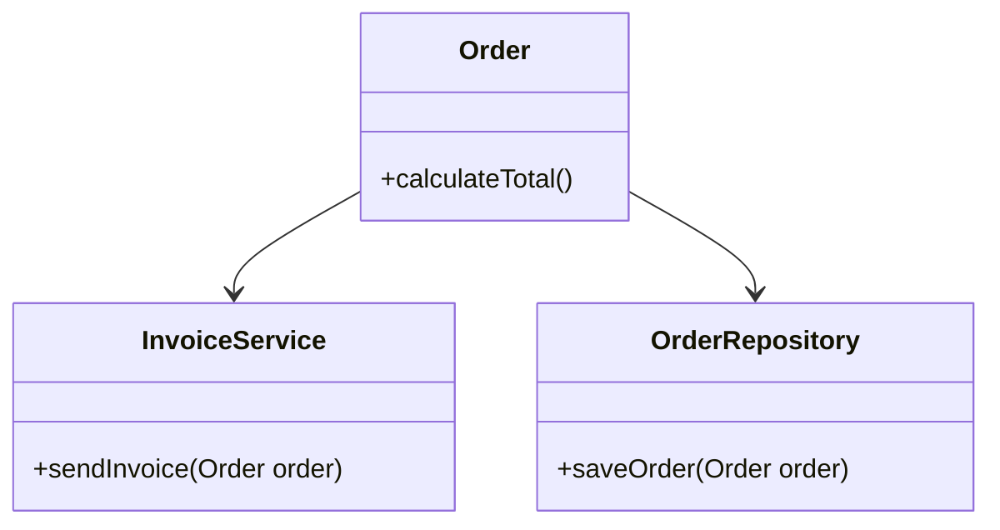

## 18.5 Clean Code Practices

In the world of software development, writing clean code is not just a best practice; it's a necessity. Clean code is easy to read, understand, and maintain. It reduces the likelihood of bugs and makes collaboration with other developers more efficient. In this section, we will explore clean code practices specifically tailored for PHP development, focusing on readability, organization, and avoiding code smells.

### Readability

Readability is the cornerstone of clean code. Code that is easy to read is easier to understand, debug, and maintain. Here are some key practices to enhance readability in PHP:

#### Use Descriptive Variable and Method Names

Descriptive names act as documentation for your code. They should convey the purpose of the variable or method clearly.

```php
// Bad Example
function calc($a, $b) {
    return $a + $b;
}

// Good Example
function calculateSum($firstNumber, $secondNumber) {
    return $firstNumber + $secondNumber;
}
```

In the good example, `calculateSum` clearly indicates what the function does, and the parameter names `firstNumber` and `secondNumber` describe their roles in the operation.

#### Write Comments Where Necessary

While code should be self-explanatory, comments are invaluable for explaining complex logic or decisions that are not immediately obvious.

```php
// Calculate the sum of two numbers
function calculateSum($firstNumber, $secondNumber) {
    // Adding the two numbers
    return $firstNumber + $secondNumber;
}
```

**Tip:** Avoid obvious comments that do not add value. Instead, focus on explaining the "why" rather than the "what."

#### Maintain Consistent Formatting

Consistent formatting helps in understanding the structure of the code at a glance. Use a consistent style for indentation, braces, and spacing.

```php
// Consistent formatting example
if ($condition) {
    doSomething();
} else {
    doSomethingElse();
}
```

#### Use PHPDoc for Documentation

PHPDoc is a powerful tool for documenting your code. It helps in generating API documentation and provides hints for IDEs.

```php
/**
 * Calculate the sum of two numbers.
 *
 * @param int $firstNumber
 * @param int $secondNumber
 * @return int
 */
function calculateSum($firstNumber, $secondNumber) {
    return $firstNumber + $secondNumber;
}
```

### Organization

Organizing your code logically makes it easier to navigate and understand. Here are some practices to achieve better organization:

#### Keep Classes and Methods Focused

Each class and method should have a single responsibility. This makes them easier to test and maintain.

```php
// Bad Example
class User {
    public function save() {
        // Save user to database
    }

    public function sendEmail() {
        // Send email to user
    }
}

// Good Example
class User {
    public function save() {
        // Save user to database
    }
}

class EmailService {
    public function sendEmail(User $user) {
        // Send email to user
    }
}
```

In the good example, responsibilities are separated into different classes, adhering to the Single Responsibility Principle.

#### Organize Code Logically

Group related functions and classes together. Use namespaces to avoid name collisions and to logically group related code.

```php
namespace App\Services;

class EmailService {
    // Email service logic
}
```

#### Use Design Patterns

Design patterns provide proven solutions to common problems. They help in organizing code and making it more reusable.

**Example:** Use the Factory Pattern to create objects without exposing the instantiation logic.

```php
interface Shape {
    public function draw();
}

class Circle implements Shape {
    public function draw() {
        echo "Drawing Circle";
    }
}

class ShapeFactory {
    public function createShape($type) {
        if ($type === 'circle') {
            return new Circle();
        }
        // Add more shapes as needed
    }
}
```

### Avoiding Code Smells

Code smells are indicators of potential problems in your code. Recognizing and eliminating them is crucial for maintaining clean code.

#### Recognize and Eliminate Poor Coding Practices

Here are some common code smells and how to address them:

- **Duplicated Code:** Refactor duplicated code into a single method or class.
- **Long Methods:** Break long methods into smaller, more manageable ones.
- **Large Classes:** Split large classes into smaller ones, each with a single responsibility.
- **Inconsistent Naming:** Use consistent naming conventions throughout your codebase.

#### Example of Refactoring to Eliminate Code Smells

Let's refactor a piece of code to eliminate code smells:

```php
// Before Refactoring
class Order {
    public function calculateTotal() {
        // Complex logic to calculate total
    }

    public function sendInvoice() {
        // Logic to send invoice
    }

    public function saveOrder() {
        // Logic to save order
    }
}

// After Refactoring
class Order {
    public function calculateTotal() {
        // Complex logic to calculate total
    }
}

class InvoiceService {
    public function sendInvoice(Order $order) {
        // Logic to send invoice
    }
}

class OrderRepository {
    public function saveOrder(Order $order) {
        // Logic to save order
    }
}
```

In the refactored example, responsibilities are separated into different classes, making the code more modular and easier to maintain.

### Resource

For a deeper dive into clean code practices, consider reading **Clean Code: A Handbook of Agile Software Craftsmanship** by Robert C. Martin. This book provides comprehensive insights into writing clean, maintainable code.

### Visualizing Clean Code Practices

To better understand the organization of clean code, let's visualize the separation of concerns using a class diagram:



**Diagram Description:** This class diagram illustrates the separation of concerns in the refactored example. The `Order` class is responsible for calculating totals, while `InvoiceService` handles sending invoices, and `OrderRepository` manages order persistence.

### Try It Yourself

Experiment with the code examples provided. Try refactoring a piece of your own code to improve readability, organization, or to eliminate code smells. Consider using PHP tools like PHPStan or Psalm to analyze your code for potential issues.

### Knowledge Check

- What are some benefits of using descriptive variable and method names?
- How can PHPDoc improve your codebase?
- What is the Single Responsibility Principle, and why is it important?
- Identify a code smell in your current project and refactor it.

### Embrace the Journey

Remember, writing clean code is a continuous journey. As you practice these principles, you'll find your code becoming more robust and maintainable. Keep experimenting, stay curious, and enjoy the process of crafting clean, efficient PHP code.

## Quiz: Clean Code Practices



### What is the primary benefit of using descriptive variable and method names?

- [x] They make the code more readable and understandable.
- [ ] They improve the performance of the code.
- [ ] They reduce the file size of the code.
- [ ] They make the code run faster.

> **Explanation:** Descriptive names help convey the purpose of variables and methods, making the code more readable and understandable.

### Why should comments focus on explaining the "why" rather than the "what"?

- [x] Because the code should be self-explanatory for the "what".
- [ ] Because comments are not necessary for the "what".
- [ ] Because the "what" is less important than the "why".
- [ ] Because comments should be as short as possible.

> **Explanation:** The code itself should be clear about what it does, while comments should provide context or reasoning that is not immediately obvious.

### What is the Single Responsibility Principle?

- [x] A class should have only one reason to change.
- [ ] A class should handle multiple responsibilities.
- [ ] A class should be as large as possible.
- [ ] A class should have multiple methods.

> **Explanation:** The Single Responsibility Principle states that a class should have only one reason to change, meaning it should have only one job or responsibility.

### How can PHPDoc benefit your codebase?

- [x] By providing documentation and hints for IDEs.
- [ ] By making the code run faster.
- [ ] By reducing the size of the code.
- [ ] By improving the security of the code.

> **Explanation:** PHPDoc helps in generating documentation and provides hints for IDEs, improving code readability and maintainability.

### What is a code smell?

- [x] An indicator of potential problems in the code.
- [ ] A feature that improves code performance.
- [ ] A method for optimizing code.
- [ ] A tool for debugging code.

> **Explanation:** A code smell is an indicator of potential problems in the code, suggesting that it may need refactoring.

### Which of the following is a common code smell?

- [x] Duplicated code
- [ ] Consistent naming
- [ ] Short methods
- [ ] Small classes

> **Explanation:** Duplicated code is a common code smell that can lead to maintenance challenges and should be refactored.

### What is the purpose of using namespaces in PHP?

- [x] To avoid name collisions and logically group related code.
- [ ] To make the code run faster.
- [ ] To reduce the size of the code.
- [ ] To improve code security.

> **Explanation:** Namespaces help avoid name collisions and logically group related code, improving organization and maintainability.

### How can design patterns help in organizing code?

- [x] By providing proven solutions to common problems.
- [ ] By making the code run faster.
- [ ] By reducing the size of the code.
- [ ] By improving code security.

> **Explanation:** Design patterns provide proven solutions to common problems, helping in organizing code and making it more reusable.

### What is the benefit of breaking long methods into smaller ones?

- [x] It makes the code more manageable and easier to test.
- [ ] It makes the code run faster.
- [ ] It reduces the file size of the code.
- [ ] It improves code security.

> **Explanation:** Breaking long methods into smaller ones makes the code more manageable and easier to test, improving maintainability.

### True or False: Clean code practices are only important for large projects.

- [x] False
- [ ] True

> **Explanation:** Clean code practices are important for projects of all sizes, as they improve readability, maintainability, and reduce the likelihood of bugs.


