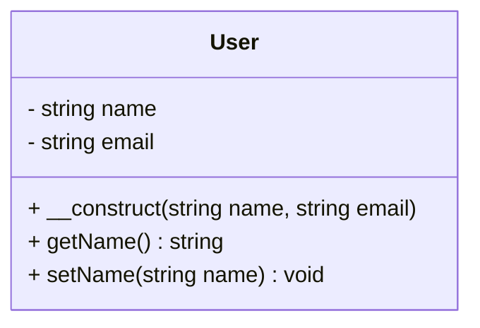

## 18.6 Documentation and Commenting

In the realm of software development, documentation and commenting are crucial for creating code that is not only functional but also maintainable and understandable. This section delves into the best practices for documenting and commenting in PHP, focusing on tools and techniques that enhance code quality and facilitate collaboration among developers.

### Importance of Documentation

Documentation serves as the backbone of any software project, providing a roadmap for developers to understand, maintain, and extend the codebase. Here are some key reasons why documentation is indispensable:

- **Facilitates Understanding:** Well-documented code is easier to read and understand, especially for new team members or contributors.
- **Enhances Maintainability:** Documentation helps in maintaining the code by providing insights into the design decisions and logic behind the implementation.
- **Improves Collaboration:** Clear documentation fosters better communication among team members, reducing misunderstandings and errors.
- **Supports Knowledge Transfer:** Documentation acts as a knowledge repository, ensuring that critical information is not lost when team members leave or change roles.

### DocBlocks: The Foundation of PHP Documentation

DocBlocks are a standardized way of documenting PHP code using PHPDoc comments. They provide structured information about the code, such as descriptions, parameters, return types, and more. Here's how to effectively use DocBlocks in PHP:

#### PHPDoc Comments

PHPDoc comments are special comments that begin with `/**` and end with `*/`. They are placed immediately before the code element they describe, such as classes, methods, or properties.

```php
<?php

/**
 * Class User
 *
 * Represents a user in the system.
 */
class User
{
    /**
     * @var string The user's name.
     */
    private $name;

    /**
     * @var string The user's email address.
     */
    private $email;

    /**
     * Constructor for the User class.
     *
     * @param string $name  The name of the user.
     * @param string $email The email address of the user.
     */
    public function __construct(string $name, string $email)
    {
        $this->name = $name;
        $this->email = $email;
    }

    /**
     * Get the user's name.
     *
     * @return string The name of the user.
     */
    public function getName(): string
    {
        return $this->name;
    }

    /**
     * Set the user's name.
     *
     * @param string $name The new name of the user.
     */
    public function setName(string $name): void
    {
        $this->name = $name;
    }
}
```

**Key Elements of PHPDoc Comments:**

- **Description:** A brief explanation of the class, method, or property.
- **Annotations:** Special tags like `@var`, `@param`, `@return`, etc., that provide additional information about the code.

For more details on PHPDoc standards, visit the [PHPDoc Standard](https://docs.phpdoc.org/).

### Automated Documentation

Automated documentation tools can generate comprehensive documentation from your PHPDoc comments, saving time and ensuring consistency. One of the most popular tools for this purpose is **phpDocumentor**.

#### phpDocumentor

phpDocumentor is a powerful tool that parses PHPDoc comments and generates documentation in various formats, such as HTML, PDF, and more. It supports a wide range of features, including:

- **Code Parsing:** Analyzes your codebase to extract PHPDoc comments.
- **Template Support:** Allows customization of the generated documentation's appearance.
- **Command-Line Interface:** Provides a CLI for easy integration into build processes.

To get started with phpDocumentor, visit the [phpDocumentor website](https://phpdoc.org/).

### Commenting Best Practices

While documentation provides a high-level overview, comments offer insights into specific code segments. Here are some best practices for effective commenting:

#### Explain Why, Not Just What

Comments should provide context and reasoning behind the code, not just describe what the code does. This helps future developers understand the purpose and intent of the code.

```php
// Calculate the discount based on user loyalty.
// This logic is crucial for retaining long-term customers.
$discount = $this->calculateLoyaltyDiscount($user);
```

#### Keep Comments Up to Date

As code evolves, comments should be updated to reflect changes. Outdated comments can be misleading and cause confusion.

#### Avoid Redundant Comments

Comments should add value and not state the obvious. Avoid comments that simply restate the code.

```php
// Increment the counter by one.
$counter++; // This comment is redundant.
```

### Visualizing Documentation and Commenting

To better understand the flow and structure of documentation and commenting, let's visualize the process using a class diagram.



**Diagram Description:** This class diagram represents the `User` class, highlighting its properties and methods. It serves as a visual aid to understand the class structure and the relationships between its components.

### References and Links

- [PHPDoc Standard](https://docs.phpdoc.org/)
- [phpDocumentor](https://phpdoc.org/)
- [PHP: The Right Way](https://phptherightway.com/)

### Knowledge Check

To reinforce your understanding of documentation and commenting in PHP, consider the following questions:

1. What is the primary purpose of using PHPDoc comments?
2. How can automated documentation tools benefit a development team?
3. Why is it important to explain the "why" in comments?
4. What are some common pitfalls to avoid when commenting code?

### Embrace the Journey

Remember, documentation and commenting are ongoing processes that evolve with your code. As you continue to develop your skills, you'll find that clear and concise documentation not only benefits your team but also enhances your own understanding of the code. Keep experimenting, stay curious, and enjoy the journey!

### Quiz: Documentation and Commenting



### What is the primary purpose of using PHPDoc comments?

- [x] To provide structured information about code elements
- [ ] To replace inline comments
- [ ] To generate code automatically
- [ ] To store data in a database

> **Explanation:** PHPDoc comments provide structured information about code elements, such as classes, methods, and properties, which aids in documentation and understanding.

### How can automated documentation tools benefit a development team?

- [x] By generating consistent and comprehensive documentation
- [ ] By writing code for the team
- [ ] By replacing the need for comments
- [ ] By managing version control

> **Explanation:** Automated documentation tools generate consistent and comprehensive documentation from PHPDoc comments, saving time and ensuring accuracy.

### Why is it important to explain the "why" in comments?

- [x] To provide context and reasoning behind the code
- [ ] To describe the syntax of the code
- [ ] To increase the length of the code
- [ ] To make the code more complex

> **Explanation:** Explaining the "why" in comments provides context and reasoning, helping future developers understand the purpose and intent of the code.

### What are some common pitfalls to avoid when commenting code?

- [x] Redundant comments and outdated comments
- [ ] Using PHPDoc comments
- [ ] Explaining complex logic
- [ ] Keeping comments concise

> **Explanation:** Common pitfalls include redundant comments that restate the obvious and outdated comments that no longer reflect the code.

### Which tool is commonly used for generating PHP documentation?

- [x] phpDocumentor
- [ ] Git
- [ ] Composer
- [ ] PHPUnit

> **Explanation:** phpDocumentor is a popular tool for generating PHP documentation from PHPDoc comments.

### What should be included in a PHPDoc comment for a method?

- [x] Description, parameters, and return type
- [ ] Only the method name
- [ ] The entire code of the method
- [ ] The method's execution time

> **Explanation:** A PHPDoc comment for a method should include a description, parameters, and return type to provide comprehensive information.

### How can outdated comments affect a codebase?

- [x] They can be misleading and cause confusion
- [ ] They improve code readability
- [ ] They enhance code performance
- [ ] They reduce the need for documentation

> **Explanation:** Outdated comments can be misleading and cause confusion, as they may no longer accurately describe the code.

### What is the benefit of using a class diagram in documentation?

- [x] It provides a visual representation of class structure
- [ ] It replaces the need for comments
- [ ] It generates code automatically
- [ ] It stores data in a database

> **Explanation:** A class diagram provides a visual representation of class structure, helping developers understand relationships between components.

### True or False: Comments should only describe what the code does.

- [ ] True
- [x] False

> **Explanation:** Comments should not only describe what the code does but also explain why it does it, providing context and reasoning.

### Which of the following is a best practice for commenting code?

- [x] Keeping comments up to date with code changes
- [ ] Writing comments in a different language
- [ ] Using comments to store data
- [ ] Avoiding comments altogether

> **Explanation:** Keeping comments up to date with code changes ensures they remain accurate and helpful.


