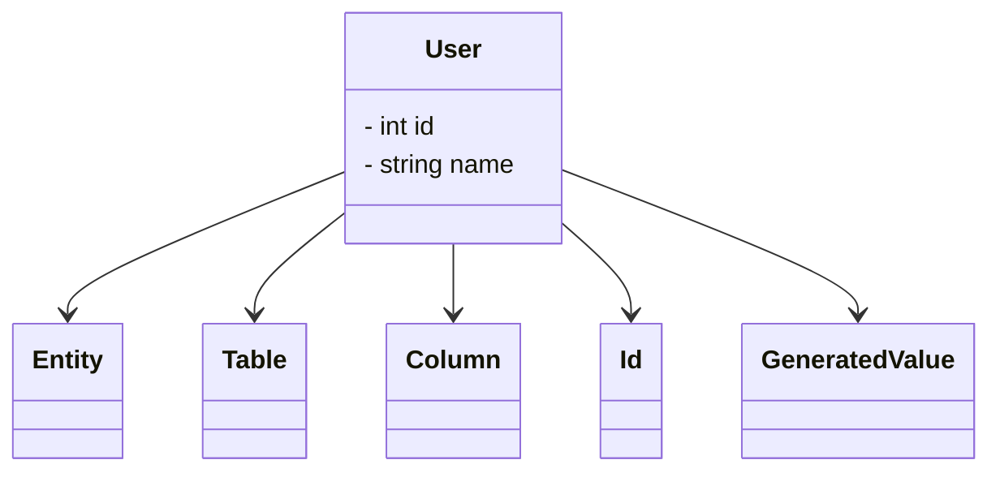

## 18.7 Using Annotations and Attributes

In modern PHP development, annotations and attributes play a crucial role in enhancing code with metadata. They provide a way to embed additional information directly into your code, which can be used by various tools and frameworks to perform specific tasks. This section will delve into the concepts of annotations and attributes, their use cases, and how they can be implemented in PHP to improve code maintainability and reusability.

### Understanding Annotations

Annotations are a form of metadata that can be embedded within code comments. They are not processed by the PHP engine itself but are instead used by external tools and frameworks to provide additional functionality. Annotations are typically used to define configuration settings, ORM mappings, or validation rules.

#### How Annotations Work

Annotations are usually placed in docblocks, which are special comment blocks that precede class, method, or property declarations. These docblocks are parsed by tools to extract the metadata and apply the necessary logic based on the annotations.

**Example:**

```php
/**
 * @Entity
 * @Table(name="users")
 */
class User
{
    /**
     * @Id
     * @Column(type="integer")
     * @GeneratedValue
     */
    private $id;

    /**
     * @Column(type="string", length=100)
     */
    private $name;
}
```

In this example, annotations are used to define ORM mappings for the `User` class. The `@Entity` and `@Table` annotations indicate that the class represents a database entity, while the `@Column` annotations specify the properties' database column types.

### PHP 8 Attributes: A Native Approach

With the release of PHP 8, attributes were introduced as a native way to add structured metadata to code. Attributes provide a more robust and type-safe alternative to annotations, as they are part of the language syntax and can be validated at compile time.

#### Key Features of PHP 8 Attributes

- **Native Syntax:** Attributes are defined using the `#[...]` syntax, making them part of the language itself.
- **Type Safety:** Attributes can be validated at compile time, reducing the risk of errors.
- **Structured Data:** Attributes can accept parameters, allowing for more complex metadata structures.

**Example:**

```php
#[Entity]
#[Table(name: "users")]
class User
{
    #[Id]
    #[Column(type: "integer")]
    #[GeneratedValue]
    private int $id;

    #[Column(type: "string", length: 100)]
    private string $name;
}
```

In this example, attributes are used to achieve the same result as annotations, but with a more concise and type-safe syntax.

### Use Cases for Annotations and Attributes

Annotations and attributes can be used in a variety of scenarios to enhance code functionality and maintainability. Some common use cases include:

- **ORM Mappings:** Define how classes and properties map to database tables and columns.
- **Serialization Rules:** Specify how objects should be serialized and deserialized.
- **Validation Rules:** Define validation constraints for class properties.
- **Dependency Injection:** Annotate classes and methods for automatic dependency injection.

### Implementing Annotations and Attributes in PHP

#### Using Annotations with Doctrine

Doctrine is a popular PHP library that utilizes annotations for ORM mappings. It allows developers to define how their PHP classes map to database tables using annotations in docblocks.

**Example:**

```php
/**
 * @Entity
 * @Table(name="products")
 */
class Product
{
    /**
     * @Id
     * @Column(type="integer")
     * @GeneratedValue
     */
    private $id;

    /**
     * @Column(type="string", length=255)
     */
    private $name;

    /**
     * @Column(type="decimal", scale=2)
     */
    private $price;
}
```

In this example, the `Product` class is mapped to a database table using annotations. The `@Entity` annotation indicates that the class is an entity, while the `@Table` annotation specifies the table name. The `@Column` annotations define the properties' column types.

#### Using Attributes in PHP 8

With PHP 8, attributes can be used to achieve similar functionality without relying on external libraries. Attributes provide a more integrated and type-safe approach to adding metadata to your code.

**Example:**

```php
#[Entity]
#[Table(name: "products")]
class Product
{
    #[Id]
    #[Column(type: "integer")]
    #[GeneratedValue]
    private int $id;

    #[Column(type: "string", length: 255)]
    private string $name;

    #[Column(type: "decimal", scale: 2)]
    private float $price;
}
```

In this example, attributes are used to define ORM mappings for the `Product` class. The syntax is more concise and integrated into the language, providing a more robust solution.

### Advantages of Using Attributes Over Annotations

- **Language Integration:** Attributes are part of the PHP language, providing better integration and type safety.
- **Performance:** Attributes are processed at compile time, reducing runtime overhead.
- **Tooling Support:** Attributes are supported by modern IDEs and tools, providing better code analysis and refactoring capabilities.

### Visualizing Annotations and Attributes

To better understand the relationship between annotations, attributes, and the code they enhance, let's visualize the process using a class diagram.



In this diagram, the `User` class is enhanced with various attributes, each representing a piece of metadata that defines how the class interacts with a database.

### Try It Yourself

To gain a deeper understanding of annotations and attributes, try modifying the examples provided. Experiment with different attribute parameters and observe how they affect the behavior of the code. Consider implementing a simple ORM system using attributes to map classes to database tables.

### References and Further Reading

- [Doctrine Annotations](https://www.doctrine-project.org/projects/doctrine-annotations/en/latest/)
- [PHP 8 Attributes](https://www.php.net/releases/8.0/en.php#attributes)
- [MDN Web Docs: Annotations](https://developer.mozilla.org/en-US/docs/Web/JavaScript/Reference/Global_Objects/Reflect/defineMetadata)

### Knowledge Check

- What are the main differences between annotations and attributes in PHP?
- How can attributes improve code maintainability and reusability?
- What are some common use cases for annotations and attributes in PHP development?

### Embrace the Journey

Remember, this is just the beginning. As you progress, you'll discover more ways to leverage annotations and attributes to enhance your PHP applications. Keep experimenting, stay curious, and enjoy the journey!

## Quiz: Using Annotations and Attributes



### What is the primary purpose of annotations in PHP?

- [x] To embed metadata in code comments for tools to process
- [ ] To execute code at runtime
- [ ] To replace PHP functions
- [ ] To define variable types

> **Explanation:** Annotations are used to embed metadata in code comments, which can be processed by external tools and frameworks.

### How do PHP 8 attributes differ from annotations?

- [x] Attributes are part of the language syntax
- [ ] Attributes are only used for error handling
- [ ] Attributes are slower than annotations
- [ ] Attributes cannot be used for ORM mappings

> **Explanation:** Attributes are a native feature of PHP 8, providing a structured and type-safe way to add metadata to code.

### Which of the following is a common use case for annotations and attributes?

- [x] Defining ORM mappings
- [ ] Creating database connections
- [ ] Writing HTML code
- [ ] Managing server configurations

> **Explanation:** Annotations and attributes are commonly used to define ORM mappings, among other use cases.

### What is the syntax used to define attributes in PHP 8?

- [x] #[...]
- [ ] @...
- [ ] /*...*/
- [ ] <!--...-->

> **Explanation:** Attributes in PHP 8 are defined using the `#[...]` syntax.

### Which PHP version introduced attributes as a native feature?

- [x] PHP 8
- [ ] PHP 7
- [ ] PHP 5
- [ ] PHP 4

> **Explanation:** Attributes were introduced as a native feature in PHP 8.

### What advantage do attributes have over annotations?

- [x] Type safety and language integration
- [ ] They are easier to write
- [ ] They are only used for testing
- [ ] They replace all PHP functions

> **Explanation:** Attributes offer type safety and are integrated into the PHP language, providing better performance and tooling support.

### Can attributes be used to define validation rules in PHP?

- [x] Yes
- [ ] No

> **Explanation:** Attributes can be used to define validation rules, among other use cases.

### What is a key benefit of using attributes for ORM mappings?

- [x] They provide a more concise and type-safe syntax
- [ ] They are faster to write
- [ ] They eliminate the need for databases
- [ ] They are only used in testing environments

> **Explanation:** Attributes offer a concise and type-safe syntax for defining ORM mappings.

### How do attributes improve performance compared to annotations?

- [x] They are processed at compile time
- [ ] They are executed at runtime
- [ ] They require less code
- [ ] They are only used in development environments

> **Explanation:** Attributes are processed at compile time, reducing runtime overhead.

### True or False: Annotations are a native feature of PHP.

- [ ] True
- [x] False

> **Explanation:** Annotations are not a native feature of PHP; they are typically used by external tools and frameworks.


