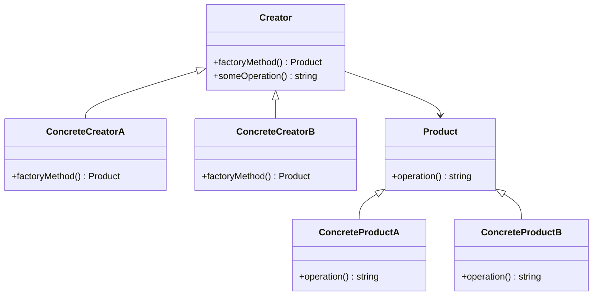
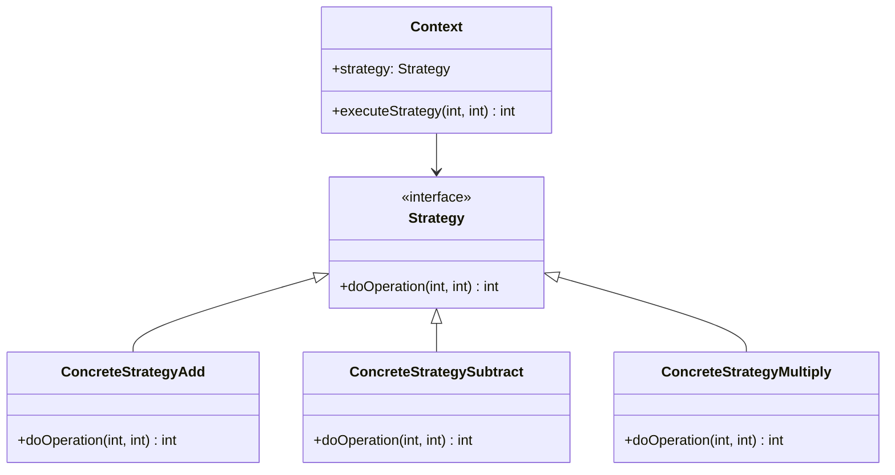
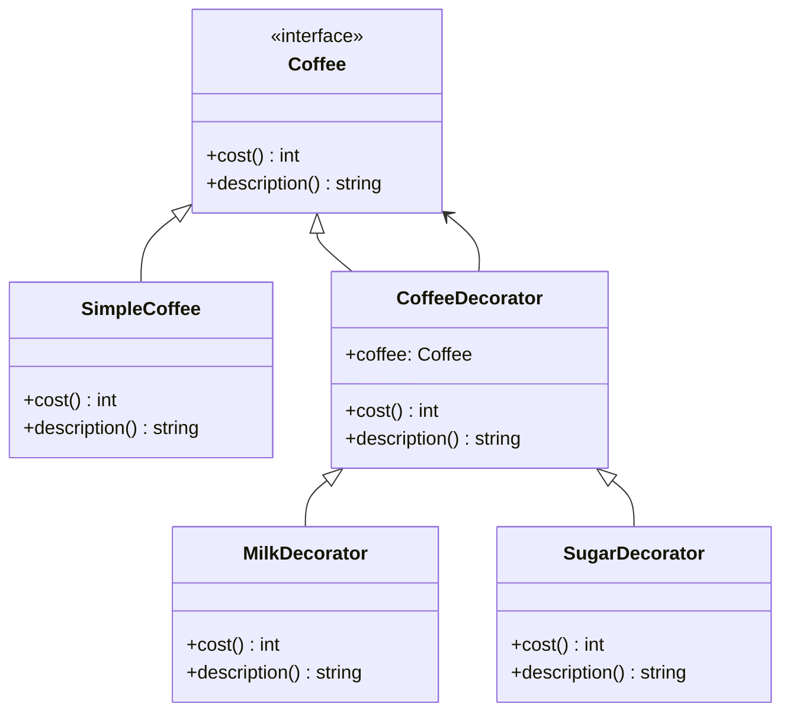

## 18.8 Design Patterns for Reusability

In the realm of software development, reusability is a cornerstone of efficient and maintainable code. Design patterns play a pivotal role in achieving this by providing proven solutions to common problems. In this section, we will delve into three key design patterns that enhance reusability in PHP: the Factory Pattern, the Strategy Pattern, and the Decorator Pattern. These patterns not only promote code reuse but also enhance flexibility and maintainability, making them indispensable tools for any PHP developer.

### Factory Pattern

#### Intent
The Factory Pattern is a creational design pattern that provides an interface for creating objects in a superclass, but allows subclasses to alter the type of objects that will be created. This pattern is particularly useful when the exact types and dependencies of the objects are not known until runtime.

#### Key Participants
- **Factory**: The interface or abstract class defining the method for creating objects.
- **ConcreteFactory**: Implements the Factory interface and creates instances of ConcreteProducts.
- **Product**: The interface or abstract class for objects the factory method creates.
- **ConcreteProduct**: Implements the Product interface.

#### Applicability
Use the Factory Pattern when:
- You need to decouple the creation of objects from their implementation.
- You want to provide a library of products that can be instantiated without exposing the instantiation logic.
- You anticipate changes in the way objects are created.

#### Sample Code Snippet

```php
<?php

// Product interface
interface Product {
    public function operation(): string;
}

// ConcreteProductA class
class ConcreteProductA implements Product {
    public function operation(): string {
        return "Result of ConcreteProductA";
    }
}

// ConcreteProductB class
class ConcreteProductB implements Product {
    public function operation(): string {
        return "Result of ConcreteProductB";
    }
}

// Creator class
abstract class Creator {
    abstract public function factoryMethod(): Product;

    public function someOperation(): string {
        $product = $this->factoryMethod();
        return "Creator: The same creator's code has just worked with " . $product->operation();
    }
}

// ConcreteCreatorA class
class ConcreteCreatorA extends Creator {
    public function factoryMethod(): Product {
        return new ConcreteProductA();
    }
}

// ConcreteCreatorB class
class ConcreteCreatorB extends Creator {
    public function factoryMethod(): Product {
        return new ConcreteProductB();
    }
}

// Client code
function clientCode(Creator $creator) {
    echo "Client: I'm not aware of the creator's class, but it still works.\n"
        . $creator->someOperation();
}

echo "App: Launched with the ConcreteCreatorA.\n";
clientCode(new ConcreteCreatorA());
echo "\n\n";

echo "App: Launched with the ConcreteCreatorB.\n";
clientCode(new ConcreteCreatorB());

?>
```

#### Design Considerations
- **When to Use**: Employ the Factory Pattern when you need to manage or manipulate collections of objects that are different but share common characteristics.
- **Pitfalls**: Overuse can lead to unnecessary complexity. Ensure that the pattern is justified by the need for flexibility in object creation.

#### PHP Unique Features
PHP's dynamic nature and support for interfaces make it an ideal language for implementing the Factory Pattern. The use of interfaces allows for flexible and interchangeable product creation.

### Strategy Pattern

#### Intent
The Strategy Pattern is a behavioral design pattern that enables selecting an algorithm's behavior at runtime. It defines a family of algorithms, encapsulates each one, and makes them interchangeable.

#### Key Participants
- **Strategy**: The interface common to all supported algorithms.
- **ConcreteStrategy**: Implements the algorithm using the Strategy interface.
- **Context**: Maintains a reference to a Strategy object and is configured with a ConcreteStrategy object.

#### Applicability
Use the Strategy Pattern when:
- You need different variants of an algorithm.
- You want to avoid exposing complex, algorithm-specific data structures.
- You have a class that defines many behaviors, and these behaviors appear as multiple conditional statements.

#### Sample Code Snippet

```php
<?php

// Strategy interface
interface Strategy {
    public function doOperation(int $num1, int $num2): int;
}

// ConcreteStrategyAdd class
class ConcreteStrategyAdd implements Strategy {
    public function doOperation(int $num1, int $num2): int {
        return $num1 + $num2;
    }
}

// ConcreteStrategySubtract class
class ConcreteStrategySubtract implements Strategy {
    public function doOperation(int $num1, int $num2): int {
        return $num1 - $num2;
    }
}

// ConcreteStrategyMultiply class
class ConcreteStrategyMultiply implements Strategy {
    public function doOperation(int $num1, int $num2): int {
        return $num1 * $num2;
    }
}

// Context class
class Context {
    private $strategy;

    public function __construct(Strategy $strategy) {
        $this->strategy = $strategy;
    }

    public function executeStrategy(int $num1, int $num2): int {
        return $this->strategy->doOperation($num1, $num2);
    }
}

// Client code
$context = new Context(new ConcreteStrategyAdd());
echo "10 + 5 = " . $context->executeStrategy(10, 5) . "\n";

$context = new Context(new ConcreteStrategySubtract());
echo "10 - 5 = " . $context->executeStrategy(10, 5) . "\n";

$context = new Context(new ConcreteStrategyMultiply());
echo "10 * 5 = " . $context->executeStrategy(10, 5) . "\n";

?>
```

#### Design Considerations
- **When to Use**: Use the Strategy Pattern when you have multiple algorithms for a specific task and want to switch between them easily.
- **Pitfalls**: Be cautious of increased complexity due to the number of strategy classes.

#### PHP Unique Features
PHP's support for anonymous functions and closures can be leveraged to implement strategies inline, providing a more concise and flexible approach.

### Decorator Pattern

#### Intent
The Decorator Pattern is a structural design pattern that allows behavior to be added to individual objects, either statically or dynamically, without affecting the behavior of other objects from the same class.

#### Key Participants
- **Component**: The interface for objects that can have responsibilities added to them dynamically.
- **ConcreteComponent**: Defines an object to which additional responsibilities can be attached.
- **Decorator**: Maintains a reference to a Component object and defines an interface that conforms to Component's interface.
- **ConcreteDecorator**: Adds responsibilities to the component.

#### Applicability
Use the Decorator Pattern when:
- You want to add responsibilities to individual objects dynamically and transparently.
- You want to avoid subclassing to extend functionality.
- You need to extend the functionality of classes in a flexible and reusable way.

#### Sample Code Snippet

```php
<?php

// Component interface
interface Coffee {
    public function cost(): int;
    public function description(): string;
}

// ConcreteComponent class
class SimpleCoffee implements Coffee {
    public function cost(): int {
        return 5;
    }

    public function description(): string {
        return "Simple coffee";
    }
}

// Decorator class
class CoffeeDecorator implements Coffee {
    protected $coffee;

    public function __construct(Coffee $coffee) {
        $this->coffee = $coffee;
    }

    public function cost(): int {
        return $this->coffee->cost();
    }

    public function description(): string {
        return $this->coffee->description();
    }
}

// ConcreteDecorator class
class MilkDecorator extends CoffeeDecorator {
    public function cost(): int {
        return $this->coffee->cost() + 2;
    }

    public function description(): string {
        return $this->coffee->description() . ", milk";
    }
}

// Another ConcreteDecorator class
class SugarDecorator extends CoffeeDecorator {
    public function cost(): int {
        return $this->coffee->cost() + 1;
    }

    public function description(): string {
        return $this->coffee->description() . ", sugar";
    }
}

// Client code
$coffee = new SimpleCoffee();
echo $coffee->description() . " costs " . $coffee->cost() . "\n";

$coffeeWithMilk = new MilkDecorator($coffee);
echo $coffeeWithMilk->description() . " costs " . $coffeeWithMilk->cost() . "\n";

$coffeeWithMilkAndSugar = new SugarDecorator($coffeeWithMilk);
echo $coffeeWithMilkAndSugar->description() . " costs " . $coffeeWithMilkAndSugar->cost() . "\n";

?>
```

#### Design Considerations
- **When to Use**: Use the Decorator Pattern when you need to add responsibilities to objects without subclassing.
- **Pitfalls**: Can lead to a system with many small objects that can be hard to manage.

#### PHP Unique Features
PHP's dynamic typing and support for interfaces make it easy to implement decorators that can be applied to a wide range of objects.

### Benefits of Design Patterns for Reusability

- **Promote Code Reuse**: By encapsulating common behaviors and functionalities, these patterns enable developers to reuse code across different parts of an application.
- **Enhance Flexibility**: Design patterns allow for easy modification and extension of code without altering existing structures.
- **Improve Maintainability**: By organizing code into well-defined patterns, maintenance becomes more straightforward, reducing the risk of introducing errors during updates.

### Try It Yourself

To solidify your understanding of these patterns, try modifying the code examples provided:
- Implement a new product type in the Factory Pattern.
- Add a new strategy to the Strategy Pattern.
- Create a new decorator in the Decorator Pattern.

### Visualizing Design Patterns

Let's visualize the relationships and flow of these patterns using Mermaid.js diagrams.

#### Factory Pattern Diagram



#### Strategy Pattern Diagram



#### Decorator Pattern Diagram



### Knowledge Check

- What are the key benefits of using the Factory Pattern?
- How does the Strategy Pattern enhance flexibility in code?
- In what scenarios would you use the Decorator Pattern?

### Embrace the Journey

Remember, mastering design patterns is a journey. As you continue to explore and apply these patterns, you'll find new ways to enhance your code's reusability and maintainability. Keep experimenting, stay curious, and enjoy the process of becoming a more proficient PHP developer!

## Quiz: Design Patterns for Reusability



### Which pattern is used to encapsulate object creation?

- [x] Factory Pattern
- [ ] Strategy Pattern
- [ ] Decorator Pattern
- [ ] Observer Pattern

> **Explanation:** The Factory Pattern is used to encapsulate object creation, allowing for flexibility and reuse.

### What is the main benefit of the Strategy Pattern?

- [ ] Encapsulating object creation
- [x] Defining interchangeable algorithms
- [ ] Adding functionality dynamically
- [ ] Managing object lifecycles

> **Explanation:** The Strategy Pattern allows for defining interchangeable algorithms or behaviors, enhancing flexibility.

### Which pattern allows adding functionality to objects dynamically?

- [ ] Factory Pattern
- [ ] Strategy Pattern
- [x] Decorator Pattern
- [ ] Singleton Pattern

> **Explanation:** The Decorator Pattern allows for adding functionality to objects dynamically without altering their structure.

### When should you use the Factory Pattern?

- [x] When you need to decouple object creation from implementation
- [ ] When you need to add functionality dynamically
- [ ] When you need interchangeable algorithms
- [ ] When you need to manage object lifecycles

> **Explanation:** The Factory Pattern is ideal for decoupling object creation from implementation details.

### What is a potential pitfall of the Strategy Pattern?

- [ ] Overuse can lead to unnecessary complexity
- [x] Increased complexity due to many strategy classes
- [ ] Difficulties in adding new functionality
- [ ] Lack of flexibility in object creation

> **Explanation:** The Strategy Pattern can lead to increased complexity due to the number of strategy classes.

### How does the Decorator Pattern enhance reusability?

- [ ] By encapsulating object creation
- [ ] By defining interchangeable algorithms
- [x] By allowing dynamic addition of functionality
- [ ] By managing object lifecycles

> **Explanation:** The Decorator Pattern enhances reusability by allowing dynamic addition of functionality to objects.

### What is a key feature of PHP that aids in implementing the Factory Pattern?

- [x] Dynamic typing and interfaces
- [ ] Static typing and classes
- [ ] Anonymous functions
- [ ] Closures

> **Explanation:** PHP's dynamic typing and support for interfaces make it ideal for implementing the Factory Pattern.

### Which pattern is best for adding responsibilities to objects without subclassing?

- [ ] Factory Pattern
- [ ] Strategy Pattern
- [x] Decorator Pattern
- [ ] Observer Pattern

> **Explanation:** The Decorator Pattern is best for adding responsibilities to objects without subclassing.

### What is the role of the Context class in the Strategy Pattern?

- [x] It maintains a reference to a Strategy object
- [ ] It creates objects
- [ ] It adds functionality dynamically
- [ ] It manages object lifecycles

> **Explanation:** The Context class maintains a reference to a Strategy object and is configured with a ConcreteStrategy object.

### True or False: The Factory Pattern is a structural design pattern.

- [ ] True
- [x] False

> **Explanation:** The Factory Pattern is a creational design pattern, not a structural one.


