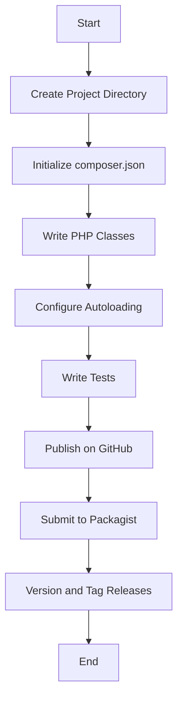

## 18.9 Package Management and Reusable Components

In the world of PHP development, managing dependencies and creating reusable components are crucial for building scalable and maintainable applications. This section delves into the intricacies of package management using Composer, the de facto standard for PHP dependency management, and explores how to create, publish, and version reusable components effectively.

### Composer for Package Management

Composer is a powerful dependency management tool for PHP, designed to simplify the process of managing libraries and packages in your projects. It allows you to declare the libraries your project depends on and manages (install/update) them for you.

#### Key Features of Composer

- **Dependency Management:** Automatically handles the installation and updating of libraries that your project depends on.
- **Autoloading:** Provides an autoloading mechanism for your classes, reducing the need for manual `require` or `include` statements.
- **Version Constraints:** Allows you to specify version constraints for your dependencies, ensuring compatibility and stability.
- **Community Support:** Composer is widely adopted and supported by a vast community, with numerous packages available on Packagist.

#### Installing Composer

To start using Composer, you need to install it on your system. Follow these steps to install Composer globally:

1. **Download Composer Installer:**

   ```bash
   php -r "copy('https://getcomposer.org/installer', 'composer-setup.php');"
   ```

2. **Verify Installer SHA-384:**

   ```bash
   php -r "if (hash_file('sha384', 'composer-setup.php') === 'your-expected-hash') { echo 'Installer verified'; } else { echo 'Installer corrupt'; unlink('composer-setup.php'); } echo PHP_EOL;"
   ```

3. **Install Composer Globally:**

   ```bash
   php composer-setup.php --install-dir=/usr/local/bin --filename=composer
   ```

4. **Remove Installer:**

   ```bash
   php -r "unlink('composer-setup.php');"
   ```

5. **Verify Installation:**

   ```bash
   composer --version
   ```

#### Using Composer in Your Project

To use Composer in your PHP project, you need to create a `composer.json` file in the root directory of your project. This file describes the dependencies of your project and other metadata.

**Example `composer.json`:**

```json
{
    "name": "your-vendor/your-project",
    "description": "A brief description of your project",
    "require": {
        "monolog/monolog": "^2.0"
    },
    "autoload": {
        "psr-4": {
            "YourNamespace\\": "src/"
        }
    }
}
```

- **`require`:** Specifies the packages your project depends on.
- **`autoload`:** Defines the autoloading rules for your project.

#### Installing Dependencies

Once you have your `composer.json` file set up, you can install the dependencies by running:

```bash
composer install
```

This command will download the specified packages and create a `vendor` directory containing the installed libraries and an `autoload.php` file for autoloading.

### Creating Reusable Packages

Creating reusable packages allows you to share your code with others and reuse it across multiple projects. Here’s how you can create a reusable package:

#### Organizing Code into Packages

1. **Structure Your Code:**

   Organize your code into a logical directory structure. For example:

   ```
   your-package/
   ├── src/
   │   └── YourClass.php
   ├── tests/
   ├── composer.json
   └── README.md
   ```

2. **Define `composer.json`:**

   Create a `composer.json` file for your package. This file should include metadata about your package, such as its name, description, and dependencies.

   **Example `composer.json`:**

   ```json
   {
       "name": "your-vendor/your-package",
       "description": "A brief description of your package",
       "type": "library",
       "license": "MIT",
       "authors": [
           {
               "name": "Your Name",
               "email": "your-email@example.com"
           }
       ],
       "require": {
           "php": ">=7.4"
       },
       "autoload": {
           "psr-4": {
               "YourVendor\\YourPackage\\": "src/"
           }
       }
   }
   ```

3. **Implement Autoloading:**

   Use PSR-4 autoloading to ensure your classes are automatically loaded. This is defined in the `autoload` section of your `composer.json`.

4. **Write Tests:**

   Include tests for your package to ensure its functionality. You can use PHPUnit or any other testing framework.

5. **Document Your Code:**

   Provide clear documentation for your package, including a `README.md` file with usage instructions and examples.

### Publishing Packages

Once your package is ready, you can publish it to Packagist, the default package repository for Composer.

#### Steps to Publish on Packagist

1. **Create a Git Repository:**

   Host your package on a version control system like GitHub or GitLab.

2. **Register on Packagist:**

   Create an account on [Packagist](https://packagist.org/) and submit your package by providing the URL of your Git repository.

3. **Tag Releases:**

   Use Git tags to mark releases of your package. This helps in managing versions and allows users to specify which version they want to install.

   ```bash
   git tag -a v1.0.0 -m "Initial release"
   git push origin v1.0.0
   ```

4. **Update Packagist:**

   Packagist will automatically detect new tags and update the package information.

### Versioning

Versioning is crucial for maintaining compatibility and managing updates. Semantic Versioning (SemVer) is a widely adopted versioning scheme that helps in this regard.

#### Semantic Versioning

Semantic Versioning follows the format `MAJOR.MINOR.PATCH`, where:

- **MAJOR:** Increments for incompatible API changes.
- **MINOR:** Increments for backward-compatible functionality.
- **PATCH:** Increments for backward-compatible bug fixes.

**Example:**

- `1.0.0` → Initial release.
- `1.1.0` → Added new features in a backward-compatible manner.
- `1.1.1` → Fixed bugs without breaking compatibility.

#### Managing Versions with Composer

In your `composer.json`, you can specify version constraints for your dependencies:

- **Exact Version:** `"1.0.0"`
- **Range:** `">=1.0.0 <2.0.0"`
- **Caret (`^`):** `"^1.0"` allows updates that do not change the left-most non-zero digit.
- **Tilde (`~`):** `"~1.0"` allows updates to the last digit specified.

### Try It Yourself

Experiment with creating your own package by following these steps:

1. **Create a New PHP Project:**

   Set up a new directory and initialize a `composer.json` file.

2. **Write a Simple Class:**

   Create a simple PHP class in the `src` directory.

3. **Configure Autoloading:**

   Set up PSR-4 autoloading in your `composer.json`.

4. **Test Your Package:**

   Write a test case for your class and run it using PHPUnit.

5. **Publish Your Package:**

   Host your code on GitHub and submit it to Packagist.

### Visualizing Package Management Workflow



### Knowledge Check

- **What is Composer, and why is it important for PHP development?**
- **How do you create a `composer.json` file, and what information does it contain?**
- **Explain the steps to publish a package on Packagist.**
- **What is Semantic Versioning, and how does it help in package management?**

### Summary

In this section, we explored the essentials of package management and reusable components in PHP using Composer. We learned how to create, publish, and version packages effectively, ensuring that our code is organized, maintainable, and shareable. By mastering these concepts, you can enhance your PHP development skills and contribute to the vibrant PHP community.

Remember, this is just the beginning. As you progress, you'll build more complex and interactive applications. Keep experimenting, stay curious, and enjoy the journey!

## Quiz: Package Management and Reusable Components



### What is the primary purpose of Composer in PHP?

- [x] Dependency management
- [ ] Database management
- [ ] User authentication
- [ ] File handling

> **Explanation:** Composer is primarily used for managing dependencies in PHP projects.

### Which file is essential for defining a PHP package's dependencies and metadata?

- [x] composer.json
- [ ] package.json
- [ ] config.php
- [ ] index.php

> **Explanation:** The `composer.json` file is used to define a PHP package's dependencies and metadata.

### What is the default package repository for Composer?

- [x] Packagist
- [ ] NPM
- [ ] PyPI
- [ ] Maven Central

> **Explanation:** Packagist is the default package repository for Composer.

### What versioning scheme is commonly used in PHP package management?

- [x] Semantic Versioning
- [ ] Calendar Versioning
- [ ] Alphanumeric Versioning
- [ ] Random Versioning

> **Explanation:** Semantic Versioning is commonly used in PHP package management.

### Which command is used to install dependencies specified in `composer.json`?

- [x] composer install
- [ ] composer update
- [ ] composer require
- [ ] composer create

> **Explanation:** The `composer install` command installs dependencies specified in `composer.json`.

### What does the caret (`^`) symbol represent in version constraints?

- [x] Allows updates that do not change the left-most non-zero digit
- [ ] Allows only exact version matches
- [ ] Allows any version updates
- [ ] Allows updates to the last digit specified

> **Explanation:** The caret (`^`) symbol allows updates that do not change the left-most non-zero digit.

### What is the purpose of the `autoload` section in `composer.json`?

- [x] Define autoloading rules for classes
- [ ] Specify database connections
- [ ] Configure server settings
- [ ] Set environment variables

> **Explanation:** The `autoload` section in `composer.json` defines autoloading rules for classes.

### What is the first step in publishing a package on Packagist?

- [x] Create a Git repository
- [ ] Write documentation
- [ ] Submit a form on Packagist
- [ ] Tag a release

> **Explanation:** Creating a Git repository is the first step in publishing a package on Packagist.

### Which command is used to update dependencies to the latest versions?

- [x] composer update
- [ ] composer install
- [ ] composer require
- [ ] composer remove

> **Explanation:** The `composer update` command updates dependencies to the latest versions.

### True or False: Semantic Versioning uses the format `MAJOR.MINOR.PATCH`.

- [x] True
- [ ] False

> **Explanation:** Semantic Versioning uses the format `MAJOR.MINOR.PATCH`.


