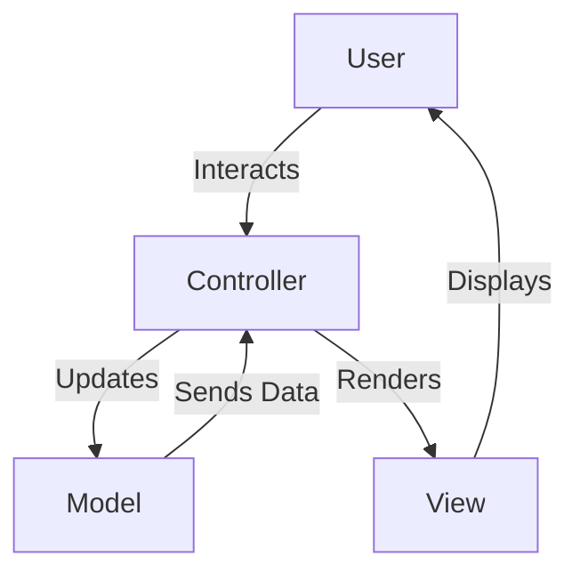

## 19.1 MVC and Templating Engines

In the realm of web development, the Model-View-Controller (MVC) architecture and templating engines play a pivotal role in creating scalable, maintainable, and efficient applications. This section delves into the intricacies of MVC and the use of templating engines in PHP, providing a comprehensive understanding of how these components work together to enhance frontend integration.

### Understanding MVC Architecture

The MVC architecture is a design pattern that separates an application into three interconnected components:

- **Model:** Represents the data and the business logic of the application. It is responsible for retrieving data from the database, processing it, and returning it to the controller or view.

- **View:** The presentation layer that displays data to the user. It is responsible for rendering the user interface and presenting the data in a readable format.

- **Controller:** Acts as an intermediary between the Model and the View. It receives user input, processes it (often by calling the Model), and returns the output display (the View).

This separation of concerns allows developers to manage complex applications more effectively by isolating the business logic from the user interface.

#### Diagram: MVC Architecture



**Caption:** The MVC architecture separates concerns between data (Model), presentation (View), and control flow (Controller).

### Server-Side Rendering with Templating Engines

Server-side rendering (SSR) involves generating the HTML content of a web page on the server before sending it to the client's browser. This approach is beneficial for SEO, as search engines can easily crawl and index the content. It also simplifies the initial page load, as the browser receives a fully rendered page.

Templating engines are tools that facilitate server-side rendering by allowing developers to create dynamic HTML pages. They enable the separation of HTML structure from the application logic, making it easier to manage and maintain.

### Popular Templating Engines in PHP

PHP boasts several powerful templating engines that streamline the process of server-side rendering. Two of the most popular are Blade and Twig.

#### Blade (Laravel)

Blade is the templating engine used by the Laravel framework. It provides a simple yet powerful syntax for creating dynamic views. Blade templates are compiled into plain PHP code, ensuring fast performance.

**Key Features of Blade:**

- **Template Inheritance:** Allows you to define a base template and extend it in child templates, promoting code reuse.
- **Control Structures:** Provides directives for loops, conditionals, and more, making it easy to implement logic within templates.
- **Data Binding:** Facilitates the passing of data from controllers to views seamlessly.

**Example of Blade Template:**

```php
<!-- resources/views/layouts/app.blade.php -->
<!DOCTYPE html>
<html>
<head>
    <title>My Application - @yield('title')</title>
</head>
<body>
    <div class="container">
        @yield('content')
    </div>
</body>
</html>
```

```php
<!-- resources/views/home.blade.php -->
@extends('layouts.app')

@section('title', 'Home Page')

@section('content')
    <h1>Welcome to My Application</h1>
    <p>This is the home page.</p>
@endsection
```

**Try It Yourself:** Modify the `home.blade.php` file to include a list of items using a Blade loop directive.

#### Twig (Symfony)

Twig is a flexible, fast, and secure templating engine used by the Symfony framework. It is designed to be easy to learn and use, with a syntax that is both concise and expressive.

**Key Features of Twig:**

- **Sandboxing:** Provides a security layer that allows you to execute templates in a restricted environment.
- **Filters and Functions:** Offers a wide range of built-in filters and functions to manipulate data within templates.
- **Extensibility:** Allows developers to create custom filters, functions, and tags.

**Example of Twig Template:**

```twig
{# templates/base.html.twig #}
<!DOCTYPE html>
<html>
<head>
    <title>{{ title }}</title>
</head>
<body>
    <div class="container">
        
    </div>
</body>
</html>
```

```twig
{# templates/home.html.twig #}



    <h1>Welcome to My Application</h1>
    <p>This is the home page.</p>

```

**Try It Yourself:** Add a conditional statement in the `home.html.twig` file to display a message based on a variable's value.

### Benefits of Using MVC and Templating Engines

The combination of MVC architecture and templating engines offers several advantages:

- **SEO-Friendly Content:** Server-side rendering ensures that content is readily available for search engines to crawl and index.
- **Simplified Initial Page Load:** By rendering the page on the server, the browser receives a fully constructed HTML document, reducing the time to first meaningful paint.
- **Separation of Concerns:** MVC architecture promotes a clean separation between business logic, data management, and presentation, making the codebase easier to manage and scale.
- **Reusability and Maintainability:** Templating engines encourage code reuse through features like template inheritance, reducing duplication and simplifying maintenance.

### Design Considerations

When implementing MVC and templating engines in PHP, consider the following:

- **Performance:** While server-side rendering can improve SEO and initial load times, it may increase server load. Optimize your templates and consider caching strategies to mitigate this.
- **Security:** Ensure that user input is properly sanitized before rendering it in templates to prevent XSS attacks.
- **Scalability:** Design your application with scalability in mind, leveraging the separation of concerns provided by MVC to facilitate future growth.

### PHP Unique Features

PHP's native support for templating and its ability to embed code directly within HTML make it a natural fit for server-side rendering. Additionally, PHP's extensive library ecosystem provides numerous tools and packages to enhance MVC and templating capabilities.

### Differences and Similarities

MVC is often confused with other architectural patterns like MVVM (Model-View-ViewModel) or MVP (Model-View-Presenter). While they share similarities in separating concerns, each pattern has distinct roles and interactions between components. Understanding these differences is crucial for selecting the right pattern for your application.

### Knowledge Check

- **Question:** What are the three main components of the MVC architecture?
- **Question:** How does server-side rendering benefit SEO?
- **Question:** Name two popular templating engines in PHP.

### Embrace the Journey

Remember, mastering MVC and templating engines is just the beginning. As you continue to explore PHP development, you'll discover more patterns and techniques that will enhance your skills. Keep experimenting, stay curious, and enjoy the journey!

## Quiz: MVC and Templating Engines



### What are the three main components of the MVC architecture?

- [x] Model, View, Controller
- [ ] Module, View, Component
- [ ] Model, View, Component
- [ ] Module, Visual, Controller

> **Explanation:** MVC stands for Model, View, and Controller, which are the three main components of this architectural pattern.

### Which PHP framework uses Blade as its templating engine?

- [x] Laravel
- [ ] Symfony
- [ ] CodeIgniter
- [ ] Zend

> **Explanation:** Blade is the templating engine used by the Laravel framework.

### What is a key benefit of server-side rendering?

- [x] SEO-friendly content
- [ ] Faster client-side rendering
- [ ] Reduced server load
- [ ] Increased client-side processing

> **Explanation:** Server-side rendering generates HTML on the server, making content SEO-friendly as search engines can easily crawl and index it.

### Which templating engine is associated with Symfony?

- [x] Twig
- [ ] Blade
- [ ] Smarty
- [ ] Mustache

> **Explanation:** Twig is the templating engine used by the Symfony framework.

### What is the purpose of the Controller in MVC?

- [x] To act as an intermediary between the Model and the View
- [ ] To store and manage data
- [ ] To render the user interface
- [ ] To handle database connections

> **Explanation:** The Controller acts as an intermediary between the Model and the View, processing user input and returning the output display.

### How does Blade facilitate code reuse?

- [x] Through template inheritance
- [ ] By using inline PHP code
- [ ] By embedding JavaScript
- [ ] By compiling to HTML

> **Explanation:** Blade facilitates code reuse through template inheritance, allowing developers to define a base template and extend it in child templates.

### What is a feature of Twig that enhances security?

- [x] Sandboxing
- [ ] Inline scripting
- [ ] Direct database access
- [ ] Client-side rendering

> **Explanation:** Twig provides sandboxing, which allows templates to be executed in a restricted environment, enhancing security.

### Why is MVC architecture beneficial for large applications?

- [x] It promotes separation of concerns
- [ ] It combines all logic into a single file
- [ ] It reduces the need for templating
- [ ] It eliminates the need for a database

> **Explanation:** MVC architecture promotes separation of concerns, making it easier to manage and scale large applications.

### What is a common pitfall when using templating engines?

- [x] Not sanitizing user input
- [ ] Overusing inline CSS
- [ ] Using too many templates
- [ ] Avoiding server-side rendering

> **Explanation:** Not sanitizing user input before rendering it in templates can lead to security vulnerabilities like XSS attacks.

### True or False: MVC architecture eliminates the need for client-side scripting.

- [ ] True
- [x] False

> **Explanation:** MVC architecture does not eliminate the need for client-side scripting; it complements it by managing server-side logic and rendering.


