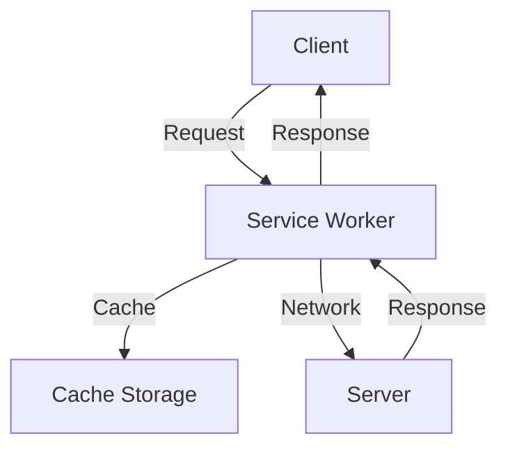

## 19.10 Progressive Web Apps (PWAs) with PHP

Progressive Web Apps (PWAs) represent a significant evolution in web development, combining the best of web and mobile applications. They offer enhanced user experiences by providing offline capabilities, push notifications, and the ability to install apps directly from the browser. In this section, we will explore how to integrate PWAs with a PHP backend, focusing on key features such as service workers and manifest files.

### Understanding Progressive Web Apps (PWAs)

Progressive Web Apps are web applications that use modern web capabilities to deliver an app-like experience to users. They are built using standard web technologies, including HTML, CSS, and JavaScript, but offer additional features that were traditionally only available to native apps.

#### Key Features of PWAs

- **Offline Capabilities:** PWAs can function offline or on low-quality networks by caching resources.
- **Push Notifications:** They can send notifications to users even when the app is not open.
- **Installable Apps:** Users can install PWAs on their devices, providing a more integrated experience.
- **Responsive Design:** PWAs are designed to work on any device with a responsive interface.
- **Secure:** They are served over HTTPS to ensure secure data transmission.

### Service Workers: The Backbone of PWAs

Service workers are a core technology behind PWAs. They are scripts that run in the background, separate from the web page, enabling features like offline support, background sync, and push notifications.

#### How Service Workers Work

Service workers act as a proxy between the web application and the network. They intercept network requests and can serve cached responses, allowing the app to function offline.

```javascript
// Registering a service worker
if ('serviceWorker' in navigator) {
  navigator.serviceWorker.register('/service-worker.js')
    .then(function(registration) {
      console.log('Service Worker registered with scope:', registration.scope);
    })
    .catch(function(error) {
      console.log('Service Worker registration failed:', error);
    });
}
```

#### Implementing a Basic Service Worker

A basic service worker can cache essential assets during the installation phase and serve them when the network is unavailable.

```javascript
// service-worker.js

const CACHE_NAME = 'my-pwa-cache-v1';
const urlsToCache = [
  '/',
  '/styles/main.css',
  '/script/main.js'
];

// Install event
self.addEventListener('install', event => {
  event.waitUntil(
    caches.open(CACHE_NAME)
      .then(cache => {
        return cache.addAll(urlsToCache);
      })
  );
});

// Fetch event
self.addEventListener('fetch', event => {
  event.respondWith(
    caches.match(event.request)
      .then(response => {
        return response || fetch(event.request);
      })
  );
});
```

### Implementing PWAs with a PHP Backend

PHP can serve as a robust backend for PWAs, handling API requests, serving manifest files, and managing data persistence.

#### Serving the Web App Manifest

The web app manifest is a JSON file that provides metadata about the application, such as its name, icons, and start URL. It is essential for making the app installable.

```json
// manifest.json
{
  "name": "My PWA",
  "short_name": "PWA",
  "start_url": "/",
  "display": "standalone",
  "background_color": "#ffffff",
  "description": "A simple PWA example",
  "icons": [
    {
      "src": "/images/icon-192x192.png",
      "sizes": "192x192",
      "type": "image/png"
    },
    {
      "src": "/images/icon-512x512.png",
      "sizes": "512x512",
      "type": "image/png"
    }
  ]
}
```

Include the manifest in your HTML:

```html
<link rel="manifest" href="/manifest.json">
```

#### Handling API Requests with PHP

PHP can be used to create RESTful APIs that the PWA can interact with. This allows for dynamic content updates and data management.

```php
// api.php

header('Content-Type: application/json');

$data = [
  'message' => 'Hello, World!',
  'timestamp' => time()
];

echo json_encode($data);
```

#### Benefits of Using PHP with PWAs

- **Scalability:** PHP is well-suited for building scalable web applications.
- **Flexibility:** PHP can easily integrate with various databases and services.
- **Security:** PHP offers robust security features to protect user data.

### Enhancing User Experience on Mobile Devices

PWAs provide a seamless user experience on mobile devices, combining the reach of the web with the capabilities of native apps.

#### Responsive Design

Ensure your PWA is responsive by using CSS media queries and flexible layouts.

```css
/* Responsive design example */
body {
  font-family: Arial, sans-serif;
  margin: 0;
  padding: 0;
}

.container {
  width: 100%;
  max-width: 1200px;
  margin: 0 auto;
  padding: 20px;
}

@media (max-width: 768px) {
  .container {
    padding: 10px;
  }
}
```

#### Push Notifications

Push notifications can be implemented using the Push API and a service worker. They allow you to engage users even when they are not actively using the app.

```javascript
// Requesting permission for notifications
Notification.requestPermission().then(function(permission) {
  if (permission === 'granted') {
    console.log('Notification permission granted.');
  }
});
```

### Visualizing PWA Architecture

Below is a diagram illustrating the architecture of a PWA, highlighting the interaction between the client, service worker, and server.



**Diagram Description:** This diagram shows how the client interacts with the service worker, which can either fetch resources from the cache or the network, depending on availability.

### Try It Yourself

Experiment with the code examples provided. Try modifying the service worker to cache additional resources or implement a new feature like background sync.

### Knowledge Check

- What are the key features of a PWA?
- How do service workers enhance offline capabilities?
- How can PHP be used to serve a web app manifest?

### Conclusion

Progressive Web Apps offer a powerful way to deliver rich, app-like experiences on the web. By leveraging PHP for the backend, developers can build scalable and secure PWAs that enhance user engagement and accessibility. Remember, this is just the beginning. As you progress, you'll build more complex and interactive web applications. Keep experimenting, stay curious, and enjoy the journey!

## Quiz: Progressive Web Apps (PWAs) with PHP



### What is a key feature of Progressive Web Apps?

- [x] Offline capabilities
- [ ] Server-side rendering
- [ ] Static content delivery
- [ ] Limited device access

> **Explanation:** Offline capabilities allow PWAs to function without an internet connection, enhancing user experience.

### What role do service workers play in PWAs?

- [x] They enable offline support and caching.
- [ ] They handle server-side logic.
- [ ] They manage database connections.
- [ ] They provide UI components.

> **Explanation:** Service workers run in the background to intercept network requests and cache resources, enabling offline functionality.

### How can PHP be used in a PWA?

- [x] To handle API requests and serve manifest files
- [ ] To manage client-side rendering
- [ ] To create service workers
- [ ] To design UI components

> **Explanation:** PHP can serve as the backend for handling API requests and serving necessary files like the manifest.

### What is the purpose of a web app manifest in a PWA?

- [x] To provide metadata about the application
- [ ] To manage database connections
- [ ] To handle user authentication
- [ ] To define service worker logic

> **Explanation:** The web app manifest is a JSON file that provides metadata such as the app's name, icons, and start URL.

### Which of the following is a benefit of using PHP with PWAs?

- [x] Scalability
- [ ] Limited functionality
- [ ] Complex integration
- [ ] Reduced security

> **Explanation:** PHP is scalable and can easily integrate with various databases and services, making it suitable for PWAs.

### What is a common use of push notifications in PWAs?

- [x] To engage users with updates
- [ ] To manage server-side logic
- [ ] To handle database queries
- [ ] To design UI components

> **Explanation:** Push notifications are used to engage users by sending updates even when the app is not open.

### How does responsive design benefit PWAs?

- [x] It ensures the app works on any device.
- [ ] It limits the app to desktop devices.
- [ ] It restricts functionality to mobile devices.
- [ ] It simplifies server-side logic.

> **Explanation:** Responsive design ensures that the app provides a consistent experience across different devices.

### What is the main advantage of caching in PWAs?

- [x] Improved performance and offline access
- [ ] Increased server load
- [ ] Reduced functionality
- [ ] Complex integration

> **Explanation:** Caching improves performance by storing resources locally, allowing the app to function offline.

### What is the role of HTTPS in PWAs?

- [x] To ensure secure data transmission
- [ ] To manage client-side rendering
- [ ] To handle database connections
- [ ] To define UI components

> **Explanation:** HTTPS is essential for secure data transmission, which is a requirement for PWAs.

### True or False: PWAs can only be used on mobile devices.

- [ ] True
- [x] False

> **Explanation:** PWAs are designed to work on any device, including desktops, tablets, and mobile devices.


