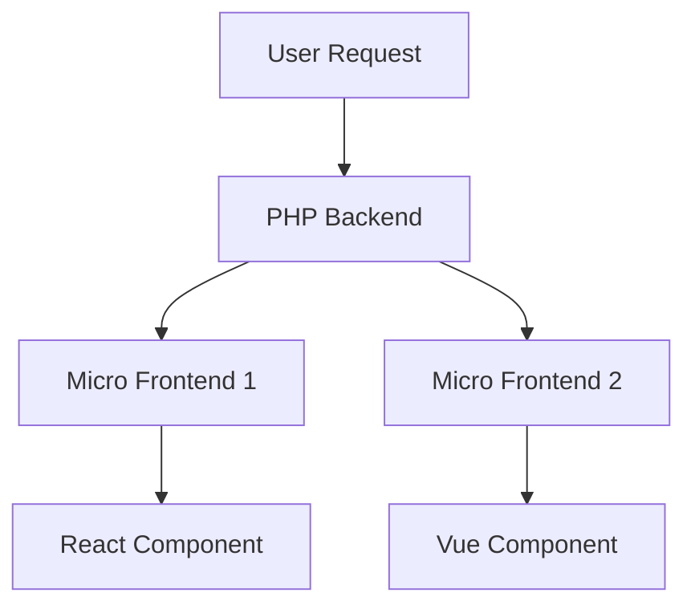

## 19.11 Micro Frontends

As web applications grow in complexity, the need for scalable and maintainable frontend architectures becomes increasingly important. Enter Micro Frontends—a revolutionary approach that breaks down the frontend monolith into smaller, manageable pieces. In this section, we will delve into the concept of Micro Frontends, their integration with PHP, and the tools and best practices for implementing them effectively.

### Concept of Micro Frontends

Micro Frontends extend the principles of microservices to the frontend world. The idea is to decompose a web application into smaller, independent applications that can be developed, deployed, and maintained separately. Each micro frontend is responsible for a distinct part of the user interface and can be built using different technologies and frameworks.

#### Key Characteristics

- **Independence:** Each micro frontend operates independently, allowing teams to work autonomously without affecting other parts of the application.
- **Technology Agnostic:** Different micro frontends can be built using different technologies, enabling teams to choose the best tools for their specific needs.
- **Scalability:** By breaking down the frontend into smaller parts, applications can scale more efficiently.
- **Resilience:** Failures in one micro frontend do not necessarily affect the entire application, enhancing overall resilience.

### Integration with PHP

PHP, being a versatile server-side language, plays a crucial role in serving and managing micro frontends. It can act as a gateway, orchestrating the delivery of different frontend modules to the client.

#### Serving Micro Frontends from PHP

To serve micro frontends using PHP, you can follow these steps:

1. **Routing:** Use PHP to route requests to the appropriate micro frontend. This can be achieved using a PHP framework like Laravel or Symfony, which provides robust routing capabilities.

2. **Module Loading:** Dynamically load different frontend modules based on the route. PHP can serve static assets or act as a proxy to fetch them from a CDN or another server.

3. **State Management:** Manage shared state across micro frontends using PHP sessions or a centralized state management solution.

4. **API Gateway:** PHP can serve as an API gateway, aggregating data from various microservices and providing a unified API for the frontend.

### Advantages of Micro Frontends

Implementing micro frontends offers several advantages:

- **Independent Development and Deployment:** Teams can develop and deploy their micro frontends independently, reducing bottlenecks and speeding up the development process.
- **Improved Maintainability:** Smaller codebases are easier to maintain and refactor.
- **Enhanced User Experience:** By loading only the necessary parts of the application, micro frontends can improve performance and user experience.
- **Flexibility in Technology Choices:** Teams can choose the best technology stack for their specific needs without being constrained by the choices of other teams.

### Tools for Micro Frontends

Several tools and frameworks facilitate the implementation of micro frontends. One of the most popular is Module Federation in Webpack 5.

#### Module Federation

Module Federation allows different parts of an application to be developed and deployed independently while sharing code and dependencies. It enables dynamic imports of remote modules at runtime, making it ideal for micro frontends.

- **Dynamic Module Loading:** Load modules dynamically at runtime, reducing initial load times and improving performance.
- **Shared Dependencies:** Share dependencies between different micro frontends to reduce duplication and improve efficiency.
- **Version Compatibility:** Handle different versions of shared dependencies gracefully, ensuring compatibility across micro frontends.

### Implementing Micro Frontends in PHP

Let's explore how to implement micro frontends in a PHP application with practical examples.

#### Example: Building a Dashboard with Micro Frontends

Consider a dashboard application with multiple widgets, each implemented as a separate micro frontend.

1. **Setup PHP Backend:**

```php
<?php
// index.php

require 'vendor/autoload.php';

use Symfony\Component\HttpFoundation\Request;
use Symfony\Component\HttpFoundation\Response;

$request = Request::createFromGlobals();
$path = $request->getPathInfo();

switch ($path) {
    case '/widget1':
        $response = new Response(file_get_contents('widgets/widget1.html'));
        break;
    case '/widget2':
        $response = new Response(file_get_contents('widgets/widget2.html'));
        break;
    default:
        $response = new Response('Page not found', 404);
}

$response->send();
```

2. **Create Micro Frontend Widgets:**

- **Widget 1 (React):**

```javascript
// widget1.js
import React from 'react';
import ReactDOM from 'react-dom';

function Widget1() {
    return <div>Widget 1 Content</div>;
}

ReactDOM.render(<Widget1 />, document.getElementById('widget1-root'));
```

- **Widget 2 (Vue):**

```javascript
// widget2.js
import Vue from 'vue';

new Vue({
    el: '#widget2-root',
    template: '<div>Widget 2 Content</div>'
});
```

3. **Integrate with PHP:**

- Serve the widgets from the PHP backend as shown in the `index.php` file.
- Use PHP to manage routing and serve the appropriate widget based on the request path.

### Design Considerations

When implementing micro frontends, consider the following:

- **Communication Between Micro Frontends:** Use events or a shared state management solution to facilitate communication between micro frontends.
- **Consistent User Experience:** Ensure a consistent look and feel across different micro frontends by sharing styles and design guidelines.
- **Security:** Implement security measures to protect against cross-site scripting (XSS) and other vulnerabilities.

### PHP Unique Features

PHP offers several unique features that can enhance the implementation of micro frontends:

- **Session Management:** Use PHP sessions to manage user state across different micro frontends.
- **Middleware:** Utilize PHP middleware to handle cross-cutting concerns like authentication and logging.
- **Templating Engines:** Use PHP templating engines like Twig to render dynamic content and integrate micro frontends seamlessly.

### Differences and Similarities with Other Patterns

Micro frontends share similarities with microservices but are focused on the frontend. Unlike traditional monolithic frontends, micro frontends allow for independent development and deployment, similar to microservices.

### Visualizing Micro Frontends Architecture



**Diagram Description:** This diagram illustrates the architecture of a micro frontends application. The PHP backend routes user requests to the appropriate micro frontend, which then loads the corresponding component.

### Try It Yourself

Experiment with the code examples by:

- Adding a new widget using a different frontend framework like Angular or Svelte.
- Implementing shared state management using a library like Redux or Vuex.
- Enhancing the PHP backend to include authentication and authorization.

### Knowledge Check

- How do micro frontends improve scalability and maintainability?
- What role does PHP play in serving micro frontends?
- How can Module Federation be used to implement micro frontends?

### Embrace the Journey

Remember, adopting micro frontends is a journey. Start small, experiment with different tools and frameworks, and gradually scale your application. Stay curious and keep learning!

## Quiz: Micro Frontends



### What is the primary goal of micro frontends?

- [x] To decompose a web application into smaller, independent applications.
- [ ] To merge multiple frontend frameworks into one.
- [ ] To enhance backend performance.
- [ ] To eliminate the need for a frontend framework.

> **Explanation:** Micro frontends aim to break down a web application into smaller, independent applications that can be developed and deployed separately.

### How does PHP facilitate micro frontends?

- [x] By serving different frontend modules and managing routing.
- [ ] By compiling frontend code into machine code.
- [ ] By replacing JavaScript frameworks.
- [ ] By providing a graphical user interface.

> **Explanation:** PHP can serve different frontend modules, manage routing, and act as an API gateway for micro frontends.

### What is Module Federation?

- [x] A feature in Webpack 5 that allows dynamic imports of remote modules.
- [ ] A PHP library for managing dependencies.
- [ ] A CSS framework for styling micro frontends.
- [ ] A database management tool.

> **Explanation:** Module Federation is a feature in Webpack 5 that enables dynamic imports of remote modules, making it ideal for micro frontends.

### Which of the following is an advantage of micro frontends?

- [x] Independent development and deployment.
- [ ] Increased monolithic structure.
- [ ] Reduced frontend complexity.
- [ ] Unified technology stack.

> **Explanation:** Micro frontends allow for independent development and deployment, enhancing scalability and maintainability.

### How can micro frontends improve user experience?

- [x] By loading only the necessary parts of the application.
- [ ] By using a single-page application architecture.
- [ ] By reducing the number of HTTP requests.
- [ ] By eliminating JavaScript.

> **Explanation:** Micro frontends can improve user experience by loading only the necessary parts of the application, reducing load times.

### What is a key consideration when implementing micro frontends?

- [x] Communication between micro frontends.
- [ ] Using a single frontend framework.
- [ ] Eliminating backend services.
- [ ] Avoiding state management.

> **Explanation:** Effective communication between micro frontends is crucial for a seamless user experience.

### What role does PHP middleware play in micro frontends?

- [x] Handling cross-cutting concerns like authentication and logging.
- [ ] Compiling JavaScript code.
- [ ] Rendering CSS styles.
- [ ] Managing database connections.

> **Explanation:** PHP middleware can handle cross-cutting concerns such as authentication and logging in a micro frontends architecture.

### What is a potential challenge of micro frontends?

- [x] Ensuring a consistent user experience across different micro frontends.
- [ ] Reducing backend complexity.
- [ ] Eliminating the need for a database.
- [ ] Increasing frontend monolith size.

> **Explanation:** Ensuring a consistent user experience across different micro frontends can be challenging due to varying technologies and styles.

### How can PHP sessions be used in micro frontends?

- [x] To manage user state across different micro frontends.
- [ ] To compile frontend code.
- [ ] To render HTML templates.
- [ ] To manage database transactions.

> **Explanation:** PHP sessions can be used to manage user state across different micro frontends, ensuring a cohesive experience.

### True or False: Micro frontends allow for technology agnosticism.

- [x] True
- [ ] False

> **Explanation:** Micro frontends allow different parts of an application to be built using different technologies, promoting technology agnosticism.


