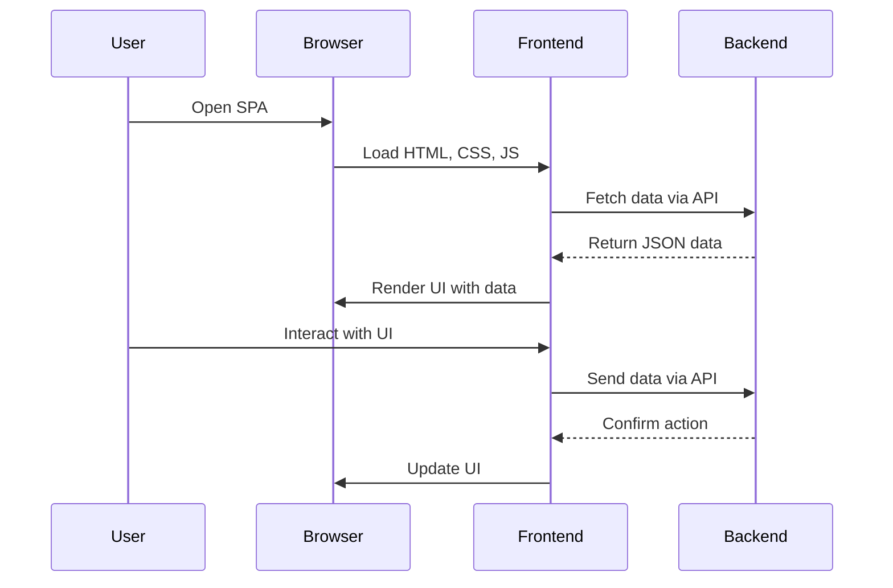

## 19.2 Implementing SPAs with a PHP Backend

In the modern web development landscape, Single Page Applications (SPAs) have emerged as a popular choice for building dynamic and responsive user interfaces. SPAs provide a seamless user experience by loading a single HTML page and dynamically updating the content as the user interacts with the application. This approach minimizes page reloads and enhances performance, making it ideal for applications that require a rich user interface.

### Understanding Single Page Applications (SPAs)

SPAs are web applications that load a single HTML page and dynamically update the content as the user interacts with the app. Unlike traditional multi-page applications, SPAs use AJAX and JavaScript to render content and manage routing on the client side. This architecture allows for a more fluid user experience, as it reduces the need for full-page reloads.

#### Key Characteristics of SPAs

- **Dynamic Content Loading:** SPAs fetch data asynchronously from the server and update the UI without reloading the entire page.
- **Client-Side Routing:** SPAs handle routing on the client side, allowing users to navigate between different views without refreshing the page.
- **Improved Performance:** By minimizing server requests and page reloads, SPAs offer faster load times and a more responsive user experience.
- **Enhanced User Experience:** SPAs provide a smooth and interactive experience, similar to native desktop applications.

### Choosing a Frontend Framework for SPAs

To build SPAs, developers often use frontend frameworks that provide the necessary tools and libraries for managing state, routing, and rendering. Some popular frameworks for building SPAs include:

#### Vue.js

[Vue.js](https://vuejs.org/) is a progressive JavaScript framework for building user interfaces. It is designed to be incrementally adoptable, meaning you can use it for a small part of your application or scale it up to manage the entire frontend. Vue.js offers a simple and flexible API, making it a great choice for both beginners and experienced developers.

#### React

[React](https://reactjs.org/) is a JavaScript library for building user interfaces, developed by Facebook. It allows developers to create reusable UI components and manage the application state efficiently. React's virtual DOM ensures high performance by minimizing direct manipulation of the actual DOM.

#### Angular

[Angular](https://angular.io/) is a platform and framework for building client-side applications using HTML, CSS, and JavaScript/TypeScript. Developed by Google, Angular provides a comprehensive solution for building SPAs, including tools for routing, forms, HTTP client, and more.

### Building a PHP Backend for SPAs

The backend of an SPA is responsible for providing the data and services required by the frontend. In a PHP-based backend, you can build RESTful or GraphQL APIs to serve as the data source for your SPA.

#### RESTful APIs

REST (Representational State Transfer) is an architectural style for designing networked applications. RESTful APIs use HTTP requests to perform CRUD (Create, Read, Update, Delete) operations on resources. They are stateless, meaning each request from the client contains all the information needed to process the request.

##### Creating a RESTful API in PHP

To create a RESTful API in PHP, you can use a framework like Laravel or Symfony, which provides built-in support for routing, controllers, and middleware. Here's a simple example of a RESTful API using Laravel:

```php
// routes/api.php

use Illuminate\Http\Request;
use Illuminate\Support\Facades\Route;
use App\Http\Controllers\ArticleController;

// Define a route for fetching all articles
Route::get('/articles', [ArticleController::class, 'index']);

// Define a route for fetching a single article by ID
Route::get('/articles/{id}', [ArticleController::class, 'show']);

// Define a route for creating a new article
Route::post('/articles', [ArticleController::class, 'store']);

// Define a route for updating an existing article
Route::put('/articles/{id}', [ArticleController::class, 'update']);

// Define a route for deleting an article
Route::delete('/articles/{id}', [ArticleController::class, 'destroy']);
```

In the `ArticleController`, you would define methods to handle each of these routes, interacting with the database to perform the necessary operations.

#### GraphQL APIs

GraphQL is a query language for APIs that allows clients to request exactly the data they need. Unlike REST, where the server defines the shape and size of the response, GraphQL gives clients the flexibility to specify the structure of the response.

##### Creating a GraphQL API in PHP

To create a GraphQL API in PHP, you can use libraries like `webonyx/graphql-php` or frameworks like Laravel with the `lighthouse-php` package. Here's a basic example using `webonyx/graphql-php`:

```php
// index.php

require 'vendor/autoload.php';

use GraphQL\GraphQL;
use GraphQL\Type\Schema;
use GraphQL\Type\Definition\ObjectType;
use GraphQL\Type\Definition\Type;

// Define a simple query type
$queryType = new ObjectType([
    'name' => 'Query',
    'fields' => [
        'hello' => [
            'type' => Type::string(),
            'resolve' => function() {
                return 'Hello, world!';
            }
        ],
    ],
]);

// Create the schema
$schema = new Schema([
    'query' => $queryType,
]);

// Execute the query
$query = '{ hello }';
$result = GraphQL::executeQuery($schema, $query);
$output = $result->toArray();

// Output the result
header('Content-Type: application/json');
echo json_encode($output);
```

This example demonstrates a simple GraphQL API that responds with a "Hello, world!" message when queried.

### Configuring CORS for API Endpoints

Cross-Origin Resource Sharing (CORS) is a security feature implemented by browsers to restrict web pages from making requests to a different domain than the one that served the web page. When building SPAs, you often need to configure CORS to allow the frontend to communicate with the backend API.

#### Enabling CORS in PHP

To enable CORS in a PHP application, you can set the appropriate headers in your API responses. Here's an example of how to enable CORS in a PHP script:

```php
// cors.php

// Allow requests from any origin
header("Access-Control-Allow-Origin: *");

// Allow specific HTTP methods
header("Access-Control-Allow-Methods: GET, POST, PUT, DELETE, OPTIONS");

// Allow specific headers
header("Access-Control-Allow-Headers: Content-Type, Authorization");

// Handle preflight requests
if ($_SERVER['REQUEST_METHOD'] === 'OPTIONS') {
    http_response_code(204);
    exit;
}
```

This script sets the necessary headers to allow cross-origin requests from any domain. You can customize the headers to restrict access to specific domains or HTTP methods as needed.

### Integrating Frontend and Backend

Once you have set up your frontend framework and backend API, the next step is to integrate them. This involves making HTTP requests from the frontend to the backend to fetch or update data.

#### Fetching Data from the Backend

In a Vue.js application, you can use the `axios` library to make HTTP requests to your PHP backend. Here's an example of how to fetch data from a RESTful API:

```javascript
// App.vue

<template>
  <div>
    <h1>Articles</h1>
    <ul>
      <li v-for="article in articles" :key="article.id">{{ article.title }}</li>
    </ul>
  </div>
</template>

<script>
import axios from 'axios';

export default {
  data() {
    return {
      articles: [],
    };
  },
  created() {
    // Fetch articles from the API when the component is created
    axios.get('http://localhost/api/articles')
      .then(response => {
        this.articles = response.data;
      })
      .catch(error => {
        console.error('Error fetching articles:', error);
      });
  },
};
</script>
```

In this example, the `axios.get` method is used to send a GET request to the API endpoint, and the response data is stored in the `articles` array.

#### Submitting Data to the Backend

To submit data to the backend, you can use the `axios.post` method. Here's an example of how to create a new article:

```javascript
// NewArticle.vue

<template>
  <div>
    <h1>Create New Article</h1>
    <form @submit.prevent="submitArticle">
      <input v-model="title" placeholder="Title" required />
      <textarea v-model="content" placeholder="Content" required></textarea>
      <button type="submit">Submit</button>
    </form>
  </div>
</template>

<script>
import axios from 'axios';

export default {
  data() {
    return {
      title: '',
      content: '',
    };
  },
  methods: {
    submitArticle() {
      // Send a POST request to the API to create a new article
      axios.post('http://localhost/api/articles', {
        title: this.title,
        content: this.content,
      })
      .then(response => {
        console.log('Article created:', response.data);
        // Clear the form fields
        this.title = '';
        this.content = '';
      })
      .catch(error => {
        console.error('Error creating article:', error);
      });
    },
  },
};
</script>
```

In this example, the `submitArticle` method sends a POST request to the API with the article data, and the form fields are cleared upon successful submission.

### Visualizing the SPA Architecture

To better understand the architecture of an SPA with a PHP backend, let's visualize the interaction between the frontend and backend components.



**Diagram Description:** This sequence diagram illustrates the flow of data and interactions in an SPA with a PHP backend. The user opens the SPA in their browser, which loads the frontend assets. The frontend then fetches data from the backend API and renders the UI. User interactions are handled by the frontend, which communicates with the backend to fetch or update data as needed.

### Try It Yourself

Now that you've learned the basics of implementing SPAs with a PHP backend, it's time to experiment with the code examples provided. Here are some suggestions for modifications:

- **Add Authentication:** Implement user authentication in your SPA using JWT (JSON Web Tokens) or OAuth2.
- **Implement Pagination:** Modify the API and frontend to support pagination for large datasets.
- **Enhance Error Handling:** Improve error handling in the frontend to provide better feedback to users.
- **Optimize Performance:** Use caching strategies to reduce the number of API requests and improve performance.

### Knowledge Check

Before moving on, take a moment to review the key concepts covered in this section:

- What are the key characteristics of SPAs?
- How do frontend frameworks like Vue.js, React, and Angular help in building SPAs?
- What are the differences between RESTful and GraphQL APIs?
- How can you enable CORS in a PHP application?
- How does the frontend communicate with the backend in an SPA?

### Conclusion

Implementing SPAs with a PHP backend involves a combination of frontend and backend development skills. By leveraging modern frontend frameworks and building robust APIs, you can create dynamic and responsive web applications that provide an excellent user experience. Remember, this is just the beginning. As you progress, you'll build more complex and interactive applications. Keep experimenting, stay curious, and enjoy the journey!

## Quiz: Implementing SPAs with a PHP Backend



### What is a key characteristic of Single Page Applications (SPAs)?

- [x] They dynamically update content without full-page reloads.
- [ ] They require server-side rendering for every request.
- [ ] They are only suitable for small applications.
- [ ] They do not use JavaScript.

> **Explanation:** SPAs dynamically update content without full-page reloads, providing a seamless user experience.

### Which frontend framework is known for its virtual DOM?

- [ ] Vue.js
- [x] React
- [ ] Angular
- [ ] Ember.js

> **Explanation:** React is known for its virtual DOM, which enhances performance by minimizing direct manipulation of the actual DOM.

### What is the main advantage of using GraphQL over REST?

- [x] Clients can request exactly the data they need.
- [ ] It is easier to implement than REST.
- [ ] It does not require a server.
- [ ] It is only used for real-time applications.

> **Explanation:** GraphQL allows clients to request exactly the data they need, providing more flexibility than REST.

### How can you enable CORS in a PHP application?

- [x] By setting appropriate headers in the API responses.
- [ ] By using a special PHP extension.
- [ ] By configuring the database.
- [ ] By modifying the frontend code.

> **Explanation:** CORS can be enabled by setting appropriate headers in the API responses to allow cross-origin requests.

### Which HTTP method is used to create a new resource in a RESTful API?

- [ ] GET
- [x] POST
- [ ] PUT
- [ ] DELETE

> **Explanation:** The POST method is used to create a new resource in a RESTful API.

### What library is commonly used in Vue.js for making HTTP requests?

- [ ] jQuery
- [ ] Fetch API
- [x] Axios
- [ ] Lodash

> **Explanation:** Axios is commonly used in Vue.js applications for making HTTP requests.

### In a sequence diagram, what does the arrow from Frontend to Backend represent?

- [x] A request from the frontend to the backend.
- [ ] A response from the backend to the frontend.
- [ ] A user interaction with the frontend.
- [ ] A data update in the frontend.

> **Explanation:** The arrow from Frontend to Backend represents a request from the frontend to the backend.

### What is a common use case for implementing SPAs?

- [x] Building dynamic and interactive web applications.
- [ ] Creating static websites with minimal interaction.
- [ ] Developing command-line tools.
- [ ] Designing database schemas.

> **Explanation:** SPAs are commonly used for building dynamic and interactive web applications.

### Which of the following is NOT a frontend framework for building SPAs?

- [ ] Vue.js
- [ ] React
- [ ] Angular
- [x] Laravel

> **Explanation:** Laravel is a PHP framework, not a frontend framework for building SPAs.

### True or False: SPAs require a full-page reload for every user interaction.

- [ ] True
- [x] False

> **Explanation:** SPAs do not require a full-page reload for every user interaction; they dynamically update content on the client side.


