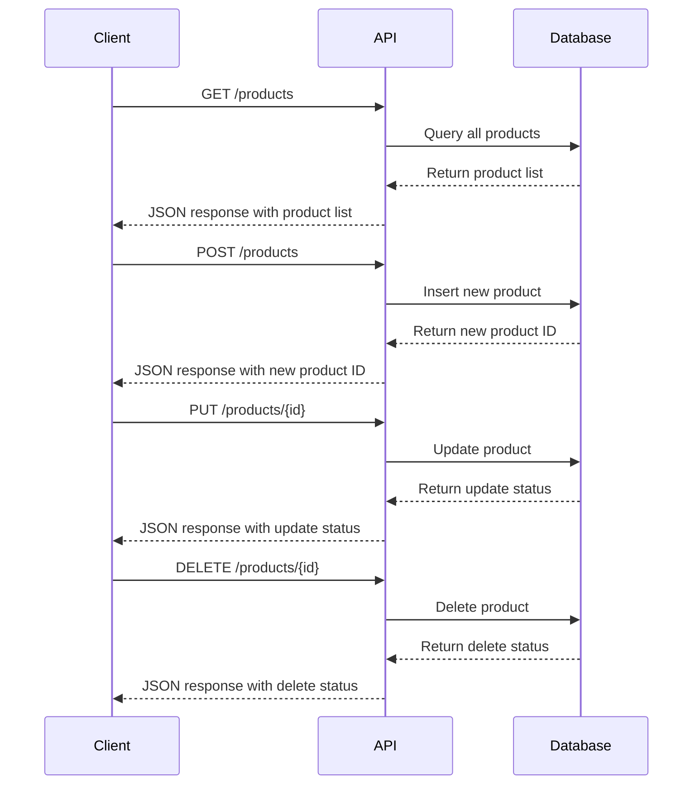

## 19.3 RESTful APIs for Frontend Consumption

In today's interconnected digital landscape, RESTful APIs have become the backbone of modern web applications, enabling seamless communication between the frontend and backend. This section delves into the intricacies of designing and implementing RESTful APIs in PHP, focusing on best practices for frontend consumption. We'll explore resource-oriented endpoints, proper use of HTTP methods, response formats, versioning, and documentation.

### Designing APIs

Designing a RESTful API involves creating a structured and intuitive interface that allows frontend applications to interact with backend services efficiently. Let's break down the key components of API design:

#### Resource-Oriented Endpoints

At the heart of RESTful API design is the concept of resources. Resources represent entities or objects in your application, such as users, products, or orders. Each resource is identified by a unique URI (Uniform Resource Identifier).

- **Identify Resources:** Begin by identifying the core entities in your application. For example, in an e-commerce application, resources might include `/products`, `/orders`, and `/customers`.
- **Design Resource URIs:** Use nouns to represent resources in your URIs. Avoid verbs, as the HTTP method will convey the action. For example, use `/products` instead of `/getProducts`.
- **Hierarchical Structure:** Organize resources hierarchically to reflect relationships. For example, `/customers/{customerId}/orders` represents orders belonging to a specific customer.

#### Use Proper HTTP Methods

HTTP methods, also known as verbs, define the action to be performed on a resource. The most commonly used methods in RESTful APIs are:

- **GET:** Retrieve data from a resource. For example, `GET /products` fetches a list of products.
- **POST:** Create a new resource. For example, `POST /products` adds a new product.
- **PUT:** Update an existing resource. For example, `PUT /products/{id}` updates the product with the specified ID.
- **DELETE:** Remove a resource. For example, `DELETE /products/{id}` deletes the product with the specified ID.
- **PATCH:** Partially update a resource. For example, `PATCH /products/{id}` updates specific fields of the product.

#### Response Formats

The response format is crucial for ensuring that frontend applications can easily parse and utilize the data returned by the API. JSON (JavaScript Object Notation) is the standard format for API responses due to its lightweight nature and ease of use.

- **Consistency:** Ensure that all API responses are consistent in structure and format. This makes it easier for frontend developers to handle responses.
- **Error Handling:** Include error codes and messages in the response to help frontend developers diagnose issues. For example, return a 404 status code with a message if a resource is not found.

#### Versioning and Documentation

As APIs evolve, changes may be necessary to accommodate new features or improvements. Versioning and documentation are essential for managing these changes without disrupting existing clients.

- **Versioning:** Use version numbers in your API URIs to indicate different versions. For example, `/v1/products` and `/v2/products`. This allows clients to continue using older versions while transitioning to newer ones.
- **Documentation:** Provide comprehensive documentation for your API, including endpoint descriptions, request/response examples, and authentication details. Tools like Swagger/OpenAPI can help generate interactive documentation.

### Implementing RESTful APIs in PHP

Now that we've covered the design principles, let's explore how to implement RESTful APIs in PHP. We'll use a simple example of a product management API.

#### Setting Up the Environment

Before we dive into the code, ensure you have a PHP development environment set up. You'll need:

- PHP 7.4 or later
- A web server (e.g., Apache or Nginx)
- Composer for dependency management

#### Creating a Basic API Structure

Let's start by creating a basic structure for our API. We'll use a simple directory layout:

```
/api
    /v1
        /products
            index.php
    /config
        database.php
    /src
        Product.php
        ProductController.php
```

#### Connecting to the Database

First, we'll set up a database connection. Create a `database.php` file in the `/config` directory:

```php
<?php
// config/database.php

$host = 'localhost';
$db = 'api_example';
$user = 'root';
$pass = '';

try {
    $pdo = new PDO("mysql:host=$host;dbname=$db", $user, $pass);
    $pdo->setAttribute(PDO::ATTR_ERRMODE, PDO::ERRMODE_EXCEPTION);
} catch (PDOException $e) {
    die("Could not connect to the database: " . $e->getMessage());
}
```

#### Defining the Product Model

Next, we'll define a simple Product model. Create a `Product.php` file in the `/src` directory:

```php
<?php
// src/Product.php

class Product
{
    private $pdo;

    public function __construct($pdo)
    {
        $this->pdo = $pdo;
    }

    public function getAll()
    {
        $stmt = $this->pdo->query("SELECT * FROM products");
        return $stmt->fetchAll(PDO::FETCH_ASSOC);
    }

    public function getById($id)
    {
        $stmt = $this->pdo->prepare("SELECT * FROM products WHERE id = :id");
        $stmt->execute(['id' => $id]);
        return $stmt->fetch(PDO::FETCH_ASSOC);
    }

    public function create($data)
    {
        $stmt = $this->pdo->prepare("INSERT INTO products (name, price) VALUES (:name, :price)");
        $stmt->execute(['name' => $data['name'], 'price' => $data['price']]);
        return $this->pdo->lastInsertId();
    }

    public function update($id, $data)
    {
        $stmt = $this->pdo->prepare("UPDATE products SET name = :name, price = :price WHERE id = :id");
        $stmt->execute(['name' => $data['name'], 'price' => $data['price'], 'id' => $id]);
        return $stmt->rowCount();
    }

    public function delete($id)
    {
        $stmt = $this->pdo->prepare("DELETE FROM products WHERE id = :id");
        $stmt->execute(['id' => $id]);
        return $stmt->rowCount();
    }
}
```

#### Creating the Product Controller

Now, let's create a controller to handle API requests. Create a `ProductController.php` file in the `/src` directory:

```php
<?php
// src/ProductController.php

require_once __DIR__ . '/../config/database.php';
require_once __DIR__ . '/Product.php';

class ProductController
{
    private $product;

    public function __construct()
    {
        global $pdo;
        $this->product = new Product($pdo);
    }

    public function handleRequest()
    {
        $method = $_SERVER['REQUEST_METHOD'];
        $uri = $_SERVER['REQUEST_URI'];

        switch ($method) {
            case 'GET':
                if (preg_match('/\/products\/(\d+)/', $uri, $matches)) {
                    $this->getProduct($matches[1]);
                } else {
                    $this->getAllProducts();
                }
                break;
            case 'POST':
                $this->createProduct();
                break;
            case 'PUT':
                if (preg_match('/\/products\/(\d+)/', $uri, $matches)) {
                    $this->updateProduct($matches[1]);
                }
                break;
            case 'DELETE':
                if (preg_match('/\/products\/(\d+)/', $uri, $matches)) {
                    $this->deleteProduct($matches[1]);
                }
                break;
            default:
                $this->sendResponse(405, ['error' => 'Method Not Allowed']);
                break;
        }
    }

    private function getAllProducts()
    {
        $products = $this->product->getAll();
        $this->sendResponse(200, $products);
    }

    private function getProduct($id)
    {
        $product = $this->product->getById($id);
        if ($product) {
            $this->sendResponse(200, $product);
        } else {
            $this->sendResponse(404, ['error' => 'Product Not Found']);
        }
    }

    private function createProduct()
    {
        $data = json_decode(file_get_contents('php://input'), true);
        if ($data && isset($data['name']) && isset($data['price'])) {
            $id = $this->product->create($data);
            $this->sendResponse(201, ['id' => $id]);
        } else {
            $this->sendResponse(400, ['error' => 'Invalid Input']);
        }
    }

    private function updateProduct($id)
    {
        $data = json_decode(file_get_contents('php://input'), true);
        if ($data && isset($data['name']) && isset($data['price'])) {
            $rows = $this->product->update($id, $data);
            if ($rows > 0) {
                $this->sendResponse(200, ['message' => 'Product Updated']);
            } else {
                $this->sendResponse(404, ['error' => 'Product Not Found']);
            }
        } else {
            $this->sendResponse(400, ['error' => 'Invalid Input']);
        }
    }

    private function deleteProduct($id)
    {
        $rows = $this->product->delete($id);
        if ($rows > 0) {
            $this->sendResponse(200, ['message' => 'Product Deleted']);
        } else {
            $this->sendResponse(404, ['error' => 'Product Not Found']);
        }
    }

    private function sendResponse($status, $data)
    {
        header("Content-Type: application/json");
        http_response_code($status);
        echo json_encode($data);
    }
}
```

#### Handling API Requests

Finally, let's handle incoming API requests. Create an `index.php` file in the `/api/v1/products` directory:

```php
<?php
// api/v1/products/index.php

require_once __DIR__ . '/../../../src/ProductController.php';

$controller = new ProductController();
$controller->handleRequest();
```

### Visualizing RESTful API Architecture

To better understand the flow of requests and responses in a RESTful API, let's visualize the architecture using a sequence diagram.



### Best Practices for RESTful APIs

To ensure your RESTful API is robust and maintainable, consider the following best practices:

- **Use HTTPS:** Always use HTTPS to encrypt data in transit and protect sensitive information.
- **Implement Authentication:** Use authentication mechanisms like OAuth2 or JWT to secure your API.
- **Rate Limiting:** Implement rate limiting to prevent abuse and ensure fair usage.
- **Caching:** Use caching strategies to improve performance and reduce server load.
- **Error Handling:** Provide meaningful error messages and status codes to help clients diagnose issues.
- **Testing:** Regularly test your API using tools like Postman or automated testing frameworks.

### Try It Yourself

Now that we've covered the basics of designing and implementing RESTful APIs, it's time to experiment. Try modifying the code examples to add new features or improve existing functionality. Here are a few ideas:

- **Add Pagination:** Implement pagination for the `GET /products` endpoint to handle large datasets.
- **Implement Search:** Add search functionality to filter products based on criteria like name or price.
- **Enhance Security:** Integrate JWT authentication to secure the API.

### References and Further Reading

- [RESTful Web Services](https://restfulapi.net/)
- [PHP: Hypertext Preprocessor](https://www.php.net/)
- [OAuth 2.0](https://oauth.net/2/)
- [JSON Web Tokens (JWT)](https://jwt.io/)

### Knowledge Check

Before we wrap up, let's reinforce what we've learned with a few questions:

1. What are the key components of a RESTful API design?
2. How do you handle versioning in RESTful APIs?
3. Why is JSON the preferred response format for APIs?
4. What are some best practices for securing RESTful APIs?

### Embrace the Journey

Remember, mastering RESTful APIs is a journey. As you continue to build and refine your APIs, you'll gain valuable insights and skills. Keep experimenting, stay curious, and enjoy the process!

## Quiz: RESTful APIs for Frontend Consumption



### What is the primary purpose of using resource-oriented endpoints in RESTful APIs?

- [x] To represent entities or objects in the application
- [ ] To perform actions on resources
- [ ] To define the structure of the database
- [ ] To manage user authentication

> **Explanation:** Resource-oriented endpoints represent entities or objects in the application, allowing clients to interact with them using HTTP methods.

### Which HTTP method is used to update an existing resource in a RESTful API?

- [ ] GET
- [ ] POST
- [x] PUT
- [ ] DELETE

> **Explanation:** The PUT method is used to update an existing resource in a RESTful API.

### What is the standard format for API responses in RESTful APIs?

- [ ] XML
- [x] JSON
- [ ] CSV
- [ ] HTML

> **Explanation:** JSON is the standard format for API responses due to its lightweight nature and ease of use.

### How can you manage changes in a RESTful API without disrupting existing clients?

- [ ] By using different HTTP methods
- [x] By versioning the API
- [ ] By changing the response format
- [ ] By using different URIs

> **Explanation:** Versioning the API allows you to manage changes without disrupting existing clients.

### What is a common tool used for generating interactive API documentation?

- [ ] Postman
- [ ] GitHub
- [x] Swagger/OpenAPI
- [ ] Jenkins

> **Explanation:** Swagger/OpenAPI is commonly used for generating interactive API documentation.

### Which of the following is a best practice for securing RESTful APIs?

- [x] Implementing authentication mechanisms
- [ ] Using HTTP instead of HTTPS
- [ ] Allowing unlimited requests
- [ ] Returning plain text responses

> **Explanation:** Implementing authentication mechanisms is a best practice for securing RESTful APIs.

### What is the purpose of rate limiting in RESTful APIs?

- [ ] To increase server load
- [x] To prevent abuse and ensure fair usage
- [ ] To encrypt data in transit
- [ ] To provide meaningful error messages

> **Explanation:** Rate limiting prevents abuse and ensures fair usage of the API.

### Which HTTP method is used to retrieve data from a resource in a RESTful API?

- [x] GET
- [ ] POST
- [ ] PUT
- [ ] DELETE

> **Explanation:** The GET method is used to retrieve data from a resource in a RESTful API.

### What should be included in API responses to help frontend developers diagnose issues?

- [ ] Only the data
- [ ] HTML pages
- [x] Error codes and messages
- [ ] Database queries

> **Explanation:** Including error codes and messages in API responses helps frontend developers diagnose issues.

### True or False: JSON is the only format that can be used for API responses.

- [ ] True
- [x] False

> **Explanation:** While JSON is the standard format, other formats like XML can also be used for API responses.




