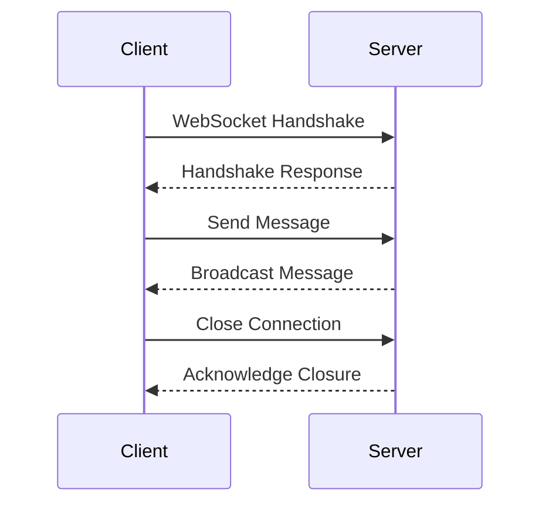

## 19.4 WebSockets and Real-Time Communication

In the world of web development, real-time communication has become a cornerstone for creating interactive and dynamic applications. WebSockets, a protocol that facilitates full-duplex communication channels over a single TCP connection, is a powerful tool for achieving this. In this section, we will explore how WebSockets can be implemented in PHP, discuss popular libraries and frameworks, and examine practical use cases.

### Understanding WebSockets

**WebSockets** provide a persistent connection between the client and server, allowing for continuous data exchange. Unlike traditional HTTP requests, which are stateless and require a new connection for each request, WebSockets maintain an open connection, enabling real-time data flow.

#### Key Features of WebSockets

- **Full-Duplex Communication:** Allows simultaneous two-way communication between client and server.
- **Low Latency:** Reduces the delay in data transmission, making it ideal for real-time applications.
- **Persistent Connection:** Maintains an open connection, reducing the overhead of establishing new connections.
- **Efficient Data Transfer:** Uses a lightweight protocol, minimizing data packet size.

### Implementing WebSockets in PHP

PHP, traditionally a server-side scripting language, can effectively handle WebSockets with the right tools and libraries. Let's explore some popular options for implementing WebSockets in PHP.

#### Ratchet: A PHP WebSocket Library

[**Ratchet**](http://socketo.me/) is a popular PHP library for building real-time, bi-directional applications. It provides a simple API for creating WebSocket servers and is built on top of ReactPHP, an event-driven, non-blocking I/O library.

##### Setting Up Ratchet

To get started with Ratchet, you'll need to install it via Composer:

```bash
composer require cboden/ratchet
```

##### Creating a Simple WebSocket Server

Here's a basic example of a WebSocket server using Ratchet:

```php
<?php

use Ratchet\MessageComponentInterface;
use Ratchet\ConnectionInterface;

class ChatServer implements MessageComponentInterface {
    protected $clients;

    public function __construct() {
        $this->clients = new \SplObjectStorage;
    }

    public function onOpen(ConnectionInterface $conn) {
        // Store the new connection
        $this->clients->attach($conn);
        echo "New connection! ({$conn->resourceId})\n";
    }

    public function onMessage(ConnectionInterface $from, $msg) {
        foreach ($this->clients as $client) {
            if ($from !== $client) {
                // Send message to all clients except the sender
                $client->send($msg);
            }
        }
    }

    public function onClose(ConnectionInterface $conn) {
        // Remove the connection
        $this->clients->detach($conn);
        echo "Connection {$conn->resourceId} has disconnected\n";
    }

    public function onError(ConnectionInterface $conn, \Exception $e) {
        echo "An error has occurred: {$e->getMessage()}\n";
        $conn->close();
    }
}

// Run the server
$server = \Ratchet\App::factory();
$server->route('/chat', new ChatServer, ['*']);
$server->run();
```

In this example, we define a `ChatServer` class that implements the `MessageComponentInterface`. The server listens for new connections, messages, and disconnections, broadcasting messages to all connected clients except the sender.

##### Running the WebSocket Server

To run the server, execute the PHP script from the command line:

```bash
php chat-server.php
```

##### Client-Side Integration

To connect to the WebSocket server from a client, use JavaScript:

```javascript
const socket = new WebSocket('ws://localhost:8080/chat');

socket.onopen = function() {
    console.log('Connected to the WebSocket server');
};

socket.onmessage = function(event) {
    console.log('Message from server:', event.data);
};

socket.onclose = function() {
    console.log('Disconnected from the WebSocket server');
};

// Send a message to the server
socket.send('Hello, server!');
```

### Firebase Realtime Database

[**Firebase**](https://firebase.google.com/) offers a Realtime Database that provides a cloud-hosted NoSQL database with real-time data synchronization. While not a WebSocket implementation per se, it achieves similar real-time capabilities through its SDKs.

#### Setting Up Firebase

To use Firebase Realtime Database, you'll need to set up a Firebase project and integrate the Firebase SDK into your PHP application.

##### Firebase SDK for PHP

While Firebase primarily targets mobile and web applications, you can use its REST API to interact with the Realtime Database from PHP.

```php
<?php

$firebaseUrl = 'https://your-database-name.firebaseio.com/';
$firebaseSecret = 'your-database-secret';

// Initialize Firebase
$firebase = new \Firebase\FirebaseLib($firebaseUrl, $firebaseSecret);

// Set data
$firebase->set('/path/to/data', ['key' => 'value']);

// Get data
$data = $firebase->get('/path/to/data');
echo $data;
```

### Use Cases for WebSockets

WebSockets are ideal for applications that require real-time data exchange. Here are some common use cases:

#### Chat Applications

WebSockets are perfect for building chat applications, where messages need to be delivered instantly to all participants.

#### Live Updates

For applications like stock tickers, sports scores, or news feeds, WebSockets provide a way to push updates to users in real-time.

#### Online Gaming

In multiplayer games, WebSockets enable real-time interaction between players, ensuring a seamless gaming experience.

#### Collaborative Tools

Applications like collaborative document editors or whiteboards benefit from WebSockets, allowing multiple users to interact with shared content simultaneously.

### Visualizing WebSocket Communication

To better understand the flow of WebSocket communication, let's visualize it using a sequence diagram.



In this diagram, we see the initial handshake between the client and server, followed by message exchange and connection closure.

### Key Considerations

When implementing WebSockets in PHP, consider the following:

- **Scalability:** WebSocket servers can handle many simultaneous connections, but scaling may require load balancing and distributed architecture.
- **Security:** Ensure secure communication by using WSS (WebSocket Secure) and implementing authentication mechanisms.
- **Error Handling:** Implement robust error handling to manage disconnections and unexpected errors gracefully.

### PHP Unique Features

PHP's event-driven libraries, like ReactPHP, make it well-suited for handling WebSockets. Additionally, PHP's ease of integration with various databases and services enhances its capability to support real-time applications.

### Differences and Similarities

WebSockets are often compared to HTTP/2 Server-Sent Events (SSE). While both enable real-time communication, WebSockets offer full-duplex communication, whereas SSE is unidirectional (server to client).

### Try It Yourself

Experiment with the provided code examples by modifying the message handling logic or integrating a database to store chat history. Try creating a simple chat application with user authentication and message persistence.

### Further Reading

For more information on WebSockets and real-time communication, consider the following resources:

- [MDN Web Docs: WebSockets](https://developer.mozilla.org/en-US/docs/Web/API/WebSockets_API)
- [Ratchet Documentation](http://socketo.me/docs/)
- [Firebase Realtime Database](https://firebase.google.com/docs/database)

### Knowledge Check

- What are the key features of WebSockets?
- How does Ratchet facilitate WebSocket communication in PHP?
- What are some common use cases for WebSockets?
- How do WebSockets differ from Server-Sent Events?

### Embrace the Journey

Remember, mastering WebSockets and real-time communication opens up a world of possibilities for creating interactive and engaging applications. Keep experimenting, stay curious, and enjoy the journey!

## Quiz: WebSockets and Real-Time Communication



### What is a key feature of WebSockets?

- [x] Full-duplex communication
- [ ] Stateless communication
- [ ] Unidirectional data flow
- [ ] High latency

> **Explanation:** WebSockets provide full-duplex communication, allowing simultaneous two-way data exchange between client and server.

### Which PHP library is commonly used for WebSocket implementation?

- [x] Ratchet
- [ ] Laravel
- [ ] Symfony
- [ ] CodeIgniter

> **Explanation:** Ratchet is a popular PHP library for building WebSocket applications.

### What is a common use case for WebSockets?

- [x] Chat applications
- [ ] Static websites
- [ ] Batch processing
- [ ] File storage

> **Explanation:** WebSockets are ideal for chat applications due to their real-time communication capabilities.

### How do WebSockets differ from HTTP requests?

- [x] WebSockets maintain a persistent connection
- [ ] WebSockets are stateless
- [ ] WebSockets use a heavier protocol
- [ ] WebSockets require a new connection for each request

> **Explanation:** WebSockets maintain a persistent connection, unlike HTTP requests, which are stateless and require a new connection for each request.

### Which protocol is used for secure WebSocket communication?

- [x] WSS
- [ ] HTTPS
- [ ] FTP
- [ ] SMTP

> **Explanation:** WSS (WebSocket Secure) is used for secure WebSocket communication.

### What is the role of the `onMessage` method in a WebSocket server?

- [x] Handle incoming messages
- [ ] Establish a connection
- [ ] Close a connection
- [ ] Log errors

> **Explanation:** The `onMessage` method handles incoming messages from clients.

### What is a benefit of using WebSockets for online gaming?

- [x] Real-time interaction
- [ ] Batch updates
- [ ] High latency
- [ ] Unidirectional communication

> **Explanation:** WebSockets enable real-time interaction between players, which is crucial for online gaming.

### What library does Ratchet build upon?

- [x] ReactPHP
- [ ] Laravel
- [ ] Symfony
- [ ] CodeIgniter

> **Explanation:** Ratchet is built on top of ReactPHP, an event-driven, non-blocking I/O library.

### What is a potential challenge when scaling WebSocket servers?

- [x] Managing many simultaneous connections
- [ ] Handling stateless requests
- [ ] Implementing batch processing
- [ ] Storing large files

> **Explanation:** WebSocket servers can handle many simultaneous connections, which may require load balancing and distributed architecture for scalability.

### True or False: WebSockets are unidirectional.

- [ ] True
- [x] False

> **Explanation:** WebSockets are not unidirectional; they provide full-duplex communication, allowing data to flow in both directions simultaneously.


