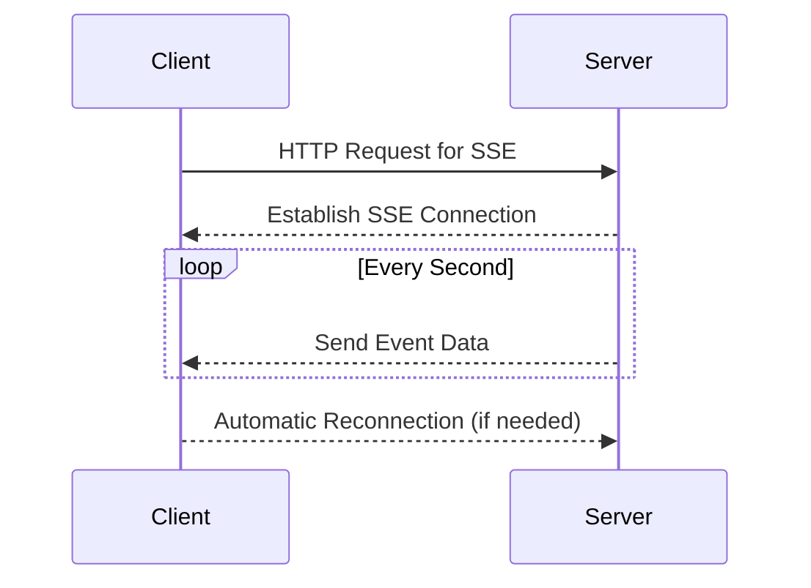

## 19.5 Server-Sent Events (SSE)

In the realm of web development, real-time data streaming has become increasingly vital for creating dynamic and interactive user experiences. Server-Sent Events (SSE) offer a powerful yet straightforward method for pushing updates from the server to the client over HTTP. In this section, we will delve into the concept of SSE, demonstrate how to implement it in PHP, and explore its advantages and use cases.

### SSE Concept

Server-Sent Events (SSE) is a technology that allows servers to push updates to clients over a single HTTP connection. Unlike traditional HTTP requests, where the client requests data from the server, SSE enables the server to send data to the client whenever new information is available. This is particularly useful for applications that require real-time updates, such as live feeds, notifications, and stock price updates.

#### Key Characteristics of SSE

- **Unidirectional Communication**: SSE is designed for one-way communication from the server to the client. This makes it simpler than WebSockets, which support bidirectional communication.
- **Persistent Connection**: SSE maintains a persistent connection between the server and the client, allowing for continuous data streaming without the need for repeated HTTP requests.
- **Text-Based Protocol**: SSE uses a text-based protocol, making it easy to implement and debug.
- **Automatic Reconnection**: The browser automatically attempts to reconnect to the server if the connection is lost, ensuring reliable data delivery.

### Implementing SSE in PHP

Implementing Server-Sent Events in PHP involves creating a PHP script that sends events to the client. The client listens for these events and updates the UI accordingly. Let's walk through the process of setting up SSE in PHP.

#### Step 1: Server-Side PHP Script

The server-side script is responsible for sending events to the client. Here's a simple example of a PHP script that sends a timestamp to the client every second:

```php
<?php
header('Content-Type: text/event-stream');
header('Cache-Control: no-cache');
header('Connection: keep-alive');

while (true) {
    $time = date('r');
    echo "data: The current server time is: {$time}\n\n";
    ob_flush();
    flush();
    sleep(1);
}
?>
```

**Explanation:**

- **Headers**: The script sets the `Content-Type` to `text/event-stream`, which is required for SSE. It also disables caching and keeps the connection alive.
- **Infinite Loop**: The script runs an infinite loop, sending the current server time to the client every second.
- **Data Format**: Each event is prefixed with `data:`, followed by the event data and two newline characters. This format is required for SSE.
- **Buffer Flushing**: `ob_flush()` and `flush()` are used to send the data to the client immediately.

#### Step 2: Client-Side JavaScript

The client-side code listens for events from the server and updates the UI. Here's an example using JavaScript:

```html
<!DOCTYPE html>
<html lang="en">
<head>
    <meta charset="UTF-8">
    <title>SSE Example</title>
</head>
<body>
    <h1>Server-Sent Events Example</h1>
    <div id="result"></div>

    <script>
        if (typeof(EventSource) !== "undefined") {
            const source = new EventSource("sse.php");
            source.onmessage = function(event) {
                document.getElementById("result").innerHTML = event.data;
            };
        } else {
            document.getElementById("result").innerHTML = "Sorry, your browser does not support server-sent events...";
        }
    </script>
</body>
</html>
```

**Explanation:**

- **EventSource**: The `EventSource` object is used to establish a connection to the server-side script (`sse.php`).
- **onmessage Event Handler**: The `onmessage` event handler is triggered whenever the server sends an event. It updates the `result` div with the event data.
- **Browser Support Check**: The script checks if the browser supports SSE using `typeof(EventSource)`.

### Advantages of SSE

Server-Sent Events offer several advantages, particularly for applications that require real-time updates:

- **Simplicity**: SSE is simpler to implement than WebSockets for one-way communication. It uses standard HTTP, which is widely supported and easy to work with.
- **Automatic Reconnection**: The browser handles reconnections automatically, ensuring that the client receives updates even if the connection is temporarily lost.
- **Efficiency**: SSE uses a single HTTP connection for all updates, reducing the overhead associated with repeated HTTP requests.
- **Compatibility**: SSE is supported by most modern browsers, making it a reliable choice for real-time data streaming.

### Use Cases for SSE

Server-Sent Events are well-suited for a variety of use cases where real-time data updates are essential:

- **Live Feeds**: SSE can be used to implement live news feeds, social media updates, or sports scores.
- **Notifications**: Applications can use SSE to send real-time notifications to users, such as chat messages or alerts.
- **Stock Price Updates**: Financial applications can use SSE to provide real-time stock price updates to users.
- **Monitoring Dashboards**: SSE can be used to update monitoring dashboards with real-time data, such as server metrics or application logs.

### Visualizing SSE Workflow

To better understand how Server-Sent Events work, let's visualize the workflow using a sequence diagram:



**Diagram Explanation:**

- **HTTP Request**: The client sends an HTTP request to the server to establish an SSE connection.
- **SSE Connection**: The server establishes a persistent connection with the client.
- **Event Data**: The server sends event data to the client at regular intervals.
- **Automatic Reconnection**: If the connection is lost, the client automatically attempts to reconnect.

### PHP Unique Features for SSE

PHP offers several features that make it well-suited for implementing Server-Sent Events:

- **Ease of Use**: PHP's simple syntax and built-in functions make it easy to implement SSE.
- **Wide Hosting Support**: PHP is widely supported by web hosting providers, making it accessible for developers.
- **Integration with Existing Systems**: PHP can easily integrate with existing systems and databases, allowing for seamless data retrieval and event generation.

### Differences and Similarities with WebSockets

While both SSE and WebSockets enable real-time communication, they have distinct differences and similarities:

- **Communication Direction**: SSE is unidirectional (server to client), while WebSockets are bidirectional (server to client and client to server).
- **Protocol**: SSE uses HTTP, while WebSockets use a separate protocol (ws:// or wss://).
- **Complexity**: SSE is simpler to implement for one-way communication, while WebSockets offer more flexibility for complex interactions.
- **Use Cases**: SSE is ideal for scenarios where the server needs to push updates to the client, while WebSockets are better suited for interactive applications requiring two-way communication.

### Design Considerations

When implementing Server-Sent Events in PHP, consider the following design considerations:

- **Connection Management**: Ensure that the server can handle multiple concurrent SSE connections efficiently.
- **Data Format**: Use a consistent data format for events to simplify client-side processing.
- **Error Handling**: Implement error handling to manage connection issues and ensure reliable data delivery.
- **Security**: Consider security implications, such as authentication and data encryption, to protect sensitive information.

### Try It Yourself

To deepen your understanding of Server-Sent Events, try modifying the code examples provided:

- **Change the Event Data**: Modify the server-side script to send different types of data, such as JSON objects or custom messages.
- **Adjust the Update Frequency**: Experiment with different update frequencies by changing the `sleep()` interval in the server-side script.
- **Add Custom Event Types**: Extend the client-side code to handle custom event types using the `addEventListener()` method.

### Knowledge Check

Before moving on, let's reinforce your understanding of Server-Sent Events with a few questions:

- What are the key characteristics of SSE?
- How does SSE differ from WebSockets?
- What are some common use cases for SSE?

### Embrace the Journey

Remember, mastering Server-Sent Events is just one step in your journey as a PHP developer. As you continue to explore real-time data streaming, keep experimenting, stay curious, and enjoy the process of learning and growing your skills.

## Quiz: Server-Sent Events (SSE)



### What is the primary purpose of Server-Sent Events (SSE)?

- [x] To push updates from the server to the client over HTTP
- [ ] To enable bidirectional communication between client and server
- [ ] To replace traditional HTTP requests
- [ ] To provide a secure communication channel

> **Explanation:** SSE is designed for pushing updates from the server to the client over a single HTTP connection.

### Which of the following is a key characteristic of SSE?

- [x] Unidirectional communication
- [ ] Bidirectional communication
- [ ] Uses WebSocket protocol
- [ ] Requires manual reconnection

> **Explanation:** SSE supports unidirectional communication from the server to the client and automatically handles reconnections.

### What is the correct content type for SSE?

- [x] text/event-stream
- [ ] application/json
- [ ] text/html
- [ ] application/xml

> **Explanation:** The correct content type for SSE is `text/event-stream`.

### How does SSE handle reconnections?

- [x] The browser automatically attempts to reconnect
- [ ] The server must initiate reconnections
- [ ] The client must manually reconnect
- [ ] Reconnections are not supported

> **Explanation:** The browser automatically attempts to reconnect if the SSE connection is lost.

### Which of the following is a common use case for SSE?

- [x] Live feeds
- [ ] Interactive chat applications
- [x] Notifications
- [ ] File uploads

> **Explanation:** SSE is commonly used for live feeds and notifications, where real-time updates are needed.

### What is the main difference between SSE and WebSockets?

- [x] SSE is unidirectional, WebSockets are bidirectional
- [ ] SSE uses a separate protocol, WebSockets use HTTP
- [ ] SSE is more complex than WebSockets
- [ ] SSE requires more bandwidth than WebSockets

> **Explanation:** SSE is unidirectional, allowing data to flow from server to client, while WebSockets support bidirectional communication.

### Which PHP function is used to flush the output buffer in SSE?

- [x] flush()
- [ ] ob_start()
- [ ] header()
- [ ] session_start()

> **Explanation:** The `flush()` function is used to send the output buffer to the client immediately.

### What is the role of the EventSource object in SSE?

- [x] To establish a connection to the server-side script
- [ ] To send data to the server
- [ ] To handle user interactions
- [ ] To manage client-side storage

> **Explanation:** The `EventSource` object is used to establish a connection to the server-side script for receiving events.

### True or False: SSE can be used for bidirectional communication.

- [ ] True
- [x] False

> **Explanation:** SSE is designed for unidirectional communication from the server to the client.

### What should you consider when implementing SSE in PHP?

- [x] Connection management
- [x] Data format consistency
- [ ] Client-side scripting only
- [x] Security implications

> **Explanation:** When implementing SSE, consider connection management, data format consistency, and security implications.


