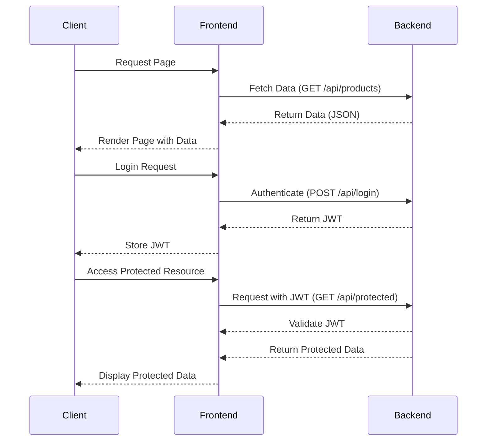

## 19.6 Integrating with JavaScript Frameworks (Vue.js, React, Angular)

In the modern web development landscape, integrating PHP with JavaScript frameworks such as Vue.js, React, and Angular is essential for creating dynamic, responsive, and interactive web applications. This section will guide you through the process of building APIs tailored for frontend frameworks, managing state on the client side, and implementing robust authentication mechanisms.

### Building APIs for Frontend Frameworks

To effectively integrate PHP with JavaScript frameworks, it's crucial to design API endpoints that cater to the specific needs of the frontend. This involves understanding the data requirements of your application and structuring your API to deliver that data efficiently.

#### Designing RESTful APIs

RESTful APIs are a common choice for communication between the frontend and backend. They use HTTP methods such as GET, POST, PUT, and DELETE to perform CRUD operations. Here's a simple example of a RESTful API endpoint in PHP:

```php
<?php
// api/products.php

header('Content-Type: application/json');

$method = $_SERVER['REQUEST_METHOD'];

switch ($method) {
    case 'GET':
        // Fetch products
        echo json_encode(['products' => getProducts()]);
        break;
    case 'POST':
        // Create a new product
        $data = json_decode(file_get_contents('php://input'), true);
        echo json_encode(['product' => createProduct($data)]);
        break;
    // Add cases for PUT and DELETE as needed
    default:
        http_response_code(405);
        echo json_encode(['error' => 'Method not allowed']);
        break;
}

function getProducts() {
    // Simulate fetching products from a database
    return [
        ['id' => 1, 'name' => 'Product 1', 'price' => 100],
        ['id' => 2, 'name' => 'Product 2', 'price' => 150],
    ];
}

function createProduct($data) {
    // Simulate creating a product
    return ['id' => 3, 'name' => $data['name'], 'price' => $data['price']];
}
?>
```

**Key Considerations:**

- **Consistency:** Ensure that your API follows consistent naming conventions and structures.
- **Versioning:** Implement versioning to manage changes without breaking existing clients.
- **Error Handling:** Provide meaningful error messages and HTTP status codes.

#### GraphQL APIs

GraphQL offers a flexible alternative to REST by allowing clients to specify exactly what data they need. This can reduce the number of requests and the amount of data transferred.

```php
// Example GraphQL query
{
  product(id: 1) {
    name
    price
  }
}
```

**PHP GraphQL Implementation:**

Use libraries like [webonyx/graphql-php](https://github.com/webonyx/graphql-php) to implement GraphQL in PHP. This library allows you to define schemas and resolve queries efficiently.

### State Management

State management is a critical aspect of frontend development, especially when dealing with complex applications. Each JavaScript framework offers its own tools for managing state.

#### Vue.js State Management

Vue.js uses Vuex for state management, which provides a centralized store for all components in an application.

```javascript
// store.js
import Vue from 'vue';
import Vuex from 'vuex';

Vue.use(Vuex);

export default new Vuex.Store({
  state: {
    products: []
  },
  mutations: {
    setProducts(state, products) {
      state.products = products;
    }
  },
  actions: {
    fetchProducts({ commit }) {
      fetch('/api/products')
        .then(response => response.json())
        .then(data => {
          commit('setProducts', data.products);
        });
    }
  }
});
```

#### React State Management

React offers several options for state management, including the Context API and Redux.

**Using Context API:**

```javascript
// ProductContext.js
import React, { createContext, useState, useEffect } from 'react';

export const ProductContext = createContext();

export const ProductProvider = ({ children }) => {
  const [products, setProducts] = useState([]);

  useEffect(() => {
    fetch('/api/products')
      .then(response => response.json())
      .then(data => setProducts(data.products));
  }, []);

  return (
    <ProductContext.Provider value={products}>
      {children}
    </ProductContext.Provider>
  );
};
```

#### Angular State Management

Angular uses services and RxJS for state management, with NgRx as a popular choice for larger applications.

```typescript
// product.service.ts
import { Injectable } from '@angular/core';
import { HttpClient } from '@angular/common/http';
import { Observable } from 'rxjs';

@Injectable({
  providedIn: 'root'
})
export class ProductService {
  constructor(private http: HttpClient) {}

  getProducts(): Observable<Product[]> {
    return this.http.get<Product[]>('/api/products');
  }
}
```

### Authentication

Implementing secure authentication is crucial for protecting user data and ensuring that only authorized users can access certain resources.

#### Token-Based Authentication with JWT

JSON Web Tokens (JWT) are a popular choice for authentication in modern web applications. They allow you to securely transmit information between parties as a JSON object.

**PHP JWT Implementation:**

Use libraries like [firebase/php-jwt](https://github.com/firebase/php-jwt) to handle JWT in PHP.

```php
<?php
use Firebase\JWT\JWT;
use Firebase\JWT\Key;

function createToken($userId) {
    $key = 'your-secret-key';
    $payload = [
        'iss' => 'your-domain.com',
        'aud' => 'your-domain.com',
        'iat' => time(),
        'nbf' => time(),
        'exp' => time() + 3600,
        'data' => [
            'userId' => $userId
        ]
    ];

    return JWT::encode($payload, $key, 'HS256');
}

function verifyToken($jwt) {
    $key = 'your-secret-key';
    try {
        $decoded = JWT::decode($jwt, new Key($key, 'HS256'));
        return $decoded->data->userId;
    } catch (Exception $e) {
        return null;
    }
}
?>
```

**Frontend JWT Handling:**

In your JavaScript framework, store the JWT in local storage or a cookie and include it in the Authorization header of your API requests.

```javascript
// Example using Fetch API
fetch('/api/protected', {
  headers: {
    'Authorization': `Bearer ${localStorage.getItem('token')}`
  }
})
.then(response => response.json())
.then(data => console.log(data));
```

### Visualizing Integration

To better understand how PHP and JavaScript frameworks interact, let's visualize the flow of data and authentication using a sequence diagram.



### Knowledge Check

- **Question:** What are the benefits of using GraphQL over REST for API design?
- **Exercise:** Modify the provided RESTful API example to include a PUT method for updating products.

### Embrace the Journey

Remember, integrating PHP with JavaScript frameworks is a powerful way to create dynamic applications. As you continue to explore these technologies, you'll discover new patterns and practices that enhance your development process. Keep experimenting, stay curious, and enjoy the journey!

### References and Links

- [MDN Web Docs: REST API](https://developer.mozilla.org/en-US/docs/Web/Guide/REST/Introduction)
- [GraphQL Official Website](https://graphql.org/)
- [Vuex Documentation](https://vuex.vuejs.org/)
- [React Context API](https://reactjs.org/docs/context.html)
- [Angular Services and Dependency Injection](https://angular.io/guide/architecture-services)

## Quiz: Integrating with JavaScript Frameworks (Vue.js, React, Angular)



### What is a primary advantage of using GraphQL over REST?

- [x] Clients can request exactly the data they need.
- [ ] It uses less bandwidth than REST.
- [ ] It is easier to implement than REST.
- [ ] It automatically handles authentication.

> **Explanation:** GraphQL allows clients to specify exactly what data they need, reducing over-fetching and under-fetching of data.

### Which library is commonly used for JWT handling in PHP?

- [x] firebase/php-jwt
- [ ] php-jwt-library
- [ ] jwt-php
- [ ] php-jwt-handler

> **Explanation:** The `firebase/php-jwt` library is widely used for handling JWTs in PHP applications.

### In Vue.js, which tool is used for state management?

- [x] Vuex
- [ ] Redux
- [ ] MobX
- [ ] Context API

> **Explanation:** Vuex is the official state management library for Vue.js applications.

### What is the purpose of the Authorization header in API requests?

- [x] To include authentication credentials.
- [ ] To specify the content type.
- [ ] To define the request method.
- [ ] To set the response format.

> **Explanation:** The Authorization header is used to include credentials, such as a JWT, for authenticating API requests.

### Which HTTP method is typically used to update a resource in a RESTful API?

- [x] PUT
- [ ] GET
- [ ] POST
- [ ] DELETE

> **Explanation:** The PUT method is used to update an existing resource in a RESTful API.

### What is a common use case for using the Context API in React?

- [x] Managing global state across components.
- [ ] Fetching data from an API.
- [ ] Handling form submissions.
- [ ] Styling components.

> **Explanation:** The Context API is used for managing global state across components in a React application.

### In Angular, which library is often used for state management in larger applications?

- [x] NgRx
- [ ] Vuex
- [ ] Redux
- [ ] MobX

> **Explanation:** NgRx is a popular state management library for larger Angular applications.

### What is a key feature of RESTful APIs?

- [x] They use standard HTTP methods for operations.
- [ ] They automatically generate client-side code.
- [ ] They require a specific frontend framework.
- [ ] They only support JSON data format.

> **Explanation:** RESTful APIs use standard HTTP methods like GET, POST, PUT, and DELETE for operations.

### How can JWTs be securely stored on the client side?

- [x] In local storage or cookies.
- [ ] In a database.
- [ ] In a text file.
- [ ] In the browser's cache.

> **Explanation:** JWTs can be securely stored in local storage or cookies on the client side.

### True or False: Angular uses Vuex for state management.

- [ ] True
- [x] False

> **Explanation:** Angular does not use Vuex; it typically uses services and libraries like NgRx for state management.


